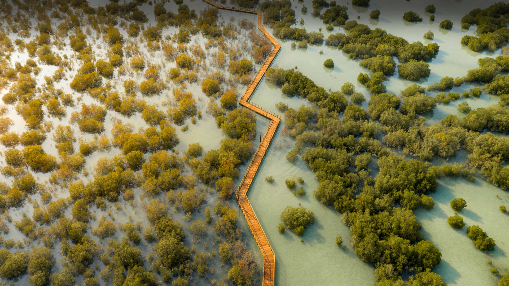
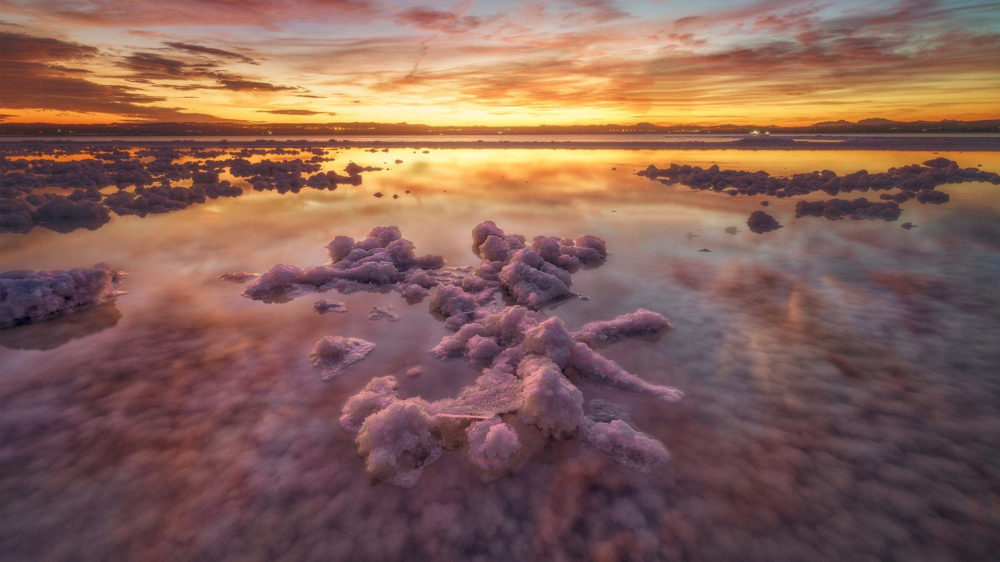
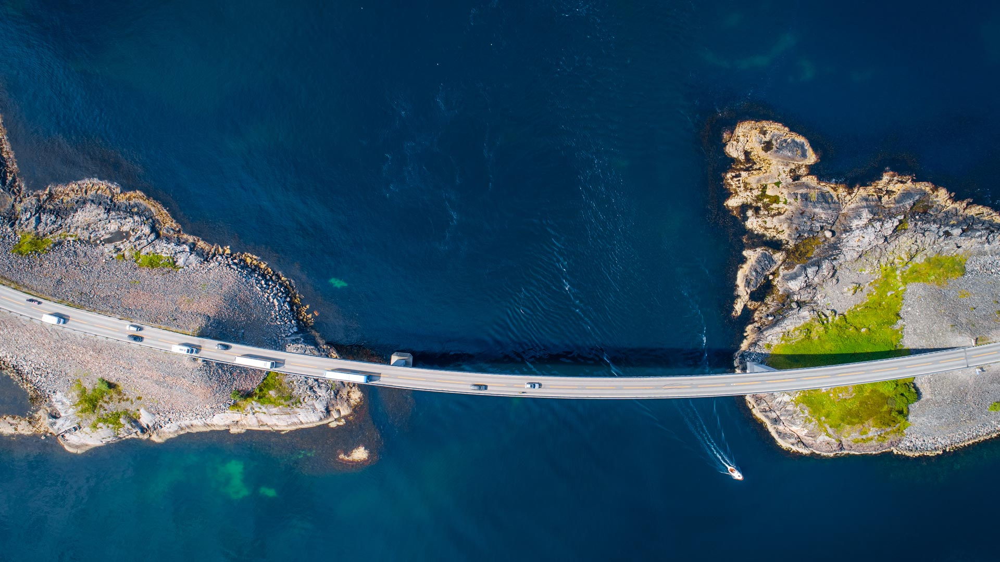
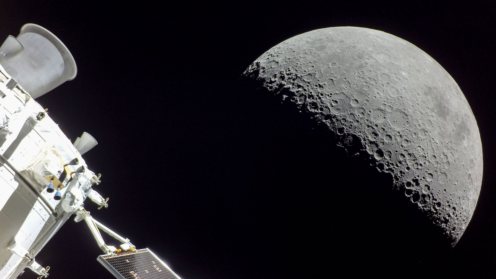
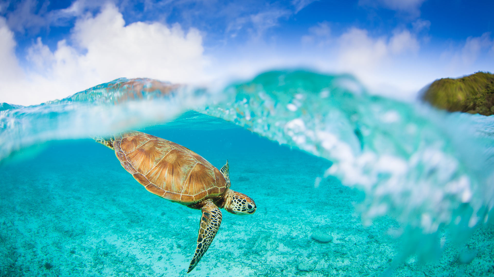
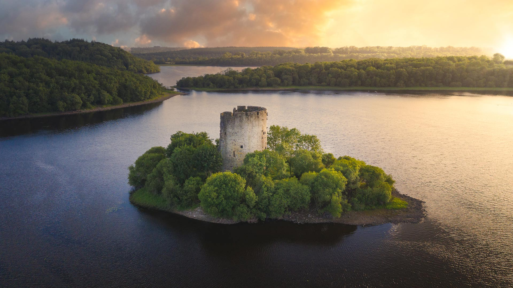
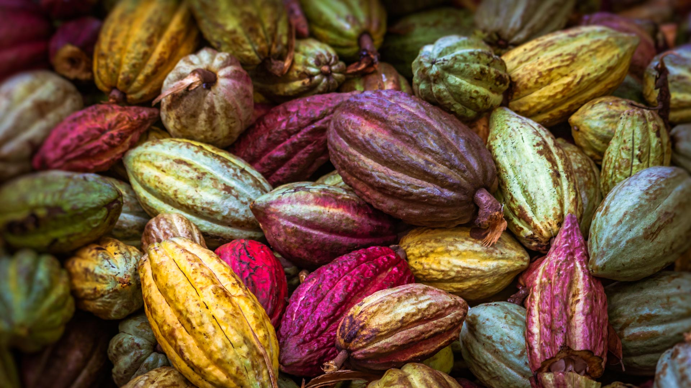
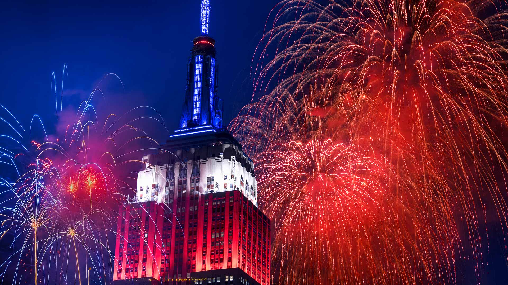

#### 20230731 Rock House, Hocking Hills State Park, Ohio (© Kenneth Keifer/Getty Images)

#### 20230730 Farmland in the Palouse, Washington (© EJ-J/Getty Images)

#### 20230730 Zwei Jungfüchse spielen auf einer Wiese, Deutschland (© Reibertb/Getty Images)

#### 20230729 Bengal tiger, Ranthambore National Park, India (© Andy Rouse/Minden Pictures)

#### 20230728 San Blas Islands, Panama (© bgremler/Shutterstock)

#### 20230727 Arc de Triomphe du Carrousel and Louvre Pyramid, Paris, France (© Jon Hicks/Getty Images)

#### 20230726 Jubail Mangrove Park in Abu Dhabi, United Arab Emirates (© Amazing Aerial Premium/Shutterstock)

#### 20230725 Laguna de Torrevieja, Alicante, Spain (© Juan Maria Coy Vergara/Getty Images)

#### 20230724 Zebras in Tarangire National Park, Tanzania (© cinoby/Getty Images)

#### 20230723 Edinburgh Tea Estate, Nuwara Eliya, Sri Lanka (© Jeremy Woodhouse/Getty Images)

#### 20230723 The Calgary Central Library, also known as the Calgary New Central Library (© Rick Rudnicki/Alamy Stock Photo)

#### 20230722 Hammock camping in a bald cypress tree, Florida (© Mac Stone/Tandem Stills + Motion)

#### 20230721 Storseisundet Bridge, Atlantic Ocean Road, Norway (© Morten Falch Sortland/Getty Images)

#### 20230720 The moon seen from the Orion spacecraft of NASA's Artemis mission (© NASA)

#### 20230719 Crescent Lake near Dunhuang, Gansu province, China (© R7 Photo/Shutterstock)

#### 20230718 Hintersee, Ramsau, Bayern (© boule13/iStock/Getty Images Plus)

#### 20230718 Great hornbill, Khao Yai National Park, Thailand (© kajornyot wildlife photography/Shutterstock)

#### 20230717 座間味島のウミガメ, 沖縄 (© petesphotography/iStock/Getty Images Plus)

#### 20230717 Cloughoughter Castle in Lough Oughter, County Cavan, Ireland (© 4H4 PH/Shutterstock)

#### 20230716 Bear Hole Brook, Catskill Mountains, New York (© GummyBone/Getty Images)

#### 20230715 Castelmezzano, Italy (© Rudy Balasko/Shutterstock)

#### 20230715 Le pont d’Avignon et le palais des Papes, Provence Alpes Côte d’Azur (© travelstock44/Alamy Stock Photo)

#### 20230714 Blacktip reef sharks, Maldives (© Filippo Bacci/Getty Images)

#### 20230714 Botanische Nacht im Botanischen Garten, Berlin (© Felipe Trueba/EPA-EFE/Shutterstock)

#### 20230714 Feu d'artifice du 14 juillet à Carcassonne, Occitanie (© Buena Vista Images/Getty Images)

#### 20230713 Zhangye Danxia National Geopark, Gansu province, China (© TONNAJA/Getty Images)

#### 20230713 Capo Caccia, Sardinia, Italy (© Francesco Riccardo Iacomino/Getty Images)

#### 20230712 Sand bar in Nakupenda Beach Nature Reserve, Zanzibar, Tanzania  (© Lubos Paukeje/Alamy)

#### 20230712 Hintersee bei Ramsau, Bayern (© Achim Thomae/Getty Images)

#### 20230711 Hong Kong SAR (© leungchopan/Getty Images)

#### 20230710 Field of lavender, Somerset, England (© Doug Chinnery/Getty Images)

#### 20230710 浅草寺のほおずき市, 東京 (© y-studio/iStock/Getty Images Plus)

#### 20230709 Moselle River loop, Kröv, Germany (© Jorg Greuel/Getty Images)

#### 20230709 Brighton Pier, England (© Peppy Graphics/Shutterstock)

#### 20230708 Les célèbres parasols multicolores de la plage de Deauville, Normandie (© Kiszon Pascal/Getty Images)

#### 20230708 Mildred B. Cooper Memorial Chapel, Bella Vista, Arkansas (© Eddie Brady/Getty Images)

#### 20230707 燕岳の星空, 長野県 (© Nuttapoom Amornpashara/Getty Images)

#### 20230707 Cocoa pods from Ambanja, Madagascar (© pierivb/Getty Images)

#### 20230706 Southern rockhopper penguins, Falkland Islands (© Tony Beck/Getty Images)

#### 20230706 Row of boats at Hintersee lake, Bavaria, Germany (© Achim Thomae/Getty Images)

#### 20230705 Porto Timoni beach, Corfu, Greece (© nantonov/Getty Images)

#### 20230704 Field of lavender, Somerset, England (© Doug Chinnery/Getty Images)

#### 20230704 草原国家公园，萨斯喀彻温省，加拿大 (© Robert Postma/Getty Images)

#### 20230704 Empire State Building on the Fourth of July, New York City (© Tetra Images/Getty Images)

#### 20230704 Mildred B. Cooper Memorial Chapel, Bella Vista, Arkansas (© Eddie Brady/Getty Images)

#### 20230703 A coyote in Banff, Alberta, Canada (© Harry Collins/Getty Images)

#### 20230703 トゥアモトゥ諸島にあるカウエヒ環礁, フランス領ポリネシア (© WaterFrame/Alamy)

#### 20230702 Veluwemeer Aqueduct, Netherlands (© Frolova_Elena/Getty Images)

#### 20230701 从意大利圣天使城堡俯瞰罗马 (© sborisov/Getty Images)

#### 20230701 Tour de France cyclists crossing the Pont du Gard, France (© Gonzalo Fuentes/Reuters)

#### 20230701 Parliament Hill in Ottawa, Ontario, Canada (© f11photo/Shutterstock)

