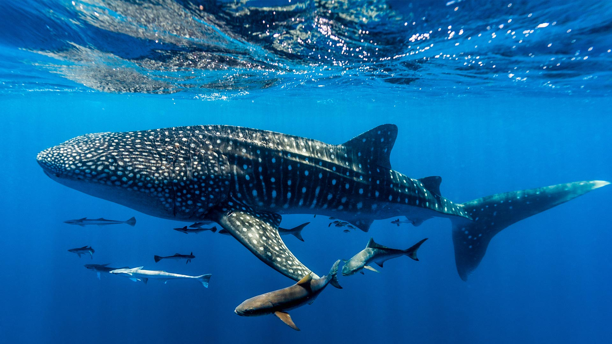
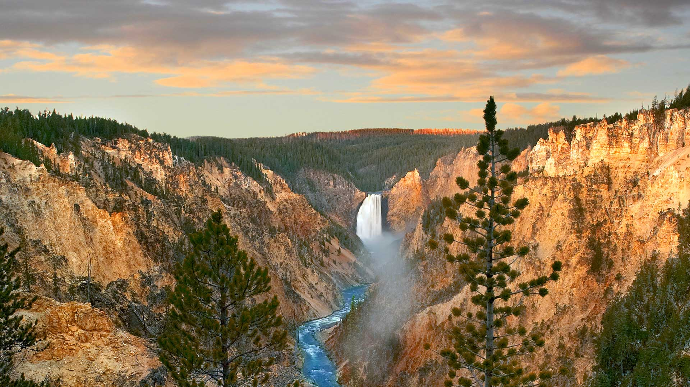
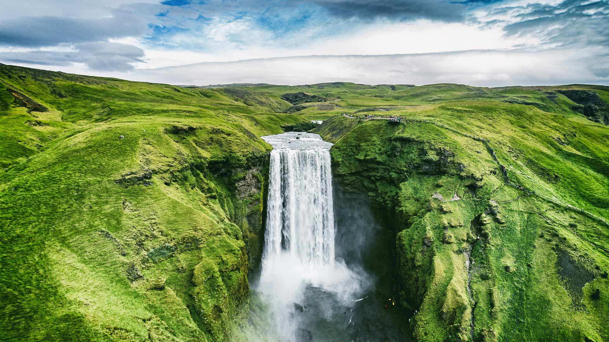
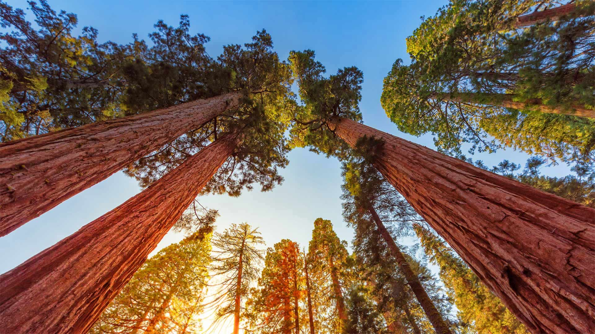
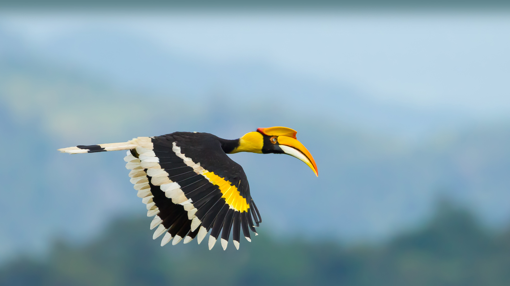
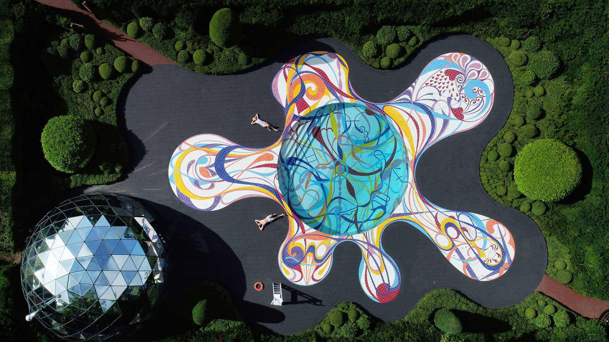
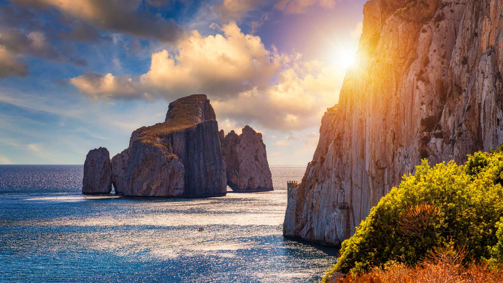
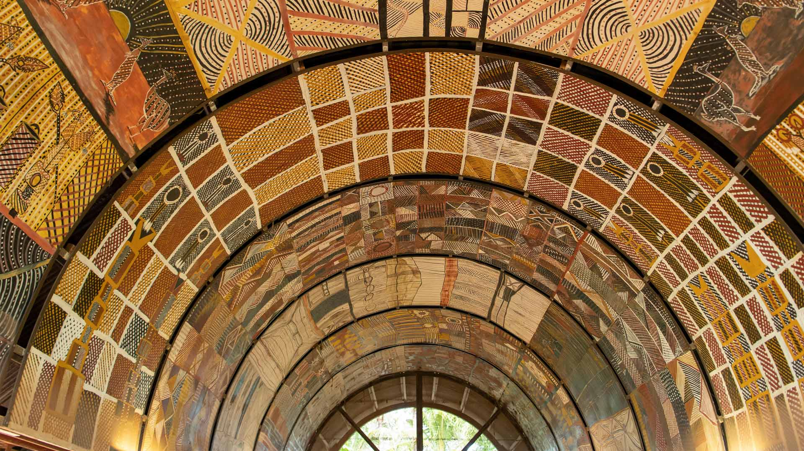

#### 20230831 Saguaro cacti, Ironwood National Monument, Arizona (© Jack Dykinga/Minden Pictures)

#### 20230831 Köpfe des Heiligen Cassius und Florentius vor dem Bonner Münster, Bonn (© Peter Unger/Getty images)

#### 20230830 Whale shark, Ningaloo Reef, Western Australia (© Jason Edwards/Getty Images)

#### 20230829 Zelenci Nature Reserve, Slovenia (© Andrey Danilovich/Getty Images)

#### 20230829 American bison in Grand Teton National Park, Wyoming (© Enrique Aguirre Aves/Getty Images)

#### 20230829 メドック, フランス ジロンド県 (© Esperanza33/Getty Images)

#### 20230829 The Circus townhouses in Bath, Somerset, England (© Gavin Hellier/Getty Images)

#### 20230829 „Avatar-Berge“, Zhangjiajie National Forest Park, China (© Amazing Aerial Premium/Shutterstock)

#### 20230828 Fort Lovrijenac, West Harbor, Dubrovnik, Croatia (© Benny Marty/Shutterstock)

#### 20230827 Seongsan Ilchulbong, a tuff cone on Jeju Island, South Korea (© Quynh Anh Nguyen/Getty Images)

#### 20230826 Berlin Cathedral and Museum Island, Berlin, Germany (© Rudy Balasko/Shutterstock)

#### 20230826 全国花火競技大会, 秋田県 大仙市 (© Shotaro Yamaki/Shutterstock)

#### 20230825 Lower Yellowstone Falls, Yellowstone National Park, Wyoming (© Tim Fitzharris/Minden Pictures)

#### 20230824 Shark Fin Cove, Davenport, California (© Jeff Lewis/Tandem Stills + Motion)

#### 20230823 Skógafoss waterfall, Iceland (© Maridav/Shutterstock)

#### 20230822 Amphitheatre of El Jem, Tunisia (© Westend61/Getty Images)

#### 20230821 Emerald Lake, South Klondike Highway, Yukon, Canada (© artherng/Getty Images)

#### 20230820 Start Point Lighthouse, South Devon, England (© Guy Edwardes/Minden Pictures)

#### 20230819 Alignements de Carnac, Golfe du Morbihan, France (© Guy Ozenne/Getty Images)

#### 20230819 Squirrel looking into the lens of a camera (© Alfredo Piedrafita/Getty Images)

#### 20230818 Rothenburg ob der Tauber, Bavaria, Germany (© RudyBalasko/Getty Images)

#### 20230818 Altstadt und die Trave, Lübeck, Schleswig-Holstein (© Harald Nachtmann/Getty Images)

#### 20230818 The Canadian International Air Show in Marilyn Bell Park (© Melissa Renwick/Contributor/Getty Images)

#### 20230817 Giant sequoia trees in Sequoia and Kings Canyon National Parks, California (© lucky-photographer/Getty Images)

#### 20230817 罕肯瀑布,威尔斯格雷省立公园, 加拿大不列颠哥伦比亚省 (© Laurens Verhoeven/Getty Images)

#### 20230817 グラスランズ国立公園, カナダ サスカチュワン州 (© Robert Postma/Getty Images)

#### 20230817 Doppelhornvogel, Nationalpark Khao Yai, Thailand (© kajornyot wildlife photography/Shutterstock)

#### 20230817 'Avatar Mountains,' Zhangjiajie National Forest Park, China (© Amazing Aerial Premium/Shutterstock)

#### 20230816 東山・大文字山の送り火, 京都 (© gyro/Getty Images)

#### 20230815 Piazza IX Aprile, Taormina, Sicily, Italy (© rudi1976/Alamy)

#### 20230814 Canyon des gorges du Verdon, Provence-Alpes-Côte d’Azur (© luisapuccini/iStock/Getty Images Plus)

#### 20230814 Overseas Highway in the Florida Keys (© Evgeny Vasenev/Cavan Images)

#### 20230814 Tiny gecko on a leaf (© Darren Greenwood/Alamy)

#### 20230813 Perseid meteor shower, Cottonwood Canyon State Park, Oregon (© Joshua Meador/Tandem Stills + Motion)

#### 20230812 Elephant family in Amboseli National Park, Kenya (© Ibrahim Suha Derbent/Getty Images)

#### 20230812 Helmcken Falls, Wells Gray Provincial Park, British Columbia, Canada (© Laurens Verhoeven/Getty Images)

#### 20230811 夏の立山, 富山県 (© yasuki/Adobe Stock)

#### 20230811 'Gateway Pool' art installation at Jupiter Artland sculpture park, Edinburgh, Scotland (© Owen Humphreys/PA Images/Alamy)

#### 20230811 Gwaii Haanas National Park Reserve and Haida Heritage Site, British Columbia, Canada (© Don Johnston_WC/Alamy Stock Photo)

#### 20230810 A lion in Maasai Mara, Kenya (© Scott Davis/Tandem Stills + Motion)

#### 20230809 马苏阿的甜面包海蚀柱，撒丁岛，意大利 (© DaLiu/Getty Images)

#### 20230809 Indigenous artwork, Ngaruwanajirri Art Centre, Wurrumiyanga, Bathurst Island, Australia (© Robert Wyatt/Alamy)

#### 20230808 五花海，阿坝九寨沟旅游景区，四川省，中国 (© Michael Ver Sprill/Getty Images)

#### 20230808 Champ de lavande sur le plateau de Valensole au lever du jour, Alpes-de-Haute-Provence (© Francesco Riccardo Iacomino/Getty Images)

#### 20230808 Highways in Taipei, Taiwan (© Tavarius/Shutterstock)

#### 20230807 Bodie Island Lighthouse, Nags Head, North Carolina (© Michael Ver Sprill/Getty Images)

#### 20230806 原爆ドーム前元安川のとうろう流し, 広島県 広島市 (© Anadolu Agency/Getty Images)

#### 20230805 Rakotzbrücke in Kromlau, Landkreis Görlitz, Sachsen (© DieterMeyrl/Getty Images)

#### 20230805 Atlantic puffin, Iceland (© Peter Hering/Minden Pictures)

#### 20230804 Kagami-ike (Mirror Pond), Nagano, Japan (© Shoji Fujita/Getty Images)

#### 20230804 Tintern Abbey, Wales (© matthibcn/Getty Images)

#### 20230803 Zelenci Nature Reserve, Slovenia (© Andrey Danilovich/Getty Images)

#### 20230803 Helmcken waterfall in Wells Gray Provincial Park, British Columbia, Canada (© Laurens Verhoeven/iStock/Getty Images)

#### 20230802 Sandstone butte in Capitol Reef National Park, Utah (© Amazing Aerial Premium/Shutterstock)

#### 20230801 絢爛華麗な弘前ねぷた, 青森県 弘前市 (© David Parker/Alamy Stock Photo)

#### 20230801 Climber on Denali, Denali National Park, Alaska (© Andrew Peacock/Tandem Stills + Motion)

#### 20230801 Plage de Rondinara et sa réserve naturelle, Bonifacio, Corse (© Hemis/Alamy Stock Photo)

#### 20230801 Confederation Bridge, Prince Edward Island, Canada (© Henryk Sadura/Getty Images)

