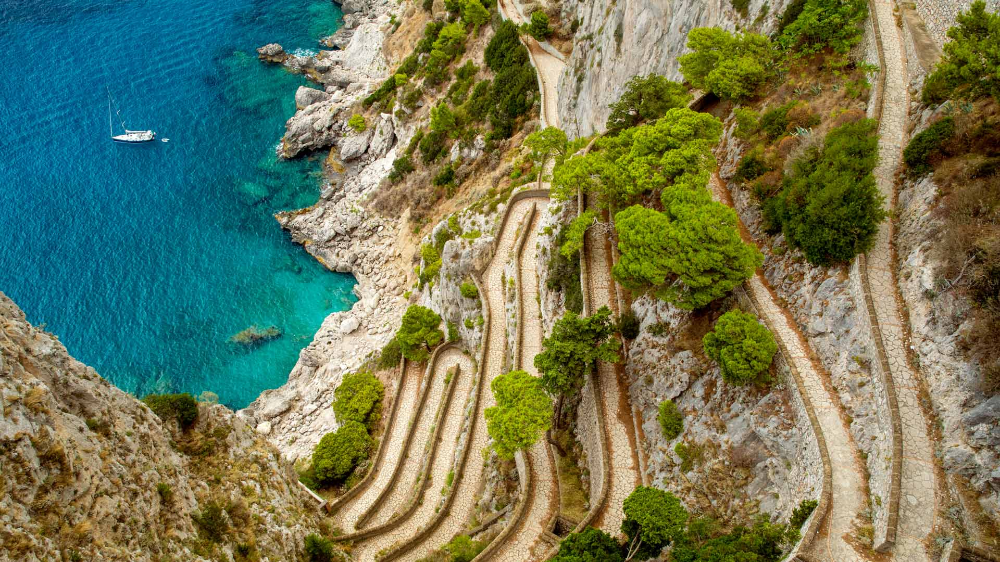
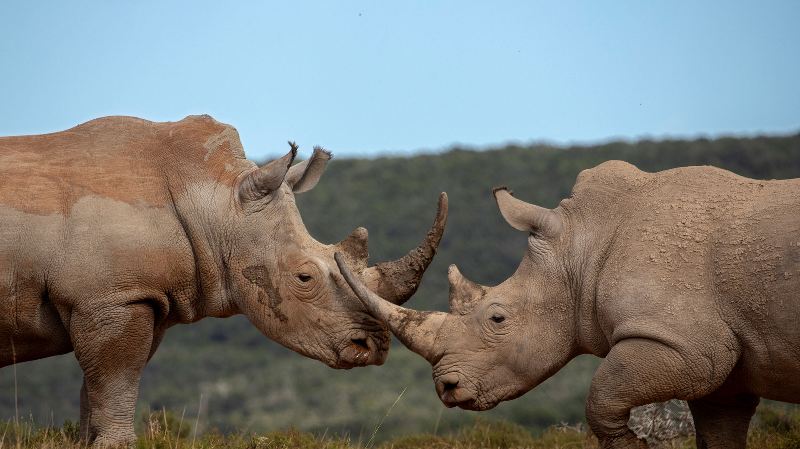
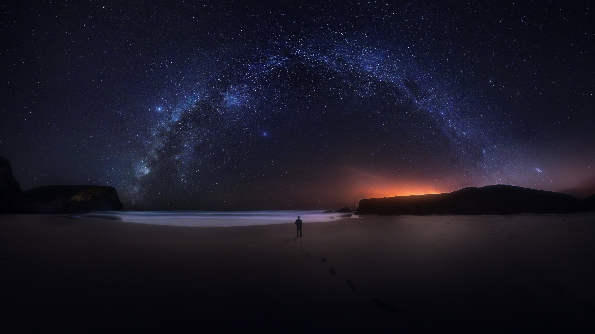
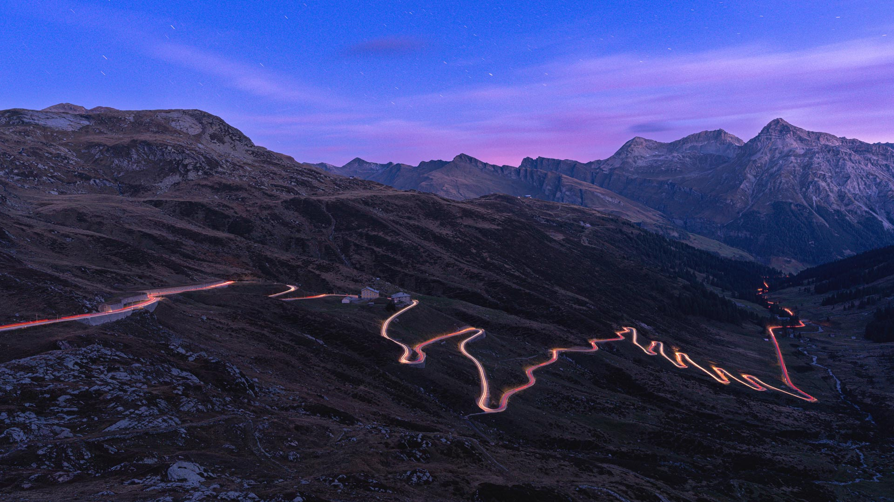
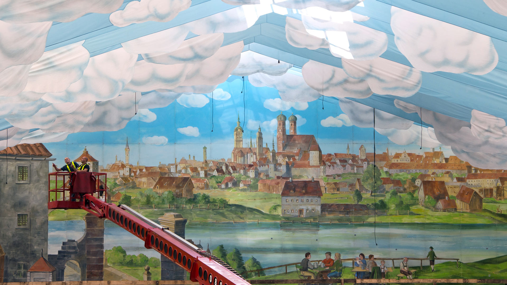
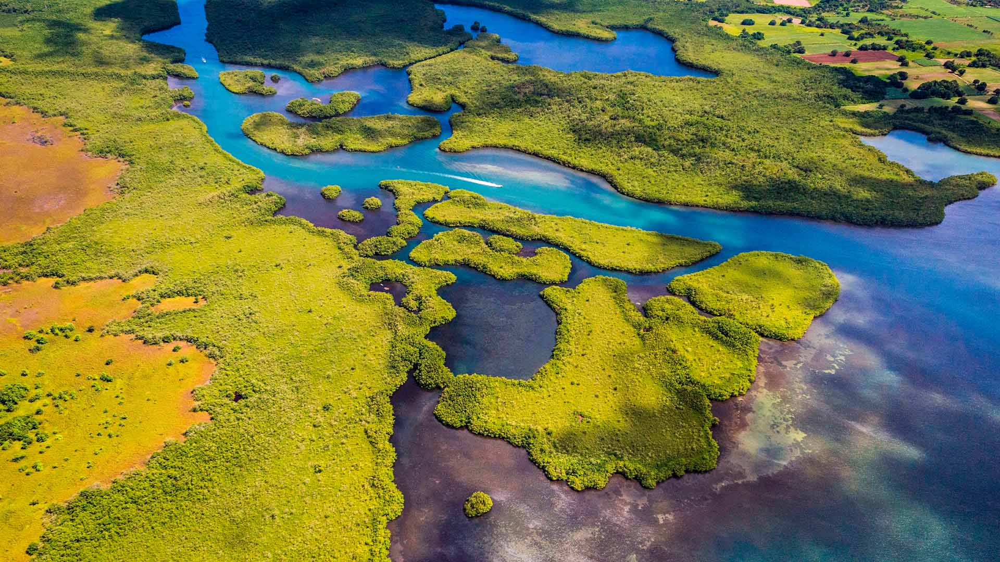
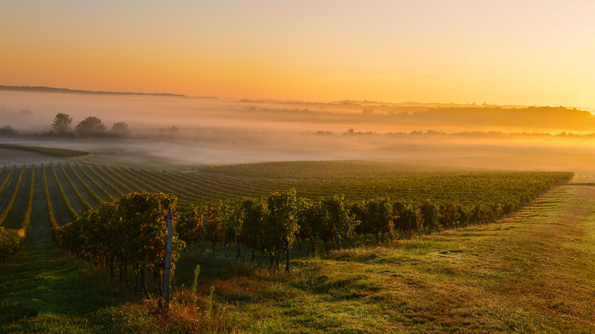
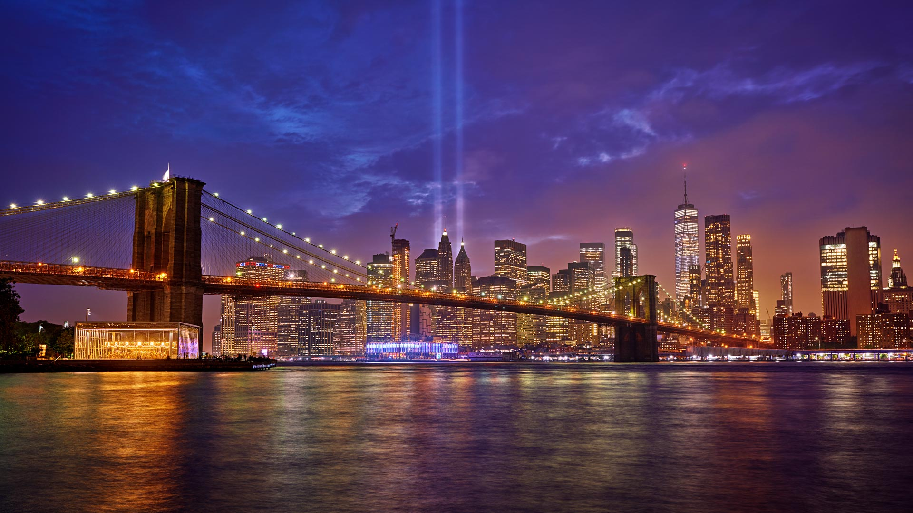
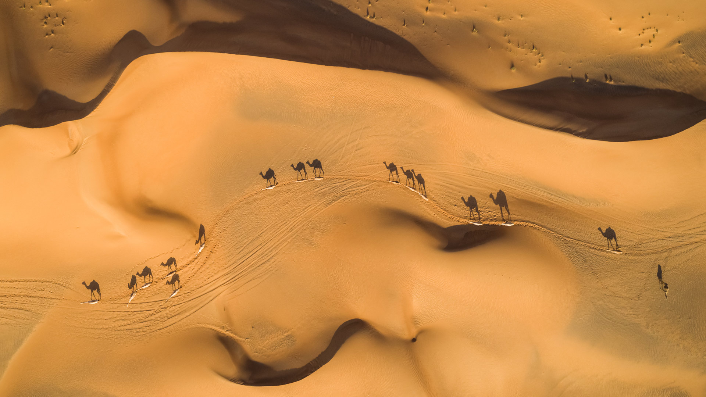
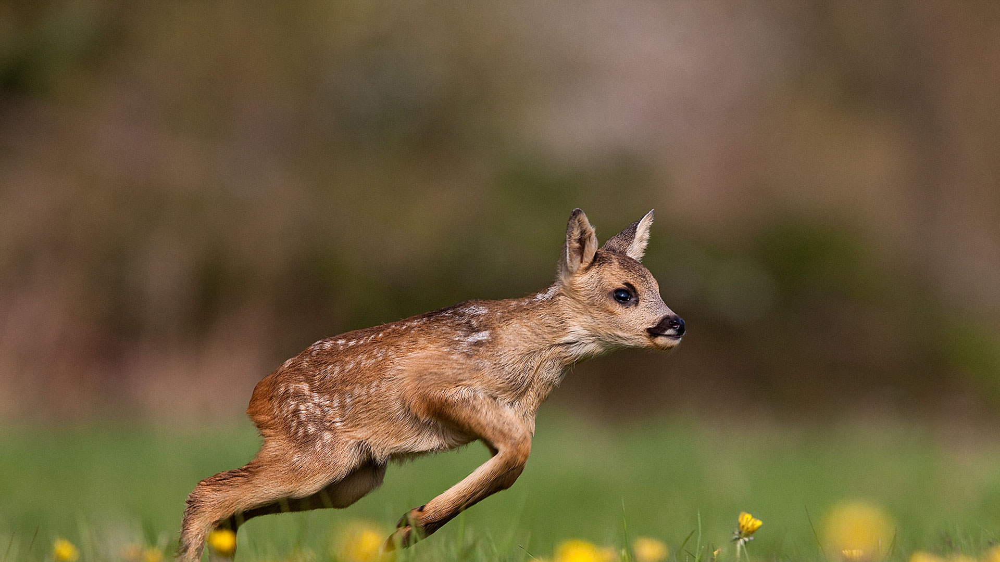

#### 20230930 Fall colors in Shenandoah National Park, Virginia (© Michael Ver Sprill/Getty Images)

#### 20230929 横浜ベイブリッジと満月, 神奈川県 横浜市 (© kanzilyou/Getty Images)

#### 20230929 Jiaxiu Tower under a full moon, Guiyang, Guizhou province, China (© Wang Yukun/Getty Images)

#### 20230928 Container ship near a commercial port in Thailand (© Suriyapong Thongsawang/Getty Images)

#### 20230928 French River, Ontario, Canada (© Tim Fitzharris/Minden)

#### 20230927 The Via Krupp footpath on Capri island, Italy (© Mikolaj Niemczewski/Shutterstock)

#### 20230926 Venice Skatepark at sunset, Los Angeles, California (© EXTREME-PHOTOGRAPHER/Getty Images)

#### 20230925 Sea otter in Bartlett Cove, Glacier Bay National Park and Preserve, Alaska (© Andrew Peacock/Tandem Stills + Motion)

#### 20230924 Coucher de soleil sur la tour Génoise de la Parata et les Iles Sanguinaires, Ajaccio, Corse (© Jon Ingall/Alamy Stock Photo)

#### 20230924 The Fraser River near Mount Robson, British Columbia, Canada (© phototropic/Getty Images)

#### 20230924 Berlin Marathon Skyline mit Sonnenlicht, Berlin (© Matthias Makarinus/Getty Images)

#### 20230923 巾着田の彼岸花, 埼玉県 日高市 (© Deseree Joy Villanueva/Getty Images)

#### 20230923 The light installation 'Global Rainbow' by artist Yvette Mattern (© David Cooper/Contributor/Getty Images)

#### 20230923 Parc ostréicole à La Faute-sur-Mer, Pointe d'Arcay France, Vendée (© LEROY Francis/hemis.fr)

#### 20230923 Cottonwood trees and red sandstone in Coyote Gulch, Glen Canyon National Recreation Area, Utah (© Stephen Matera/Tandem Stills + Motion)

#### 20230922 Southern white rhinoceros males, Shamwari Private Game Reserve, South Africa (© David Silverman/Getty Images)

#### 20230922 马尔萨拉盐田，意大利 (© javarman3/Getty Images)

#### 20230921 Inside the Nobel Peace Center, Oslo, Norway (© Ilyas Ayub/Alamy)

#### 20230920 Roman-inspired aqueduct, Arkadia Park, Poland (© PATSTOCK/Getty Images)

#### 20230919 哈德良长城，诺森伯兰郡国家公园，英国 (© daverhead/Getty Images)

#### 20230918 Milky Way over Southwest Alentejo and Vicentine Coast Natural Park, Portugal (© Daniel Garrido/Getty Images)

#### 20230918 コノハズク, 鳥取県 (© Eric Sohn Joo Tan/Minden)

#### 20230917 Cuban tody, Alejandro de Humboldt National Park, Cuba (© Bruno D'Amicis/Minden Pictures)

#### 20230916 Splügen Pass, Graubünden, Switzerland (© Roberto Moiola/Getty Images)

#### 20230916 A beer tent at Oktoberfest in Theresienwiese, Munich, Germany (© Peter Kneffel/picture alliance via Getty Images)

#### 20230916 Lederhosen und Tradition, Oktoberfest auf der Theresienwiese in München (© FooTToo/Getty Images)

#### 20230915 Mission church ruins at Quarai, Salinas Pueblo Missions National Monument, New Mexico (© Thomas Roche/Getty Images)

#### 20230915 格莱纳里夫森林公园的日落，安特里姆郡，爱尔兰 (© Peter Zelei/Getty Images)

#### 20230915 グランド・クルドサック・マリン, フランス (© Hemis/Alamy)

#### 20230915 Luftaufnahme von Köln (© Romas_Photo/Shutterstock)

#### 20230914 Przewalski's horses, Hustai National Park, Mongolia (© Ondrej Prosicky/Shutterstock)

#### 20230913 Temples on Hemakuta Hill, Hampi, Karnataka, India (© Images of india/Alamy)

#### 20230912 North Sea at sunset, Norddorf, Amrum Island, Germany (© Frederick Doerschem/Getty Images)

#### 20230911 波尔多葡萄园的日出，法国 (© Esperanza33/Getty Images)

#### 20230911 French River, Ontario, Canada (© Tim Fitzharris/Minden)

#### 20230911 Brooklyn Bridge with the 'Tribute in Light' installation for 9/11, New York (© ANDREY DENISYUK/Getty Images)

#### 20230910 Walrus pair at sea in Svalbard, Norway (© Mark Smith/Getty Images)

#### 20230910 Castelmezzano, Italie (© Rudy Balasko/Shutterstock)

#### 20230909 菊の花 (© Maciej Figiel/Alamy Stock Photo)

#### 20230909 Wat Chaiwatthanaram temple, Ayutthaya Historical Park, Thailand (© Weerasak Saeku/Getty Images)

#### 20230908 Parc Olympique Lyonnais, Groupama Stadium OL Vallée, Lyon (© dpa picture alliance/Alamy Stock Photo)

#### 20230908 The Circus townhouses in Bath, Somerset, England (© Gavin Hellier/Getty Images)

#### 20230907 Scenic view at Toronto city waterfront skyline at sunset (© Elena Elisseeva/Shutterstock)

#### 20230907 Der Reichstag unter einem Sternenhimmel, Berlin (© MarioGuti/Getty Images)

#### 20230906 Old Venetian harbor, Rethymno, Crete Island, Greece (© Gatsi/Getty Images)

#### 20230905 Mount Segla, Senja Island, Troms og Finnmark, Norway (© imageBROKER/Moritz Wolf/Getty Images)

#### 20230904 パッサウ, ドイツ バイエルン州 (© Scott Wilson/Alamy)

#### 20230904 Construction workers on scaffolding (© Bits and Splits/Shutterstock)

#### 20230904 Camels in the desert, United Arab Emirates (© Amazing Aerial Premium/Shutterstock)

#### 20230904 布尔日的沼泽，法国 (© Tuul & Bruno Morandi/Getty Images)

#### 20230903 Aerial view of Manhattan, New York City (© Wojtek Zagorski/Getty Images)

#### 20230902 Allen's hummingbird, Santa Cruz, California (© mallardg500/Getty Images)

#### 20230901 Turkey tail mushroom, Brevard, North Carolina (© Bill Gozansky/Alamy)

#### 20230901 草原を走るノロジカの子鹿, フランス ノルマンディー (© Gerard Lacz/Minden)

