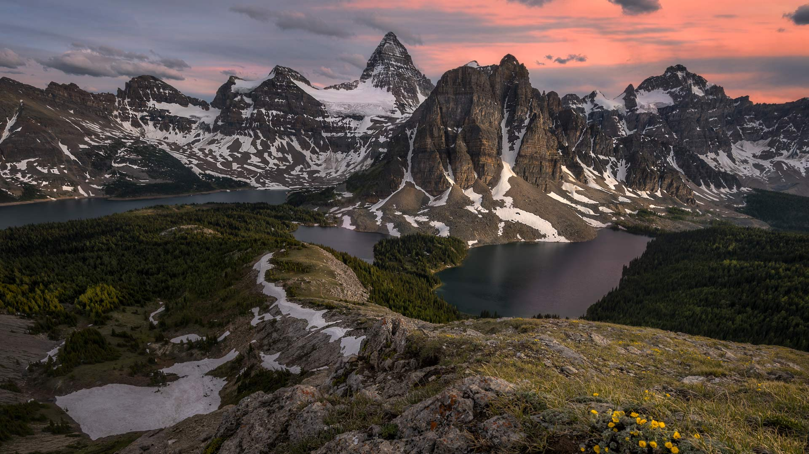
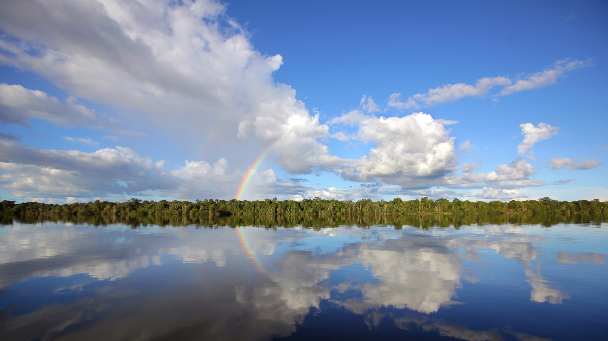
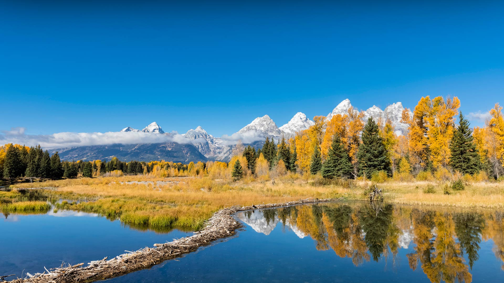
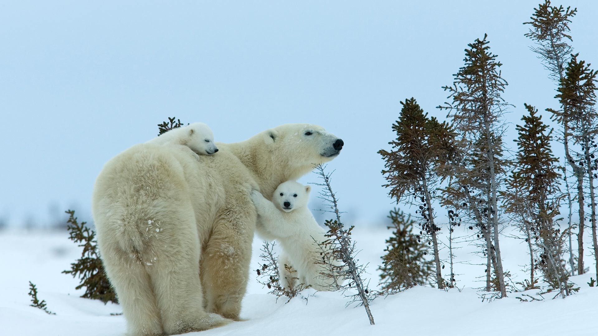
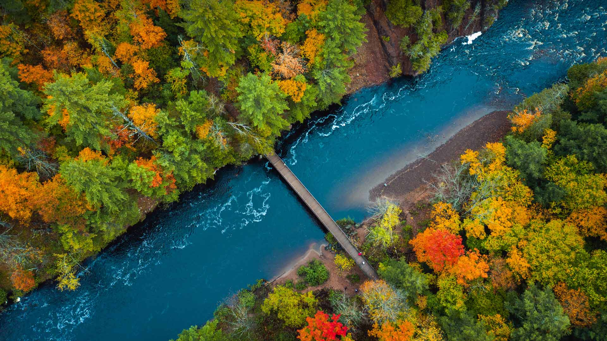
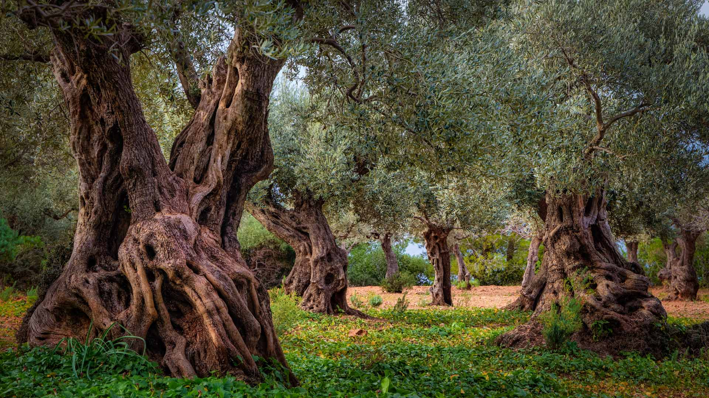
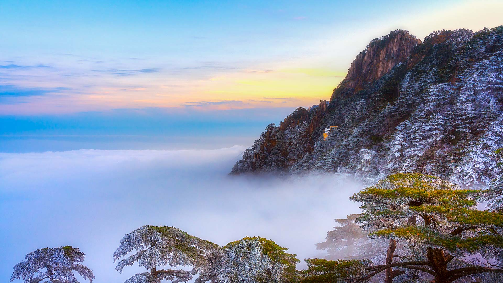
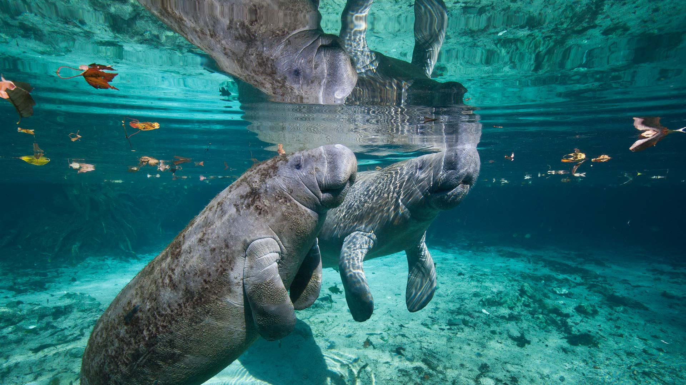

#### 20231130 The Storr, a rock outcrop on the Isle of Skye, Scotland (© Juan Maria Coy Vergara/Getty Images)

#### 20231130 Cyprès chauves à l'étang de Boulieu, Isère, France (© photosimysia/Getty Images)

#### 20231129 Rockefeller Center Christmas tree, New York City (© Jonathan Orenstein/Getty Images)

#### 20231129 什未林湖上的什未林城堡，梅克伦堡-前波美拉尼亚州，德国 (© Hannes Wendt/Shutterstock)

#### 20231128 Giant land art fresco by artist Saype in Istanbul, Türkiye (© Chris McGrath/Getty Images)

#### 20231128 阿西尼博因山省级公园，加拿大 (© matt macpherson/500px/Getty Images)

#### 20231127 Río Negro, Amazon basin, Brazil (© Timothy Allen/Getty Images)

#### 20231127 Weihnachtsmarkt in Frankfurt am Main, Hessen (© Michael Abid/Alamy Stock Photo)

#### 20231126 Fallow deer in Bradgate Park, Leicestershire, England (© Chris Bainbridge/Alamy)

#### 20231126 修善寺温泉街, 静岡県 伊豆市 (© JaCZhou 2015/Getty Images)

#### 20231125 Toledo, Spain (© Carlos Fernandez/Getty Images)

#### 20231125 Mount Logan in Kluane National Park and Reserve, Yukon, Canada (© A. Michael Brown/Shutterstock)

#### 20231124 Hall of Mosses trail in the Hoh Rain Forest, Olympic National Park, Washington (© James Randklev/Getty Images)

#### 20231123 泰德国家公园的日落，特内里费岛，加那利群岛, 西班牙 (© Javier Martínez Morán/Alamy)

#### 20231123 Flint corn (© Cynthia Liang/Shutterstock)

#### 20231123 Flamants roses au lever du soleil, Saintes-Maries-de-la-Mer, Parc Naturel Régional de Camargue, France (© Image via Shutterstock)

#### 20231123 Fallow deer in Bradgate Park, Leicestershire, England (© Chris Bainbridge/Alamy)

#### 20231122 初冬の阿寒湖周辺, 北海道 釧路市 (© vladimir zakharov/Getty Images)

#### 20231122 Grand Teton National Park, Wyoming (© Westend61/Getty Images)

#### 20231121 Río Negro, Amazon basin, Brazil (© Timothy Allen/Getty Images)

#### 20231121 Gray seal pup, Norfolk, England (© Vince Burton/Minden Pictures)

#### 20231120 Chapman Adventure Playground in the Gathering Place, Tulsa, Oklahoma (© Susan Vineyard/Alamy)

#### 20231120 科奇城堡，Tongwynlais，卡迪夫，威尔士，英国，欧洲 (© Billy Stock/robertharding/Alamy Stock Photo)

#### 20231119 Alam-Pedja Nature Reserve, Estonia (© Sven Zacek/Minden Pictures)

#### 20231118 Polar bear mother and cubs, Churchill, Manitoba, Canada (© Thorsten Milse/Getty Images)

#### 20231117 Grand Teton National Park, Wyoming (© Westend61/Getty Images)

#### 20231117 Königssee im Herbst, Berchtesgaden, Bayern (© rusm/Getty Images)

#### 20231117 Bad River in Copper Falls State Park, Wisconsin (© Big Joe/Getty Images)

#### 20231116 Festival of Lights, VanDusen Botanical Garden, Vancouver (© Wiliam Perry/Alamy Stock Photo)

#### 20231116 Moulin à vent dans les vignes, France (© Marco Bottigelli/Getty Images)

#### 20231116 View over Athens and the Acropolis, Greece (© Mlenny/Getty Images)

#### 20231115 七五三の絵馬 (© 222studio/Shutterstock)

#### 20231115 Rapa Valley in Sarek National Park, Sweden (© Hans Strand/Getty Images)

#### 20231114 Russell lupines along Lake Tekapo, South Island, New Zealand (© Jeffrey Lewis/Tandem Stills + Motion)

#### 20231114 Vielblättrige Lupinen am Lake Tekapo, Südinsel, Neuseeland (© Jeffrey Lewis/Tandem Stills + Motion)

#### 20231113 Old olive grove in the Serra Tramuntana range, Majorca, Spain (© cinoby/Getty Images)

#### 20231112 秋天池塘里的两只绿头鸭 (© sun ok/Shutterstock)

#### 20231112 Lamps on the banks of the Sarayu River for Diwali, Ayodhya, India (© SANJAY KANOJIA/AFP/Getty Images)

#### 20231111 Autumnal woodland and Young Peak, British Columbia, Canada (© David Noton/Minden)

#### 20231111 Sunset at the Washington Monument, Washington, DC (© Joe Daniel Price/Getty Images)

#### 20231111 富内斯山谷，背景是多洛米蒂山，南蒂罗尔，意大利 (© Achim Thomae/Getty Images)

#### 20231111 Rapa Valley in Sarek National Park, Sweden (© Hans Strand/Getty Images)

#### 20231111 Drapeau français sous l’Arc de Triomphe, Paris, France (© Wiliam Perry/Alamy Stock Photo)

#### 20231110 Das pittoreske Schweriner Schloss, Schwerin, Mecklenburg-Vorpommern (© Hannes Wendt/Shutterstock)

#### 20231110 Badlands National Park, South Dakota (© Grant Ordelheide/Tandem Stills + Motion)

#### 20231109 Birch trees in autumn, Drammen, Norway (© Baac3nes/Getty Images)

#### 20231108 West Indian manatee mother and baby, Three Sisters Springs, Crystal River, Florida (© Karine Aigner/Tandem Stills + Motion)

#### 20231108 干し柿, 山梨県 南都留郡 富士河口湖町 (© STEPHEN FLEMING/Alamy Stock Photo)

#### 20231108 黄山的日落，安徽省，中国 (© Nantapon Pattamakijsakul/Getty Images)

#### 20231107 Kirkilai lakes and lookout tower, Biržai Regional Park, Lithuania (© MNStudio/Shutterstock)

#### 20231106 Lake Pehoé, Torres del Paine National Park, Chile (© OST/Getty Images)

#### 20231105 Quartzite formation, Playa del Silencio, Asturias, Spain (© Jean-Philippe Delobelle/Minden Pictures)

#### 20231104 American bison, Yellowstone National Park, Wyoming (© Gary Gray/Getty Images)

#### 20231103 Pacific sea nettles off the coast of Carmel, California (© Jim Patterson/Tandem Stills + Motion)

#### 20231103 West Indian manatee mother and baby, Three Sisters Springs, Crystal River, Florida (© Karine Aigner/Tandem Stills + Motion)

#### 20231103 Hunsrück Hochwald, Herbstwald bei Deuselbach, Naherholungsgebiet Erbeskopf, Rheinland-Pfalz (© Hans-Peter Merten/Huber/eStock Photo)

#### 20231102 Salt flats in Badwater Basin, Death Valley National Park, California (© Jim Patterson/Tandem Stills + Motion)

#### 20231101 Pumpkins and squashes (© bobkeenan/Getty Images)

#### 20231101 Mummy Cave ruins, Canyon de Chelly National Monument, Arizona (© Cindy Miller Hopkins/Danita Delimont)

#### 20231101 Kenny Lake at dawn, Lake Superior Provincial Park, Ontario, Canada (© Don Johnston/agefotostock)

#### 20231101 上巴尔城堡，阿尔萨斯，法国 (© Andrea Pistolesi/Getty Images)

#### 20231101 コロンビア川とアストリア・メグラー橋, 米国 オレゴン州 (© Dan Mihai/Getty Images)

