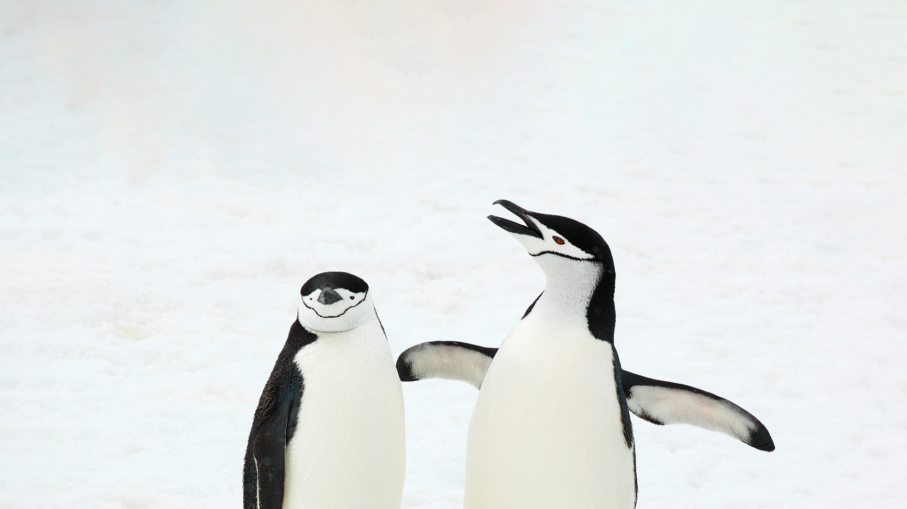
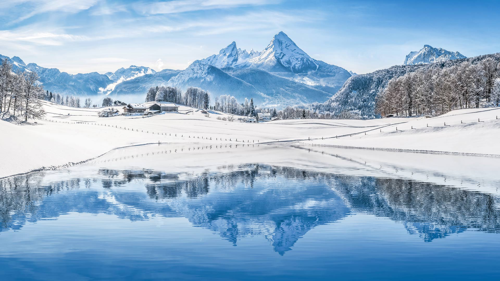
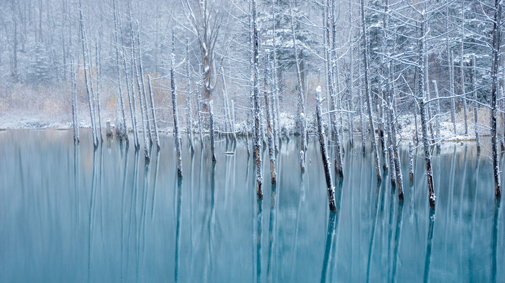
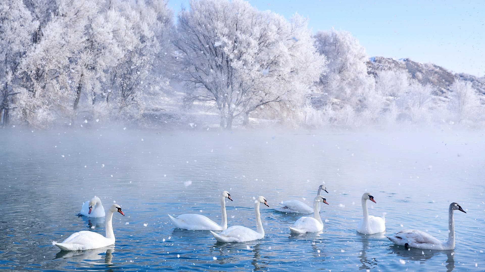
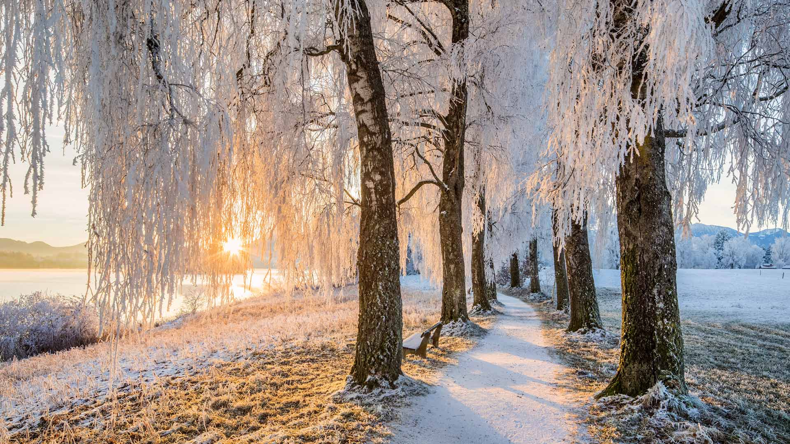
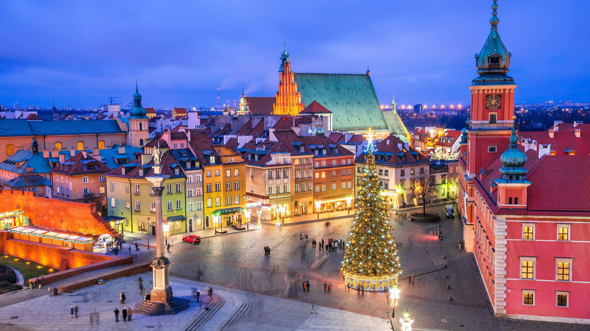
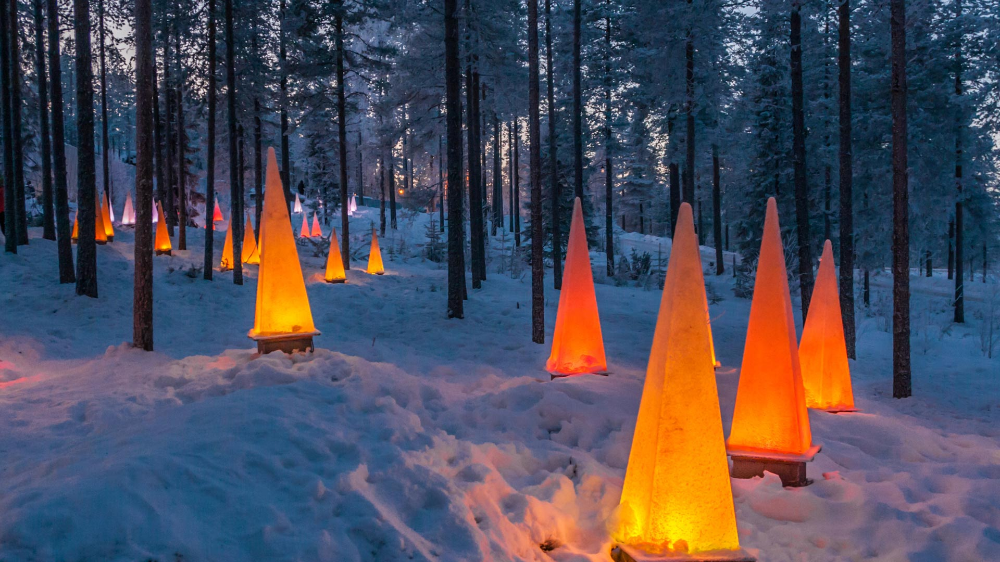
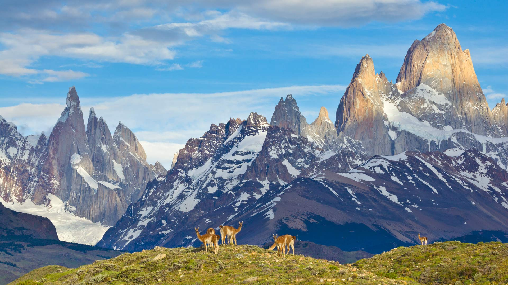
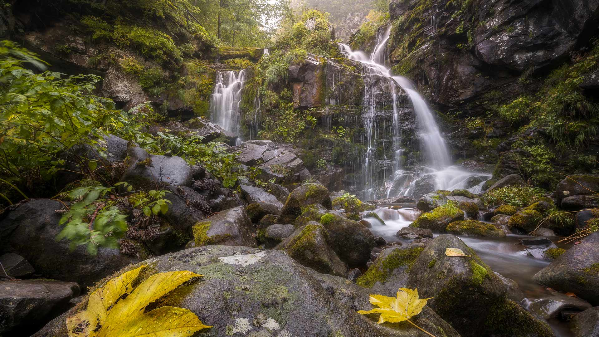

#### 20231231 Fireworks over Phra Nakhon Khiri, Phetchaburi, Thailand (© noomcpk/Shutterstock)

#### 20231231 増上寺の梵鐘, 東京 (© kanzilyou/Adobe Stock)

#### 20231230 Daiichi Tadami River Bridge, Fukushima prefecture, Japan (© DoctorEgg/Getty Images)

#### 20231230 卡塞里格石圈，湖区国家公园 ，坎布里亚，英国 (© John Finney Photography/Getty Images)

#### 20231229 Oud-West, Amsterdam, Netherlands (© George Pachantouris/Getty Images)

#### 20231228 Humpback whale, Disko Bay, Greenland (© Paul Souders/DanitaDelimont.com)

#### 20231227 Kirkjufell, Snæfellsnes peninsula, Iceland (© Ratnakorn Piyasirisorost/Getty Images)

#### 20231226 Winter sunrise in Dedham, Colchester, England (© George W Johnson/Getty Images)

#### 20231226 Christmas lights on trees at dusk, Vancouver, Canada (© Stuart Dee/Getty Images)

#### 20231225 Toronto Christmas market at the Distillery District (© Praveen P.N/Moment/Getty Images)

#### 20231225 Caribou running in snow, Alaska (© Michael Quinton/Minden Pictures)

#### 20231224 Town Hall Square, Tartu, Estonia (© Westend61/Getty Images)

#### 20231223 けやき坂のイルミネーション, 東京 (© Photography by ZhangXun/Getty Images)

#### 20231223 Chinstrap penguins, South Sandwich Islands, South Atlantic Ocean (© Jan Vermeer/Minden Pictures)

#### 20231223 Berge, die sich in einem kristallklaren Bergsee spiegeln, Alpen Deutschland (© JFL Photography/Adobe Stock)

#### 20231222 青い池, 北海道 美瑛町 (© Haruna/Getty Images)

#### 20231222 天鹅泉湿地公园，伊犁，新疆，中国 (© 500px Asia/Getty images)

#### 20231221 Ljubljana, Slovenia (© kasto80/Getty images)

#### 20231221 Castlerigg Stone Circle near Keswick, Lake District National Park, Cumbria, United Kingdom (© John Finney Photography/Getty Images)

#### 20231221 Avenue of birch trees near Uffing am Staffelsee, Bavaria, Germany (© Reinhard Schmid/Huber/eStock Photo)

#### 20231220 Barcelonnette aux portes des Hautes Vallées de l'Ubay, Alpes-de-Haute-Provence, France (© iStock/Getty Images Plus)

#### 20231220 Village in Val Gardena at Christmas, Dolomites, Italy (© Ingus Kruklitis/Getty Images)

#### 20231220 Cachoeira da Fumacinha, Chapada Diamantina, Bahia, Brazil (© Rtzstudio/Shutterstock)

#### 20231219 Christmas tree in Castle Square, Old Town, Warsaw, Poland (© Panther Media GmbH/Alamy)

#### 20231218 Capitol Reef National Park, Utah (© Jeff Clay/Tandem Stills + Motion)

#### 20231218 Station de ski du col des Saisies à l'aube, Beaufortain, Savoie, France (© SPANI Arnaud/hemis.fr/Alamy Stock Photo)

#### 20231217 Bohemian waxwings perched on a branch, Canada (© Jim Cumming/Shutterstock)

#### 20231216 Guild houses of Grand-Place, Brussels, Belgium (© Richard Taylor/Sime/eStock Photo)

#### 20231216 Festlich beleuchtete Marktkirche, Hannover, Niedersachsen (© picture alliance/Alamy)

#### 20231215 SantaPark in Rovaniemi, Lapland, Finland (© lukutin77/Getty Images)

#### 20231214 Boreal owl, Saskatchewan, Canada (© Nick Saunders/Minden Pictures)

#### 20231213 Traditional rorbu houses, Svolvaer, Lofoten Islands, Norway (© Roberto Moiola/Sysaworld/Getty Images)

#### 20231212 Poinsettias (© Yarygin/Getty Images)

#### 20231211 Winter at Huangshan, China (© Hung Chung Chih/Shutterstock)

#### 20231210 Last rays of sun on a group of dunes, Sahara, Algeria (© AWL Images/DanitaDelimont.com)

#### 20231210 林帕达恩湖，斯诺登尼亚国家公园， 威尔士 (© Joe Daniel Price/Getty Images)

#### 20231209 Guanacos in Los Glaciares National Park, Patagonia, Argentina (© Yva Momatiuk and John Eastcott/Minden Pictures)

#### 20231208 Souvenirverkauf auf dem Christkindlesmarkt, Nürnberg (© AlpKaya/Shutterstock)

#### 20231208 Fête des Lumières, œuvre d'art de Daniel Knipper, nommée Regards, en hommage aux victimes de l'attentat de Paris 2015, Lyon, France (© Baptiste de Izarra/Alamy Stock Photo)

#### 20231208 La Rocque Harbour, St. Clement, Island of Jersey (© Reinhard Schmid/Huber/eStock Photo)

#### 20231207 白川郷の雪景色, 岐阜県 (© MIYAMOTO_Y/Getty Images)

#### 20231207 USS Arizona Memorial, Pearl Harbor, Oahu, Hawaii (© Douglas Peebles Photography/Alamy)

#### 20231207 韦尔东峡谷的雾蒙蒙的早晨，普罗旺斯-阿尔卑斯-蓝色海岸大区，法国 (© Hemis/Alamy)

#### 20231206 达尔达尼亚瀑布，博洛尼亚，意大利 (© Alberto Ghizzi Panizza/Minden)

#### 20231206 The Globe of Science and Innovation building, Meyrin, Switzerland (© Deyan Baric/Alamy)

#### 20231205 Neuschwanstein and Hohenschwangau castles, Bavarian Alps, Germany (© Harald Nachtmann/Getty Images)

#### 20231204 A mother cheetah and her cubs in the Maasai Mara National Reserve, Kenya (© Scott Davis/Tandem Stills + Motion)

#### 20231203 Sandstone rock formations, Vermilion Cliffs National Monument, Arizona (© Yva Momatiuk and John Eastcott/Minden Pictures)

#### 20231203 豪華絢爛な山車と花火, 埼玉県 秩父市 (© ASSOCIATED PRESS/AP)

#### 20231203 Die Adventszeit beginnt (© Muenz/Getty Images)

#### 20231202 Milky Way over Athabasca Glacier in Jasper National Park, Canada (© Alan Dyer/Getty Images)

#### 20231202 瓜廖尔堡，中央邦，印度 (© Dmitry Rukhlenko-Photos of India/Alamy)

#### 20231202 North Gate of Angkor Thom, Angkor Archaeological Park, Cambodia (© Amazing Travel Lifestyle/Shutterstock)

#### 20231201 Lake Minnewanka, Alberta, Canada (© Ken Phung/500px/Getty Images)

#### 20231201 Iceberg in the Ross Sea, Antarctica (© Michel Roggo/Minden Pictures)

