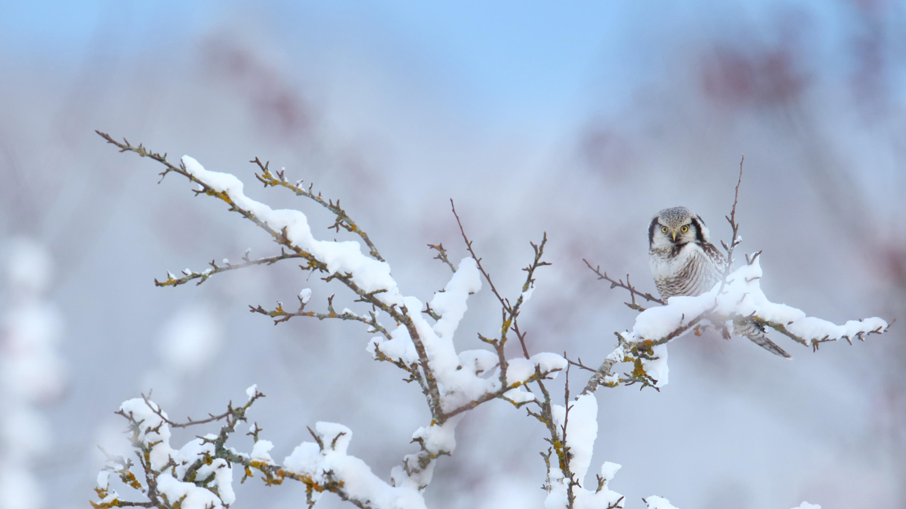
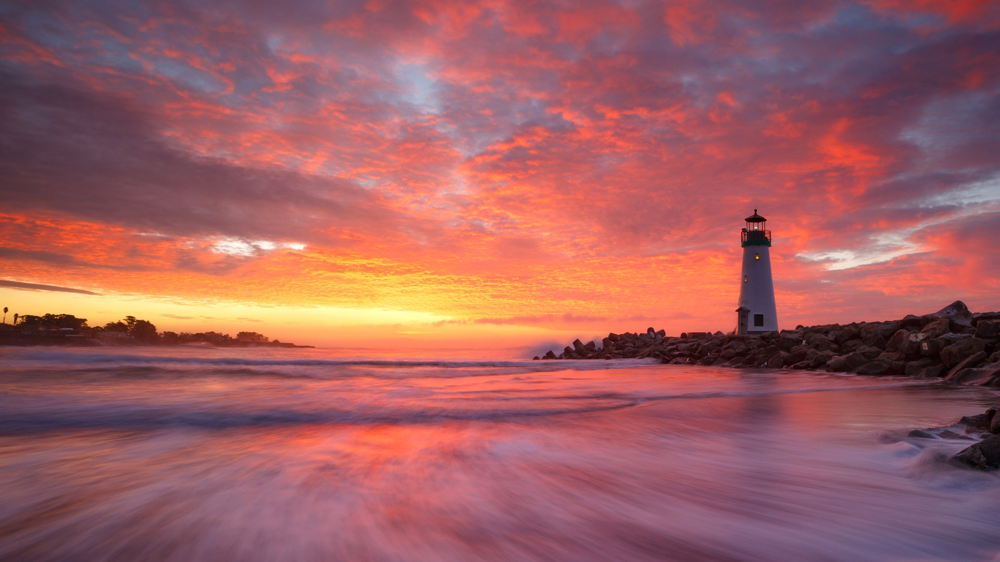
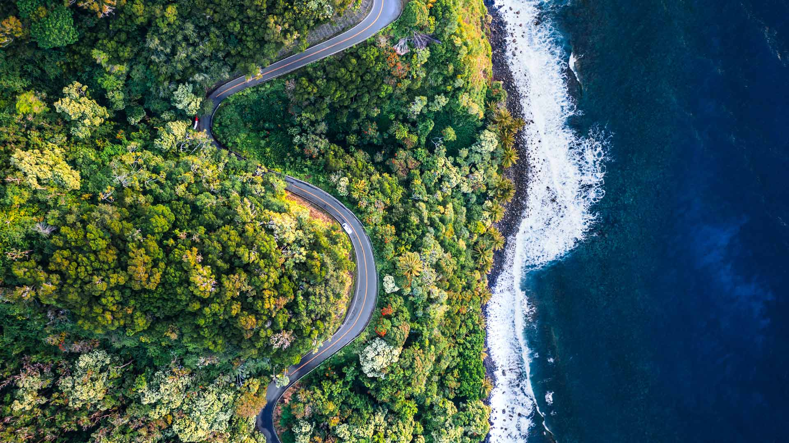
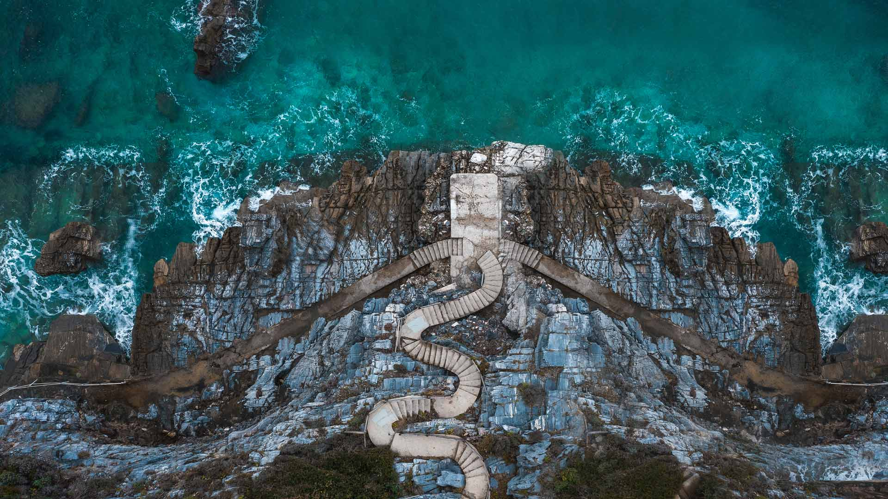

#### 20240131 Burchell's zebra mother and foal, Rietvlei Nature Reserve, South Africa (© Richard Du Toit/Minden Pictures)

#### 20240130 Aýna, Sierra del Segura, Albacete, Spain (© Juan Maria Coy Vergara/Getty Images)

#### 20240129 Golling Waterfall, Tennengau, Salzburg, Austria (© Frank Fischbach/Alamy)

#### 20240128 Renard roux, Lac des Truites, Soultzeren, Alsace, France (© gmo-pixel/500px/Getty Images)

#### 20240128 Channel Country, Outback Queensland, Australia (© Southern Lightscapes-Australia/Getty Images)

#### 20240127 Ice palace at the St. Paul Winter Carnival, Minnesota (© Joe Mamer Photography/Alamy)

#### 20240127 点嘴小巨嘴鸟，大西洋森林，巴西 (© aaprophoto/Getty Images)

#### 20240126 Northern hawk-owl (© Remo Savisaar/Alamy)

#### 20240125 A snowy owl on the icy field, Quebec City, Canada (© Marco Pozzi Photographer/Moment/Getty Images)

#### 20240125 Ruins of St. Dwynwen's Church, Ynys Llanddwyn, Wales (© Photos by R A Kearton/Getty Images)

#### 20240124 Diamond Beach, Iceland (© Rachid Dahnoun/Tandem Stills + Motion)

#### 20240123 Atolls in Indian Ocean, Maldives (© Amazing Aerial Premium/Shutterstock)

#### 20240122 Winter sunrise, Walton Lighthouse, Santa Cruz, California (© Jeff Lewis/Tandem Stills + Motion)

#### 20240122 Beatus-Rhenanus-Brücke über den Rhein, zwischen Straßburg und Kehl, Straßburg, Frankreich (© mauritius images GmbH/Alamy)

#### 20240121 Eurasian red squirrel, Netherlands (© Ernst Dirksen/Minden Pictures)

#### 20240120 Macaroni penguins, Drake Passage, Chile (© Paul Souders/Getty Images)

#### 20240120 音羽橋から見る川霧に佇むタンチョウ, 北海道 阿寒郡 (© Natapong Supalertsophon/Getty Images)

#### 20240120 Château de Castelnaud avant le lever du soleil, Dordogne, France (© Gareth Kirkland/Alamy Stock Photo)

#### 20240119 Frozen waterfalls in Plitvice Lakes National Park, Croatia (© Massimo_S8/Getty Images)

#### 20240118 Pont Alexandre III at twilight, Paris, France (© Sizun Eye/Getty Images)

#### 20240117 Sleeping wolf in Bavarian Forest National Park, Germany (© Raimund Linke/Getty Images)

#### 20240116 Lake Louise, Banff National Park, Alberta, Canada (© Mr. Simon Paul/Shutterstock)

#### 20240115 Chevaux comtois, Jura, Bourgogne-Franche-Comté, France (© Philippe Saire Photography/Getty Images)

#### 20240115 Martin Luther King Jr. Memorial, Washington, DC (© kropic1/Shutterstock)

#### 20240115 瓦茨曼山脚下的冰教堂，巴伐利亚，德国 (© Christian Bäck/eStock Photo)

#### 20240115 Geomagnetic storm at night, Penticton, British Columbia, Canada (© DEEPOL by plainpicture/Preserved Light Photography)

#### 20240114 Whooper swans in Lake Kussharo, Japan (© Darrell Gulin/DanitaDelimont.com)

#### 20240113 Road to Hana, Maui, Hawaii (© Matteo Colombo/Getty Images)

#### 20240113 勝尾寺の勝ちダルマ, 大阪府 箕面市 (© feathercollector/Adobe Stock)

#### 20240112 Bukhansan National Park, South Korea (© TRAVEL TAKE PHOTOS/Shutterstock)

#### 20240111 Früchte-im-Frost-und-Eis-versteckt,-Göttingen (© Duncan Usher/Alamy Stock Foto)

#### 20240110 Stairs on the shoreline at Mylopotamos Beach, Thessaly, Greece (© Orestis Zoumpos/Amazing Aerial Agency)

#### 20240110 Eurasian lynx in the snow (© Jan Stria/Shutterstock)

#### 20240109 Hot air balloons over the Rio Grande, Albuquerque, New Mexico (© Jennifer MacCornack/Shutterstock)

#### 20240108 Skier at Bernina Pass, Graubünden, Switzerland (© Francesco Bergamaschi/Getty Images)

#### 20240107 Karlu Karlu/Devils Marbles Conservation Reserve, Australia (© Yva Momatiuk and John Eastcott/Minden Pictures)

#### 20240106 Vermilion Lakes, Banff, Canada (© Carlos Fernandez/Moment/Getty Images)

#### 20240106 Antilles françaises, Guadeloupe, brume sur le volcan de la Soufrière (© Walter Bibikow/Getty Images)

#### 20240106 Male chaffinch perched on a crab apple tree in winter (© Mark Hamblin/2020VISION/Minden Pictures)

#### 20240105 International Ice and Snow Sculpture Festival, Harbin, China (© WANG ZHAO/AFP/Getty Images)

#### 20240105 巴伐利亚阿尔卑斯山脉，德国 (© JFL Photography/Adobe Stock)

#### 20240104 Klosterkirche St. Peter auf dem Schwarzwald, Südschwarzwald, Baden-Württemberg (© Reinhard Schmid/Huber/eStock Photo)

#### 20240104 Golden Gate Bridge, San Francisco, California (© Jim Patterson/Tandem Stills + Motion)

#### 20240103 明尼汪卡湖，阿尔伯塔省，加拿大 (© Ken Phung/500px/Getty Images)

#### 20240103 Coucher de soleil sur les lacs des Chéserys, Chamonix-Mont Blanc, France (© Smit/Shutterstock)

#### 20240103 Bodleian Library, University of Oxford, England (© Andrew Holt/Getty Images)

#### 20240102 贾斯旺萨达陵墓和梅兰加尔古堡，焦特布尔，拉贾斯坦邦，印度 (© Twenty47studio/Getty images)

#### 20240102 Prayer flags in Phobjikha Valley, Bhutan (© John Warburton-Lee/DanitaDelimont.com)

#### 20240101 本栖湖から見る富士山の日の出, 山梨県 (© Sakarin Sawasdinaka/Shutterstock)

#### 20240101 Red fox sleeping in the snow, Abruzzo, Italy (© marco vancini/500px/Getty Images)

