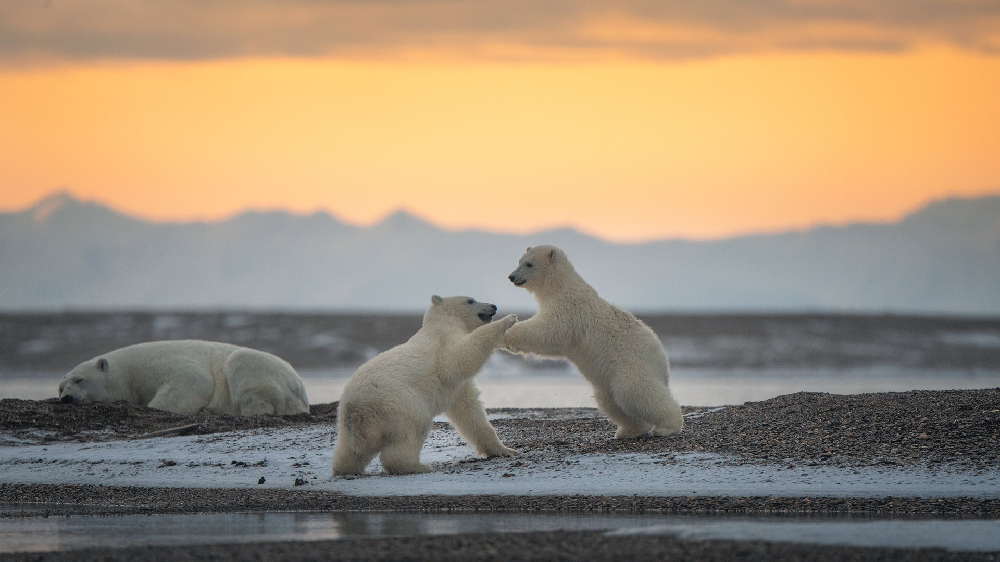
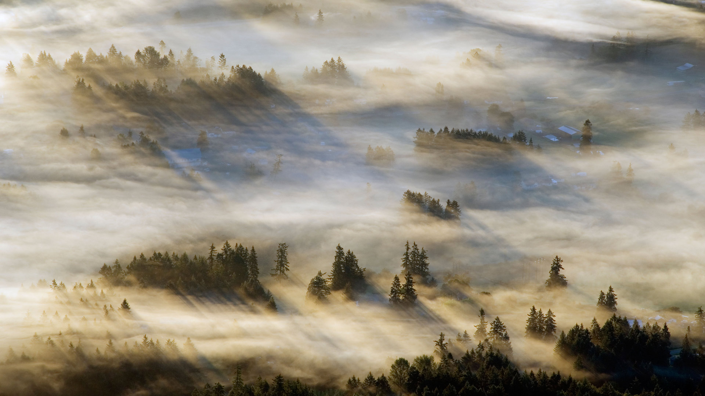
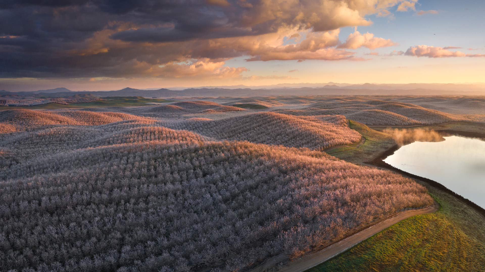
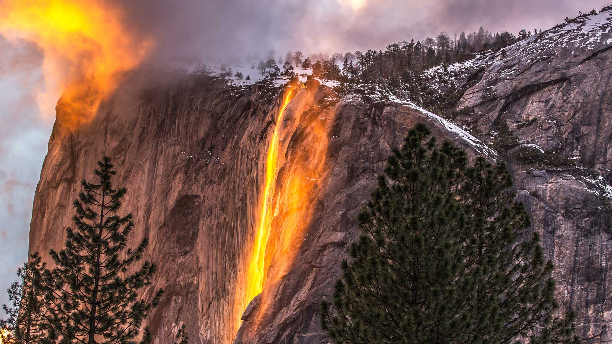
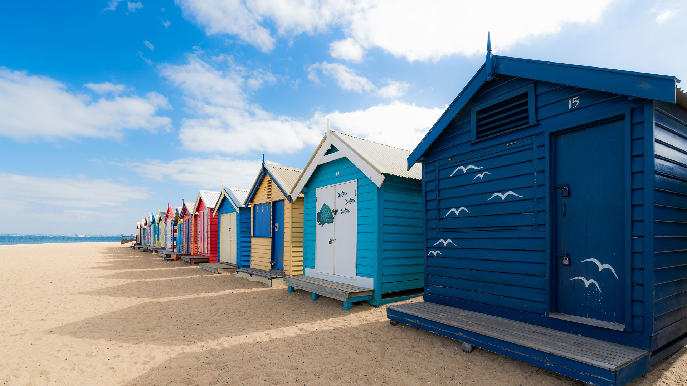
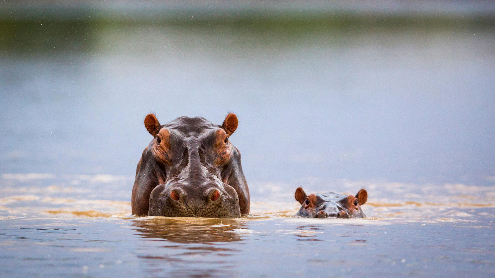
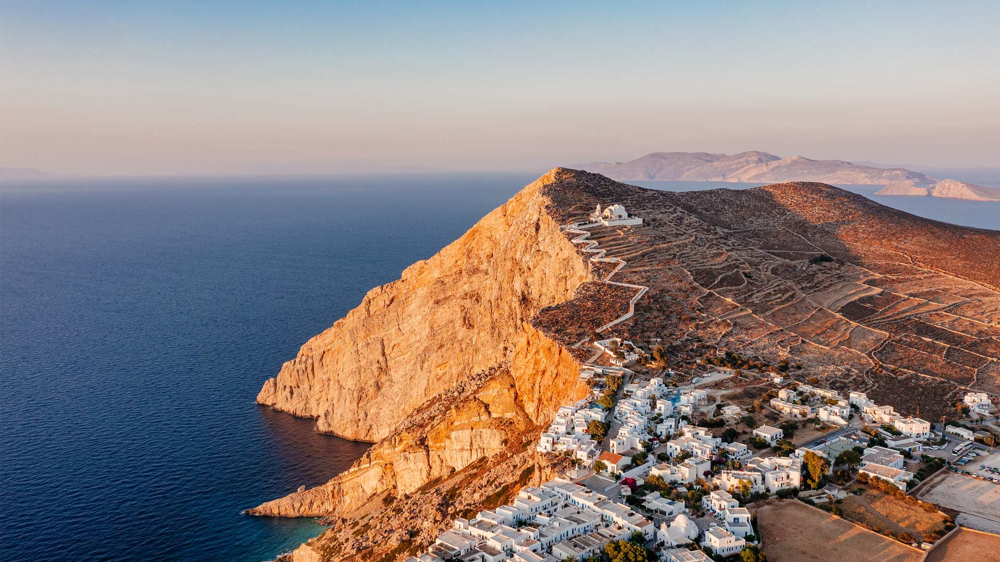

#### 20240229 バーミリオン・クリフ国定公園, 米国 アリゾナ州 (© Yva Momatiuk and John Eastcott/Minden Pictures)

#### 20240229 Eurasian red squirrel (© Westend61/Getty Images)

#### 20240228 Bamburgh Castle, Northumberland, England (© Blackbeck/Getty Images)

#### 20240227 Polar bear cubs playing, Kaktovik, Alaska (© Piriya Photography/Getty Images)

#### 20240226 Grand Canyon National Park, Arizona (© Jeremy Janus/Getty Images)

#### 20240225 'United We Stand' sculpture by Charles McGee, Charles H. Wright Museum of African American History, Detroit, Michigan (© Jim West/Alamy)

#### 20240225 考伊琴山谷的薄雾，温哥华岛，加拿大不列颠哥伦比亚省 (© Kevin Oke/Alamy)

#### 20240224 锦里街上悬挂的红色中国灯笼，成都，中国四川省 (© Philippe LEJEANVRE/Getty images)

#### 20240224 Hänsel und Gretel Haus in Oberammergau, Bayern (© Tim Graham/Getty Images)

#### 20240224 Almond trees in full bloom, California (© Jeffrey Lewis/Tandem Stills + Motion)

#### 20240224 Le Ballon d'Alsace, Territoire de Belfort, France (© VUANO Tristan/Hemis.fr/Alamy Stock Photo)

#### 20240223 Haghartsin Monastery, Dilijan National Park, Armenia (© Alexey Kharitonov/Shutterstock)

#### 20240223 朝焼けに輝く富士山と山中湖, 山梨県 (© magicflute002/Getty Images)

#### 20240222 Vallée de Chamonix, Haute-Savoie, France (© Charlie Pics/Getty Images)

#### 20240222 Wundervoll gefrorene Seifenblase (© Oksana Schmidt/Getty Images)

#### 20240222 Bathing boxes at Brighton Beach, Melbourne, Victoria, Australia (© Prasit photo/Getty Images)

#### 20240221 Firefall at Horsetail Fall, Yosemite National Park, California (© Gregory B Cuvelier/Shutterstock)

#### 20240220 Kinder Scout at sunrise, Peak District National Park, England (© john finney photography/Getty Images)

#### 20240219 乱れて咲くしだれ梅の花, 京都府 京都市 (© EvergreenPlanet/Getty Images)

#### 20240219 Toledo, Spain (© Carlos Fernandez/Getty Images)

#### 20240219 Lincoln Memorial, Washington, DC (© Steve Whiston/Fallen Log Photography/Getty Images)

#### 20240218 Sperm whale pod surfacing, Dominica (© Franco Banfi/Minden Pictures)

#### 20240218 Maisons colorées, Puerto de la Cruz, Tenerife, Espagne (© Marco Bottigelli/Getty Images)

#### 20240217 ペガドゥン・ロック, インドネシア (© CK NG/500px/Getty Images)

#### 20240217 多洛米蒂山的布莱耶斯湖，南蒂罗尔，意大利 (© Marco Bottigelli/Getty Images)

#### 20240217 Sassnitz lighthouse on Rügen island, Germany (© Christian Back/eStock)

#### 20240217 Bathing boxes at Brighton Beach, Melbourne, Victoria, Australia (© Prasit photo/Getty Images)

#### 20240217 The Alvin Ailey American Dance Theater rehearsing 'Uptown,' 2009, New York (© STAN HONDA/AFP via Getty Images)

#### 20240216 Station de Saint-Jean-d'Arves, Savoie, France (© shutterstock)

#### 20240216 Female pyrrhuloxia perched on cactus plant, Texas (© outtakes/Getty Images)

#### 20240215 Hippopotamus mother and calf, South Luangwa National Park, Zambia (© Nature Picture Library/Alamy)

#### 20240215 Berlinale, roter Teppich am Potsdamer Platz, Berlin (© Cineberg/Getty Images)

#### 20240214 L’arche de Port-Blanc, Saint-Pierre-Quiberon, France (© DaLiu/Getty Images)

#### 20240214 Red-crowned crane bowing to his mate in Hokkaido, Japan (© Steve Bloom Images/Alamy)

#### 20240213 Mardi Gras beads in the Marigny, New Orleans (© Erik Pronske Photography/Getty Images)

#### 20240212 Volcán Alcedo giant tortoises, Isabela Island, Galápagos, Ecuador (© Tui De Roy/Minden Pictures)

#### 20240211 Giant anteater in the Pantanal, Brazil (© Pedro Ferreira do Amaral/Getty Images)

#### 20240211 Chora, Folegandros Island, Cyclades, Greece (© Francesco Riccardo Iacomino/Getty Images)

#### 20240210 中国舞狮，大年初一 (© SENEZ/Getty Images)

#### 20240210 Chinese New Year Parade, Vancouver, British Columbia, Canada (© Michael Wheatley/Alamy Stock Photo)

#### 20240210 Artists performing the dragon dance for Chinese New Year, Luzhou, China (© Liu Guoxing/VCG via Getty Images)

#### 20240209 お城の雪像, 北海道 札幌市 (© Terry Donnelly/Alamy Stock Photo)

#### 20240209 Pegadung Rock, Lampung, Sumatra, Indonesia (© CK NG/500px/Getty Images)

#### 20240209 灯光秀点亮夜幕中的西安城墙，中国春节 (© Eastimages/Getty Images)

#### 20240208 Mount Hood, Oregon (© Inigo Cia/Getty Images)

#### 20240207 St. James Tidal Pool, Cape Town, South Africa (© AmazingAerialAgency/Adobe)

#### 20240207 ヴェルドン峡谷, フランス (© Hemis/Alamy)

#### 20240206 Bonsai Rock, Lake Tahoe, Nevada (© Jim Patterson/Tandem Stills + Motion)

#### 20240205 Monarch butterflies, Goleta, California (© Craig Rademacher/500px/Getty Images)

#### 20240205 テイデ国立公園, スペイン (© Javier Martínez Morán/Alamy)

#### 20240205 Innenansicht Münchner Nationaltheater Opernhaus, München, Bayern (© plainpicture/RelaxImages/WRIGHT)

#### 20240205 从奥索伊尼察观景点看日出时的布莱德湖，斯洛文尼亚 (© Rasica/Getty Images)

#### 20240204 梅の枝に止まるメジロ  (© pheeby/Adobe Stock)

#### 20240204 Devetashka Cave, Devetaki, Bulgaria (© Jasmine_K/Shutterstock)

#### 20240203 Grand Canal with Santa Maria della Salute Basilica, Venice, Italy (© RudyBalasko/Getty Images)

#### 20240203 函館山から見る夜景, 北海道 函館市 (© Hiro1775/Getty Images)

#### 20240202 L’arche de Port-Blanc, Saint-Pierre-Quiberon, France (© DaLiu/Getty Images)

#### 20240202 Marmot peeking out of its burrow (© Scacciamosche/Getty Images)

#### 20240201 Polar bear resting in rocky landscape, Churchill, Manitoba, Canada (© Warwick Sloss/NPL/Minden Pictures)

#### 20240201 吕根岛的萨斯尼茨灯塔，德国 (© Christian Back/eStock)

#### 20240201 Dizzy Gillespie in 1990 at the 32nd Monterey Jazz Festival, California (© Craig Lovell/Eagle Visions Photography/Alamy)

#### 20240201 Devetashka Cave, Devetaki, Bulgaria (© Jasmine_K/Shutterstock)

