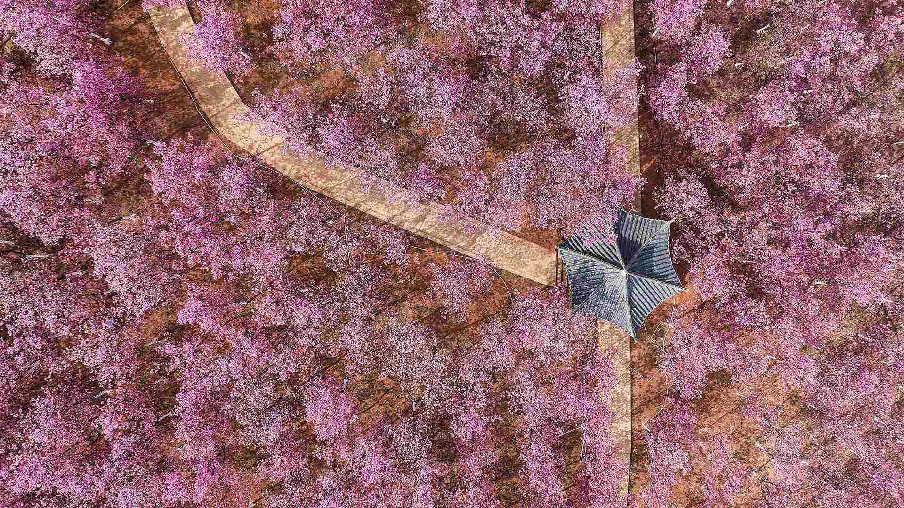
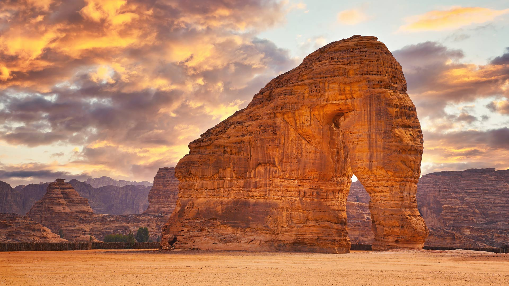
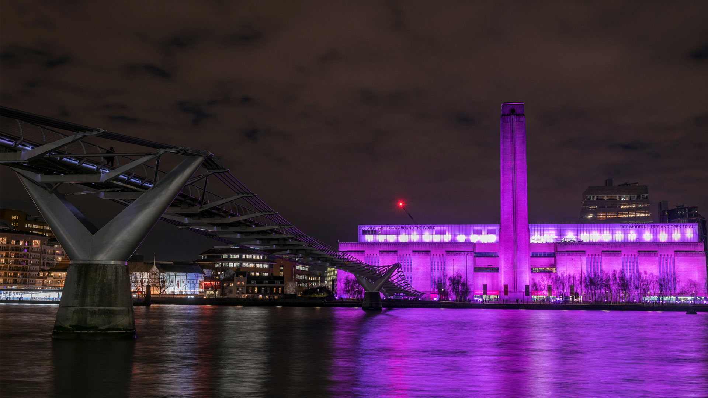

#### 20240331 Easter eggs painted by Tünde Csuhaj, Szekszárd, Hungary (© ATTILA KISBENEDEK/AFP/Getty Images)

#### 20240331 潘塔纳尔湿地的大白鹭，巴西 (© Geraldi Corsi/Getty Images)

#### 20240330 Brown-throated three-toed sloth sleeping in cecropia tree, Costa Rica (© Juan Carlos Vindas/Getty Images)

#### 20240330 'Vanishing Point' by French street artist JR on the facade of Palazzo Farnese, Rome, Italy (© Fabrizio Troiani/Alamy)

#### 20240329 South Stack Lighthouse at sunset, Holy Island, Wales (© mariotlr/Getty Images)

#### 20240328 Tea plantation near Munnar, Kerala, India (© Peter Zelei Images/Getty Images)

#### 20240328 Cherry blossoms in Shanghai, China (© Yaorusheng/Getty Images)

#### 20240327 Teatro Colón in Buenos Aires, Argentina (© Wei Hao Ho/Alamy)

#### 20240326 Seawater cascades over an ancient coral reef, Hang Rai, Vietnam (© Thang Tat Nguyen/Getty Images)

#### 20240326 目黒川沿いの桜, 東京 (© twomeows/Getty Images)

#### 20240325 弗雷泽河谷的郁金香田，阿伯兹福德，不列颠哥伦比亚省，加拿大 (© LeonU/Getty Images)

#### 20240325 Une biche dans un champ de colza, lac de Serre-Ponçon, Chorges, Hautes-Alpes, France (© Alain Bachellier/Getty Images)

#### 20240325 Celebrating Holi in Mathura, Uttar Pradesh, India (© Avishek Das/SOPA Images/LightRocket via Getty Images)

#### 20240324 Silvereyes with cherry blossoms, South Korea (© TigerSeo/Getty Images)

#### 20240324 Blick auf Felder, Luftaufnahme, Bayern (© Westend61 GmbH/Alamy)

#### 20240324 オカバンゴ・デルタ, ボツワナ (© Ibrahim Suha Derbent/Getty Images)

#### 20240323 Large anvil clouds above the Amazon in Brazil (© NASA)

#### 20240322 Blue Spring, Te Waihou Walkway, New Zealand (© Ian Beattie/Alamy)

#### 20240321 Bwindi Impenetrable National Forest, Uganda (© Art Wolfe/DanitaDelimont.com)

#### 20240320 鸟瞰春日盛开的樱花，中国 (© outcast85/Getty images)

#### 20240320 カウチンバレー, カナダ ブリティッシュコロンビア州 (© Kevin Oke/Alamy)

#### 20240320 The Jefferson Memorial during the Cherry Blossom Festival, Washington, DC (© f11photo/Shutterstock)

#### 20240320 Château d'If, Calanques, Marseille, Bouches du Rhône (© MOIRENC Camille/Hemis/Alamy Stock Photo)

#### 20240319 Tree frog on leaf (© Tetsuya Tanooka/DEEPOL by plainpicture)

#### 20240319 Cave Dale und Peveril Castle in Castleton, Peak-District-Nationalpark, Derbyshire, England (© James Osmond/Alamy)

#### 20240319 ブライスキャニオン国立公園, 米国 ユタ州 (© Jim Patterson/Tandem Stills + Motion)

#### 20240319 盛开的扁桃树, 加利福尼亚州，美国 (© Jeffrey Lewis/Tandem Stills + Motion)

#### 20240318 Elephant Rock, Al-Ula, Saudi Arabia (© Lubo Ivanko/Shutterstock)

#### 20240317 St. Finian's Bay, County Kerry, Ireland (© Atlantide Phototravel/Getty Images)

#### 20240317 Eurasian blue tit, United Kingdom (© Anne Coatesy/iStock/Getty Images)

#### 20240316 Giant panda eating bamboo, Chengdu, China (© Suzi Eszterhas/Minden Pictures)

#### 20240315 Colourful tulip fields in Fraser Valley, Abbotsford, BC, Canada (© LeonU/Getty Images)

#### 20240315 Lindenallee, baumgesäumter Fußweg durch den Park im Frühling (© AVTG/Getty Images)

#### 20240315 Anza-Borrego Desert State Park, California (© Stephen Matera/Tandem Stills + Motion)

#### 20240314 Wat Phra Ngam, Ayutthaya Historical Park, Thailand (© boonchai wedmakawand/Alamy)

#### 20240313 Lesser flamingos flying over Lake Magadi, Kenya (© Vicki Jauron, Babylon and Beyond Photography/Getty Images)

#### 20240312 東大寺, 奈良県 奈良市 (© Buddhika Weerasinghe/Getty Images)

#### 20240312 Bryce Canyon National Park, Utah (© Jim Patterson/Tandem Stills + Motion)

#### 20240311 A koala sleeping in a eucalyptus tree, Australia (© Anton Rogozin/Getty Images)

#### 20240311 Prosecco Hills of Conegliano and Valdobbiadene, Veneto, Italy (© Olimpio Fantuz/eStock Photo)

#### 20240311 追悼イベントの灯籠, 宮城県 名取市 (© Satoshi Takahashi/Getty Images)

#### 20240310 La Mer de Glace, Chamonix, massif du Mont-Blanc, Haute-Savoie, France (© Hagenmuller Jean-François/Hemis.fr)

#### 20240310 San Jacinto Building's mechanical clock, Beaumont, Texas (© Richard T. Nowitz/Getty Images)

#### 20240310 Rathaus Ulm, Astronomische Uhr aus dem 16. Jahrhundert, Ulm, Baden-Württemberg (© Hemis/Alamy Stock Photo)

#### 20240309 Bisti/De-Na-Zin Wilderness Area, New Mexico (© Ian Shive/Tandem Stills + Motion)

#### 20240308 Tate Modern lit up for International Women's Day, London, England (© Stephen Chung/Alamy Stock Photo)

#### 20240308 伊瓜苏大瀑布鸟瞰图，巴西 (© Nido Huebl/Shutterstock)

#### 20240307 Roques de Benet, Els Ports Natural Park, Catalonia, Spain (© Sergi Boixader/Alamy)

#### 20240306 Wahclella Falls in the Columbia River Gorge, Oregon (© Eric Vogt/Tandem Stills + Motion)

#### 20240305 Traffic circle and highway in Bangkok, Thailand (© Avigator Fortuner/Shutterstock)

#### 20240304 Arenal Volcano seen from Monteverde, Costa Rica (© Lukas Bischoff/Getty Images)

#### 20240303 下鴨神社の流し雛, 京都 (© masahiro Makino/Getty Images)

#### 20240302 Leopard in a tree, Kruger National Park, South Africa (© Tonino De Marco/Minden Pictures)

#### 20240301 Sunset colours over the icy Wheaton River, Yukon, Canada (© Robert Postma/All Canada Photos/Alamy Stock Photo)

#### 20240301 Women's suffrage parade on Fifth Avenue, Manhattan, New York City, October 23, 1915 (© Bettmann/Getty Images)

#### 20240301 德国草地上的蝴蝶 (© Albert Fertl/Getty Images)

#### 20240301 Modica, Sicily, Italy (© Sandro Bisaro/Getty Images)

#### 20240301 Blaireau européen (© Milan Zygmunt/Shutterstock)

