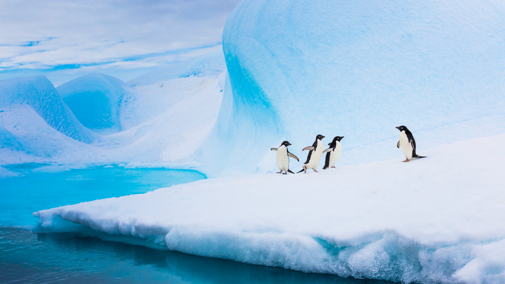
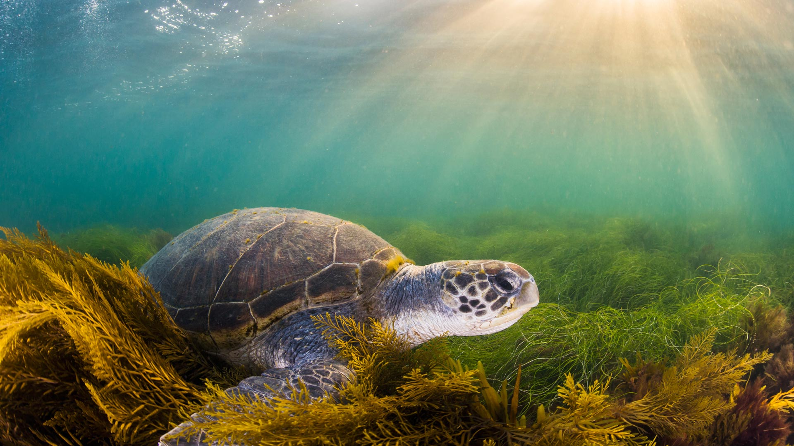
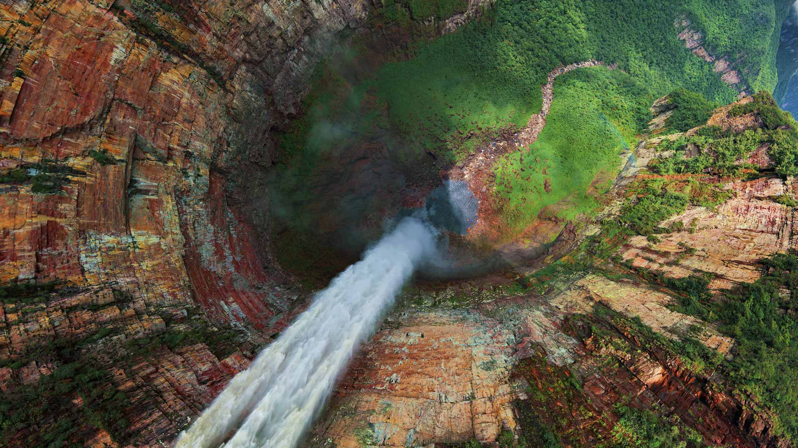
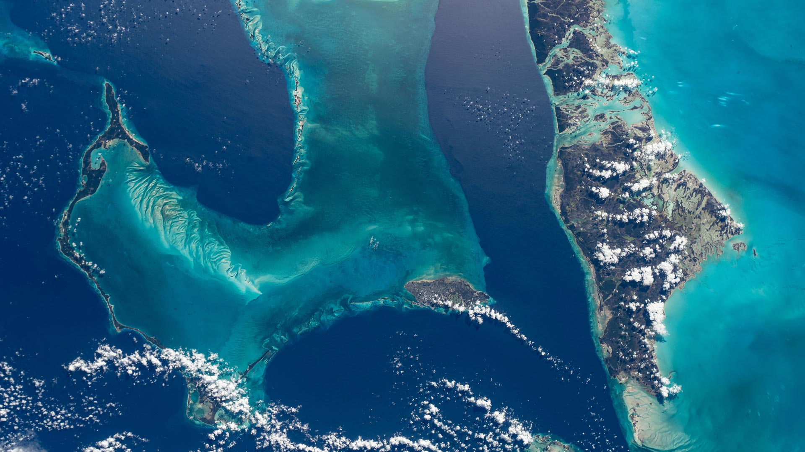
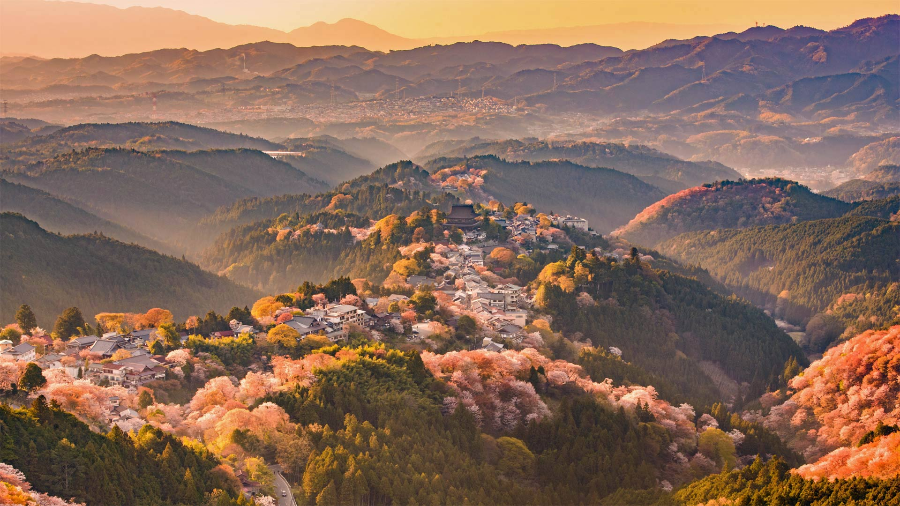

#### 20240430 Cheetah in morning rain, Ndutu Plains, Ngorongoro Conservation Area, Tanzania (© Paul Souders/Getty Images)

#### 20240429 Fujian Tulou complex of historical and cultural heritage buildings in Fujian province, China (© Hongjie Han/Getty Images)

#### 20240428 El Capitan at sunrise in Guadalupe Mountains National Park, Texas (© Adam Mowery/Tandem Stills + Motion)

#### 20240427 Leucistic Anna's hummingbird in the Australian Garden, UC Santa Cruz Arboretum, California (© yhelfman/Getty Images)

#### 20240427 L'abbaye Saint-Martin du Canigou, Casteil, Occitanie, France (© Cyril Gosselin/Getty Images)

#### 20240426 Villnöß with the Dolomites in the background, South Tyrol, Italy (© Achim Thomae/Getty Images)

#### 20240425 Adélie penguins on an iceberg, Antarctica (© Patrick J. Endres/Getty Images)

#### 20240425 Tree of Life, Kalaloch Beach, Olympic National Park, Washington (© Abbie Warnock-Matthews/Shutterstock)

#### 20240424 White trilliums blooming in Ontario, Canada (© Jun Zhang/Getty Images)

#### 20240424 Seiser Alm in the Dolomites, South Tyrol, Italy (© Achim Thomae/Getty Images)

#### 20240423 Library of Trinity College Dublin, Ireland (© Vincent Isore/Getty Images)

#### 20240422 Green sea turtle, San Diego, California (© Ralph Pace/Minden Pictures)

#### 20240421 Blumenbeete mit Tulpen und anderen Frühlingsblumen im Rheinpark, Köln (© Elisabeth Schittenhelm/Getty Images)

#### 20240421 Îles Chausey, Normandie, France (© Tuul & Bruno Morandi/Getty Images)

#### 20240421 Sparks Lane in Cades Cove, Great Smoky Mountains National Park, Tennessee (© Richard Bernabe/Shutterstock)

#### 20240420 Grand Prismatic Spring at sunrise, Yellowstone National Park, Wyoming (© XIN WANG/Getty Images)

#### 20240419 The Ring of Brodgar, Orkney, Scotland (© Paul Williams - FunkyStock/Getty Images)

#### 20240418 Château royal d'Amboise dans la vallée de la Loire, France (© iStock/Getty Images Plus/StockPhotoAstur)

#### 20240418 Medieval city walls, Ávila, Spain (© Alberto Loyo/Getty Images)

#### 20240417 American black bear cub in spring, Shenandoah National Park, Virginia (© Scott Suriano/Getty Images)

#### 20240416 Union Square in lower Manhattan at twilight, New York (© Sean Pavone/Getty Images)

#### 20240415 The RedBall Project art installation, Centraal Station, Antwerp, Belgium (© Brit Worgan/Getty Images)

#### 20240415 香波城堡，中央-卢瓦尔河谷大区，法国 (© Susanne Kremer/eStock Photo)

#### 20240414 Stängellose Schlüsselblumen, Weener, Niedersachsen (© Mohssen Assanimoghaddam/picture alliance via Getty Images)

#### 20240414 Sunset on Bowling Ball Beach, Mendocino County, California (© Melo Qiao/Getty Images)

#### 20240413 富士本栖湖リゾート, 山梨県 (© Torsakarin/Getty Images)

#### 20240413 Cherry blossoms in Queen Elizabeth Park, Vancouver (© Yun Han Xu/Moment Open/Getty Images)

#### 20240413 Vue nocturne depuis le Rhône sur la ville de Lyon avec le Grand Hôtel-Dieu et la cathédrale de Fourvière, France (© Frédéric Prochasson/Getty Images)

#### 20240412 Evening light over North Window with Turret Arch in the distance, Arches National Park, Utah (© Anthony Heflin/Shutterstock)

#### 20240411 Aerial view of Churún Merú waterfall, Venezuela (© AirPano LLC/Amazing Aerial Agency)

#### 20240410 Burrowing owl chicks near a burrow, Wyoming (© Danita Delimont/Getty Images)

#### 20240409 Whistler Mountain in the creekside of Whistler (© Insight Photography/Design Pics/Getty Images)

#### 20240409 Tulip fields in spring, Skagit Valley, Washington (© Claudia Cooper/Getty Images)

#### 20240408 Apple trees in spring, Germany (© Smileus/Getty Images)

#### 20240408 Total solar eclipse photographed from Madras, Oregon on August 21, 2017 (© NASA/Aubrey Gemignani)

#### 20240408 欧洲刺猬在长满蒲公英的花园里，巴特德里堡，德国 (© Oksana Schmidt/Getty Images)

#### 20240407 North American beaver in a pond near Wonder Lake, Denali National Park, Alaska (© Paul Souders/Getty Images)

#### 20240406 Himeji Castle, Himeji, Hyōgo Prefecture, Japan (© Julian Elliott Photography/Getty Images)

#### 20240405 The Bahamas photographed from the International Space Station (© NASA)

#### 20240404 吉野山の桜, 奈良県 吉野郡 (© Sean Pavone/iStock/Getty Images Plus)

#### 20240404 Red lechwe herd crossing marshy plain of Okavango Delta, Botswana (© Ibrahim Suha Derbent/Getty Images)

#### 20240403 Broken Group Islands, Pacific Rim National Park Reserve, Vancouver Island, British Columbia (© Ron Watts/Design Pics/Getty Images)

#### 20240403 A rainbow in At-Bashy District  , Kakshaal Too Mountains, Naryn Province, Kyrgyzstan (© Emad aljumah/Getty Images)

#### 20240403 Château de Chambord, Vallée de la Loire, France (© Susanne Kremer/Huber/eStock Photo)

#### 20240402 Beech trees and wild anemones, Jutland, Denmark (© Nick Brundle Photography/Getty Images)

#### 20240401 Traunsteiner Pferde beim traditionellen St. Georgi-Ritt am Ostermontag in bayerischen Farben geschmückt, Deutschland (© Christof Stache/AFP via Getty Images)

#### 20240401 勃朗峰上的冰海，夏慕尼，法国 (© Hagenmuller Jean-François/Hemis/Alamy)

