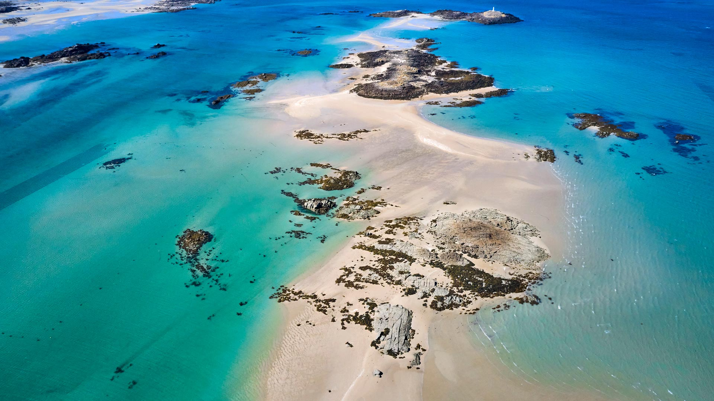
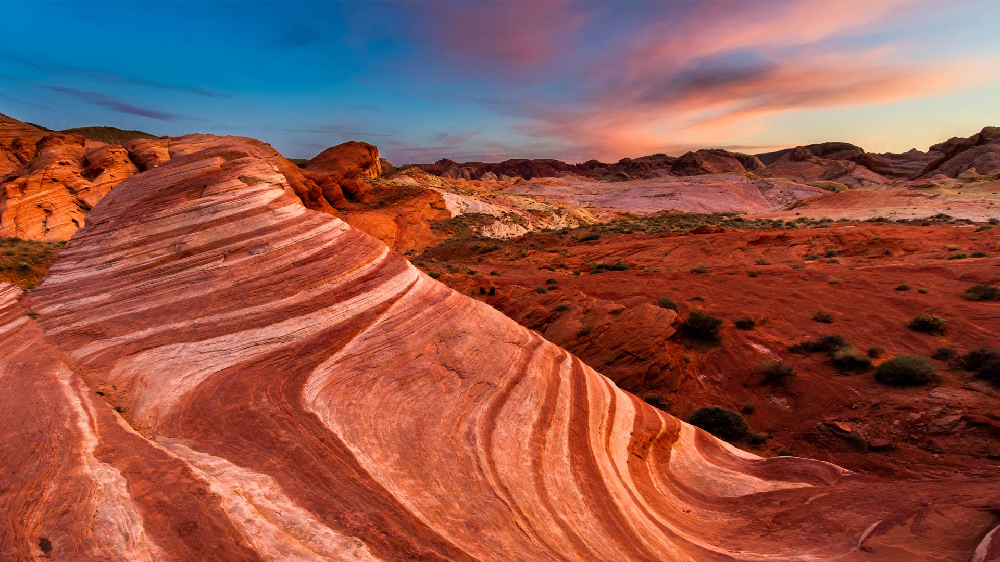
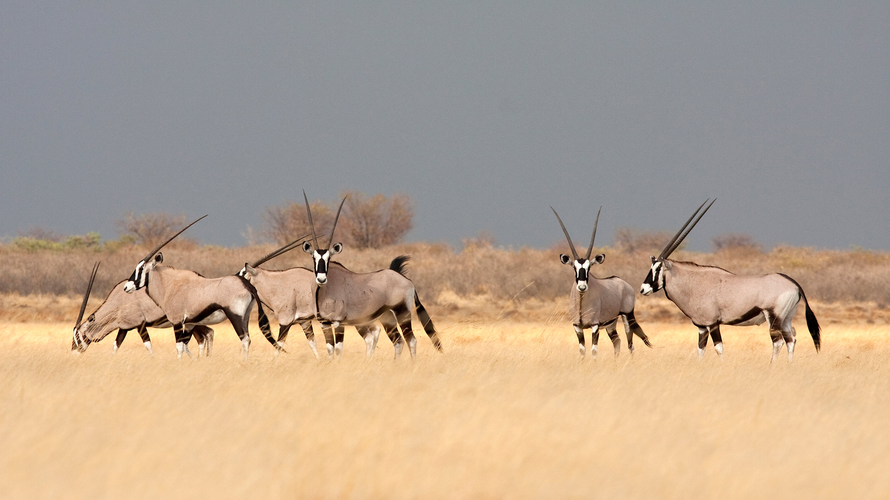
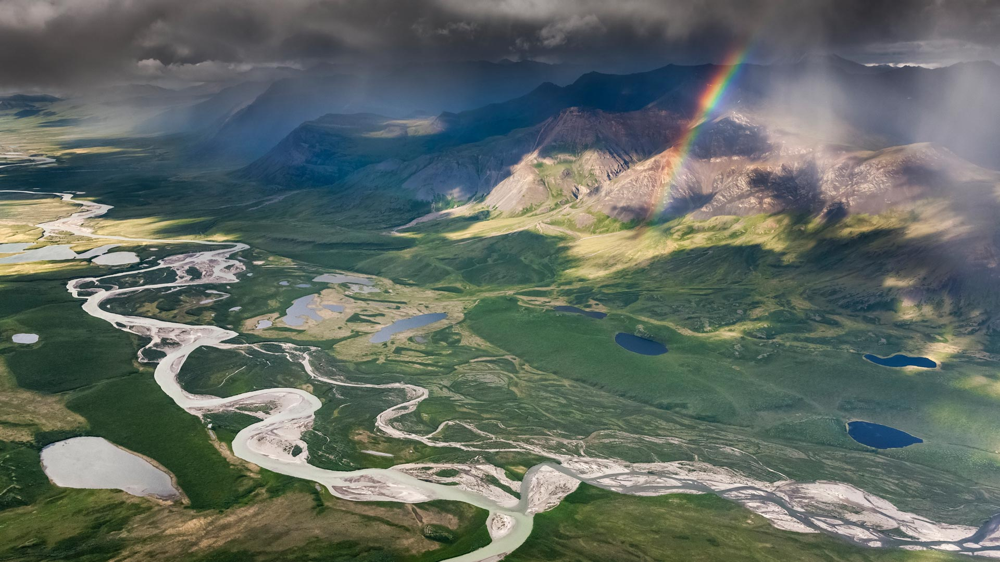

#### 20240630 Stone carving at a temple in Ubud, Bali, Indonesia (© R. Schönebaum/plainpicture)

#### 20240629 Cyclists in the 2013 Tour de France, Corsica, France (© Pascal Pochard-Casabianca/AFP via Getty Images)

#### 20240629 宁哈根的山毛榉林，梅克伦堡-前波美拉尼亚州，德国 (© Martin Ruegner/Getty Images)

#### 20240628 Drapeau arc-en-ciel brandi devant la tour Eiffel lors de la marche des fiertés (© Yuriko Nakao/Getty Images)

#### 20240628 Pride flags at Christopher Park, Stonewall National Monument, New York City (© Noam Galai/Getty Images)

#### 20240628 诺曼底海岸的绍塞群岛，法国 (© Tuul & Bruno Morandi/Getty Images)

#### 20240628 Die Allianz Arena in Regenbogenfarben beleuchtet, München, Deutschland (© Marci Kost/Getty Images)

#### 20240627 Duomo Santa Maria del Fiore at dusk, Florence, Italy (© Elena Pueyo/Getty Images)

#### 20240627 菖蒲, 山形県 長井市 (© gyro/Getty Images)

#### 20240626 ペヴリル城, イングランド (© James Osmond/Alamy)

#### 20240626 Juvenile Banggai cardinalfish with sea anemone, Lembeh Strait, North Sulawesi, Indonesia (© Constantinos Petrinos/NPL/Minden Pictures)

#### 20240625 Fire Wave, a rock formation in Valley of Fire State Park, Nevada (© Clint Losee/Tandem Stills + Motion)

#### 20240624 Volcanic crater lakes on Kelimutu, Flores, Indonesia (© Shane P. White/Minden Pictures)

#### 20240623 湖畔に咲き誇るラベンダーと富士山, 河口湖 (© DoctorEgg/Getty Images)

#### 20240623 Aerial view of an intersection in Dhaka, Bangladesh (© Azim Khan Ronnie/Amazing Aerial Agency)

#### 20240622 Amazon rainforest, Brazil (© Claus Meyer/plainpicture)

#### 20240621 蓝色水面上的渔船航拍图，郴州市，湖南省，中国 (© Haitong Yu/Getty images)

#### 20240621 Pont-Neuf à Toulouse (© benkrut/Getty Images)

#### 20240621 Interior exhibits of the Canadian Museum of History (© Inspired By Maps/Shutterstock)

#### 20240620 Kokino, an ancient megalithic observatory, North Macedonia (© stoimilov/Shutterstock)

#### 20240619 Reticulated giraffe mother greeting calf, Lewa Wildlife Conservancy, Kenya (© Sean Crane/Minden Pictures)

#### 20240619 Jacob Lawrence's mosaic 'Community,' Joseph P. Addabbo Federal Building, Jamaica, Queens, New York (© Alpha Stock/Alamy)

#### 20240619 Duomo Santa Maria del Fiore at dusk, Florence, Italy (© Elena Pueyo/Getty Images)

#### 20240619 库克斯港的水塔，德国 (© Andreas Vogel/Alamy)

#### 20240618 Lupine fields and church at sunrise, Snæfellsnes Peninsula, Iceland (© Matteo Colombo/Getty Images)

#### 20240617 Green-crowned brilliant hummingbird with giant thistle, Cerro de la Muerte, Costa Rica (© adrian hepworth/Alamy)

#### 20240617 Fort Cigogne, archipel des Glénans, Bretagne (© Gerard SIOEN/Getty Images)

#### 20240616 Ruinenberg, ein Hügel im Potsdamer Stadtteil Bornstedt (© Sabina Berezina/Getty Images)

#### 20240616 Red fox father and kit, Washington (© Chase Dekker/Minden Pictures)

#### 20240615 Surfer riding a wave in Nazaré, Portugal (© Rui Caria/Getty Images)

#### 20240614 佩姬湾灯塔，新斯科舍省，加拿大 (© Pugalenthi/Getty Images)

#### 20240614 Flag display at the Washington Monument, Washington, DC  (© tristanbnz/Adobe Stock)

#### 20240614 Aerial view of an intersection in Dhaka, Bangladesh (© Azim Khan Ronnie/Amazing Aerial Agency)

#### 20240613 Mosaic façade in the Registan, Samarkand, Uzbekistan (© da-kuk/Getty Images)

#### 20240612 Milky Way over Big Bend National Park, Texas (© wisanuboonrawd/Adobe Stock)

#### 20240611 Gemsbok in the savanna, Botswana (© Karine Aigner/Tandem Stills + Motion)

#### 20240611 アジサイ, 神奈川県 鎌倉市 (© baphotte/Getty Images)

#### 20240610 Osaka at night, Japan (© wichianduangsri/Getty Images)

#### 20240610 龙舟池日出，集美区，厦门，中国 (© outcast85/Getty images)

#### 20240609 Kloster Kamp mit Terrassengarten und Klosterbarockgarten, Kamp-Lintfort, Niederrhein (© Hans Blossey/Alamy)

#### 20240609 Bardenas Reales Biosphere Reserve and Natural Park, Bardenas, Navarra, Spain (© Aliaume Chapelle/Tandem Stills + Motion)

#### 20240608 Confluence of Easter Creek and Killik River, Gates of the Arctic National Park, Alaska (© Patrick J. Endres/Getty Images)

#### 20240608 Skyline of Downtown Montreal, Quebec, Canada (© benedek/E+/Getty Images)

#### 20240607 Family of humpback whales, Dutch Harbor, Alaska (© Jude Newkirk/Amazing Aerial Agency)

#### 20240606 Luftaufnahme der Rossfeld-Panoramastraße, Berchtesgaden, Deutschland (© DieterMeyrl/Getty Images)

#### 20240606 Les Braves monument on Omaha Beach, Normandy, France (© Christopher Furlong/Getty Images)

#### 20240606 Southern gemsbok in the savanna, Botswana (© Karine Aigner/Tandem Stills + Motion)

#### 20240606 蓬德高鸟类公园的大红鹳，卡玛格，法国 (© Yann Guichaoua-Photos/Getty Images)

#### 20240605 Masoala National Park in Madagascar (© Dennis van de Water/Shutterstock)

#### 20240604 Chestnut-headed bee-eaters, Bardia National Park, Nepal (© PACO COMO/Shutterstock)

#### 20240603 Bicycles in Copenhagen, Denmark (© Alphotographic/Getty Images)

#### 20240602 みなとみらい 21 地区, 神奈川県 横浜市 (© SeanPavonePhoto/Getty Images)

#### 20240602 普卢马纳克的灯塔，阿摩尔滨海省，法国 (© Christian Handl/Getty Images)

#### 20240602 Flowers blooming in a garden, Alaska (© jet 67/Shutterstock)

#### 20240602 Female Anna's hummingbird, Canada (© Devonyu/iStock/Getty Images)

#### 20240601 San Francisco City Hall lit up in rainbow lights for Pride, California (© Josh Edelson/AFP via Getty Images)

#### 20240601 帝王棕榈树，里约热内卢植物园，巴西 (© Marcia Silva de Mendonca/Getty Images)

