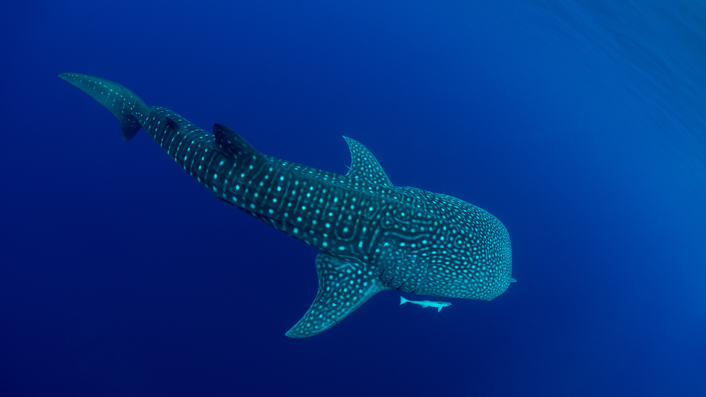
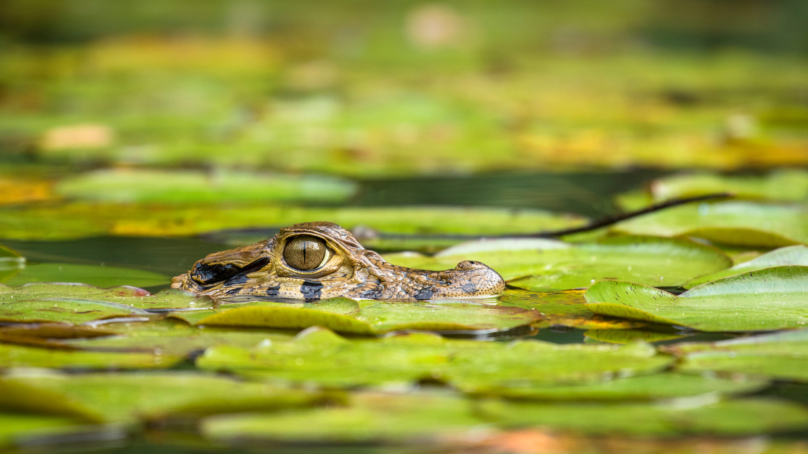
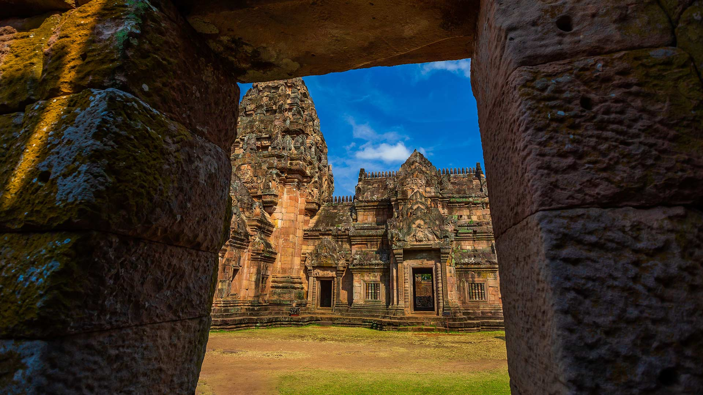
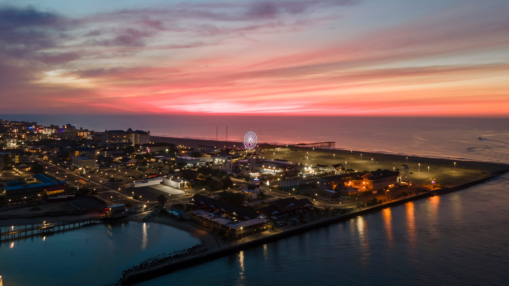
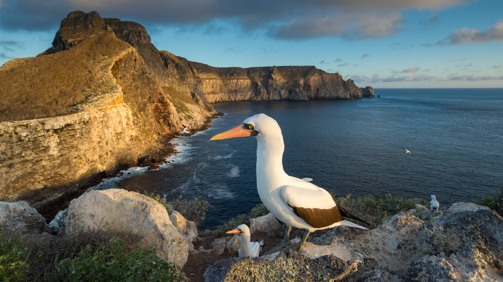
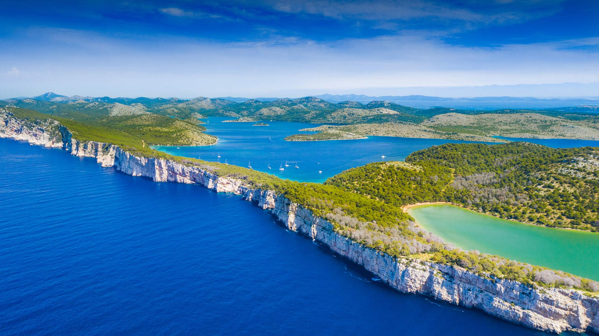
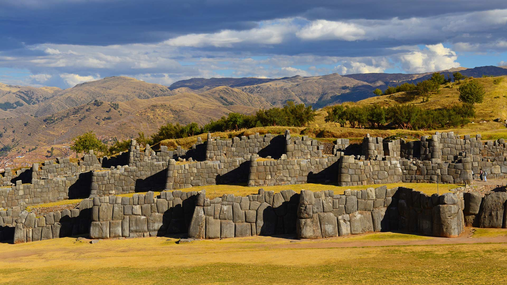
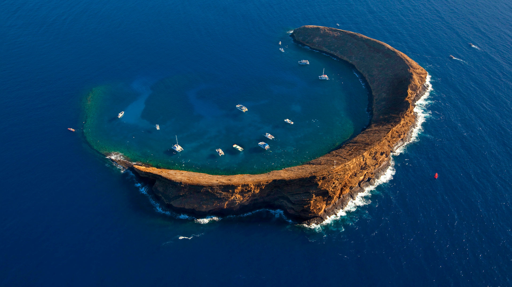
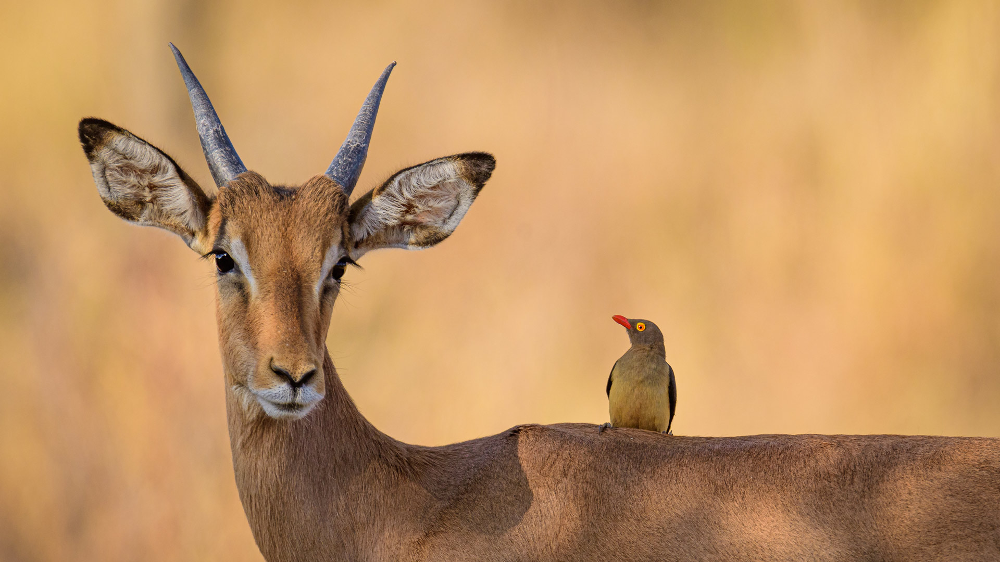

#### 20240831 Rock formations and sand dunes in the Sahara, Tassili n’Ajjer, Algeria (© Airpano/Amazing Aerial Agency)

#### 20240830 A whale shark in Cenderawasih Bay, West Papua, Indonesia (© Andy Lerner/Tandem Stills + Motion)

#### 20240829 Castellfollit de la Roca, Catalonia, Spain (© Eloi_Omella/Getty Images)

#### 20240828 Pont Neuf sur la Seine, Paris, France (© f11photo/Getty Images)

#### 20240828 Montmartre and Sacre Cœur, Paris, France (© Tuul & Bruno Morandi/Getty Images)

#### 20240827 Young black caiman, Tambopata National Reserve, Peru (© Maxime Aliaga/Minden Pictures)

#### 20240826 Palmyra Atoll National Wildlife Refuge, Central Pacific Ocean (© Ian Shive/Tandem Stills + Motion)

#### 20240825 Drohnenansicht der Weinberge im Remstal, Baden-Württemberg (© Westend61/Getty Images)

#### 20240825 Reflet du ciel sur le lac Blanc, Alpes françaises, Monte Bianco en arrière-plan, Chamonix (© Smitt/Getty Image)

#### 20240825 Sunrise over Swiftcurrent Lake, Glacier National Park, Montana (© Jason Savage/Tandem Stills + Motion)

#### 20240824 Museumsinsel auf der Spree und Fernsehturm, Berlin (© TomasSereda/Getty Images)

#### 20240824 Katahdin Woods and Waters National Monument, Penobscot County, Maine (© Cavan Images/Alamy)

#### 20240824 三千院のわらべ地蔵, 京都 (© Klaus-Werner Friedrich/Alamy)

#### 20240823 Prasat Phanom Rung temple ruins, Buriram province, Thailand (© Banjongseal324/Getty Images)

#### 20240823 厳島神社, 広島県 廿日市市 (© Matsuo Sato/Shutterstock)

#### 20240822 Ocean City, Maryland, at sunrise (© Kevin Olson/Amazing Aerial Agency)

#### 20240821 Nazca boobies, Wolf Island, Galápagos Islands, Ecuador (© Tui De Roy/Minden Pictures)

#### 20240820 Sunrise at Grand Teton National Park, Wyoming (© Kurt Budliger/Tandem Stills + Motion)

#### 20240819 Two Atlantic puffins, Elliston, Newfoundland, Canada (© Daphne Roberts Photography/Getty Images)

#### 20240819 Bufadero de la Garita，大加那利岛，西班牙 (© Marco Bottigelli/Getty Images)

#### 20240819 Museum of Flight, Seattle, Washington (© George Rose/Getty Images)

#### 20240818 Huntington Beach Pier, California, at sunset (© Stan Moniz Photography/Tandem Stills + Motion)

#### 20240818 Externsteine im Teutoburger Wald, Nordrhein-Westfalen (© MoJoLo/Panther Media GmbH/Alamy Stock Photo)

#### 20240817 Alfanzina Lighthouse, Algarve, Portugal (© Andreas Kunz/Getty Images)

#### 20240816 Roller coaster in Nagashima Spa Land, Mie prefecture, Japan (© Japanese amateur photographer/Getty Images)

#### 20240816 大文字山の大文字, 京都 (© Masako Ishida/Getty Images)

#### 20240816 Canadian International Air Show at the Canadian National Exhibition, in Toronto, Ontario (© Tony Florio/Alamy Stock Photo)

#### 20240816 Papillon et fleur de lavande au lever du soleil, France (© Konstanttin/Getty Images)

#### 20240815 Hang Sơn Đoòng cave, Phong Nha-Kẻ Bàng National Park, Vietnam (© Geng Xu/Getty Images)

#### 20240814 Thorny devil, Watarrka National Park, Australia (© Yva Momatiuk and John Eastcott/Minden Pictures)

#### 20240813 Citadelle de Port Louis, Lorient, Morbihan, France (© Philippe TURPIN/Getty Images)

#### 20240813 Cliffs of Telašćica Nature Park, Dugi Otok Island, Croatia (© Ilija Ascic/Shutterstock)

#### 20240812 African elephants, Amboseli National Park, Kenya (© Ruzdi Ekenheim/Getty Images)

#### 20240811 草津白根山, 群馬県 吾妻郡 (© Twenty47studio/Getty Images)

#### 20240810 Wooden path to Kennedy Lake, Vancouver Island, BC, Canada (© EB Adventure Photography/Shutterstock)

#### 20240810 Joshua Tree National Park, California (© Chris Moore - Exploring Light Photography/Tandem Stills + Motion)

#### 20240810 Luftaufnahme der Elbphilharmonie in Hamburg (© Michael Abid/Alamy)

#### 20240809 Inca ruin of Sacsayhuamán near Cusco, Peru (© SL_Photography/Getty Images)

#### 20240808 Spotted owlet, Bangkok, Thailand (© Tfilm/Getty Images)

#### 20240807 St. Joseph North Pier Inner and Outer Lights, Michigan (© Kenneth Keifer/Getty Images)

#### 20240806 巨大な吹き流し, 宮城県 仙台市 (© rujin/Shutterstock)

#### 20240806 Molokini Crater, Maui, Hawaii (© Douglas Peebles/eStock Photo)

#### 20240805 Lavender field, Hertfordshire, England (© George W Johnson/Getty Images)

#### 20240804 Sellin Seebrücke, Sellin, Rügen (© SW Travel Imagery/Alamy Foto de stock)

#### 20240804 Impala and red-billed oxpecker, South Africa (© Matrishva Vyas/Getty Images)

#### 20240804 San Gimignano, Sienne, Toscane, Italie (© MNStudio/Shutterstock)

#### 20240803 Three Natural Bridges, Wulong Karst National Geology Park, China (© Pav-Pro Photography Ltd/Shutterstock)

#### 20240803 Faon chevreuil, Normandie (© slowmotiongli/Getty Images)

#### 20240803 Sunset over Anse Champagne beach in Saint-François, Guadeloupe, Caribbean (© Fyletto/Getty Images)

#### 20240802 Trunk Bay, St. John, Virgin Islands National Park (© cdwheatley/Getty Images)

#### 20240802 A family of Canadian geese swimming in a lake in Banff National Park, Alberta (© Chase Dekker Wild-Life Images/Moment/Getty Images)

#### 20240801 豪華絢爛なねぷた, 青森県 弘前市 (© David Parker/Alamy)

#### 20240801 Floating market, Kaptai Lake, Rangamati, Bangladesh (© Azim Khan Ronnie/Amazing Aerial Agency)

