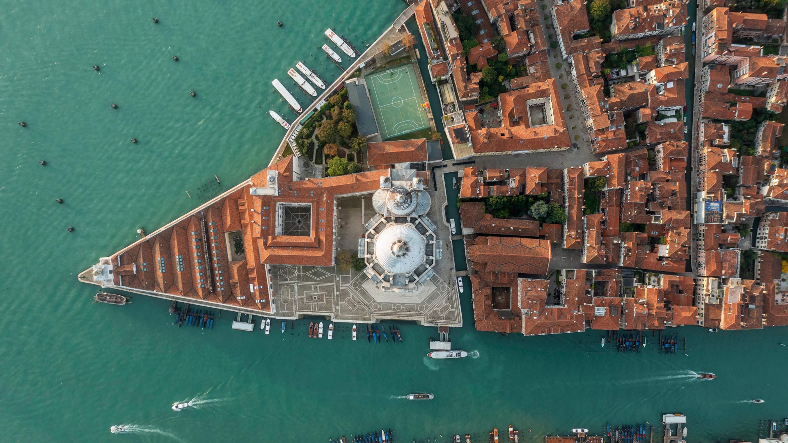
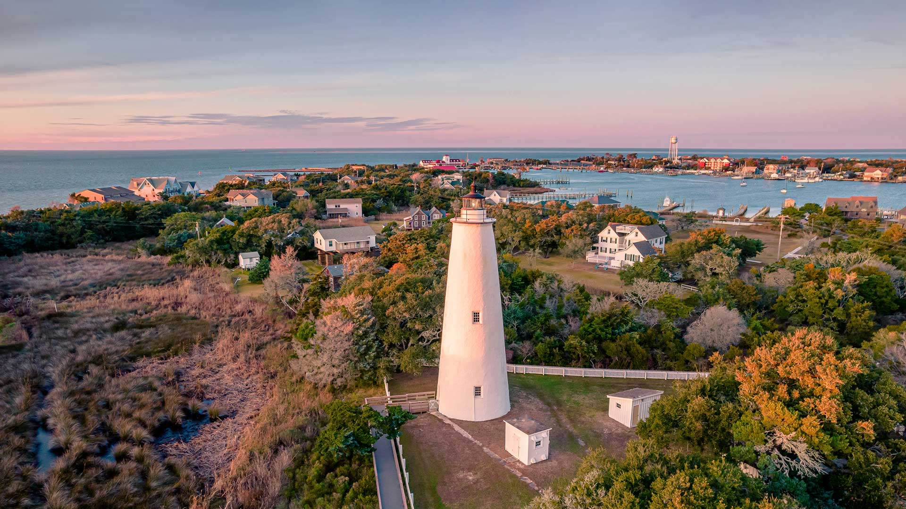
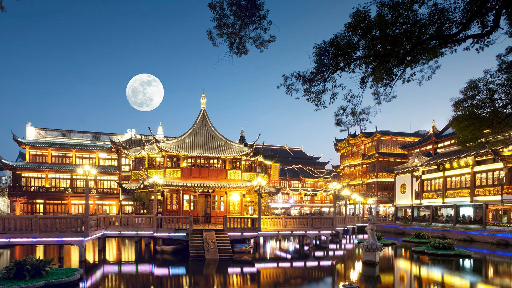
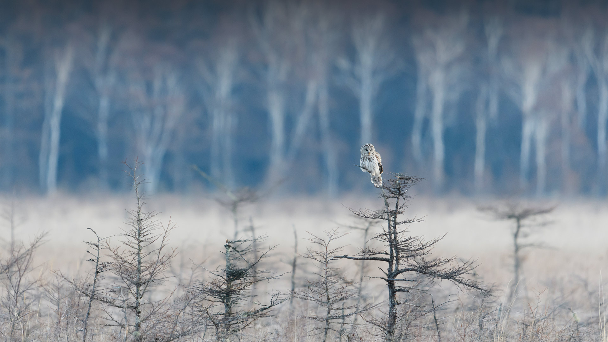
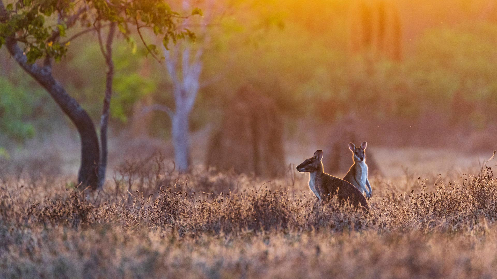
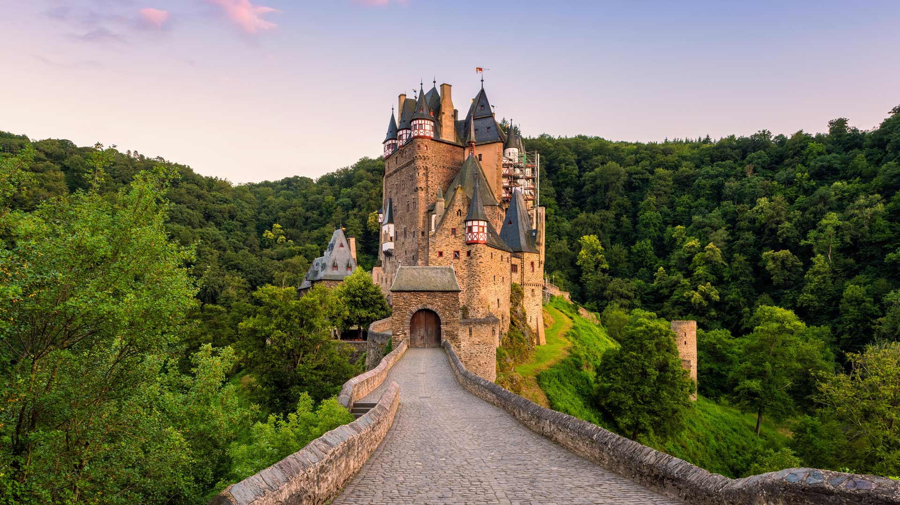
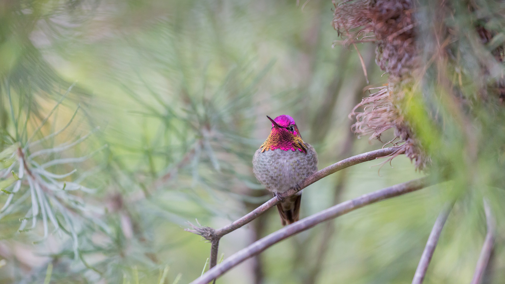

#### 20240930 Herd of walruses in northern Spitsbergen, Svalbard archipelago, Norway (© AWL Images/Danita Delimont)

#### 20240929 West Cornwall Covered Bridge over the Housatonic River, Connecticut (© pabradyphoto/Getty Images)

#### 20240928 日出时的海滩，海湾岛国家海岸，佛罗里达，美国 (© Tim Fitzharris/Minden Pictures)

#### 20240928 Cottonwoods seen through an arch in Coyote Gulch, Glen Canyon Recreation Area, Utah (© Stephen Matera/Tandem Stills + Motion)

#### 20240928 Calanque d'En-Vau, parc national des Calanques, Côte d’Azur (© Marco Bottigelli/Getty Images)

#### 20240927 夕暮れに染まる橋, 神奈川県 横浜市 (© Prisma by Dukas Presseagentur GmbH/Alamy Stock Photo)

#### 20240927 Aerial view of the Grand Canal and the Basilica di Santa Maria della Salute, Venice, Italy (© Bachir Moukarzel/Amazing Aerial Agency)

#### 20240926 Taj Mahal in Agra, Uttar Pradesh, India (© Tanarch/Getty Images)

#### 20240926 Blue-throated toucanet, Los Quetzales National Park, Costa Rica (© Oscar Dominguez/Tandem Stills + Motion)

#### 20240925 Giant sequoias, Sequoia National Park, California (© Galyna Andrushko/Shutterstock)

#### 20240924 Waterfall in Skaftafell, Vatnajökull National Park, Iceland (© Nopasorn Kowathanakul/Getty Images)

#### 20240923 Sea otter, Prince William Sound, Alaska (© Gerald Corsi/Getty Images)

#### 20240922 巾着田の彼岸花, 埼玉県 日高市 (© Scirocco340/Shutterstock)

#### 20240922 Buttermere, Lake District National Park, England (© Alan Novelli/Alamy)

#### 20240921 Menschen im „Spaten“-Bierzelt auf dem größten Volksfest der Welt, Oktoberfest 2017, München, Bayern (© FooTToo/Getty Images)

#### 20240921 Oktoberfest in Munich, Germany, at sunset (© AllesSuper21/iStock/Getty Images)

#### 20240920 Ocracoke Lighthouse on Ocracoke Island, North Carolina (© Chansak Joe/Getty Images)

#### 20240919 Playground at the Obereversand Lighthouse in Dorum-Neufeld, Germany (© INGO WAGNER/DPA/AFP via Getty Images)

#### 20240919 埃尔博河上空的银河，阿尔伯塔省，加拿大 (© Alan Dyer/Getty Images)

#### 20240918 Kerala, India (© Pranavan Shoots/Shutterstock)

#### 20240918 Gujō Hachiman Castle, Gifu prefecture, Japan (© ta2funk ito/500px/Getty Images)

#### 20240918 グレナリフ森林公園, 北アイルランド アントリム県 (© Dawid K Photography/Shutterstock)

#### 20240917 Vue aérienne de champs géométriques de raisin, vignoble en Alsace (© Alexander Sorokopud/Alamy Stock Photo)

#### 20240917 Mid-Autumn Festival in Gardens by the Bay, Singapore (© Victor Y. Zhuo/Alamy)

#### 20240917 月圆之夜的豫园，上海，中国 (© zyxeos30/Gettyimages)

#### 20240916 枝の先に止まっているフクロウ (© rockptarmigan/Getty Images)

#### 20240916 Varenna on Lake Como, Italy (© Givaga/Getty Images)

#### 20240915 Wallabies at sunrise, Adelaide River, Northern Territory, Australia (© Jeremy Woodhouse/Getty Images)

#### 20240915 Ouimet Canyon near Thunder Bay (© plainpicture/Design Pics/Susan Dykstra)

#### 20240915 阿科马尼奥海滩，卡拉布里亚，意大利 (© Alessio de Cicco/Getty Images)

#### 20240915 Casa del Prado, Balboa Park, San Diego, California (© f11photo/Getty Images)

#### 20240914 Sunrise at Ahu Tongariki, Rapa Nui National Park, Easter Island, Chile (© Piriya Photography/Getty Images)

#### 20240914 国営ひたち海浜公園, 茨城県 ひたちなか市 (© ThePonAek/Shutterstock)

#### 20240913 Schloss Sanssouci, Schlosspark, Potsdam, Brandenburg (© Günter Gräfenhain/Alamy)

#### 20240913 Lighthouse at Point Reyes National Seashore, California (© RMB Images/Photography by Robert Bowman/Getty Images)

#### 20240912 Dolphin pod near Réunion, overseas department of France, Indian Ocean (© Joost van Uffelen/Shutterstock)

#### 20240911 Red fox mother kissing her baby in Canada (© pchoui/Getty Images)

#### 20240911 National September 11 Memorial & Museum, New York City (© Antonino Bartuccio/Sime/eStock Photo)

#### 20240911 埃尔茨城堡，德国 (© Allard Schager/Alamy)

#### 20240910 Sunrise at Ahu Tongariki, Rapa Nui National Park, Easter Island, Chile (© Piriya Photography/Getty Images)

#### 20240910 Vasco da Gama Bridge, Lisbon, Portugal (© Achim Thomae/Getty Images)

#### 20240909 Iguazu Falls at the border of Argentina and Brazil (© AirPano LLC/Amazing Aerial Agency)

#### 20240908 Interior of the Stockholm Public Library, Sweden (© Andrei Hrabun/Alamy)

#### 20240908 加泰罗尼亚北部的圣马丁杜卡尼古修道院 ，法国 (© Cyril Gosselin/Getty Images)

#### 20240907 Anna's hummingbird, Santa Cruz, California (© yhelfman/Getty Images)

#### 20240906 郡上八幡城, 岐阜県 郡上市 (© ta2funk ito/500px/Getty Images)

#### 20240906 Ancient beech tree, Glenariff Forest Park, County Antrim, Northern Ireland (© Dawid K Photography/Shutterstock)

#### 20240906 Cabines de plage à Deauville, France (© Skayamauritius images GmbH/Alamy Stock Photo)

#### 20240905 Toronto city skyline seen from Lake Ontario, Canada (© Roberto Machado Noa/Getty Images)

#### 20240904 Dusky eagle-owls, Pakistan (© zahoor salmi/Getty Images)

#### 20240903 Crystal Lake in the Enchantments, Alpine Lakes Wilderness, Washington (© Mitch Pittman/Tandem Stills + Motion)

#### 20240902 Les Pénitents des Mées, Alpes-de-Haute-Provence (© Cavalier Michel/Hemis/Alamy Stock Photo)

#### 20240902 'Power of the Titans' mural by Andrei Krautsou, North Kansas City, Missouri (© Stephen Taylor/Alamy)

#### 20240902 Milky Way over the Elbow River in southern Alberta, Canada (© Alan Dyer/Stocktrek Images/Getty Images)

#### 20240902 红绿金刚鹦鹉，南马托格罗索州，巴西 (© Ellen Goff/Danita Delimont)

#### 20240901 River Thames, London, England (© Puthipong Worasaran/Getty Images)

