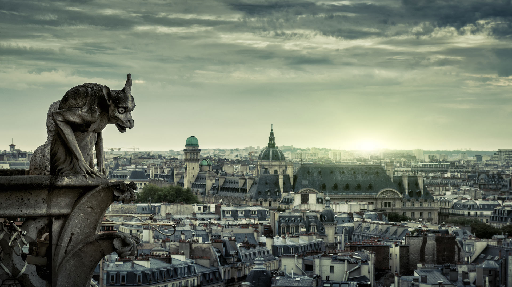
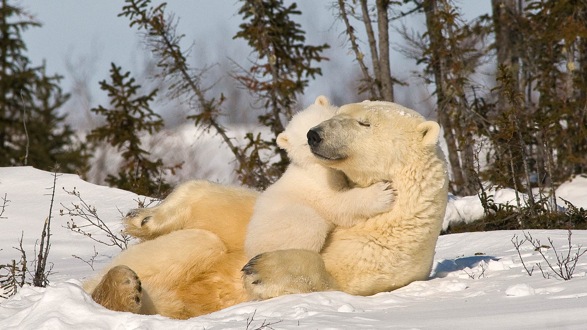
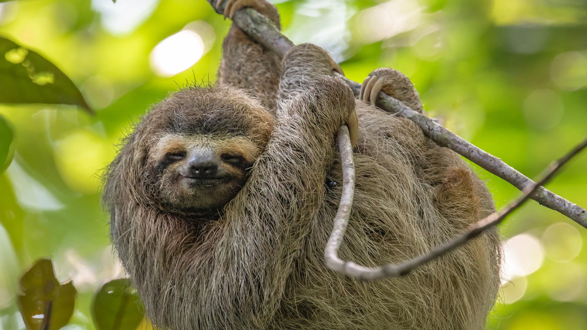
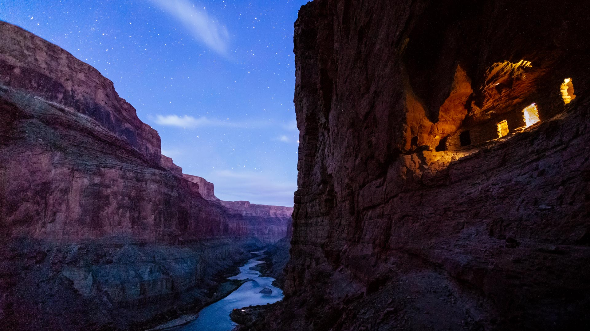
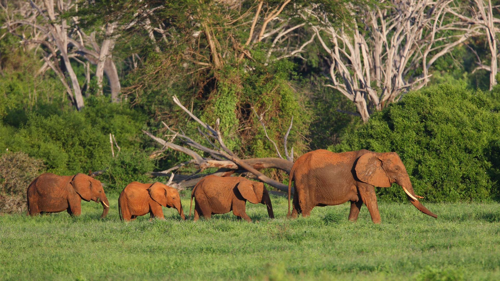

#### 20241031 Gran Paradiso National Park, Italy (© Ondrej Prosicky/Alamy)

#### 20241031 草間彌生の「南瓜」, 香川県 香川郡 (© hedgehog111/Shutterstock)

#### 20241031 Chimera of Notre-Dame de Paris, France (© scaliger/Getty Images)

#### 20241030 View of Edinburgh Castle from a churchyard in Scotland (© Chris Dorney/Alamy)

#### 20241029 Great horned owl (© Mark Newman/Getty Images)

#### 20241028 Pumpkin field, Victoria, British Columbia, Canada (© Shaun Cunningham/Alamy)

#### 20241027 Polar bear mom and cub, Churchill, Manitoba, Canada (© Design Pics/plainpicture)

#### 20241026 Gespensterwald, Nienhagen, Mecklenburg-West Pomerania, Germany (© mauritius images GmbH/Alamy)

#### 20241026 Vue de Paris à travers l'horloge géante du Musée d'Orsay, Paris (© Bruce Beck/Alamy Stock Photo)

#### 20241025 The Mont Blanc massif, near Chamonix, France (© Simon Schöpf/Getty Images)

#### 20241024 Die Bibliothek der Humboldt-Universität in Berlin (© Hemis/Alamy Stock Photo)

#### 20241024 Bodie State Historic Park, Mono County, California (© Julien McRoberts/Tetra Images, LLC/Alamy)

#### 20241023 Madame Sherri Forest and the ruins of an old castle, New Hampshire (© yggdrasill/Shutterstock)

#### 20241023 紅葉に包まれた法体の滝, 秋田県 由利本荘市 (© nattya3714/Getty Images)

#### 20241022 Palazzo Zuccari, Rome, Italy (© Photon-Photos/Getty Images)

#### 20241022 平安神宮, 京都府 京都市 (© Ulana Switucha/Alamy Stock Photo)

#### 20241021 Herbstbäume am Baldeneysee, NRW (© Simon Perez/Alamy Stock Photo)

#### 20241021 Cypress trees in George L. Smith State Park, Georgia (© Chris Moore/TANDEM Stills + Motion)

#### 20241020 Three-toed sloth in Costa Rica (© Harry Collins/Getty Images)

#### 20241020 Vignobles de Champagne, parc naturel régional de la Montagne de Reims, Verzenay (© Philippe Turpin/Getty Images)

#### 20241019 Temple of Hathor, Dendera Temple Complex, Qena, Egypt (© Nick Brundle Photography/Getty Images)

#### 20241018 Kochia, Ibaraki Prefecture, Japan (© DigiPub/Getty Images)

#### 20241018 The Milky Way above Pyramid Lake, Jasper National Park, Alberta, Canada (© Salted Fish Studio/iStock/Getty Images)

#### 20241018 Autumn in Central Park, Manhattan, New York (© mapman/Shutterstock)

#### 20241017 Volcan Formica Leo, Piton de la Fournaise, île de La Réunion (© Stefan Kiefer/imageBROKER.com GmbH & Co. KG/Alamy Stock Photo)

#### 20241017 Frost-covered dunes on the surface of Mars (© NASA/JPL-Caltech/UArizona)

#### 20241017 グレンキャニオン国立保養地, 米国 ユタ州 (© Stephen Matera/Tandem Stills + Motion)

#### 20241015 Great wildebeest migration at Mara River, Kenya (© Ayzenstayn/Getty Images)

#### 20241015 Fossils of belemnites and ammonites, Jurassic Coast, Dorset, England (© Nature Picture Library/Alamy)

#### 20241014 東京駅, 東京都 (© phutthiseth thongtae/Getty Images)

#### 20241014 Ancestral Pueblo granaries at Nankoweap, Grand Canyon National Park, Arizona (© Andrew Peacock/Tandem Stills + Motion)

#### 20241014 Bateaux dans la baie de Marigot, Terre-de-Haut, archipel des Saintes, Guadeloupe (© Tan Yilmaz/Getty Images)

#### 20241014 可可海滩上的渔船，果阿邦，印度 (© Abhinav Sah/Shutterstock)

#### 20241013 Courtyard of the Maidens, Alcázar of Seville, Spain (© Danny Lehman/Getty Images)

#### 20241012 Wood duck, Quebec, Canada (© Maxime Riendeau/Getty Images)

#### 20241011 黄山云海，安徽省，中国 (© yangyang1991/Getty Images)

#### 20241011 Cape Breton Highlands, Nova Scotia, Canada (© Cavan Images/Alamy)

#### 20241009 Potsdamer Platz in Berlin (© franckreporter/Getty Images)

#### 20241009 Aspens in the White River National Forest, Colorado (© Jason Hatfield/Tandem Stills + Motion)

#### 20241008 Mototi octopus, Lembeh Strait, Indonesia (© Howard Chew/Alamy)

#### 20241008 秋の八甲田ロープウェイ,  青森県 青森市 (© Torsakarin/Getty Images)

#### 20241008 Aerial view of Bora Bora in French Polynesia (© GLF Media/Shutterstock)

#### 20241007 The Elbphilharmonie concert hall in Hamburg, Germany (© Canetti/Shutterstock)

#### 20241007 Cottonwoods through an arch in Coyote Gulch, Glen Canyon Recreation Area, Utah, USA (© Stephen Matera/TANDEM Stills + Motion)

#### 20241006 Sorano, Tuscany, Italy (© Luigi Vaccarella/eStock Photo)

#### 20241006 Kochia, Ibaraki prefecture, Japan (© DigiPub/Getty Images)

#### 20241006 Festival of Lights, Berlin (© JOHN MACDOUGALL/Getty Images)

#### 20241005 African elephants in Tsavo East National Park, Kenya (© Neil Bowman/Minden Pictures)

#### 20241004 Toronto Sign, Nathan Phillips Square, Canada (© Bruce Christie/Moment/Getty Images)

#### 20241004 Jupiter's icy moon Europa (© NASA/JPL-Caltech/SETI Institute)

#### 20241003 Taj Mahal in Agra, Uttar Pradesh, India (© Tanarch/Getty Images)

#### 20241003 Tag der Deutschen Einheit, Berlin (© pensatyva/Getty Images)

#### 20241002 Autumn in the Ogilvie Mountains, Yukon,Canada (© Theo Allofs/Minden Pictures)

#### 20241002 Wind River, Brooks Range, Arctic National Wildlife Refuge, Alaska (© Design Pics/Danita Delimont)

#### 20241001 禾木村的风景，新疆，中国 (© snvv18870020330/Shutterstock)

#### 20241001 Last light on Half Dome, Yosemite National Park, California (© Adam Burton/Alamy)

#### 20241001 Vue aérienne de Bora-Bora, Polynésie française (© GLF Media/Shutterstock)

