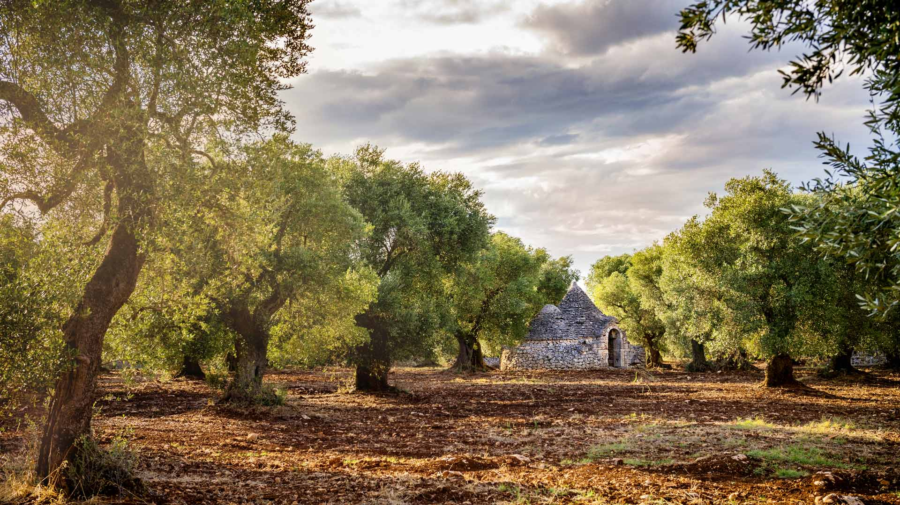
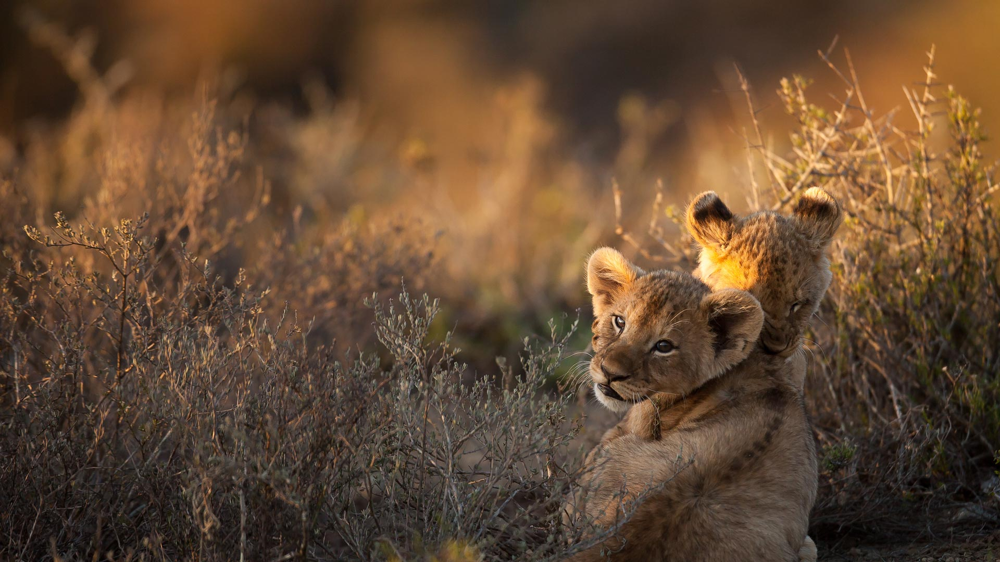
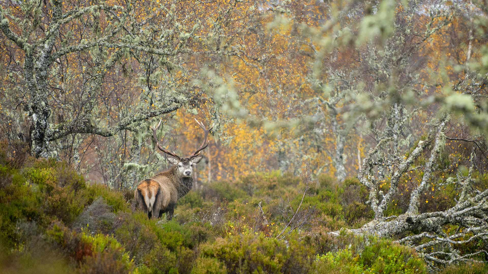
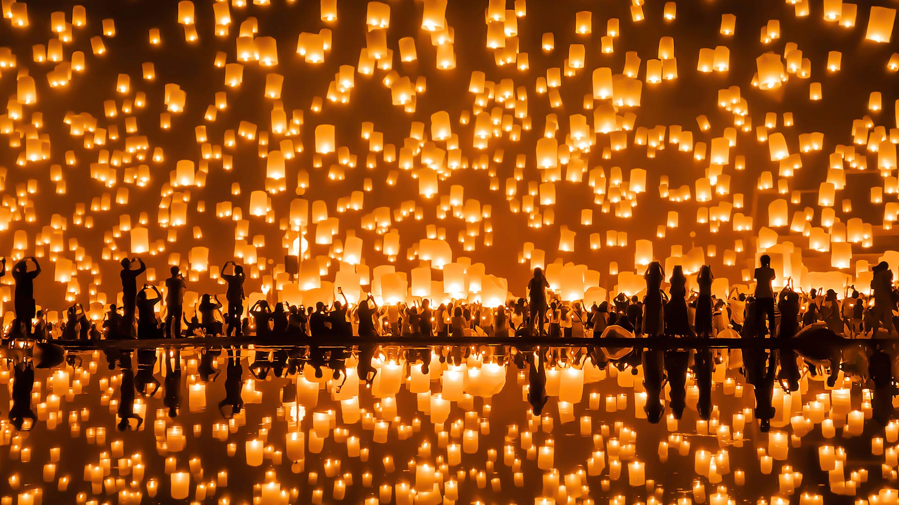
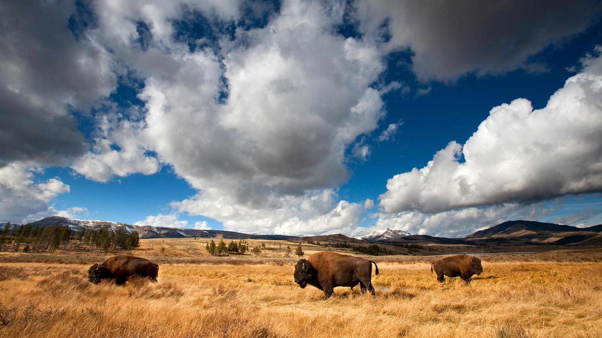

#### 20241130 Kilchurn Castle reflected in Loch Awe, Argyll and Bute, Scotland (© Tom Mackie/plainpicture)

#### 20241129 Mont-Saint-Michel, Normandy, France (© Captain Skyhigh/Getty Images)

#### 20241128 Wild turkeys, New York (© John Cancalosi/Alamy)

#### 20241128 日落时分风暴渐渐消散，阿西尼博因山省立公园，加拿大 (© Jeff Lewis/TANDEM Stills + Motion)

#### 20241127 Tombeau du Géant (Giant's Tomb) in autumn, Bouillon, Belgium (© David Briard/Getty)

#### 20241127 Baie du Marin, Martinique (© Tuul & Bruno Morandi/Getty Images)

#### 20241126 Olive grove, Valle d'Itria, Puglia, Italy (© Massimo Santi/Shutterstock)

#### 20241126 金鱗湖の鳥居, 大分県 由布市 (© T-Mizuguchi/Shutterstock)

#### 20241125 Weihnachtsmarkt in Regensburg, Bayern (© Harald Nachtmann/Getty Images)

#### 20241125 Masai giraffes, Amboseli National Park, Kenya (© Art Wolfe/DanitaDelimont.com)

#### 20241124 Sonoma Coast State Park, California (© Rachid Dahnoun/Tandem Stills + Motion)

#### 20241124 Paris aux couleurs de l’automne (© encrier/Getty Images)

#### 20241123 Spiral aloe, Kangaroo Island, Australia (© Michael Melford/Alamy)

#### 20241122 Castle of Zafra, Guadalajara province, Spain (© Eduard Gene/Getty Images)

#### 20241122 白糸の滝, 静岡県 富士宮市 (© Sean Pavone/Alamy Stock Photo)

#### 20241121 Lion cubs at sunrise, South Africa (© Ruan Springorum/Getty Images)

#### 20241121 Aspen trees in autumn, Stewart-Cassiar Highway, British Columbia, Canada (© Yva Momatiuk and John Eastcott/Minden Pictures)

#### 20241120 皮埃尔桥，波尔多，法国 (© SergiyN/Getty Images)

#### 20241120 Giant land art painting 'Beyond Crisis' by Saype, Leysin, Switzerland (© VALENTIN FLAURAUD/EPA-EFE/Shutterstock)

#### 20241119 Tasmans Arch, Tasmania, Australia (© Gary Bell/Minden Pictures)

#### 20241119 Weißbirkenwald (Betula pendula) im Herbstnebel, Deutschland (© Duncan Usher/Minden Pictures)

#### 20241118 Porthcawl Lighthouse, Wales (© Leighton Collins/Alamy)

#### 20241117 Red deer stag in the Caledonian Forest, Glen Affric, Scottish Highlands (© Terry Whittaker/Alamy)

#### 20241116 Wadden Sea coast, near Moddergat, Friesland, Netherlands (© Ron ter Burg/Minden Pictures)

#### 20241115 Yi Peng lantern festival, Chiang Mai, Thailand (© tampatra/Getty Images)

#### 20241114 Manarola, Cinque Terre National Park, Liguria, Italy (© John_Silver/Shutterstock)

#### 20241113 California sea lion in a forest of giant kelp, Baja California, Mexico (© Claudio Contreras/Minden Pictures)

#### 20241112 Kirchturm von Bremm an der Moselschleife, Rheinland-Pfalz (© Jan Wehnert/Shutterstock)

#### 20241112 Coraux et lagon de Moorea, Polynésie française (© bru_greg/Getty Images)

#### 20241112 Double Arch seen through Cove Arch, Arches National Park, Utah (© Jeff Foott/Minden Pictures)

#### 20241111 Mural Wall, Korean War Veterans Memorial, Washington, DC (© Steve Tulley/Alamy)

#### 20241111 班夫国家公园的日落，阿尔伯塔省，加拿大 (© fywPhoto 云卷云舒/Getty Images)

#### 20241110 Les Sables-d'Olonne, la Tour d'Arundel, le casino, le fort Saint-Nicolas et le chenal menant au port (© Leroy Francis/Hemis/Alamy Stock Photo)

#### 20241109 Milky Way, Aït Benhaddou, Morocco (© Cavan Images/Getty Images)

#### 20241108 Aerial view of glacial rivers in Iceland (© rybarmarekk/Shutterstock)

#### 20241107 金色的松树，坝上草原，中国 (© MelindaChan/Getty Images)

#### 20241107 Vancouver Coastal Sea wolves in Great Bear Rainforest, British Columbia, Canada (© Nick Garbutt/Alamy)

#### 20241107 マガンの群れ (© feathercollector/Shutterstock)

#### 20241106 Shi Shi Beach in Olympic National Park, Washington (© T.M. Schultze/TANDEM Stills + Motion)

#### 20241105 Caribbean flamingos, Yucatán Peninsula, Mexico (© Claudio Contreras/NPL/Minden Pictures)

#### 20241105 酉の市で販売される縁起熊手, 東京 (© ASSOCIATED PRESS/AP)

#### 20241105 Autumn sunrise over the National Mall, Washington, DC (© WLDavies/iStock/Getty Images Plus)

#### 20241104 Grasmere, Lake District, Cumbria, England (© Thomas Molyneux/Getty Images)

#### 20241103 Caribbean flamingo nests, Ría Lagartos Biosphere Reserve, Yucatán, Mexico (© Claudio Contreras/Minden Pictures)

#### 20241102 American bison in Yellowstone National Park, Wyoming (© Ian Shive/TANDEM Stills + Motion)

#### 20241101 秋季葡萄园的鸟瞰图，瓦恩哈尔特，黑森林，德国 (© Sabine Gerold/Amazing Aerial Agency)

#### 20241101 レンソイス・マラニャンセス国立公園, ブラジル マラニャン州 (© thanosquest/Shutterstock)

#### 20241101 Pueblo ruins, Hovenweep National Monument, Utah (© Alan Majchrowicz/Getty Images)

