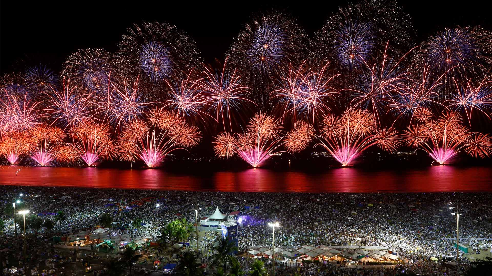
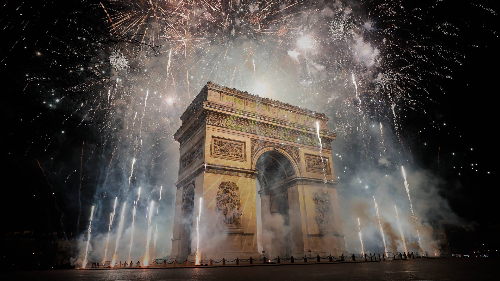
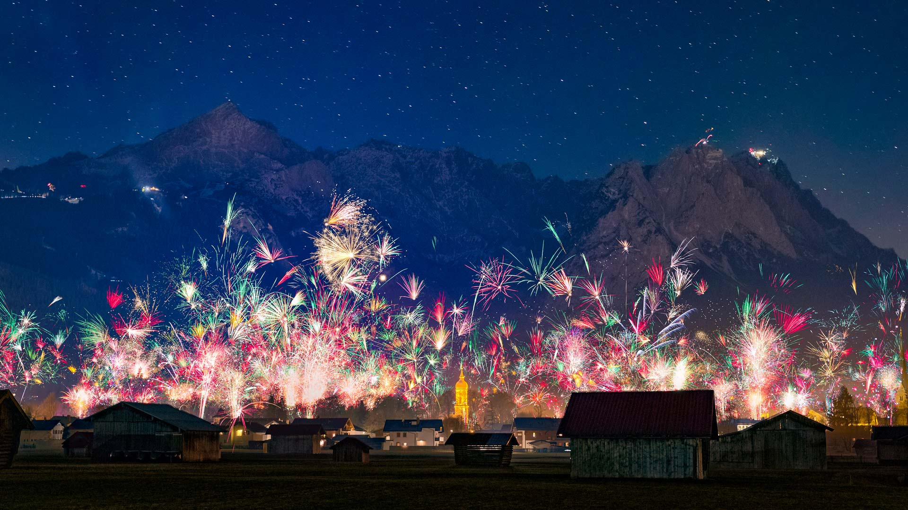
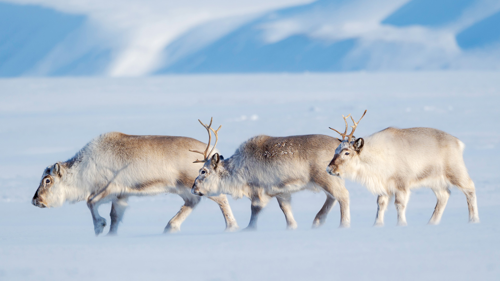
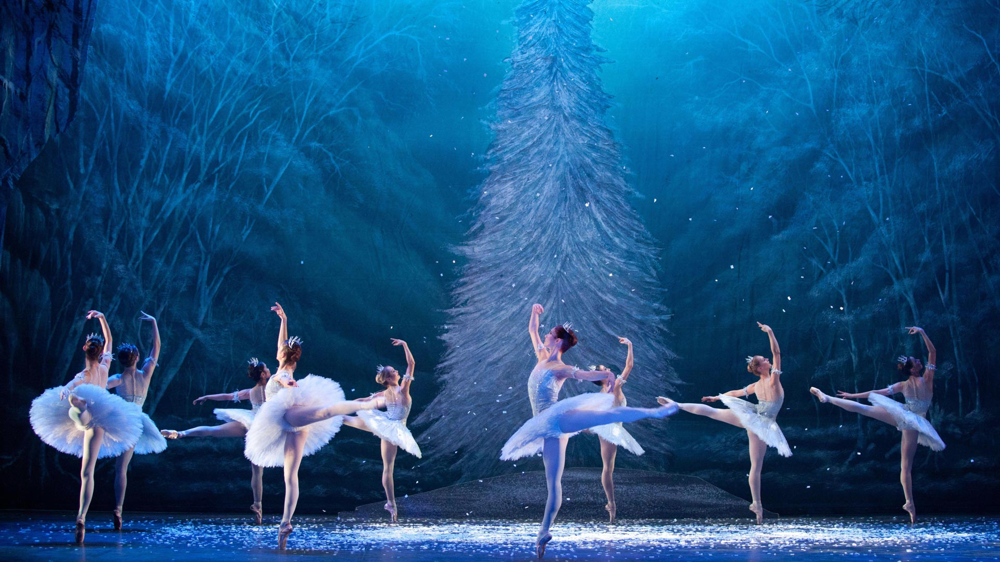
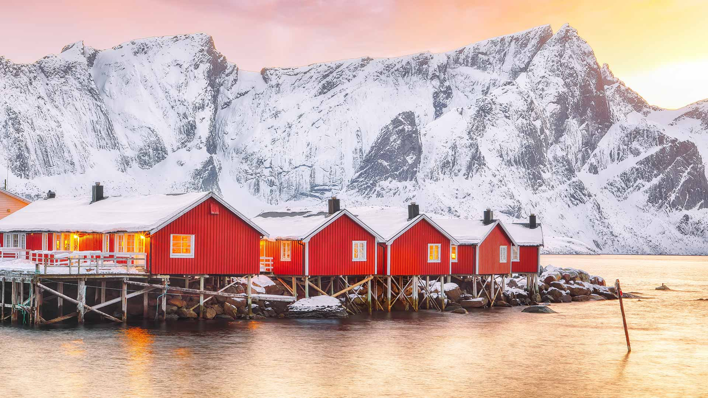
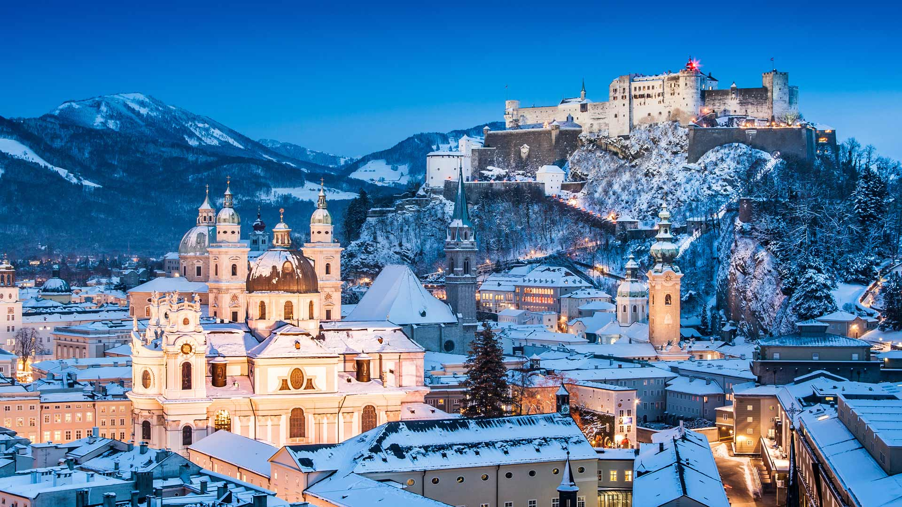
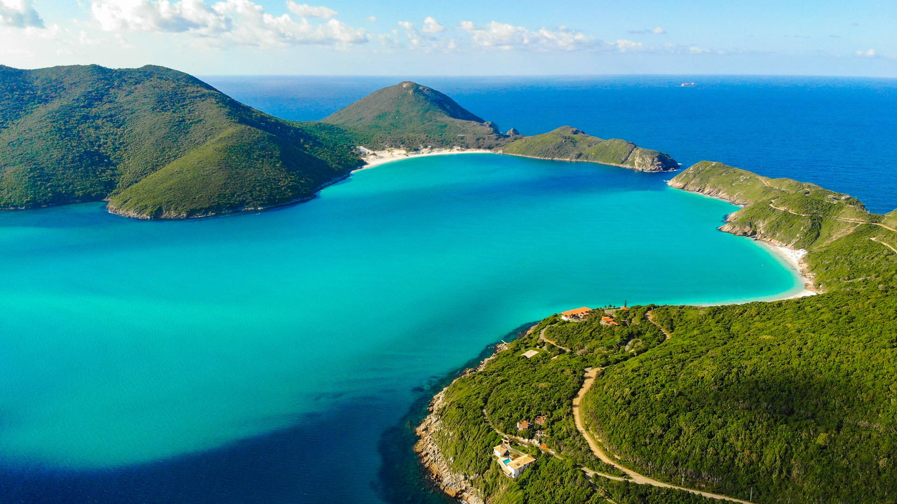

#### 20241231 New Year's Eve fireworks over Copacabana Beach, Rio de Janeiro, Brazil (© Wagner Meier/Getty Images)

#### 20241231 Arc de Triomphe sous les feux d’artifice, Paris (© Kiran Ridley/Getty Images)

#### 20241231 平等院の梵鐘, 京都 (© Asia Images Group LLC/Alamy Stock Photo)

#### 20241231 国会山上空的烟花，渥太华，加拿大 (© naibank/Getty Images)

#### 20241231 Silvesterfeuerwerk über der Stadt Garmisch-Partenkirchen mit Blick auf die Zugspitzgruppe, Bayern (© Marc Hohenleitner/Huber/eStock Photo)

#### 20241230 Tasmanian snow gum and pandani plants near Lake Dobson, Mount Field National Park, Tasmania, Australia (© Whitworth Images/Getty Images)

#### 20241229 Borobudur Temple, Java, Indonesia (© Robertharding/Shutterstock)

#### 20241228 A green sea turtle swims in the Pacific Ocean near the French special collectivity of New Caledonia (© Damsea/Shutterstock)

#### 20241227 Lake Bled, Slovenia (© Kesu01/Getty Images)

#### 20241226 Pointe du Diable, Saint Pierre, Parc national de la Réunion (© MONTICO Lionel/Hemis/Alamy Stock Photo)

#### 20241226 Christmas lights at Mousehole Harbour, Cornwall, England (© ianwool/Getty Images)

#### 20241226 Gastown steam clock in Vancouver, British Columbia, Canada (© J Duquette/iStock/Getty Images)

#### 20241225 Svalbard reindeer in Van Mijenfjorden NP, Norway (© Martin Zwick/REDA&CO/Universal Images Group via Getty Images)

#### 20241225 Half-timbered Houses of Freudenberg, North Rhine-Westphalia, Germany (© Thorsten Frisch/Shutterstock)

#### 20241225 科瓦东加湖，阿斯图里亚斯，西班牙 (© Carlos Fernandez/Getty Images)

#### 20241225 Christmas trees with the Three Sisters mountain in the background, Canmore, Alberta (© Nick Fitzhardinge/Moment/Getty Images)

#### 20241224 Christmas market scene in Germany (© Cyril Gosselin/Getty Images)

#### 20241223 けやき坂のイルミネーション, 東京 (© Kinsei-TGS/Getty Images)

#### 20241222 Adventskranz, 4. Advent (© Asvolas/Getty Images)

#### 20241222 Red-crowned cranes in Kushiro, Hokkaido, Japan (© Wirestock, Inc./Alamy)

#### 20241222 Christmas tree at Crystal Pier, Pacific Beach, San Diego, California (© SamAntonioPhotography/Getty Images)

#### 20241221 满拉水库的雪景，日喀则，中国西藏自治区 (© Zhang Zhenqi/VCG via Getty Images)

#### 20241221 Halo um die Sonne, Erzgebirge, Sachsen, Deutschland (© Martin Ruegner/Getty Images)

#### 20241221 ライトアップされた青い池, 北海道 美瑛町 (© Sean Pavone/Alamy Stock Photo)

#### 20241221 Loisach River at Lake Kochelsee, Bavaria, Germany (© Christian Back/eStock Photo)

#### 20241220 Santa Claus Village in Rovaniemi, Lapland, Finland (© Smelov/Shutterstock)

#### 20241219 Christmas market in Sibiu, Romania (© Calin Stan/Alamy)

#### 20241218 English National Ballet performing 'The Nutcracker' (© Caroline Holden/Alamy)

#### 20241218 印度吉姆科比特国家公园的大象，印度 (© ABHILASH VISWA PICASSO/Shutterstock)

#### 20241217 Traditional red fishermen's cabins on the shore of Reinefjorden, Norway (© Pilat666/Getty Images)

#### 20241216 Salzburg, Austria (© bluejayphoto/Getty Images)

#### 20241215 Lake Misurina, Dolomites, Italy (© Marco Bottigelli/Getty Images)

#### 20241214 Northern hawk-owl, Canada (© pchoui/Getty Images)

#### 20241214 Lynx de Boréal perché dans un arbre, France (© Marc Chesneau/Getty Images)

#### 20241213 Christmas market, St. Stephen's Basilica, Budapest, Hungary (© Calin Stan/Shutterstock)

#### 20241212 Wild poinsettia (aka Christmas flower) (© David Hosking/NPL/Minden Pictures)

#### 20241212 Gefrorener See bei Wintersonnenaufgang, Deutschland (© Marc_Osborne/Getty Images)

#### 20241211 Tre Cime di Lavaredo, Sexten Dolomites, Italy (© Daniel Maran/Getty Images)

#### 20241210 The Cornish Coast Path covered in snow, Land's End, Cornwall, England (© Josef FitzGerald-Patrick/Getty Images)

#### 20241209 Corals and the lagoon of Mo'orea in French Polynesia (© bru_greg/Getty Images)

#### 20241209 Guanacos, Torres del Paine National Park, Chile (© Floris van Breugel/NPL/Minden Pictures)

#### 20241208 Notre-Dame Cathedral, Paris, France (© Julien Fromentin/Getty Images)

#### 20241207 Lake Ontario in the winter season, Toronto (© Brendan Riley/Shutterstock)

#### 20241207 Pearl Harbor Memorial Bridge, New Haven, Connecticut (© Enzo Figueres/Getty Images)

#### 20241207 雪化粧の五稜郭, 北海道 函館 (© Hiro1775/Getty Images)

#### 20241207 里约热内卢州的阿拉亚尔多卡博，巴西 (© Derson Santana/Shutterstock)

#### 20241206 Old Town in Helsinki, Finland (© Oleksiy Mark/Shutterstock)

#### 20241206 鸟瞰冰封的大海和悬崖上的灯塔，大连泊霞湾公园，辽宁省，中国 (© zhengshun tang/Getty Images)

#### 20241206 Maisons traditionnelles alsaciennes à colombages et rivière Lauch Colmar, Alsace (© KavalenkavaVolha/Getty Images)

#### 20241205 Tufa formations in Mono Lake, California (© Susanna Patras/TANDEM Stills + Motion)

#### 20241204 Male white rhinoceroses, Lake Nakuru, Kenya (© Ingo Arndt/Minden Pictures)

#### 20241203 Sattais Katcheri (Court of 27 Pillars), Amber Fort, Rajasthan, India (© Yury Taranik/Shutterstock)

#### 20241203 花火と豪華な山車,埼玉県 秩父市 (© ASSOCIATED PRESS/AP)

#### 20241202 Female moose, Denali National Park, Alaska (© Cavan Images/Alamy)

#### 20241201 Icebergs, Antarctica (© Art Wolfe/DanitaDelimont.com)

#### 20241201 Verschneite Fachwerkhäuser in Freudenberg bei Siegen, Nordrhein-Westfalen (© Thorsten Frisch/Shutterstock)

