#### 20250131 Plains zebras at sunrise, Mokala National Park, South Africa (© EcoPrint/Shutterstock)

#### 20250130 Prioro, Castile and León, Spain (© Ruben Earth/Getty Images)

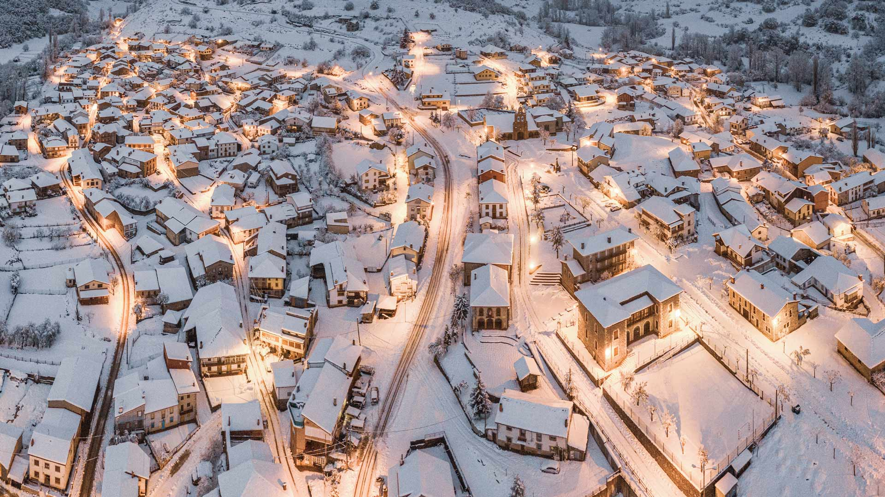

#### 20250130 La Brecha de Rolando, Ordesa y Monte Perdido National Park, Spain (© Inaki Relanzon/Nature Picture Library/Alamy)

#### 20250130 Granville Island in Vancouver, British Columbia, Canada (© AWL Images/DanitaDelimont.com)

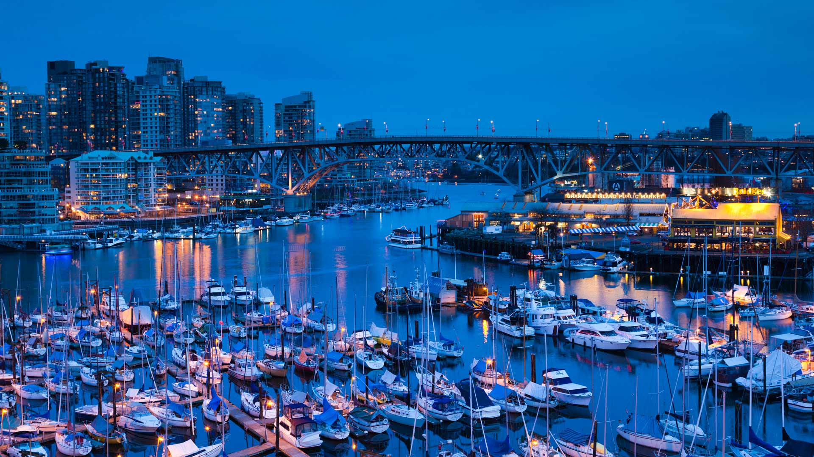

#### 20250129 南京夫子庙的春节许愿牌，江苏省，中国 (© lazy dragon/Shutterstock)

#### 20250129 Dragon dance, Wuhan, China (© Miao Jian/Wuhan Morning Post/Visual China Group via Getty Images)

#### 20250128 夜空中的烟花表演，长沙，湖南省，中国 (© Sino Images/Getty Images)

#### 20250128 Short-eared owl hunting in heavy snow (© Dilshan Muthalib/Getty Images)

#### 20250127 La tour Eiffel sous la neige, Paris (© Orbon Alija/Getty Images)

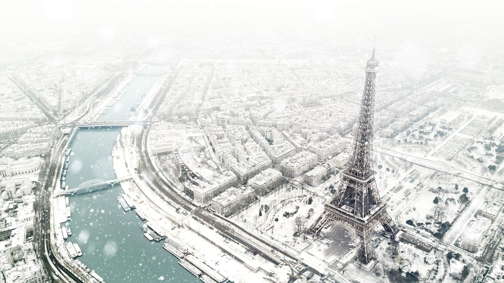

#### 20250127 Zoroaster Temple, Grand Canyon National Park, Arizona (© Nick Lake/Tandem Stills + Motion)

#### 20250126 European beech forest in Belgium (© Philippe Moes/Minden Pictures)

#### 20250125 Porto, Portugal (© Starcevic/Getty Images)

#### 20250124 Strokkur geyser in Iceland (© John and Tina Reid/Getty Images)

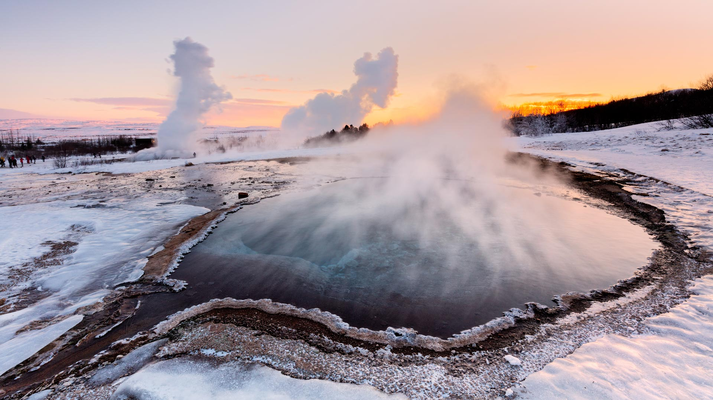

#### 20250123 Deer Valley at dusk, Park City, Utah (© Adventure_Photo/Getty Images)

#### 20250122 Ad-Deir, Petra, Jordan (© Punnawit Suwuttananun/Getty Images)

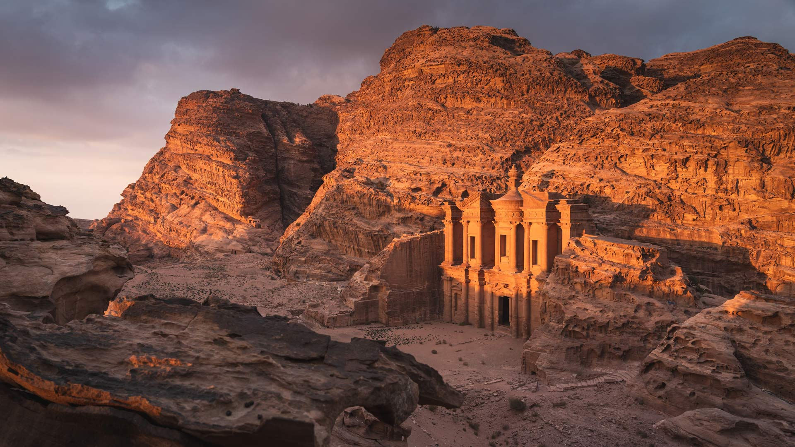

#### 20250121 Cabanes aux toits colorés recouvertes de neige à Gouville-sur-Mer, Normandie (© Andia/Getty Images)

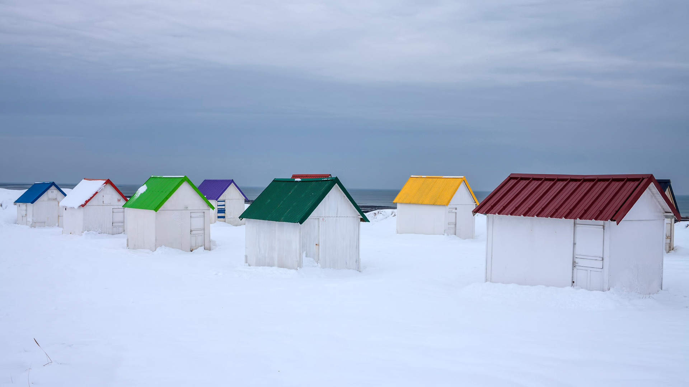

#### 20250120 Martin Luther King Jr. Memorial in Washington, DC (© Win McNamee/Getty Images)

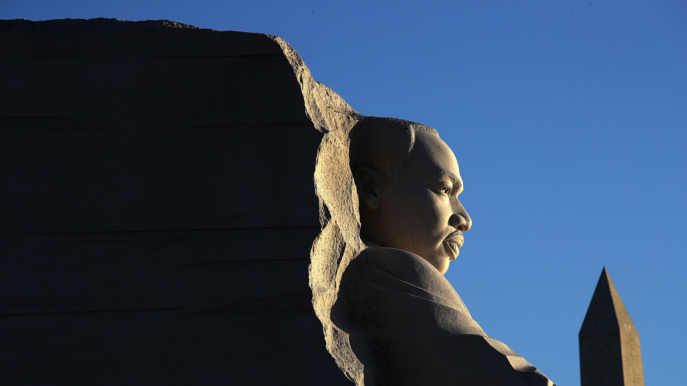

#### 20250120 Eurasian red squirrel (© Edwin Giesbers/Minden Pictures)

#### 20250120 コタンの湯, 北海道 川上郡 (© NitiChuysakul Photography/Getty Images)

#### 20250120 Lac Abraham, Alberta, Canada (© Basic Elements Photography/Getty Images)

#### 20250119 Neptune's Grotto, Sardinia, Italy (© Carlo Murenu/Getty Images)

#### 20250118 Sunset at White Sands National Park, New Mexico (© Image Professionals GmbH/Alamy)

#### 20250117 Brown pelican, San Diego, California (© Arthur Morris/BIRDS AS ART/Getty Images)

#### 20250117 Blick über den Golf von Neapel auf den Vesuv, Italien (© ezypix/Getty Images)

#### 20250117 マウント・アシニボイン州立公園, カナダ ブリティッシュコロンビア州 (© Jeff Lewis/TANDEM Stills + Motion)

#### 20250116 High Peaks Trail in Pinnacles National Park, San Benito County, California (© yhelfman/Getty Images)

#### 20250116 Bartmeisen (Panurus biarmicus) Männchen und Weibchen auf Nahrungssuche in verschneiten Schilfrohren, Baden-Wuerttemberg (© Martin Grimm/Alamy Stock Photo)

#### 20250115 Pointe du Diable，圣皮埃尔，留尼汪岛 (© MONTICO Lionel/Alamy)

#### 20250115 カラフルな餅花, 愛知県 豊田市 (© Photo taken by Bong Grit/Getty Images)

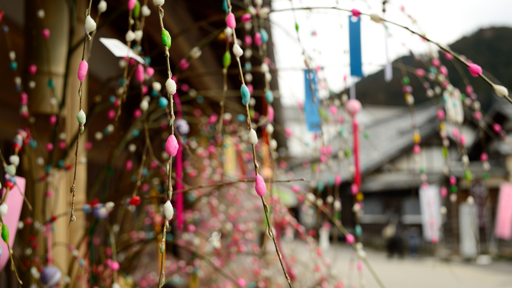

#### 20250115 Lake Superior during winters, Thunder Bay, Ontario (© Susan Dykstra/plainpicture)

#### 20250114 The Great Court of the British Museum, London, England (© Cavan Images/Offset/Shutterstock)

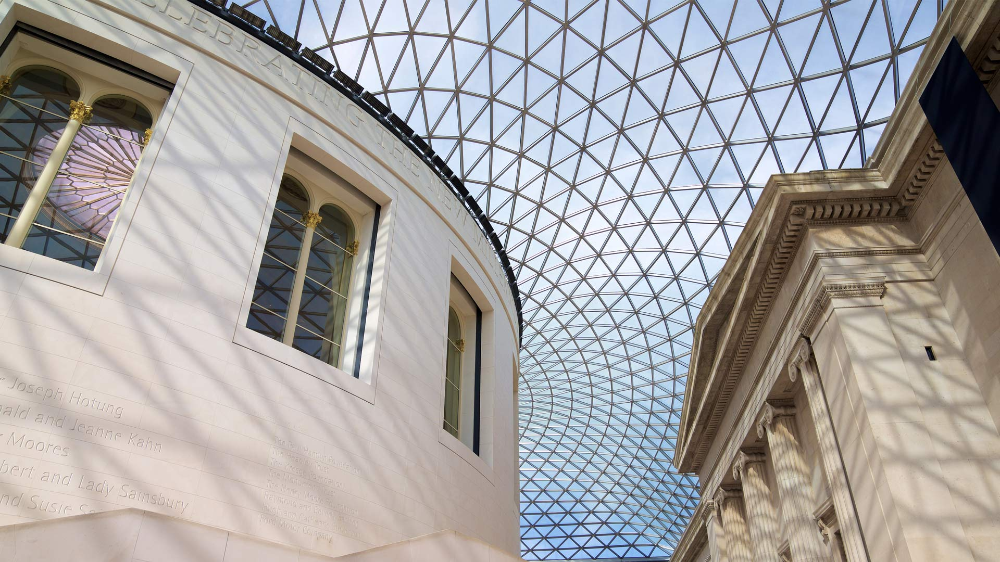

#### 20250113 Cottage with Tŵr Bach Lighthouse in the background, Ynys Llanddwyn, Wales (© Westend61 on Offset/Shutterstock)

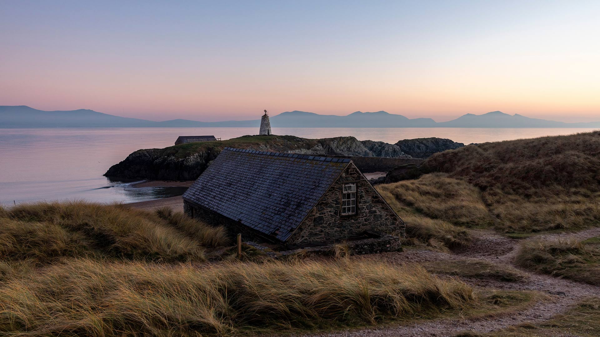

#### 20250112 Crescent-tail bigeye fish in the Great Barrier Reef, Australia (© Fred Bavendam/Minden Pictures)

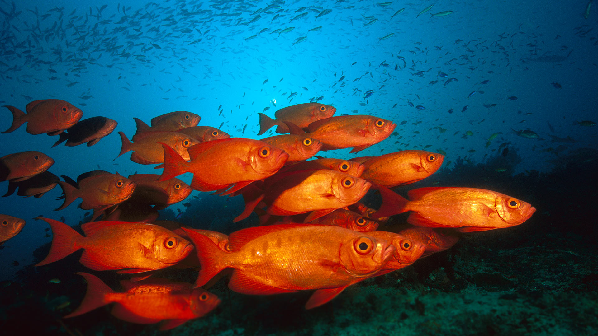

#### 20250112 Village of Zahara de la Sierra overlooking Zahara-El Gastor Reservoir, Cádiz province, Spain (© SEN LI/Getty Images)

#### 20250111 Heri es-Swani in Meknes, Morocco (© Calin Stan/Shutterstock)

#### 20250111 Apfel hängt an einem verschneiten Baum, Deutschland (© Westend61/Getty Images)

#### 20250110 Route de la bande dessinée, peinture murale de Tintin de Hergé à Bruxelles (© travelpix/Alamy Stock Photo)

#### 20250110 Abraham Lake, Alberta, Canada (© Basic Elements Photography/Getty Images)

#### 20250109 苏丝斯黎沙丘，纳米布沙漠，纳米比亚 (© Airpano/Amazing Aerial Agency)

#### 20250109 The US Capitol dome with flags flying at half-staff in honor of former President Jimmy Carter, Washington, DC (© J. David Ake/Getty Images)

#### 20250108 Snow on the Great Wall of China (© View Stock/Alamy)

#### 20250106 Flooded crypt, Basilica of San Francesco, Ravenna, Italy (© Andrea Pucci/Getty Images)

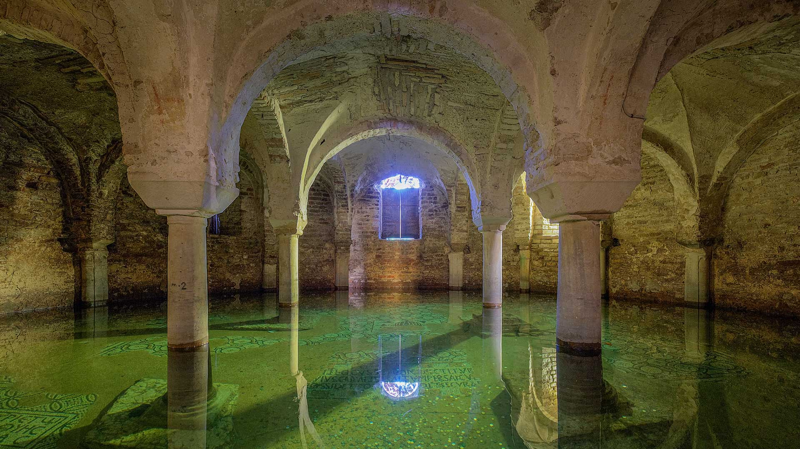

#### 20250105 Winterlandschaft in Bayern, Deutschland (© wingmar/Getty Images)

#### 20250104 Bản Giốc–Detian Falls on the Quây Sơn River, Vietnam (© Shane P. White/Minden Pictures)

#### 20250104 Moeraki Boulders at sunset, South Island, New Zealand (© Douglas Pearson/eStock Photo)

#### 20250103 The Radcliffe Camera and All Souls College, University of Oxford, England (© atiger/Shutterstock)

#### 20250102 Plum-headed parakeet at Shimoga, Karnataka, India (© Hira Punjabi/Alamy)

#### 20250102 Star trails over Ardez, Graubunden, Switzerland (© Roberto Moiola/Getty Images)

#### 20250102 Montagne enneigée au coucher du soleil, Alpes françaises (© raeva/Getty Images)

#### 20250101 朝日と白髭神社の鳥居, 滋賀県 高島市 (© Cavan Images/Alamy Stock Photo)

#### 20250101 Polar bears at play in the Arctic (© Ondrej Prosicky/Shutterstock)

