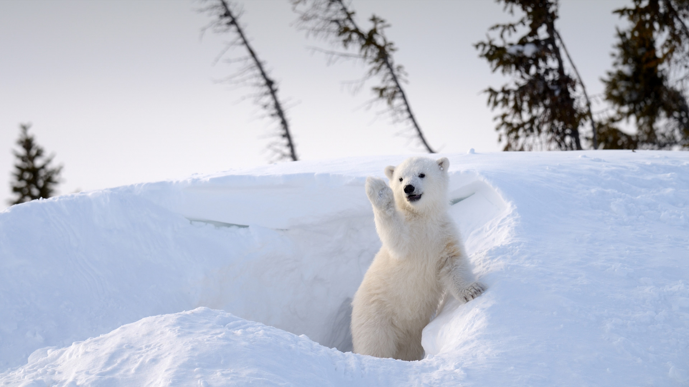
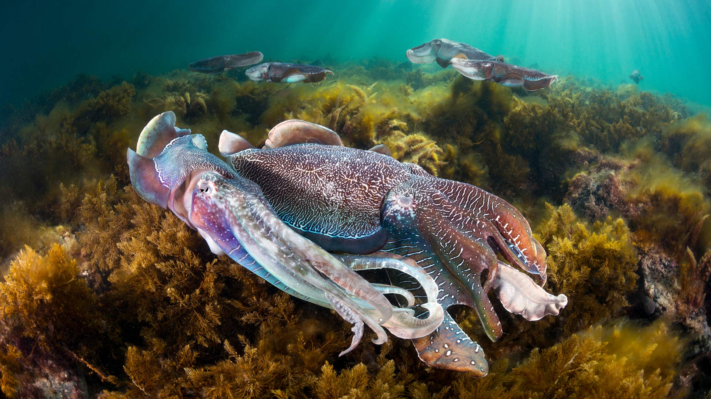
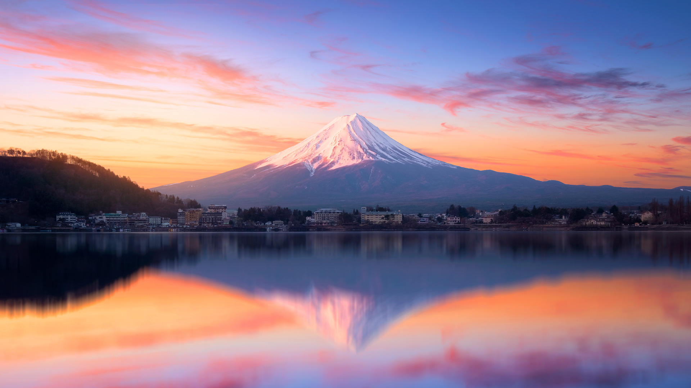
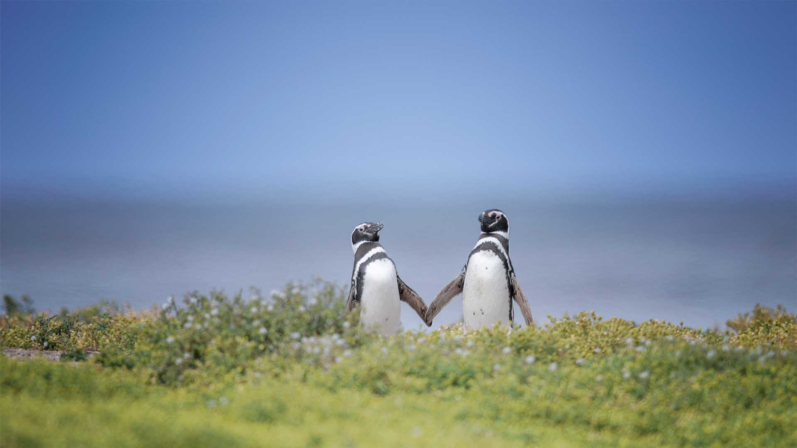
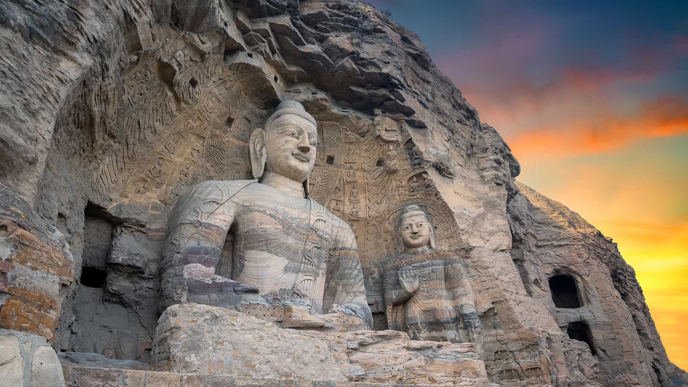
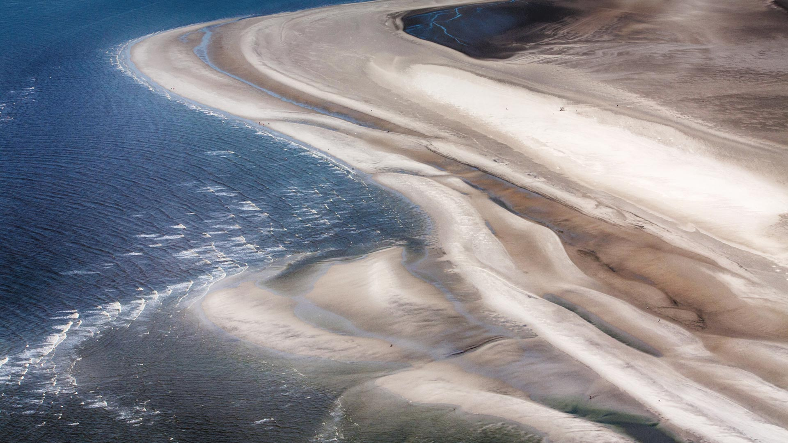

#### 20250228 Desert bighorn sheep in Valley of Fire State Park, Nevada (© Rachid Dahnoun/Cavan Images)

#### 20250228 Paro Taktsang, a Buddhist monastery in Bhutan (© Baron Reznik/Getty Images)

#### 20250227 Polar bear cub, Churchill, Manitoba, Canada (© Eric Baccega/NPL/Minden Pictures)

#### 20250227 Hohenzollernbrücke mit dem Kölner Dom und dem Rhein bei Sonnenuntergang in Köln (© Prasit Rodphan/Alamy Stock Foto)

#### 20250226 Castle Stalker on Loch Laich, Argyll, Scotland (© WLDavies/Getty Images)

#### 20250225 Viaduc de Millau, Aveyron, France (© Andrzej Gorzkowski Photography/Alamy Stock Photo)

#### 20250225 Sandstone hoodoos, Bryce Canyon National Park, Utah (© Stephen Matera/TANDEM Stills + Motion)

#### 20250224 リブルヘッド高架橋, イングランド ノース・ヨークシャー (© AWL Images/DanitaDelimont.com)

#### 20250224 Group of giant cuttlefish in Spencer Gulf, off Whyalla, South Australia (© Gary Bell/Minden Pictures)

#### 20250223 Mount Fuji at sunrise, Lake Kawaguchi, Japan (© Twenty47studio/Getty Images)

#### 20250222 The Gateway Arch in St. Louis, Missouri (© f11photo/Getty Images)

#### 20250221 Fête du citron, Menton, Alpes-Maritimes (© NelzTabcharani316/Shutterstock)

#### 20250221 Stieglitze (Carduelis carduelis) auf der Nahrungssuche in einem Sonnenblumenfeld, Deutschland (© Arndt, S.E./Juniors Bildarchiv GmbH/Alamy Stock Foto)

#### 20250221 Champaka Sarasi pond near Shivamogga, Karnataka, India (© Amith Nag Photography/Getty Images)

#### 20250220 ケーニッヒシュタイン要塞, ドイツ (© Bildagentur-online/Exss/Alamy)

#### 20250220 马鹿，加拿大 (© Delbars/Getty Images)

#### 20250220 Heure bleue à Trondheim, Norvège (© Jeanny Mueller/Getty Images)

#### 20250220 Alpenglow on Half Dome, Yosemite National Park, California (© Matthew Kuhns/TANDEM Stills + Motion)

#### 20250219 European river otter, Lelystad, Netherlands (© Ernst Dirksen/Minden Pictures)

#### 20250218 Great Blue Hole, Belize (© JamiesOnAMission/Shutterstock)

#### 20250217 雲崗石窟, 中国 山西省 (© Eric Yang/Getty Images)

#### 20250217 The Washington Monument seen from the Lincoln Memorial, Washington, DC (© lucky-photographer/Alamy)

#### 20250217 Coll d'Ares，加泰罗尼亚比利牛斯​​山脉 (© CRISTIAN IONUT ZAHARIA/Shutterstock)

#### 20250216 Humpback whale mother and calf, Tonga (© Chase Dekker/Minden Pictures)

#### 20250215 Icicles of Misotsuchi, Chichibu, Japan (© watayu0821/Shutterstock)

#### 20250215 Défilé du Carnaval de Nice, le Roi sur la Promenade des Anglais (© aerial-photos.com/Alamy Stock Photo)

#### 20250214 Magellanic penguins in the Falkland Islands (© Vicki Jauron, Babylon and Beyond Photography/Getty Images)

#### 20250213 Lake Tyrrell, Victoria, Australia (© Monica Bertolazzi/Getty Images)

#### 20250213 Kino Zoo Palast, Berlin (© Ponizak/Agencja Fotograficzna Caro/Alamy Stock Photo)

#### 20250212 ホッキョクグマ  (© Ondrej Prosicky/Shutterstock)

#### 20250212 上海豫园的灯会，元宵节，上海市，中国 (© atiger/Shutterstock)

#### 20250212 Marine iguanas, Galápagos Islands, Ecuador (© helovi/Getty Images)

#### 20250211 Yungang Grottoes, Datong, Shanxi province, China (© Eric Yang/Getty Images)

#### 20250211 春の訪れを告げる梅の花, 茨城県 水戸市 (© dekitateyo/shutterstock)

#### 20250210 Art installation of umbrellas at Borough Market in London, England (© Malcolm P Chapman/Getty Images)

#### 20250210 Banff National Park in winter, Alberta, Canada (© Waitforlight/Moment/Getty Images)

#### 20250209 Leonardo Glass Cube, Bad Driburg, Nordrhein-Westfalen (© Nathan Willock-VIEW/Alamy Stock Foto)

#### 20250209 Alstrom Point, Lake Powell, Utah (© T.M. Schultze/TANDEM Stills + Motion)

#### 20250208 Medieval towers in Mestia, Upper Svaneti, Georgia (© photoaliona/Getty Images)

#### 20250207 Pyramide du Louvre, Paris, France (© Andriy Kravchenko/Alamy Stock Photo)

#### 20250207 Blue hour in Trondheim, Norway (© Jeanny Mueller/Getty Images)

#### 20250206 Archway Islands, Wharariki Beach, South Island, New Zealand (© Francesco Vaninetti/AWL/plainpicture)

#### 20250205 Scottish Blackface sheep, Aberdeenshire, Scotland  (© Mike Powles/Getty Images)

#### 20250204 犬山城の大雪像, 北海道 札幌市 (© Randy Green/Alamy Stock Photo)

#### 20250203 梅の花で吸蜜するメジロ (© yankane/shutterstock)

#### 20250203 Ribblehead Viaduct and Ingleborough mountain, North Yorkshire, England (© AWL Images/DanitaDelimont.com)

#### 20250203 盛开的樱花树上的红头长尾山雀 (© Haitong Yu/Getty Images)

#### 20250202 Westerhever, Nationalpark Schleswig-Holsteinisches Wattenmeer (© 3quarks/Getty Images)

#### 20250202 Young alpine marmot (© Jonas Fichtner-Pflaum/Getty Images)

#### 20250201 Golden Bridge, Bà Nà Hills, Da Nang, Vietnam (© Hien Phung Thu/Shutterstock)

#### 20250201 国王岩堡垒 , 瑞士撒克逊, 德国 (© Bildagentur-online/Exss/Alamy)

#### 20250201 Cerf élaphe, forêt de Rambouillet,  Île-de-France (© Nicolas Le Boulanger/500px/Getty Image)

#### 20250201 National Museum of African American History & Culture, Washington, DC (© BrianPIrwin/Shutterstock)

