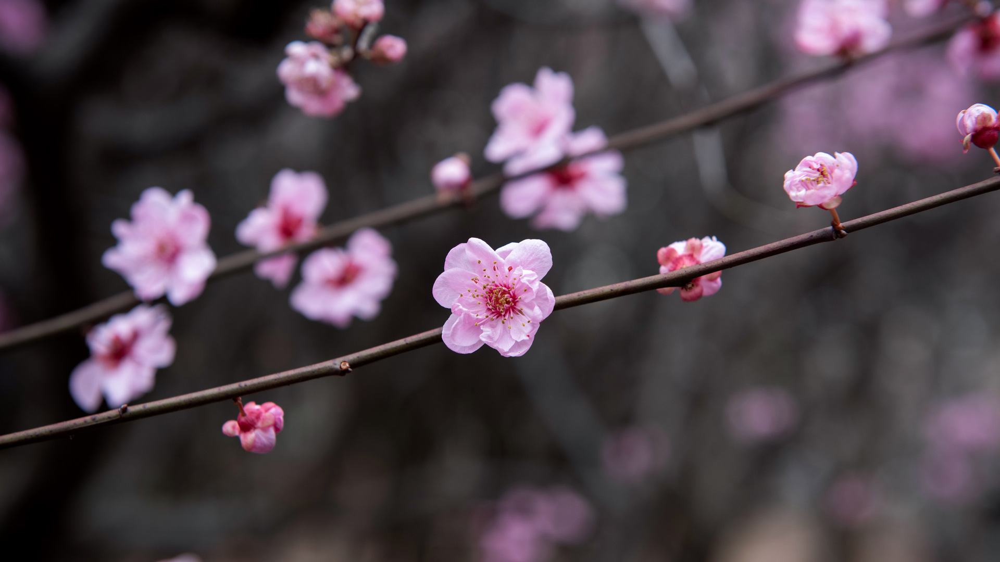
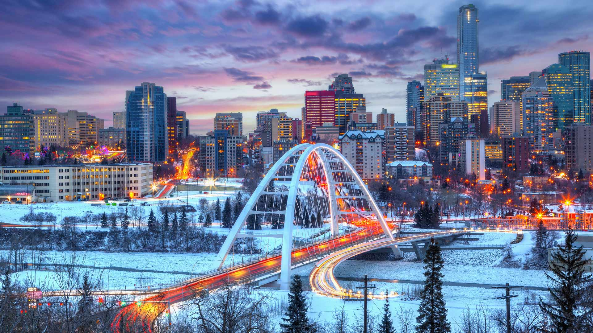
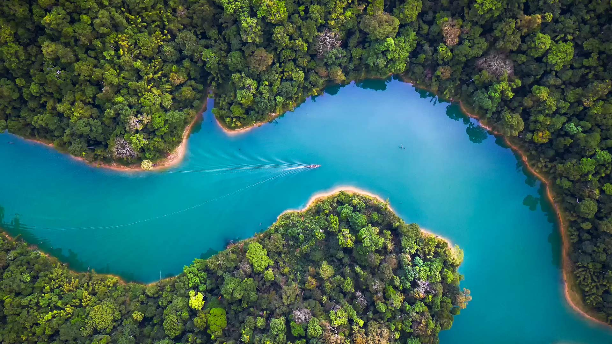
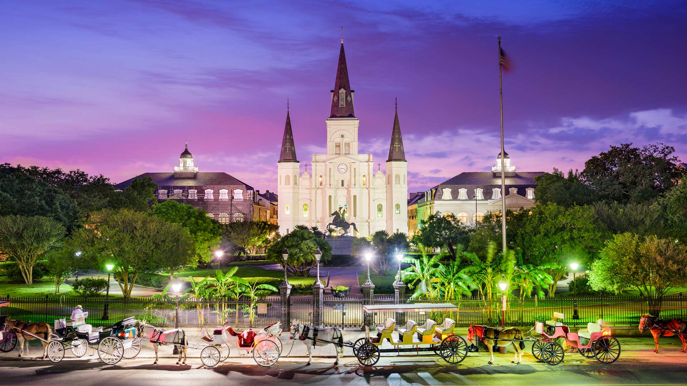
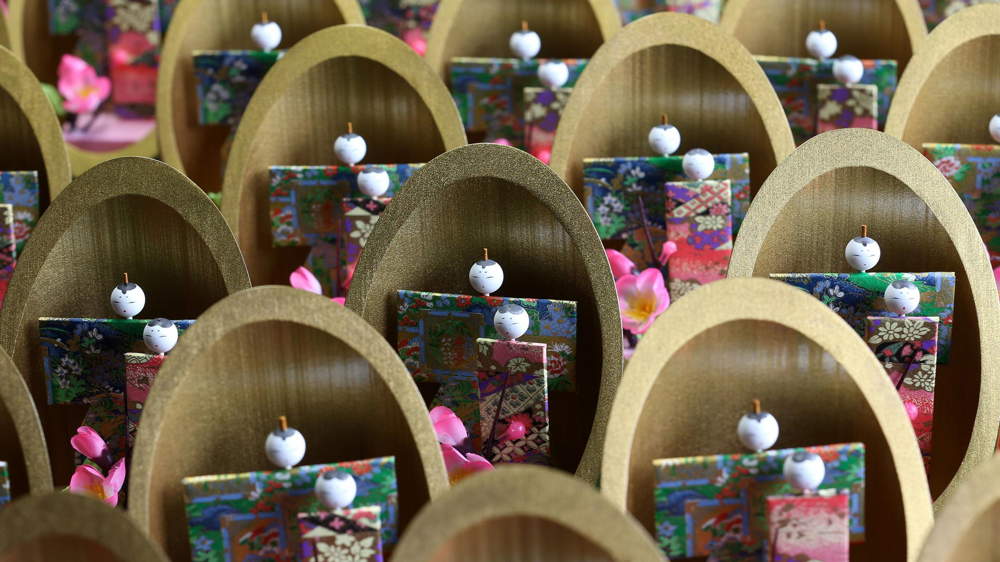
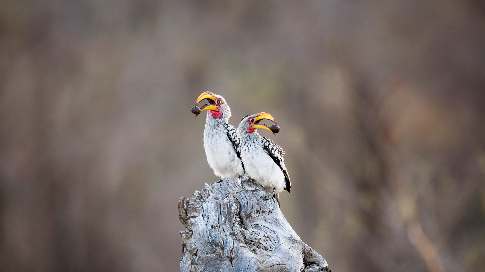
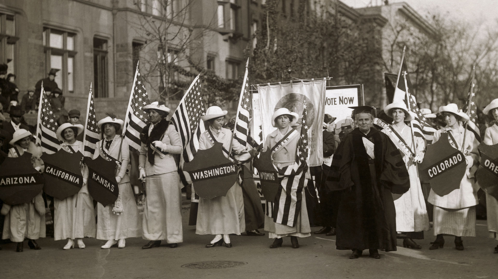
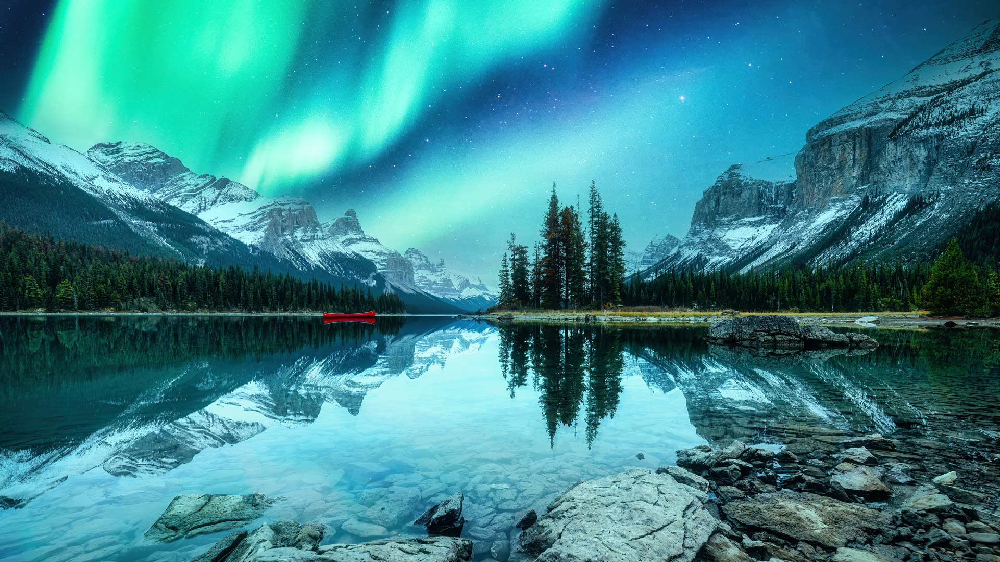
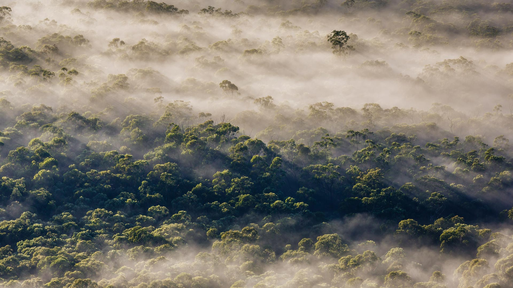

#### 20250307 Plum blossoms in China (© zhikun sun/Getty Images)

#### 20250306 Walterdale Bridge in Edmonton, Canada (© ronniechua/Getty Images)

#### 20250305 Aerial view of Khao Sok National Park, Surat Thani, Thailand (© Peetatham Kongkapech/Getty Images)

#### 20250304 Jackson Square, New Orleans, Louisiana (© SeanPavonePhoto/Getty Images)

#### 20250303 かぐやびな, 兵庫県 上郡町 (© Buddhika Weerasinghe/特派員/Getty Images)

#### 20250302 Southern yellow-billed hornbills in Kruger National Park, South Africa (© Richard Du Toit/Minden Pictures)

#### 20250301 Dr. Anna Howard Shaw leading a suffrage parade in 1910s New York City (© Bettmann/Getty Images)

#### 20250301 玛琳湖精灵岛上空的北极光，贾斯珀国家公园，加拿大 (© Mumemories/Getty Images)

#### 20250301 Eucalyptus trees, Megalong Valley, Blue Mountains National Park, NSW, Australia (© Andrew Peacock/TANDEM Stills + Motion)

