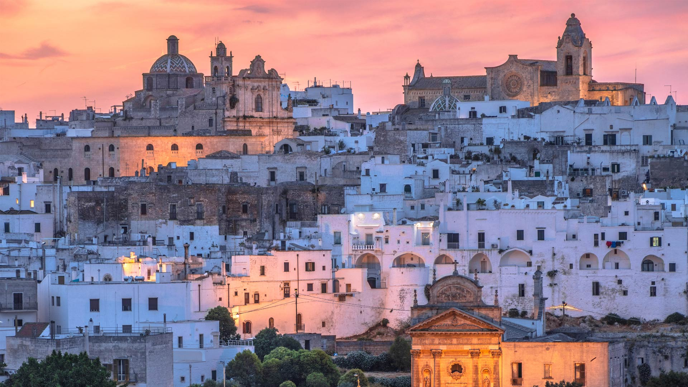
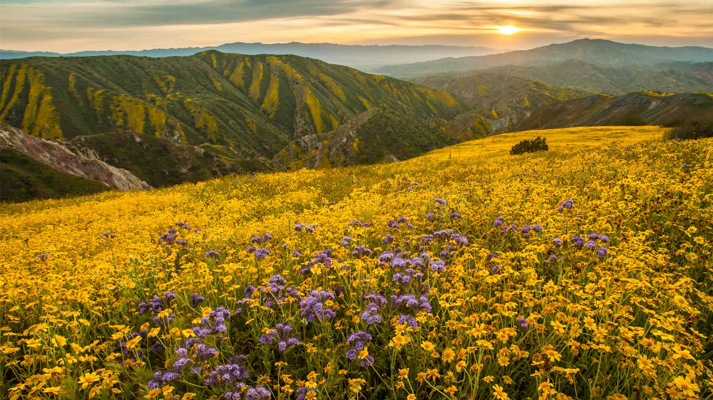
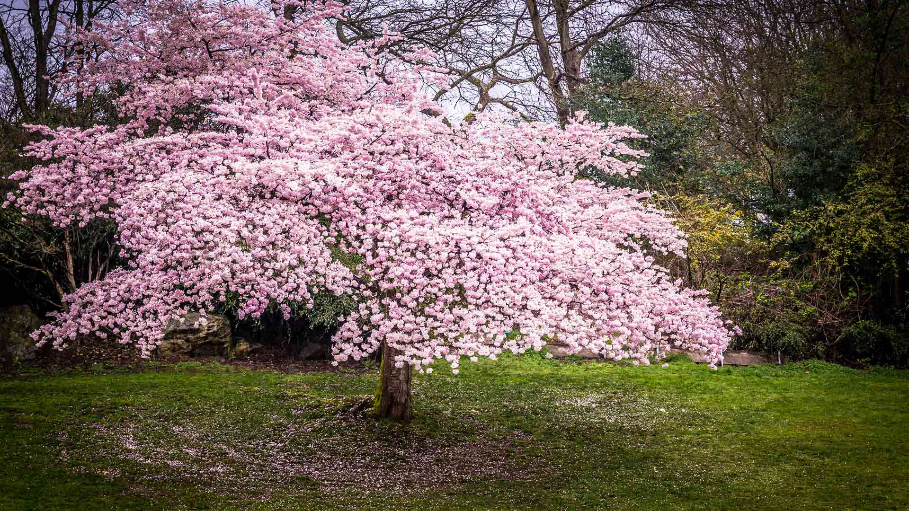
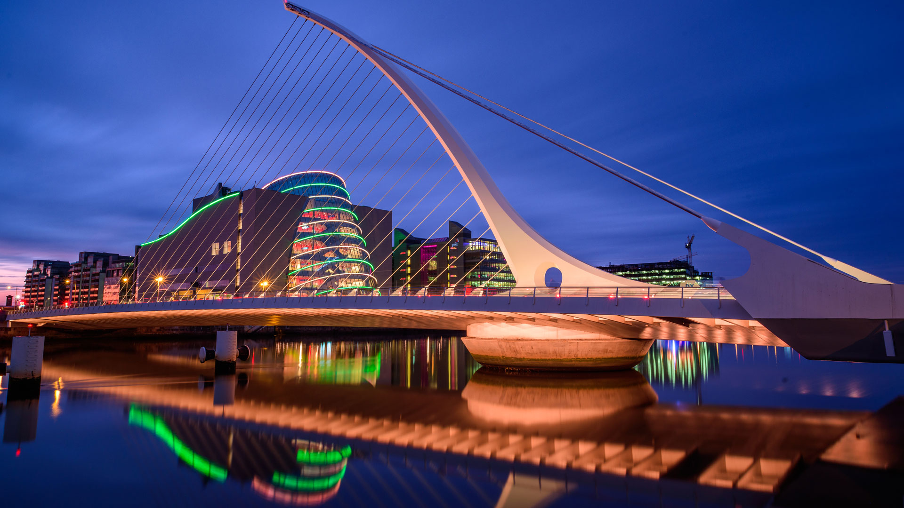
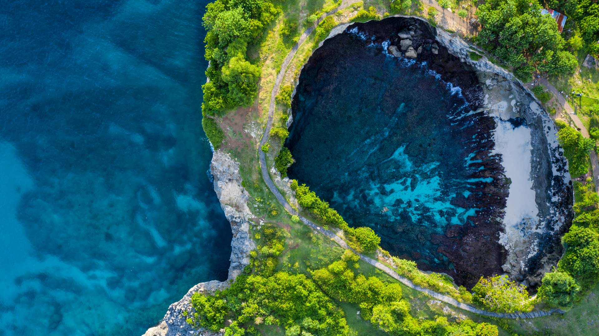
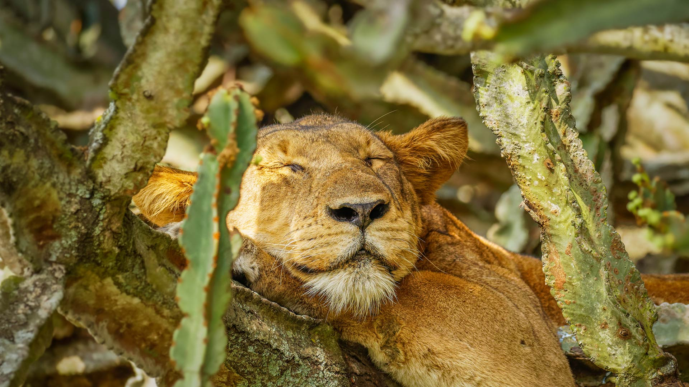

#### 20250331 Ostuni at dusk, Apulia, Italy (© Feng Wei Photography/Getty Images)

#### 20250330 Aerial view of Sydney Harbour, New South Wales, Australia (© jamenpercy/Getty Images)

#### 20250330 Tour de l'horloge de Saint-Marc, Venise, Italie (© scaliger/Getty Images)

#### 20250330 Steinkauz-Junges in einem Baumloch (© Bildagentur Zoonar GmbH/Alamy)

#### 20250329 Aerial view of Sydney Harbour, New South Wales, Australia (© jamenpercy/Getty Images)

#### 20250329 Superbloom in Carrizo Plain National Monument, California (© Robb Hirsch/TANDEM Stills + Motion)

#### 20250328 Female black-naped monarch nesting (© komkrit tonusin/Alamy)

#### 20250327 Odeon of Herodes Atticus, Acropolis of Athens, Greece (© f11photo/Getty Images)

#### 20250326 Manatee in Three Sisters Springs, Crystal River National Wildlife Refuge, Florida (© Stephen Frink/Getty Images)

#### 20250326 Cherry blossoms in Queen Elizabeth Park, Vancouver, Canada (© Kim Rogerson/Getty Images)

#### 20250325 Marmottes des Alpes, Marmota Marmota, Hautes Pyrénées (© Yann Guichaoua-Photos/Getty Images)

#### 20250325 Hobbit-hole in Hobbiton Movie Set, Waikato, New Zealand (© Kim Petersen/Alamy)

#### 20250325 向日葵田里的红额金翅雀，德国 (© Juniors Bildarchiv GmbH/Alamy)

#### 20250325 Kirschblüten am Ufer der Alster bei Sonnenuntergang, Hamburg (© Westend61/Getty Images)

#### 20250324 Desert elephant with calf feeding on tall grass, Namibia (© Christophe Courteau/Minden Pictures)

#### 20250323 Lightning and storm clouds at sunset near Bowman, Nebraska (© john finney photography/Getty Images)

#### 20250322 Water lilies at the surface of Cenote Nicte-Ha, Tulum, Mexico (© Franco Banfi/NPL/Minden Pictures)

#### 20250321 Mist over a lowland rainforest, Danum Valley, Sabah, Borneo, Malaysia (© Nick Garbutt/Alamy)

#### 20250320 美丽盛开的樱花，杭州的春天，中国 (© zhang shuang/Getty Images)

#### 20250320 Spring daffodils glowing in morning light (© LedyX/Shutterstock)

#### 20250320 Schneeglöckchen blühen im Wald (© gehringj/Getty Images)

#### 20250320 Bassin d'Apollon, château de Versailles (© Petr Kovalenkov/Shutterstock)

#### 20250319 A black heron canopy feeding, Chobe National Park, Botswana (© Paul Souders/Minden Pictures)

#### 20250318 Red rock formations, Sedona, Arizona (© Jim Ekstrand/Alamy)

#### 20250317 A kingfisher perched on a branch (© NJphoto/Alamy)

#### 20250317 Samuel Beckett Bridge, Dublin, Ireland (© Colm Keating/Tandem Stills + Motion)

#### 20250316 Baby giant panda in the snow, China (© Cheryl Schneider/Alamy)

#### 20250315 Ucluelet, Vancouver Island, British Columbia (© AWL Images/DanitaDelimont.com)

#### 20250315 The Temple of Saturn in the Roman Forum, Rome, Italy (© Nico De Pasquale Photography/Getty Images)

#### 20250314 Gran Paradiso National Park, Piedmont, Italy (© Stefano Zaccaria/Alamy)

#### 20250314 Dolmen of Sorginetxe, Basque Country, Álava, Spain (© David Herraez Calzada/plainpicture)

#### 20250313 Holi celebration in Jaipur, India (© powerofforever/Getty Images)

#### 20250312 東大寺, 奈良県 奈良市 (© Chris Willson/Alamy Stock Photo)

#### 20250312 Château de Sully-sur-Loire, Center-Val de Loire, France (© StockPhotoAstur/Shutterstock)

#### 20250311 追悼イベントの灯籠, 宮城県 名取市 (© Kuni Takahashi/寄稿者/Getty Images)

#### 20250311 Broken Beach in Nusa Penida, Bali, Indonesia (© joakimbkk/Getty Images)

#### 20250310 Baby giant panda in the snow, China (© Cheryl Schneider/Alamy)

#### 20250310 A lion sleeping in Ishasha Sector, Queen Elizabeth National Park, Uganda (© Gunter Nuyts/Getty Images)

#### 20250309 Martin-pêcheur d'Europe sur une branche (© Javier Fernández Sánchez/Getty Images)

#### 20250309 St. Mark's Clock Tower, Venice, Italy (© scaliger/Getty Images)

#### 20250309 Wallfahrtskirche Maria Gern und Watzmannmassiv, Berchtesgadener Alpen, Bayern (© bluejayphoto/Getty Images)

#### 20250308 石勒苏益格-荷尔斯泰因州瓦登海国家公园，德国 (© 3quarks/Getty Images)

#### 20250308 Fearless Girl statue facing the New York Stock Exchange, New York City (© JOHANNES EISELE/AFP via Getty Images)

#### 20250307 Plum blossoms in China (© zhikun sun/Getty Images)

#### 20250306 Walterdale Bridge in Edmonton, Canada (© ronniechua/Getty Images)

#### 20250306 Desert bighorn sheep in Valley of Fire State Park, Nevada (© Rachid Dahnoun/Cavan Images)

#### 20250305 Aerial view of Khao Sok National Park, Surat Thani, Thailand (© Peetatham Kongkapech/Getty Images)

#### 20250304 Jackson Square, New Orleans, Louisiana (© SeanPavonePhoto/Getty Images)

#### 20250303 かぐやびな, 兵庫県 上郡町 (© Buddhika Weerasinghe/特派員/Getty Images)

#### 20250302 Southern yellow-billed hornbills in Kruger National Park, South Africa (© Richard Du Toit/Minden Pictures)

#### 20250301 Dr. Anna Howard Shaw leading a suffrage parade in 1910s New York City (© Bettmann/Getty Images)

#### 20250301 玛琳湖精灵岛上空的北极光，贾斯珀国家公园，加拿大 (© Mumemories/Getty Images)

#### 20250301 Eucalyptus trees, Megalong Valley, Blue Mountains National Park, NSW, Australia (© Andrew Peacock/TANDEM Stills + Motion)

