#### 20250416 卡奇纳桥，天然桥国家区，犹他州，美国 (© Alan Majchrowicz/Getty Images)

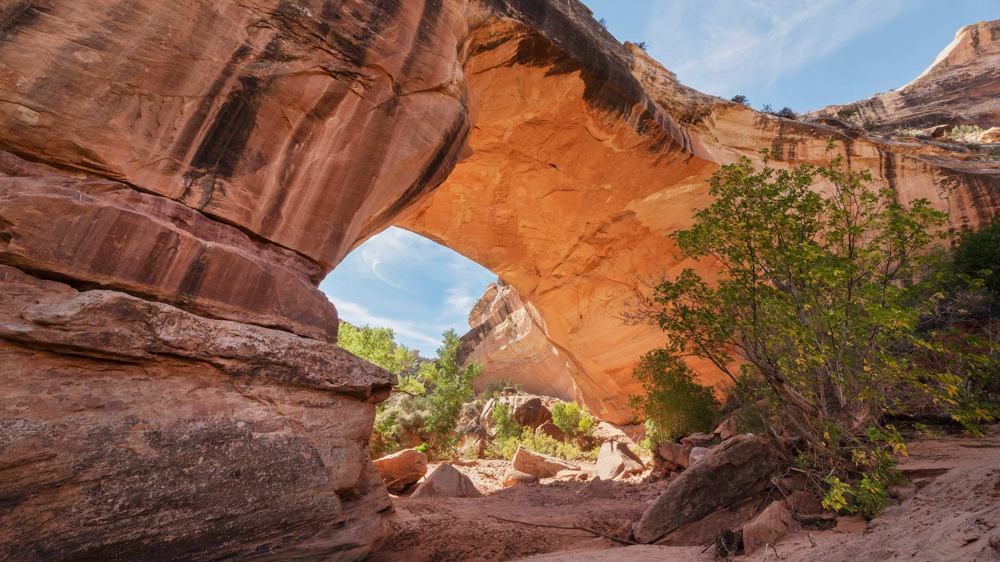

#### 20250415 卡拉奥拉城堡，格拉纳达，西班牙 (© Ugo Mellone/eStock Photo)

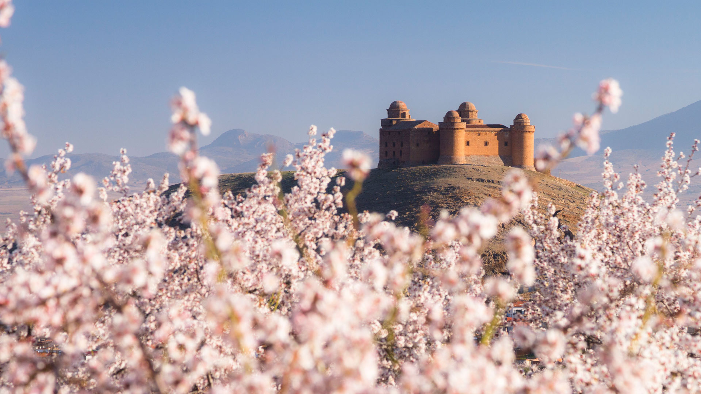

#### 20250415 Beach art by Zarpõ at plage de Sauveterre, Les Sables-d'Olonne, France (© Hemis/Alamy)

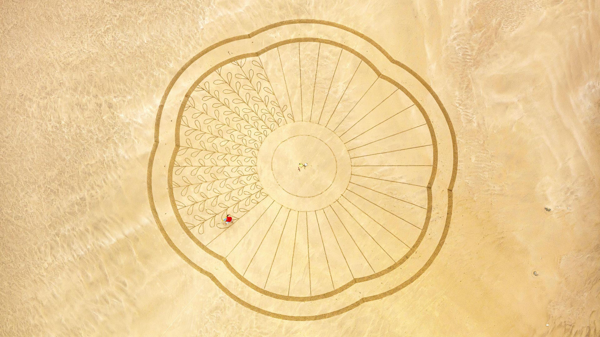

#### 20250414 精巧なからくり人形, 岐阜県 高山市 (© N. F. Photography/Shutterstock)

#### 20250414 Atlantic spotted dolphins near Santa Maria Island, Azores, Portugal (© Jordi Chias/Minden Pictures)

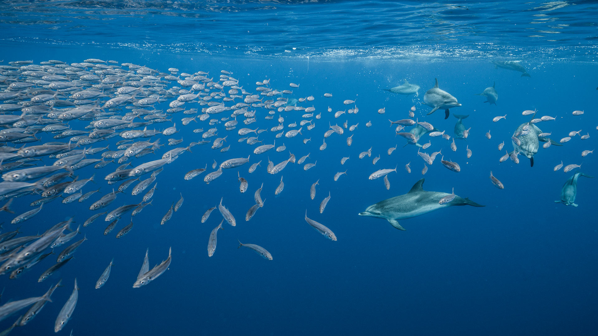

#### 20250413 Wat Tang Sai Temple in Ban Krut, Thailand (© Ratnakorn Piyasirisorost/Getty Images)

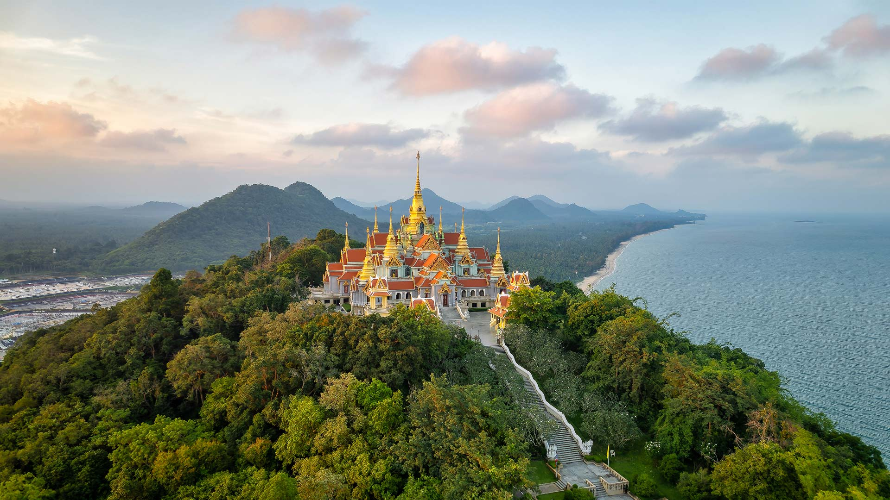

#### 20250412 View from the cupola of the International Space Station above the South Pacific Ocean (© NASA)

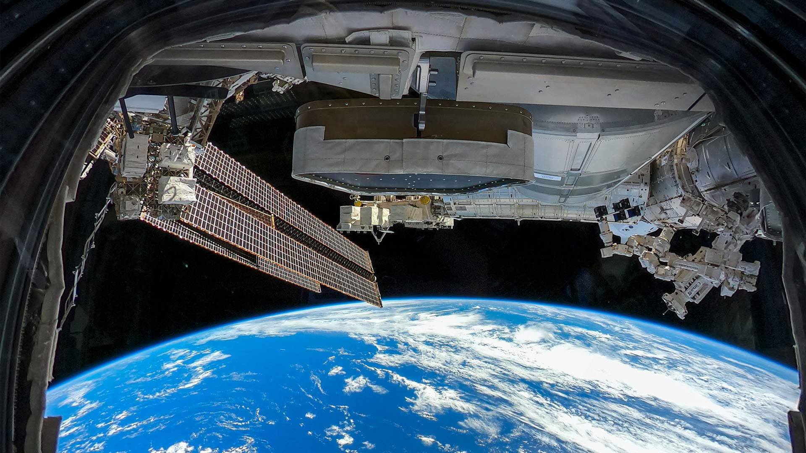

#### 20250411 Vue aérienne du pont Wilson sur la Loire au crépuscule, Tours (© Cristian Mircea Balate/Getty Images)

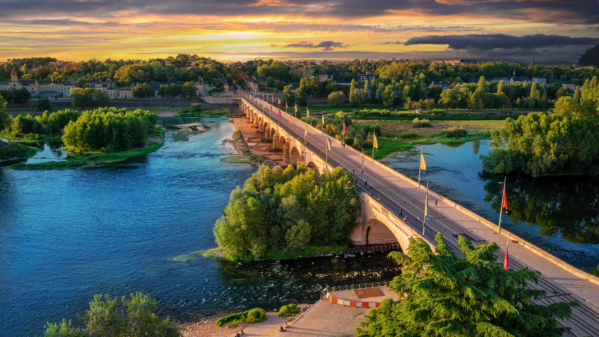

#### 20250410 Red fox cubs near their den (© WildMedia/Shutterstock)

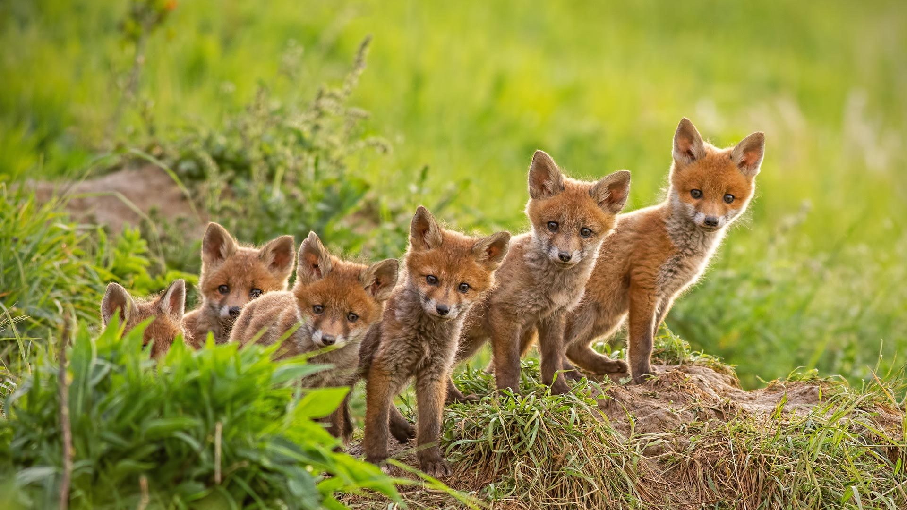

#### 20250409 Piazza Maggiore, Bologna, Italy (© RudyBalasko/Getty Images)

#### 20250409 Blue hour in Naxos, Cyclades, Greece (© Sizun Eye/Getty Images)

#### 20250408 春天的水仙花在清晨绽放 (© LedyX/Shutterstock)

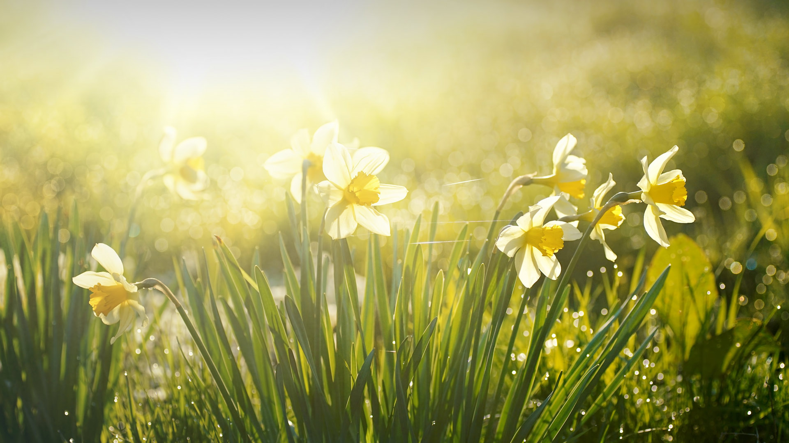

#### 20250408 Women in traditional dress at the Paro Tshechu Festival in Bhutan (© Richard I'Anson/Getty Images)

#### 20250408 Benagil Cave, Algarve, Portugal (© Westend61/Getty Images)

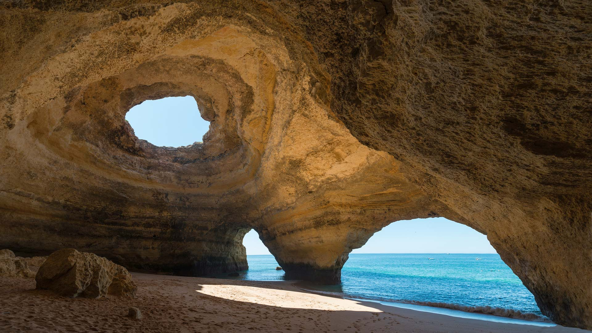

#### 20250407 Whistler and Blackcomb mountains, British Columbia (© Pierre Leclerc/Shutterstock)

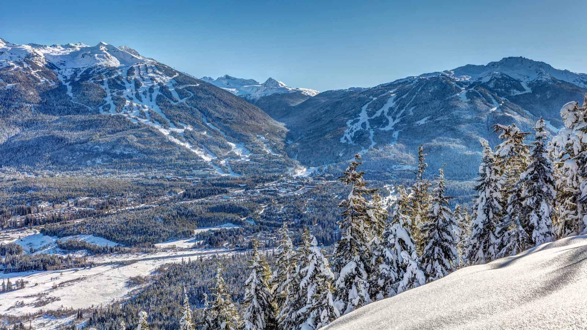

#### 20250407 North American beaver, Moran, Wyoming (© Enrique Aguirre Aves/Getty Images)

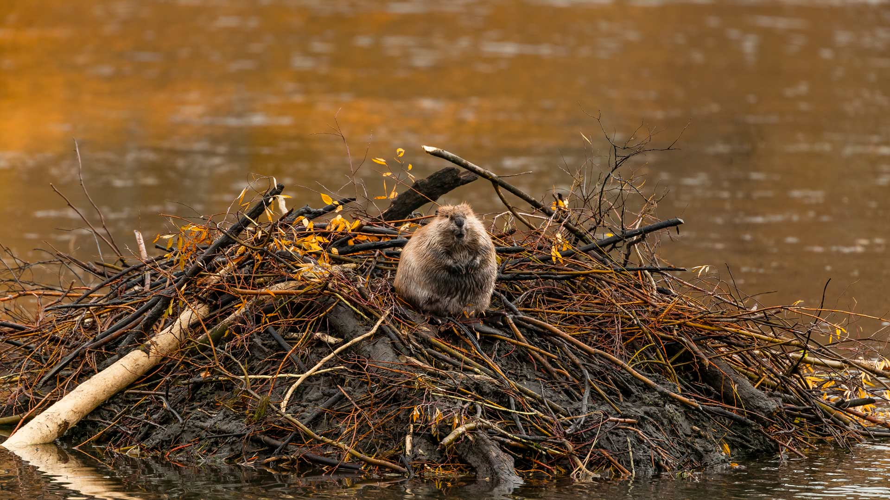

#### 20250406 Yellow warbler in Canada (© mirceax/Getty Images)

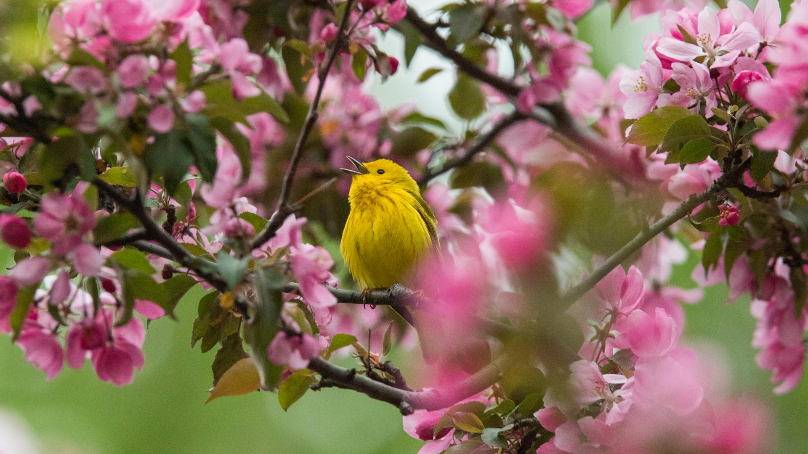

#### 20250406 Tulip fields in Netherlands (© 1111IESPDJ/Getty Images)

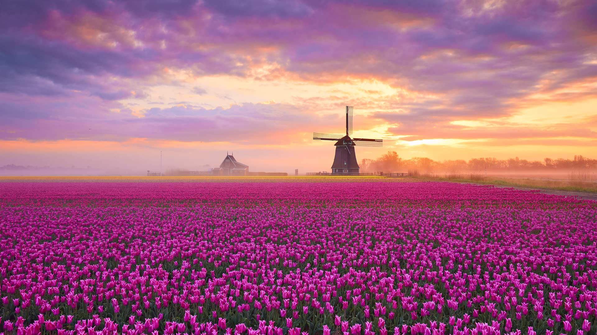

#### 20250406 碎片大厦，伦敦 (© Dennis Fischer Photography/Moment/Getty Images)

#### 20250406 George Peabody Library, Baltimore, Maryland (© Wim Wiskerke/Alamy)

#### 20250406 姫路城, 兵庫県 姫路市 (© Sean Pavone/Alamy Stock Photo)

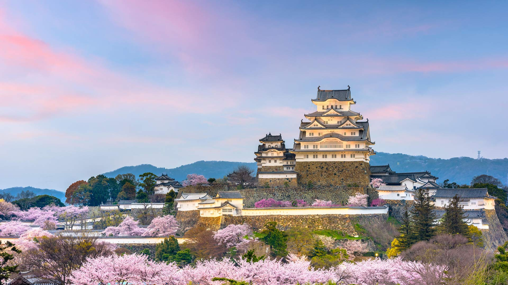

#### 20250405 Gaztelugatxe at sunset, Basque Country, Spain (© Eloi_Omella/Getty Images)

#### 20250404 首里城の守礼門, 沖縄県 那覇市 (© Richie Chan/Shutterstock)

#### 20250404 苏州古镇风景，江苏省，中国 (© gyn9038/Getty Images)

#### 20250404 Informations-, Kommunikations- und Medienzentrum Cottbus, Brandenburg (© H & D ZIELSKE/Gallery Stock)

#### 20250404 The National Cherry Blossom Festival in Washington, DC (© f11photo/Getty Images)

#### 20250404 Taktsang Palphug Monastery, Bhutan (© Baron Reznik/Getty Images)

#### 20250403 バッドランド, 米国 ユタ州 (© Chris Moore/TANDEM Stills + Motion)

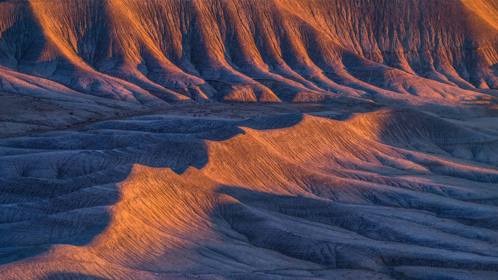

#### 20250403 Rainbow over Wasson Peak, Saguaro National Park, Arizona (© Frank Staub/Getty Images)

#### 20250403 Rufous hummingbird, Salt Spring Island, British Columbia, Canada (© Dave Hutchison Photography/Getty Images)

#### 20250402 Loup gris (© AB Photography/Getty Images)

#### 20250402 Sandstone formations in the badlands near Caineville, Utah (© Chris Moore/TANDEM Stills + Motion)

#### 20250402 香取神宮の田植え祭, 千葉県 香取市 (© Junko Kimura/特派員/Getty Images)

#### 20250401 Tree frog, Costa Rica (© Ondrej Prosicky/Shutterstock)

#### 20250401 奈良公園, 奈良県 奈良市 (© AaronChenPS2/Shutterstock)

