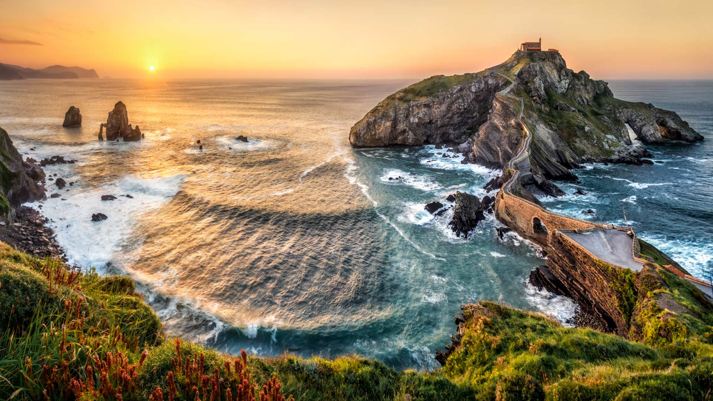
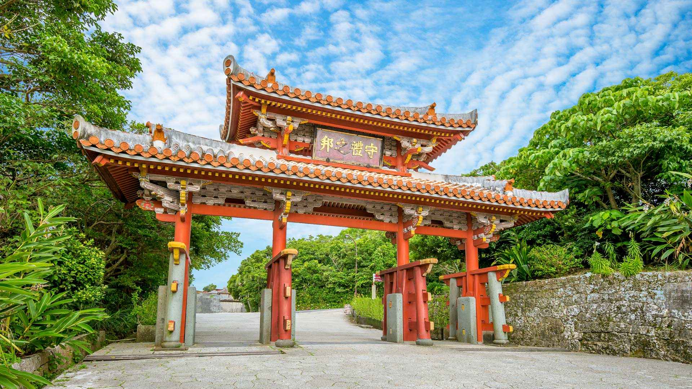
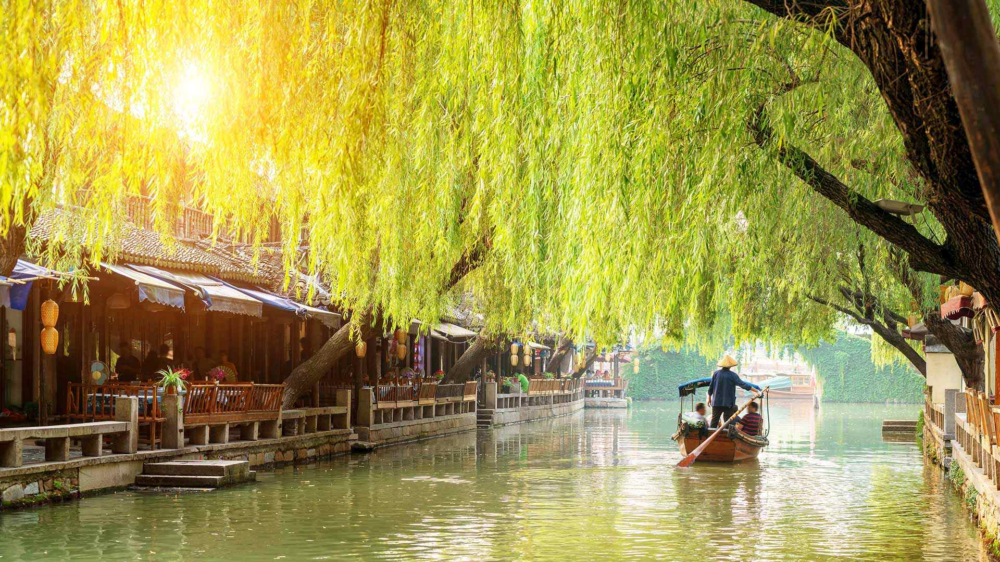
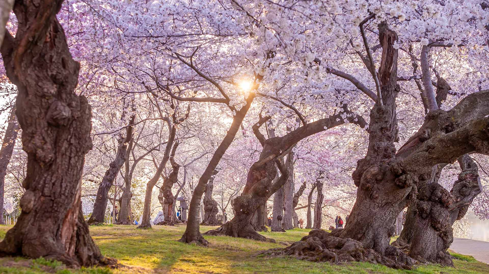
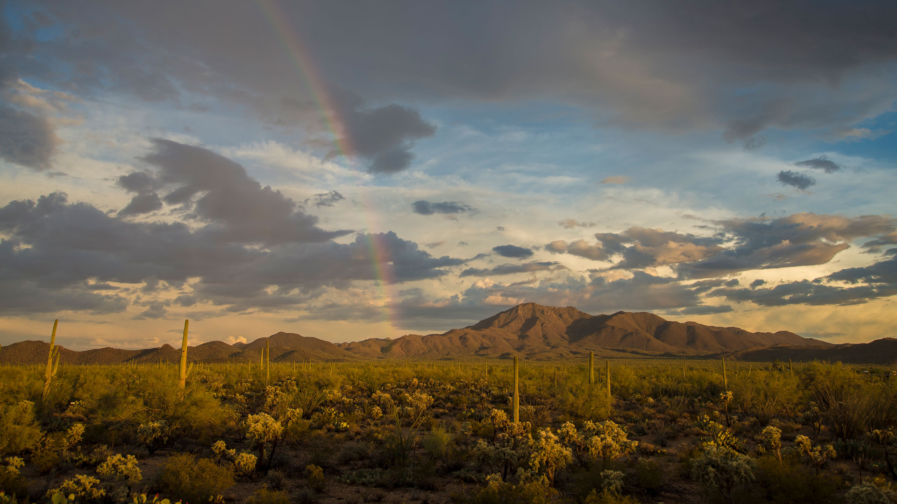
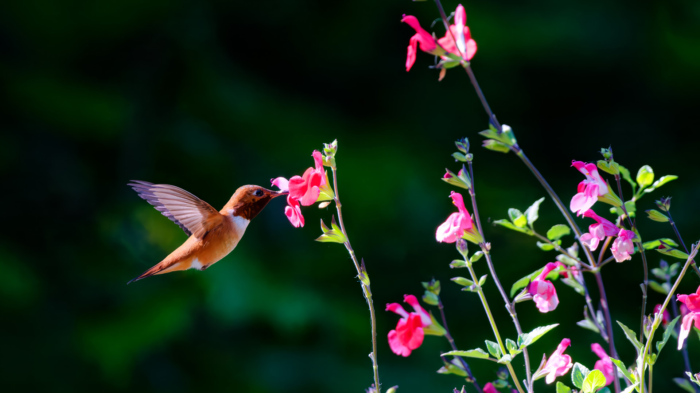
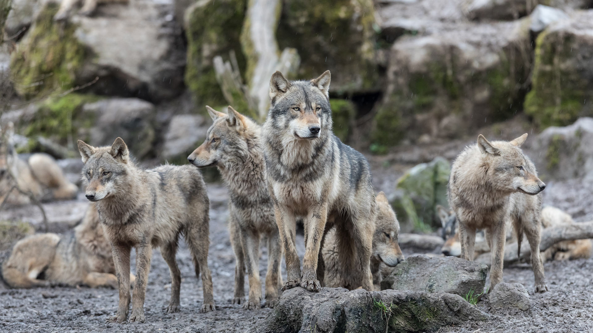
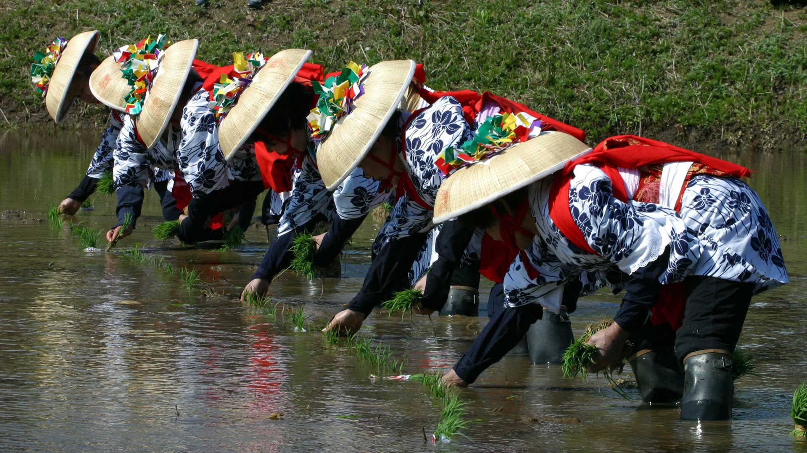
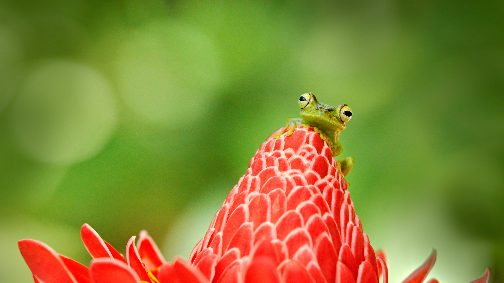
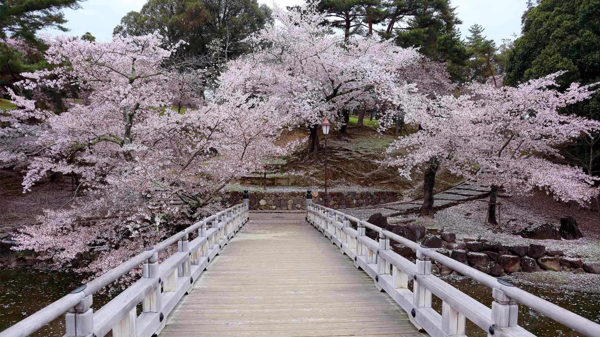

#### 20250405 Gaztelugatxe at sunset, Basque Country, Spain (© Eloi_Omella/Getty Images)

#### 20250404 首里城の守礼門, 沖縄県 那覇市 (© Richie Chan/Shutterstock)

#### 20250404 苏州古镇风景，江苏省，中国 (© gyn9038/Getty Images)

#### 20250404 Informations-, Kommunikations- und Medienzentrum Cottbus, Brandenburg (© H & D ZIELSKE/Gallery Stock)

#### 20250404 The National Cherry Blossom Festival in Washington, DC (© f11photo/Getty Images)

#### 20250404 Taktsang Palphug Monastery, Bhutan (© Baron Reznik/Getty Images)

#### 20250403 Rainbow over Wasson Peak, Saguaro National Park, Arizona (© Frank Staub/Getty Images)

#### 20250403 Rufous hummingbird, Salt Spring Island, British Columbia, Canada (© Dave Hutchison Photography/Getty Images)

#### 20250402 Loup gris (© AB Photography/Getty Images)

#### 20250402 Sandstone formations in the badlands near Caineville, Utah (© Chris Moore/TANDEM Stills + Motion)

#### 20250402 香取神宮の田植え祭, 千葉県 香取市 (© Junko Kimura/特派員/Getty Images)

#### 20250401 Tree frog, Costa Rica (© Ondrej Prosicky/Shutterstock)

#### 20250401 奈良公園, 奈良県 奈良市 (© AaronChenPS2/Shutterstock)

