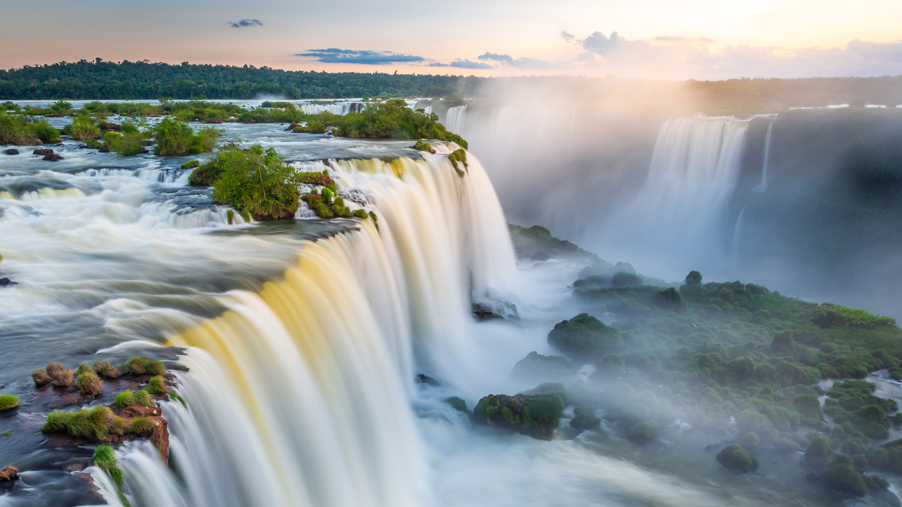
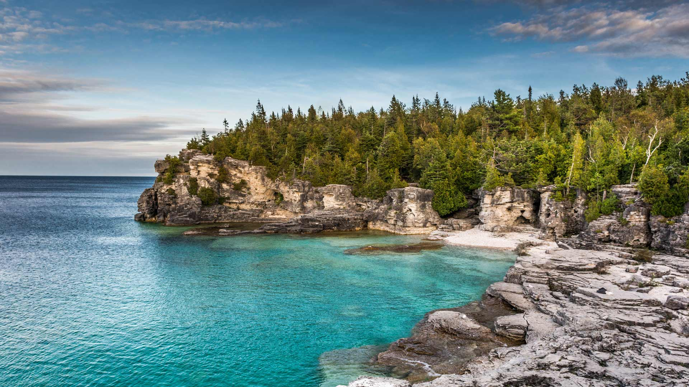
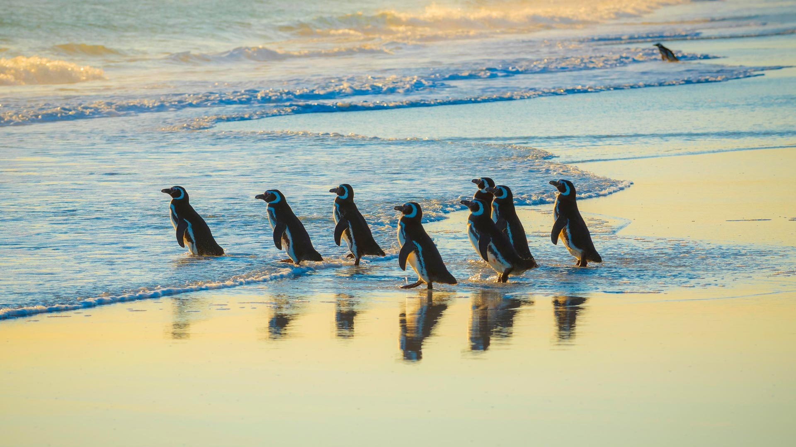
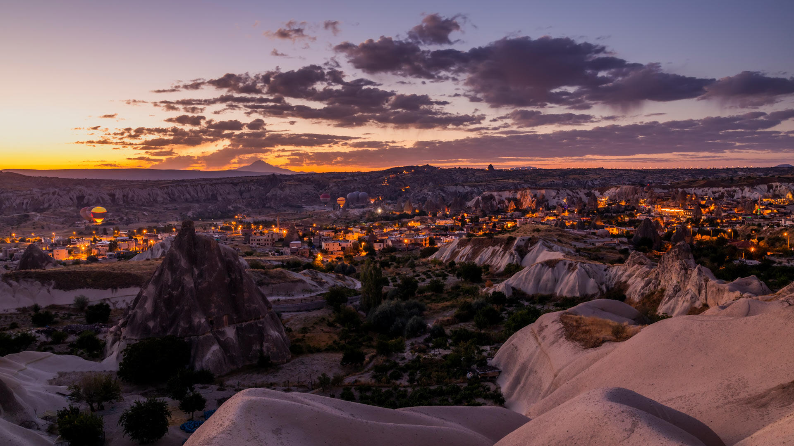
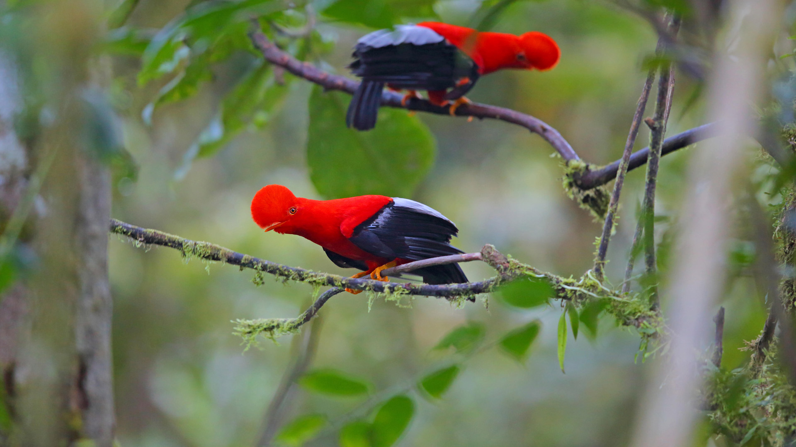
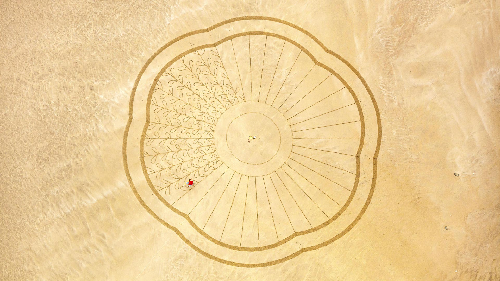
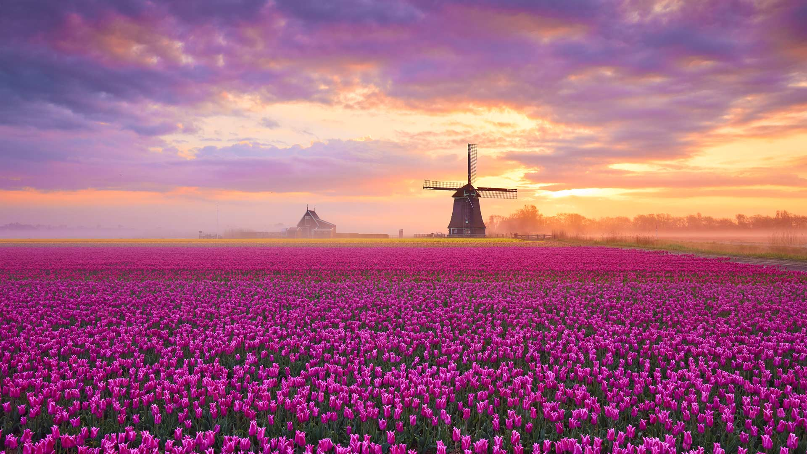
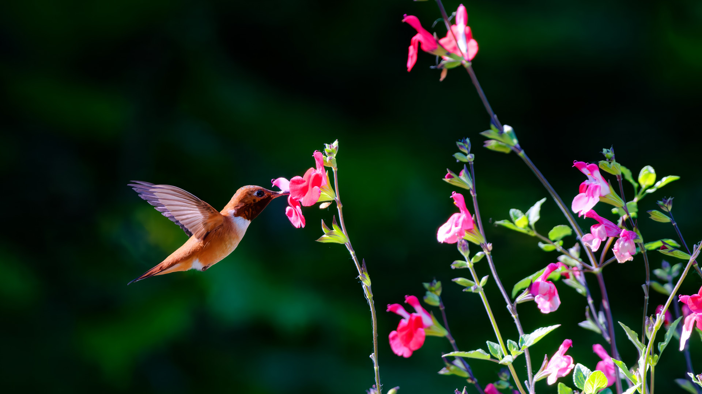
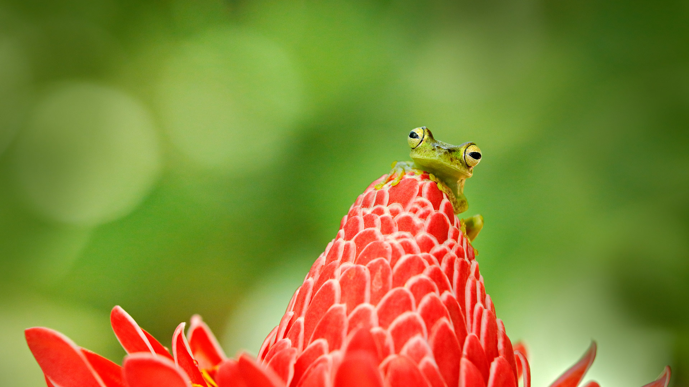

#### 20250430 Faisan de Colchide mâle au milieu de fleurs jaunes, Normandie (© slowmotiongli/Getty Images)

#### 20250430 从巴拉那州看到的伊瓜苏瀑布, 巴西 (© agustavop/Getty Images)

#### 20250430 Jazz saxophonist John Coltrane and band performing in 1961 in London, England (© Popperfoto/Getty Images)

#### 20250429 Formal garden at Château de Villandry, Loire Valley, France (© Mint Images/Getty Images)

#### 20250428 Impala with red-billed oxpecker in Moremi Game Reserve, Botswana (© Paul Souders/Getty Images)

#### 20250427 Vogelperspektive auf Giebelhäuser, Große Petersgrube, Lübeck, Schleswig-Holstein (© H & D ZIELSKE/Image Professionals GmbH/Alamy Stock Foto)

#### 20250427 Halema'uma'u Crater's lava lake, Kīlauea Caldera, Hawai'i Volcanoes National Park, Hawaii (© Stephen Matera/Tandem Stills + Motion)

#### 20250426 Grove of redwoods in Redwood National and State Parks, California (© Bob Pool/Getty Images)

#### 20250426 ジャスパー国立公園, カナダ アルバータ州 (© Mumemories/Getty Images)

#### 20250426 印第安头湾, 布鲁斯半岛国家公园, 安大略, 加拿大 (© Maurice Prokaziuk/Getty Images)

#### 20250425 Magellanic penguins, Volunteer Point, Falkland Islands (© imageBROKER/Matthias Graben/Getty Images)

#### 20250424 Spire Cove in Kenai Fjords National Park, Seward, Alaska (© Wander Photography/Getty Images)

#### 20250424 Beach chairs on Steinwarder in Heiligenhafen, Schleswig-Holstein, Germany (© Frank Lukasseck/eStock Photo)

#### 20250423 Shakespeare's Globe, London, England (© Peter Dazeley/Getty Images)

#### 20250422 Grand Prismatic Spring, Yellowstone National Park, Wyoming (© Ajith Kumar/Getty Images)

#### 20250421 Yellow warbler in Canada (© mirceax/Getty Images)

#### 20250421 Joshua trees under the Milky Way, California (© Chao Zhang/Getty Images)

#### 20250420 Viele bunt bemalte Ostereier an einem Apfelbaum (© Kerrick/Getty Images)

#### 20250420 Wild baby rabbits in spring (© Fiona McAllister Photography/Getty Images)

#### 20250419 Zion National Park, Utah (© Simon Dannhauer/Getty Images)

#### 20250418 Hot air balloons over Göreme Historical National Park in Cappadocia, Türkiye (© Anton Petrus/Getty Images)

#### 20250418 Lion de Belfort, Bourgogne-Franche-Comté, France (© milosk50/Shutterstock)

#### 20250417 Andean cocks-of-the-rock, Ecuador (© Kit Day/Alamy)

#### 20250416 Pont sur la Garonne avec le Dôme de la Grave, Toulouse (© LOOK-foto/Image Professionals GmbH/Alamy Stock Photo)

#### 20250416 Kachina Bridge, Natural Bridges National Monument, Utah (© Alan Majchrowicz/Getty Images)

#### 20250416 Strandkörbe vor der Seebrücke auf Steinwarder in Heiligenhafen, Schleswig-Holstein, Deutschland (© Frank Lukasseck/Huber/eStock Photo)

#### 20250415 卡拉奥拉城堡，格拉纳达，西班牙 (© Ugo Mellone/eStock Photo)

#### 20250415 Beach art by Zarpõ at plage de Sauveterre, Les Sables-d'Olonne, France (© Hemis/Alamy)

#### 20250414 精巧なからくり人形, 岐阜県 高山市 (© N. F. Photography/Shutterstock)

#### 20250414 Atlantic spotted dolphins near Santa Maria Island, Azores, Portugal (© Jordi Chias/Minden Pictures)

#### 20250413 Wat Tang Sai Temple in Ban Krut, Thailand (© Ratnakorn Piyasirisorost/Getty Images)

#### 20250412 View from the cupola of the International Space Station above the South Pacific Ocean (© NASA)

#### 20250411 Tulip fields in Netherlands (© 1111IESPDJ/Getty Images)

#### 20250411 Vue aérienne du pont Wilson sur la Loire au crépuscule, Tours (© Cristian Mircea Balate/Getty Images)

#### 20250410 Red fox cubs near their den (© WildMedia/Shutterstock)

#### 20250409 Piazza Maggiore, Bologna, Italy (© RudyBalasko/Getty Images)

#### 20250409 Blue hour in Naxos, Cyclades, Greece (© Sizun Eye/Getty Images)

#### 20250408 春天的水仙花在清晨绽放 (© LedyX/Shutterstock)

#### 20250408 Women in traditional dress at the Paro Tshechu Festival in Bhutan (© Richard I'Anson/Getty Images)

#### 20250408 Benagil Cave, Algarve, Portugal (© Westend61/Getty Images)

#### 20250407 Whistler and Blackcomb mountains, British Columbia (© Pierre Leclerc/Shutterstock)

#### 20250407 North American beaver, Moran, Wyoming (© Enrique Aguirre Aves/Getty Images)

#### 20250406 Yellow warbler in Canada (© mirceax/Getty Images)

#### 20250406 Tulip fields in Netherlands (© 1111IESPDJ/Getty Images)

#### 20250406 碎片大厦，伦敦 (© Dennis Fischer Photography/Moment/Getty Images)

#### 20250406 George Peabody Library, Baltimore, Maryland (© Wim Wiskerke/Alamy)

#### 20250406 姫路城, 兵庫県 姫路市 (© Sean Pavone/Alamy Stock Photo)

#### 20250405 Gaztelugatxe at sunset, Basque Country, Spain (© Eloi_Omella/Getty Images)

#### 20250404 首里城の守礼門, 沖縄県 那覇市 (© Richie Chan/Shutterstock)

#### 20250404 苏州古镇风景，江苏省，中国 (© gyn9038/Getty Images)

#### 20250404 Informations-, Kommunikations- und Medienzentrum Cottbus, Brandenburg (© H & D ZIELSKE/Gallery Stock)

#### 20250404 The National Cherry Blossom Festival in Washington, DC (© f11photo/Getty Images)

#### 20250404 Taktsang Palphug Monastery, Bhutan (© Baron Reznik/Getty Images)

#### 20250403 バッドランド, 米国 ユタ州 (© Chris Moore/TANDEM Stills + Motion)

#### 20250403 Rainbow over Wasson Peak, Saguaro National Park, Arizona (© Frank Staub/Getty Images)

#### 20250403 Rufous hummingbird, Salt Spring Island, British Columbia, Canada (© Dave Hutchison Photography/Getty Images)

#### 20250402 Loup gris (© AB Photography/Getty Images)

#### 20250402 Sandstone formations in the badlands near Caineville, Utah (© Chris Moore/TANDEM Stills + Motion)

#### 20250402 香取神宮の田植え祭, 千葉県 香取市 (© Junko Kimura/特派員/Getty Images)

#### 20250401 Tree frog, Costa Rica (© Ondrej Prosicky/Shutterstock)

#### 20250401 奈良公園, 奈良県 奈良市 (© AaronChenPS2/Shutterstock)

