#### 20250509 Canadian Tulip Festival in Ottawa (© Danielle Donders/Getty Images)

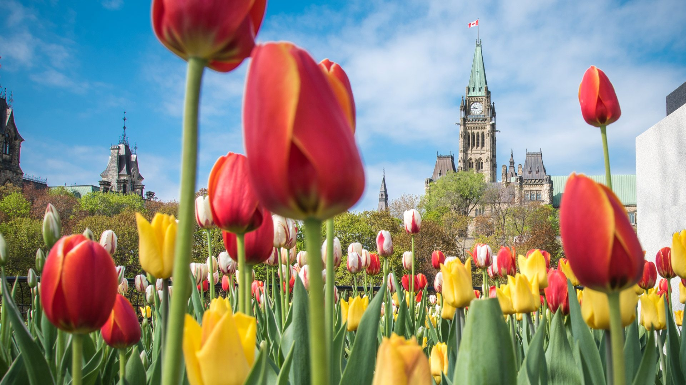

#### 20250509 普通变色龙 (© Photostock-Israel/SPL/Getty Images)

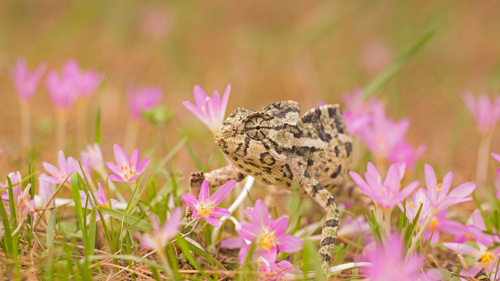

#### 20250509 ブルース・ペニンシュラ国立公園, カナダ オンタリオ州 (© Maurice Prokaziuk/Getty Images)

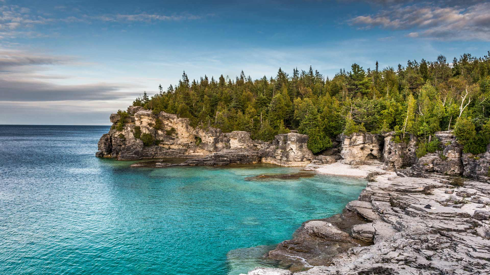

#### 20250508 Volcan Puy du Pariou, Auvergne (© Frantisek ZVARDON/Onlyfrance.fr/Alamy Stock Photo)

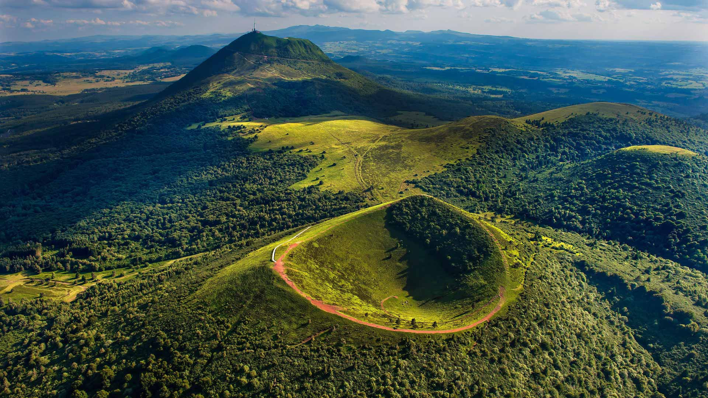

#### 20250507 Dunluce Castle, County Antrim, Northern Ireland (© DieterMeyrl/Getty Images)

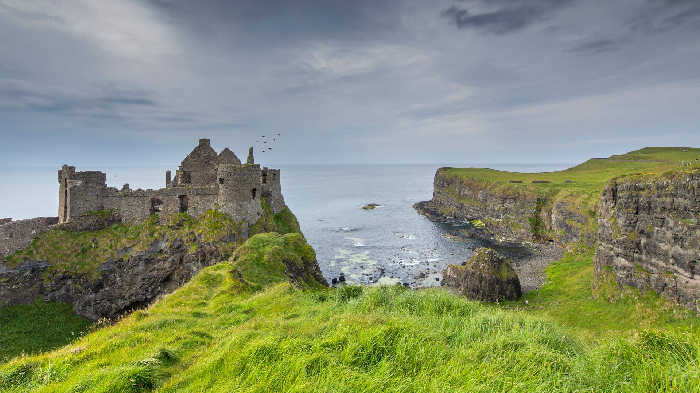

#### 20250506 An ultralight aircraft flying over the sands of Namibia (© Burt Johnson/Alamy)

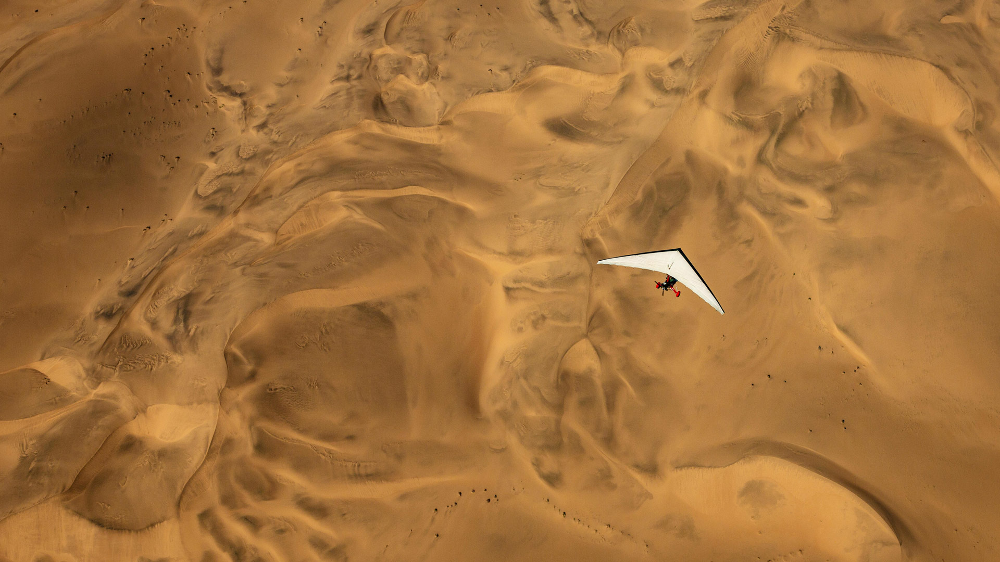

#### 20250505 Mount Burgess und Emerald Lake im Yoho-Nationalpark, British Columbia, Kanada (© Feng Wei Photography/Getty Images)

#### 20250505 Torres del Paine National Park, Patagonia, Chile (© Marco Bottigelli/Getty Images)

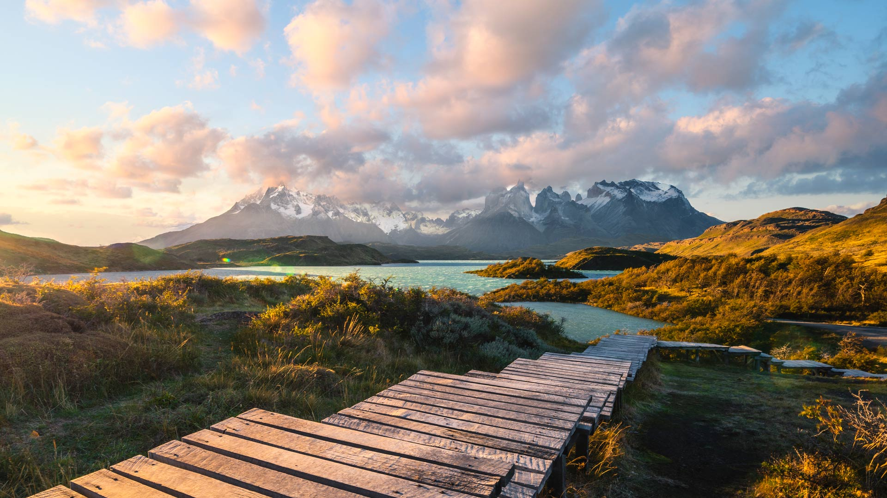

#### 20250505 Donkeys in a valley near Rhyolite, Nevada (© Moelyn Photos/Getty Images)

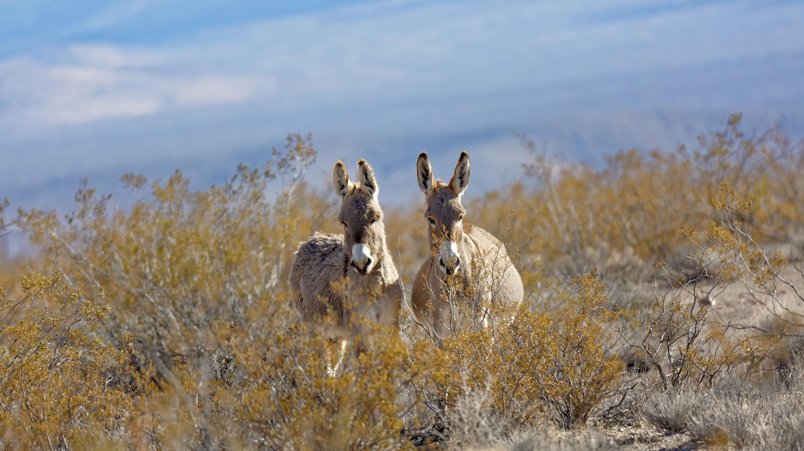

#### 20250505 東京タワー 333 匹の鯉のぼり, 東京 (© Takashi Aoyama/寄稿者/Getty Images)

#### 20250505 Paper flags strung over a street in San Miguel de Allende, Mexico (© William Zinn/Getty Images)

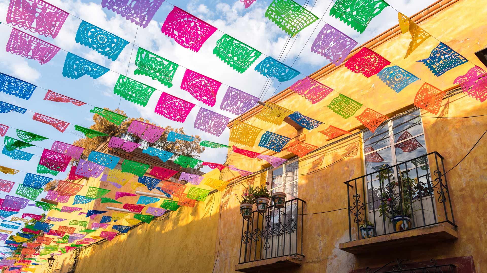

#### 20250505 日出时分，美丽的喀斯特山脉鸟瞰图，中国桂林 (© zhaojiankang/Getty Images)

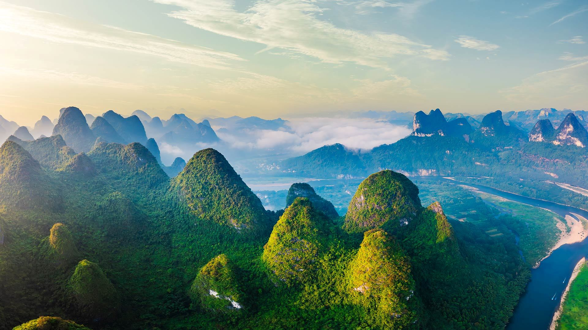

#### 20250504 Plaza de España, Seville, Spain (© Horia Merla/Getty Images)

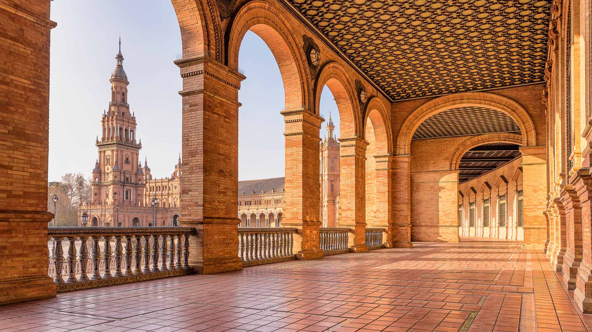

#### 20250504 屋久島, 鹿児島県 (© oxico/Getty Images)

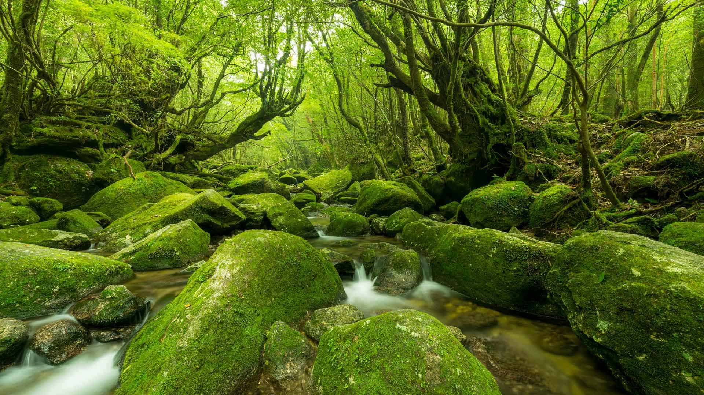

#### 20250503 Schloss Moritzburg bei Dresden, Sachsen (© Hans-Peter Szyszka/Huber/eStock Photo)

#### 20250503 The Milky Way framed by Double Arch in Arches National Park, Utah (© Adventure_Photo/Getty Images)

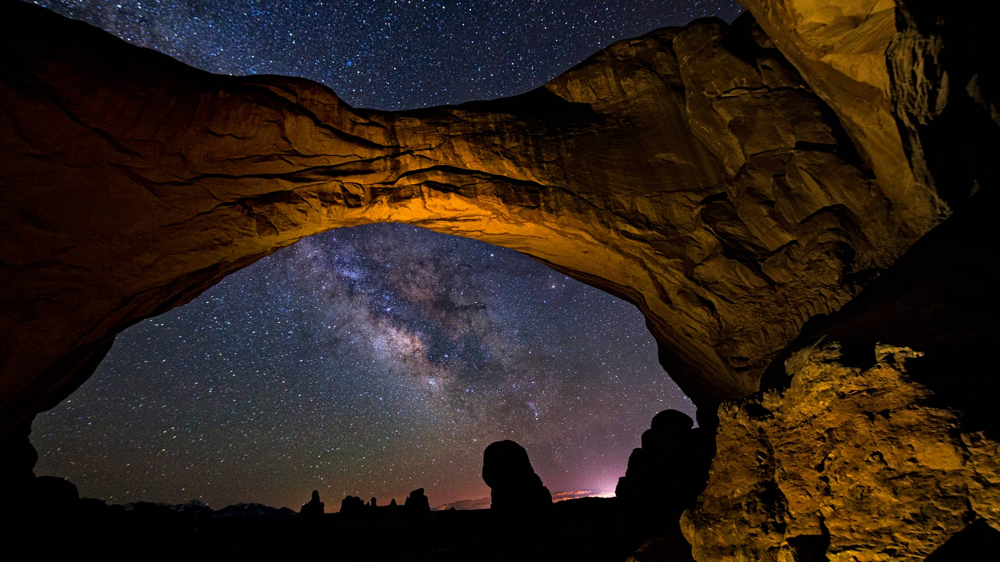

#### 20250502 Striated heron on a Victoria water lily, Pantanal, Brazil (© Gerald Corsi/Getty Images)

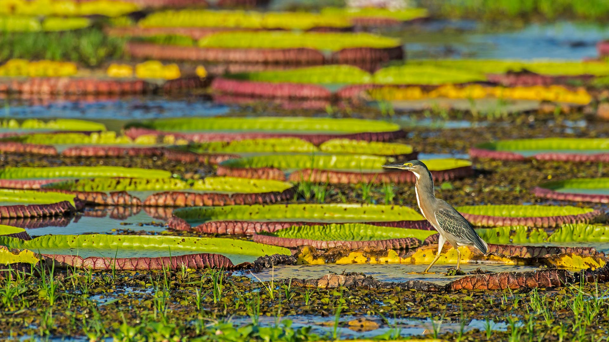

#### 20250501 Plumeria flowers, Hawaii (© Miranda Jans/Getty Images)

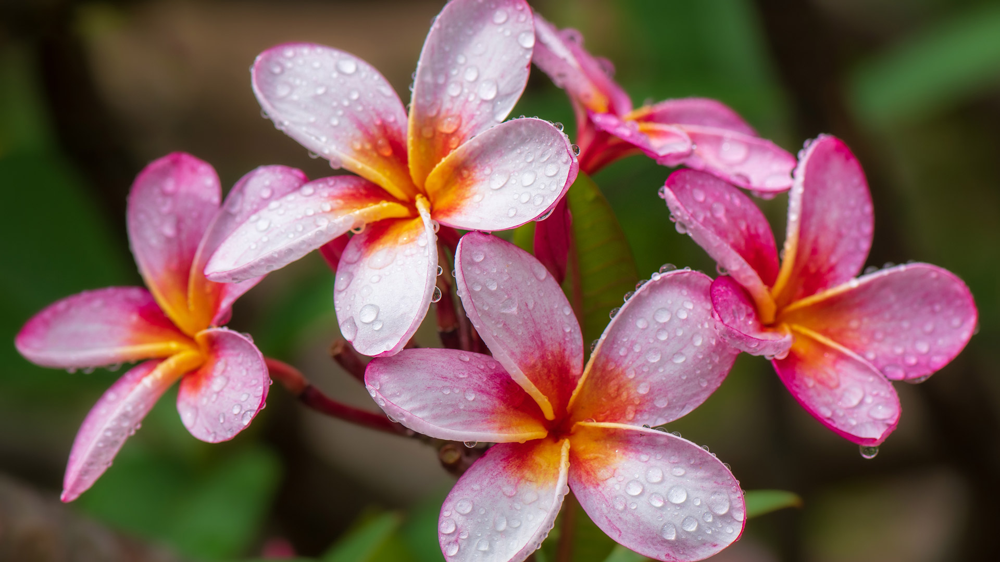

#### 20250501 大淵笹場の茶畑, 静岡県 富士市 (© 7maru/Getty Images)

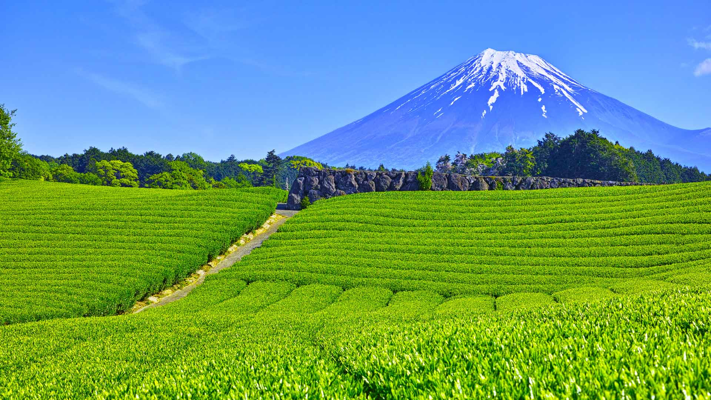

