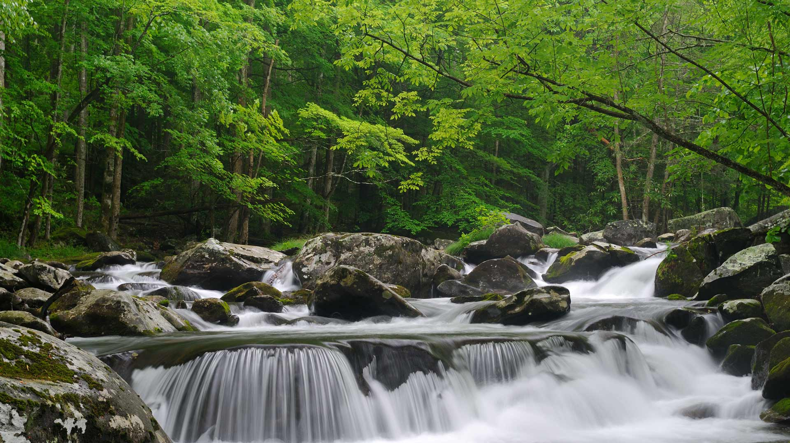
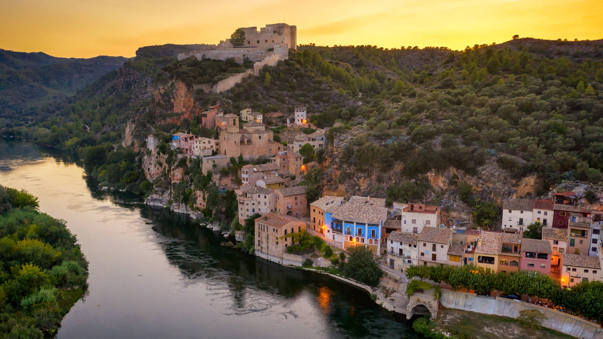
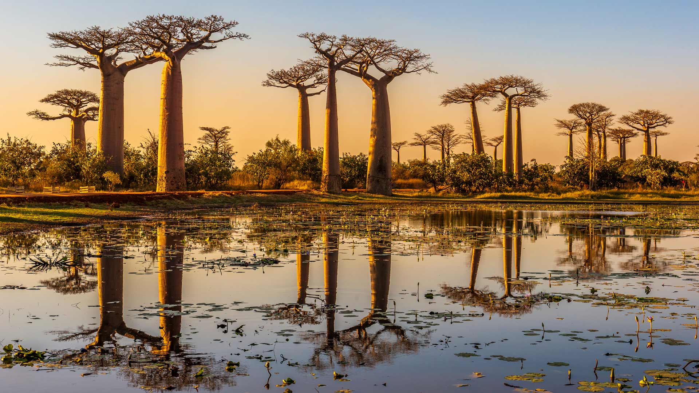
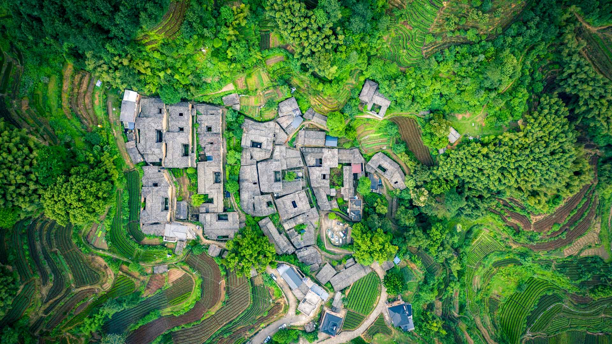
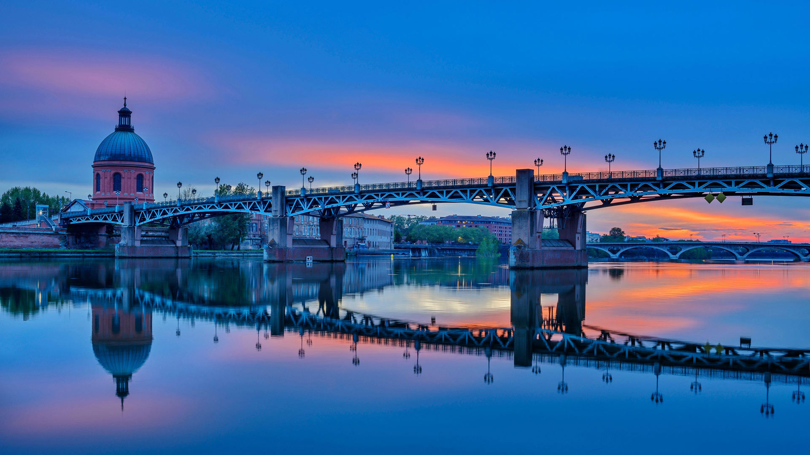
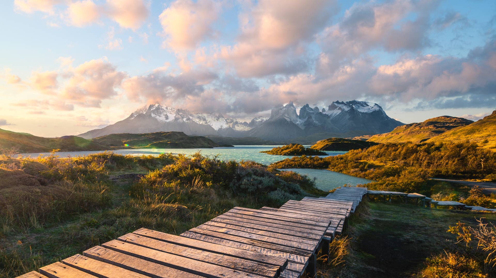
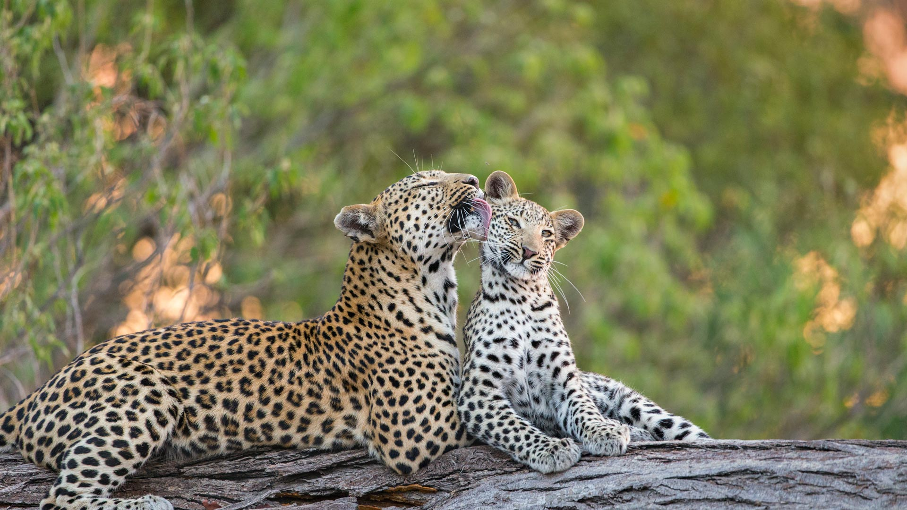
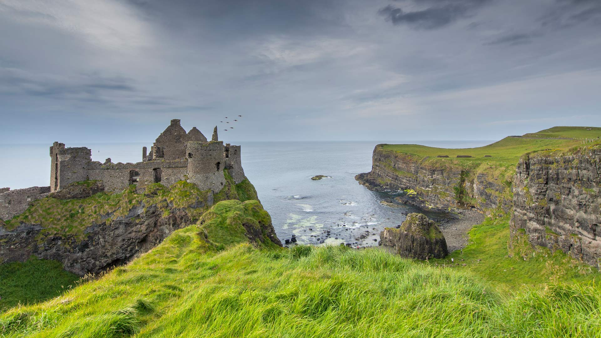
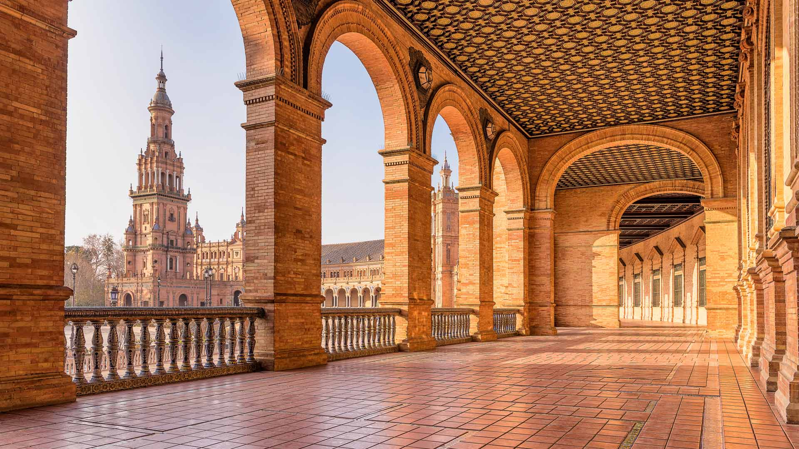

#### 20250531 Knuthöjdsmossen, a nature reserve in Sweden (© Sven Halling/DEEPOL/plainpicture)

#### 20250531 用彩色丝线串成的香囊，端午节前夕的庙会上，吉林省吉林市，中国 (© Visual China Group/Getty Images)

#### 20250530 Little Pigeon River, Great Smoky Mountains National Park, Tennessee (© GreenStock/Getty Images)

#### 20250529 Miravet on the Ebro River, Tarragona, Catalonia, Spain (© Eloi_Omella/Getty Images)

#### 20250529 Goethe-Schiller-Denkmal in Weimar, Thüringen (© Robert Ruidl/iStock/Getty Images)

#### 20250528 Sea otter floating in a kelp bed in Alaska Maritime National Wildlife Refuge (© Gerry Ellis/Minden Pictures)

#### 20250528 Heidelberg, Baden-Württemberg, Germany (© anyaivanova/Getty Images)

#### 20250527 Mona Vale Rockpool, Sydney, Australia (© jamenpercy/Getty Images)

#### 20250527 A train running along Hozugawa River in Arashiyama, Kyoto, Japan (© Alvin Huang/Getty Images)

#### 20250526 Cigognes blanches dans un champ de meules de foin (© Buchet Jean-marc/Wirestock/Adobe Stock)

#### 20250526 Mount Hamilton, San Francisco Bay Area, California, United States (© Jeffrey Lewis/TANDEM Stills + Motion)

#### 20250526 Arlington National Cemetery in Virginia (© Dennis Govoni/Getty Images)

#### 20250525 Mère léopard qui toilette son petit, Réserve de Jao, Botswana (© Suzi Eszterhas/Minden Pictures)

#### 20250525 Butchart Gardens in Brentwood Bay, British Columbia, Canada (© 2009fotofriends/Shutterstock)

#### 20250524 Jotunheimen National Park in Norway (© Marisa Estivill/Shutterstock)

#### 20250524 水郷佐原あやめパーク, 千葉県 香取市 (© MIXA/Getty Images)

#### 20250523 A Julia butterfly on the nose of a yellow-spotted river turtle, Amazon Region, Ecuador (© Westend61/Getty Images)

#### 20250522 Baobab trees at sunset, Avenue of the Baobabs, Madagascar (© Framalicious/Shutterstock)

#### 20250521 Tea garden at Yangjiatang Village, Songyang County, China (© feng xu/Getty Images)

#### 20250520 Honey bee on lavender flowers (© Anthony Brown/Alamy)

#### 20250519 British Columbia Parliament Buildings (© bluejayphoto/Getty Images)

#### 20250519 Faucon de Harris sur le court Suzanne-Lenglen, stade Roland-Garros, Paris (© Jacques Demarthon/Getty Images)

#### 20250519 Mount Hamilton, near San Jose, California (© Jeffrey Lewis/TANDEM Stills + Motion)

#### 20250518 加龙河对面的圣皮埃尔桥，图卢兹，法国 (© Image Professionals GmbH/Alamy)

#### 20250518 'The Spirit of Electricity' by Raoul Dufy, Museum of Modern Art, Paris, France (© BERTRAND GUAY/AFP via Getty Images)

#### 20250518 Pei-Bau des Deutschen Historischen Museums in Berlin (© Westend61/Getty Images)

#### 20250517 A delta in the Venetian Lagoon, Italy (© Dimitri Weber/Amazing Aerial Agency)

#### 20250516 Great green macaw, Mexico (© Ondrej Prosicky/Shutterstock)

#### 20250516 保津川沿いに走るトロッコ列車, 京都 (© Alvin Huang/Getty Images)

#### 20250515 Big Ben and the Palace of Westminster, London, England (© Puthipong Worasaran/Getty Images)

#### 20250514 Porto Flavia, Sardinia, Italy (© Francesco Riccardo Iacomino/Getty Images)

#### 20250513 Yoho National Park, British Columbia (© Feng Wei Photography/Getty Images)

#### 20250513 Torres del Paine National Park, Patagonia, Chile (© Marco Bottigelli/Getty Images)

#### 20250513 Baie de Cannes au crépuscule, Côte d'Azur (© Jean-Pierre Pieuchot/Getty Images)

#### 20250512 An iris garden in Tokyo, Japan (© M.Arai/Getty Images)

#### 20250511 Leopard mother grooming her cub, Jao Reserve, Botswana (© Suzi Eszterhas/Minden Pictures)

#### 20250510 Minnesota State Capitol, St. Paul, Minnesota (© lavin photography/Getty Images)

#### 20250510 Blick auf Heidelberg und das Heidelberger Schloss im Frühling, Baden-Württemberg (© anyaivanova/Getty Images)

#### 20250510 巴尔德纳斯雷亚尔斯自然公园的卡斯蒂尔德蒂拉，纳瓦拉，西班牙 (© Eloi_Omella/Getty Images)

#### 20250509 Canadian Tulip Festival in Ottawa (© Danielle Donders/Getty Images)

#### 20250509 Common chameleon (© Photostock-Israel/SPL/Getty Images)

#### 20250509 ブルース・ペニンシュラ国立公園, カナダ オンタリオ州 (© Maurice Prokaziuk/Getty Images)

#### 20250508 Volcan Puy du Pariou, Auvergne (© Frantisek ZVARDON/Onlyfrance.fr/Alamy Stock Photo)

#### 20250507 Dunluce Castle, County Antrim, Northern Ireland (© DieterMeyrl/Getty Images)

#### 20250506 An ultralight aircraft flying over the sands of Namibia (© Burt Johnson/Alamy)

#### 20250505 Mount Burgess und Emerald Lake im Yoho-Nationalpark, British Columbia, Kanada (© Feng Wei Photography/Getty Images)

#### 20250505 Torres del Paine National Park, Patagonia, Chile (© Marco Bottigelli/Getty Images)

#### 20250505 Donkeys in a valley near Rhyolite, Nevada (© Moelyn Photos/Getty Images)

#### 20250505 東京タワー 333 匹の鯉のぼり, 東京 (© Takashi Aoyama/寄稿者/Getty Images)

#### 20250505 Paper flags strung over a street in San Miguel de Allende, Mexico (© William Zinn/Getty Images)

#### 20250505 日出时分，美丽的喀斯特山脉鸟瞰图，中国桂林 (© zhaojiankang/Getty Images)

#### 20250504 Plaza de España, Seville, Spain (© Horia Merla/Getty Images)

#### 20250504 屋久島, 鹿児島県 (© oxico/Getty Images)

#### 20250503 Schloss Moritzburg bei Dresden, Sachsen (© Hans-Peter Szyszka/Huber/eStock Photo)

#### 20250503 The Milky Way framed by Double Arch in Arches National Park, Utah (© Adventure_Photo/Getty Images)

#### 20250502 Striated heron on a Victoria water lily, Pantanal, Brazil (© Gerald Corsi/Getty Images)

#### 20250501 Plumeria flowers, Hawaii (© Miranda Jans/Getty Images)

#### 20250501 大淵笹場の茶畑, 静岡県 富士市 (© 7maru/Getty Images)

