#### 20250613 Vila Franca Islet, São Miguel Island, Azores, Portugal (© ARoxo/Getty Images)

#### 20250613 Montreal skyline reflecting in St. Lawrence River, Quebec (© Walter Bibikow/Stone/Getty Images)

#### 20250612 Chisos Mountains, Big Bend National Park, Texas (© Dean Fikar/Getty Images)

#### 20250611 あじさいの丘, 静岡県 賀茂郡 (© Tommy Tsutsui/Getty Images)

#### 20250610 Aerial view of Everglades National Park, Florida (© Robert DelVecchio - OcuDrone/Getty Images)

#### 20250609 Mühle im LWL-Freilichtmuseum Detmold, NRW (© ullstein bild/Getty Images)

#### 20250608 Steller sea lions, Vancouver Island, British Columbia, Canada (© Steve Woods Photography/Getty Images)

#### 20250607 Common pheasant, Normandy, France (© slowmotiongli/Getty Images)

#### 20250607 Summit of Pine Mountain, Angeles National Forest, California (© Matthew Kuhns/TANDEM Stills + Motion)

#### 20250607 Vue aérienne de Paris au crépuscule avec le Jardin des Tuileries, le Louvre et le Sacré-Cœur de Montmartre (© Francois Roux/Alamy Stock Photo)

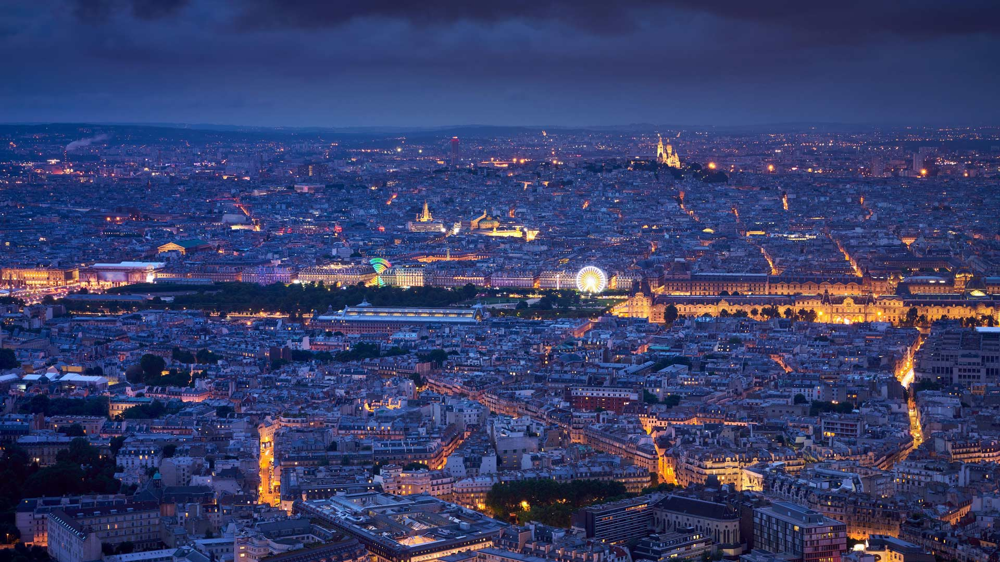

#### 20250606 Arromanches-les-Bains in Normandy, France (© Horia Merla/Getty Images)

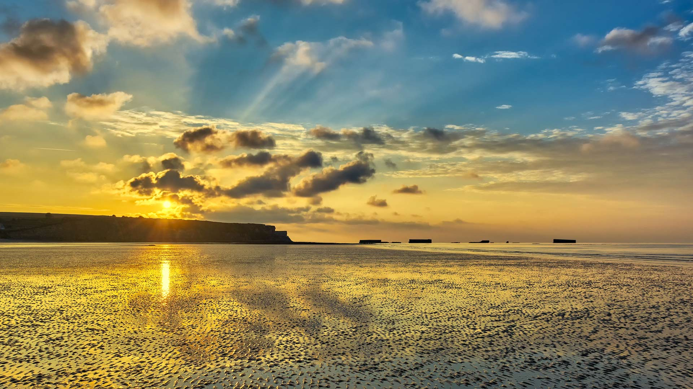

#### 20250606 Greater flamingos, Lüderitz, Namibia (© Karine Aigner/TANDEM Stills + Motion)

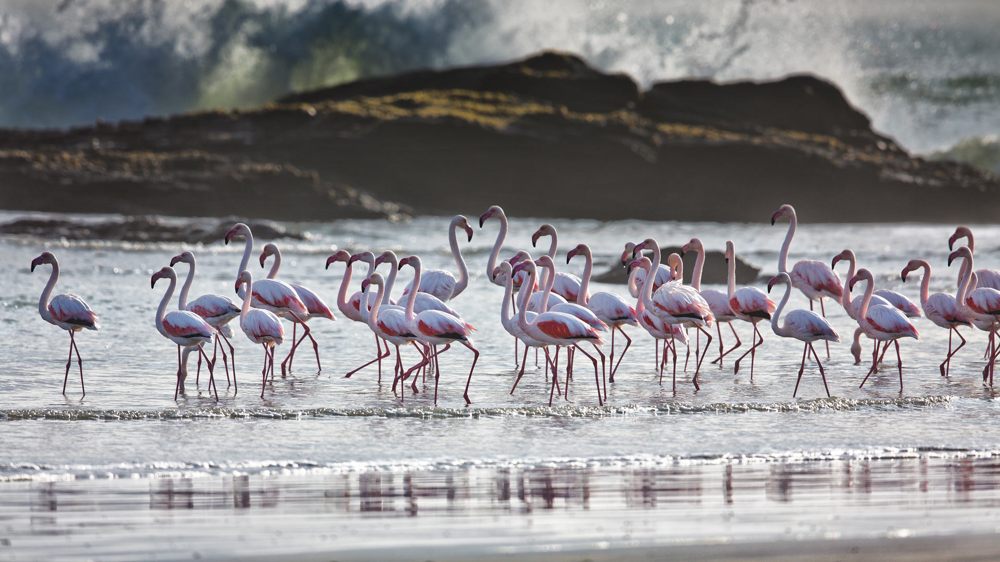

#### 20250606 Old City of Dubrovnik in Dalmatia, Croatia (© bluejayphoto/Getty Images)

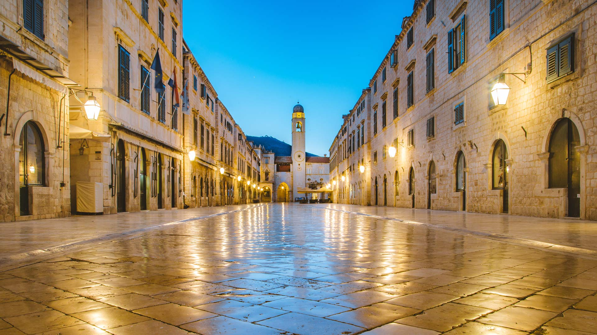

#### 20250605 Moritzburg Castle, Saxony, Germany (© Hans-Peter Szyszka/eStock Photo)

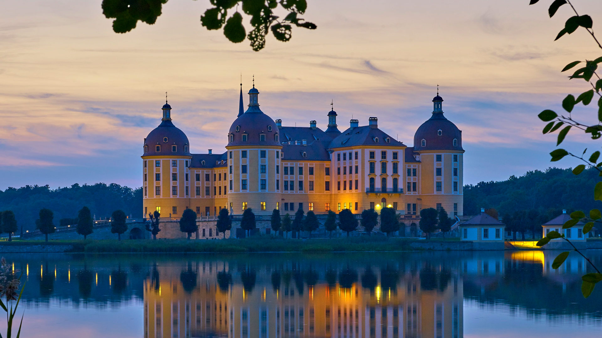

#### 20250605 Bottle-cap mural made by Oscar Olivares in Guatire, Venezuela (© FEDERICO PARRA/AFP via Getty Images)

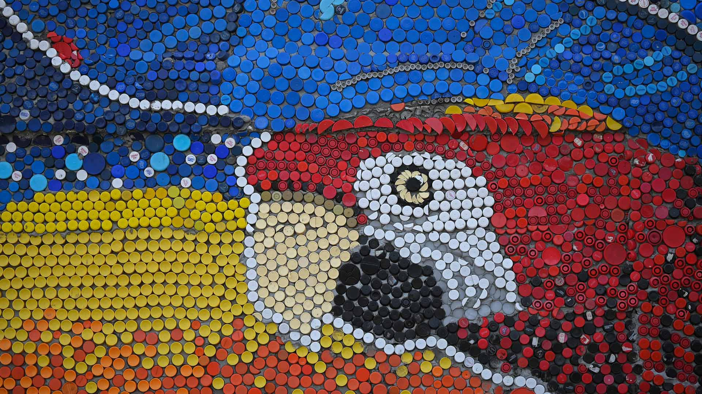

#### 20250605 福玛萨瀑布，迪亚曼蒂纳，巴西 (© Pulsar Images/Alamy)

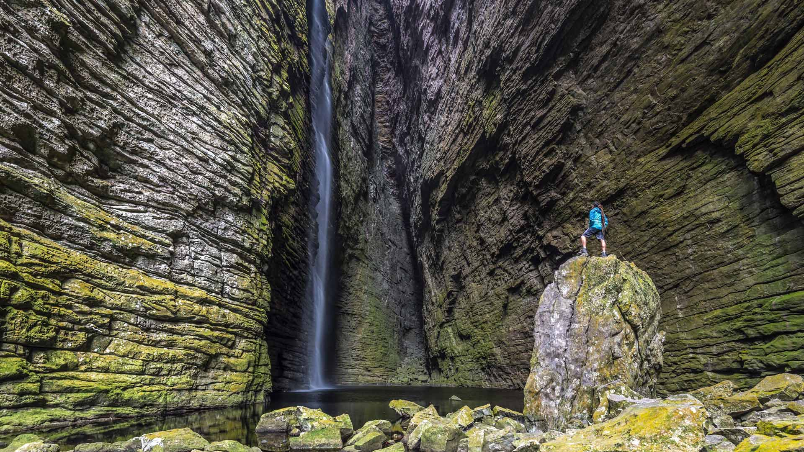

#### 20250604 The beach at Cala Luna, Sardinia, Italy (© guenterguni/Getty Images)

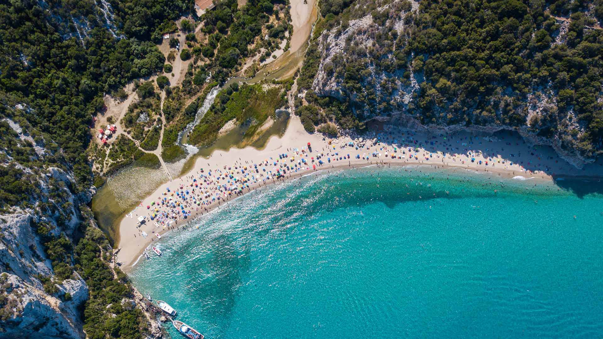

#### 20250603 Bicycles on a bridge in Utrecht, Netherlands (© George Pachantouris/Getty Images)

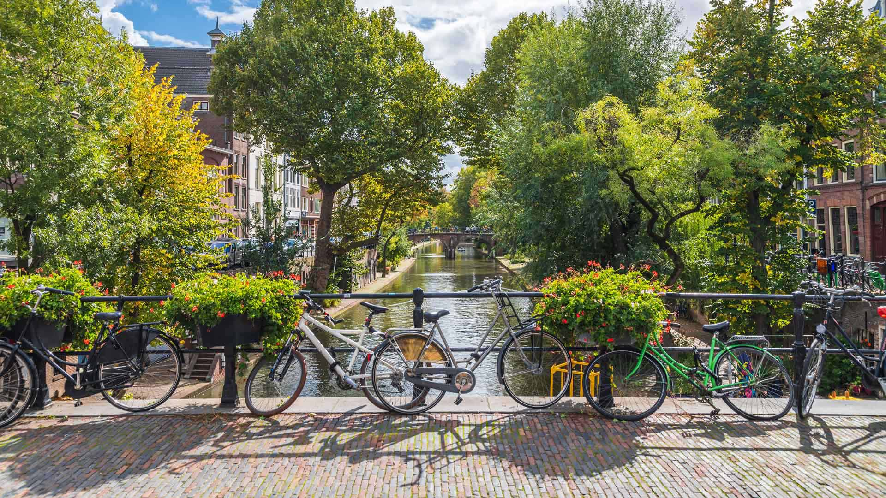

#### 20250602 みなとみらい 21 地区, 神奈川県 横浜市 (© Shingo Tamura/Getty Images)

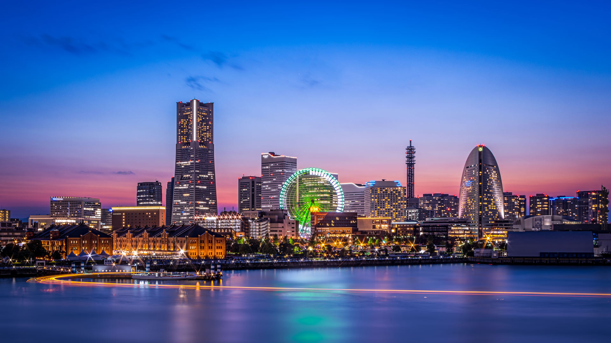

#### 20250602 Fogo Island, Newfoundland and Labrador (© Greg Johnston/Photodisc/Getty Images)

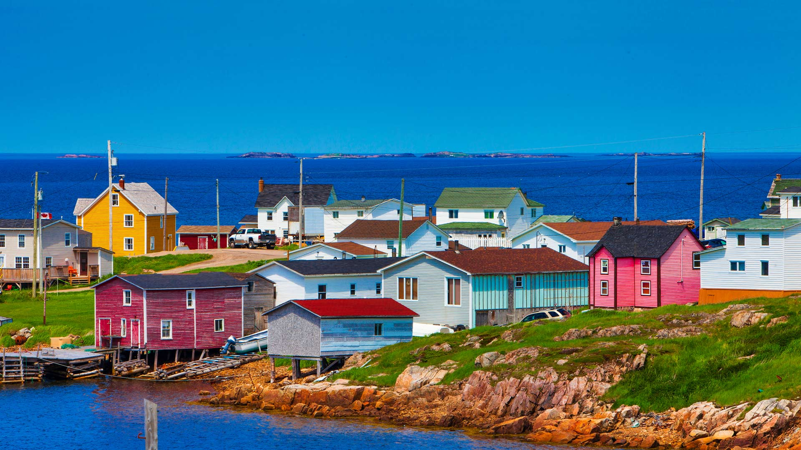

#### 20250602 Skipper butterfly on a coneflower, Rockefeller State Park Preserve, New York (© Marianne A. Campolongo/Alamy)

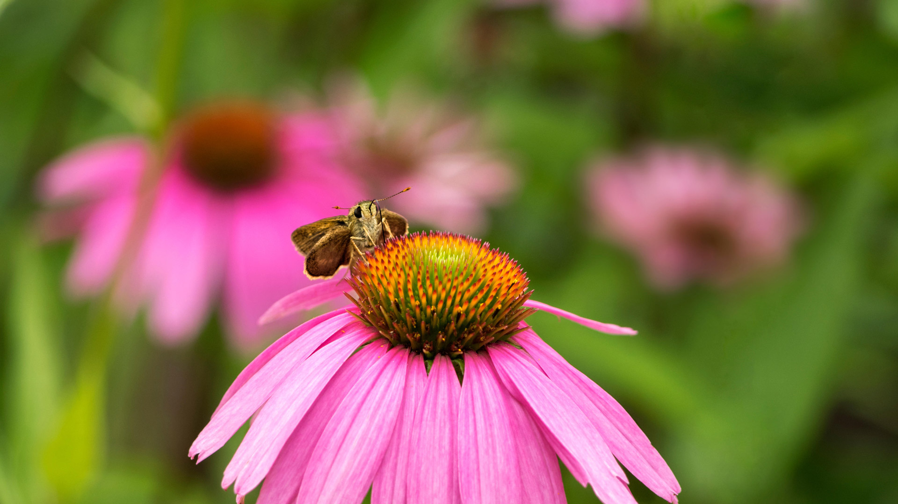

#### 20250602 Gänseküken auf einer Wiese im Ahnepark, Vellmar, Hessen (© Gerhard Hagen/Getty Images)

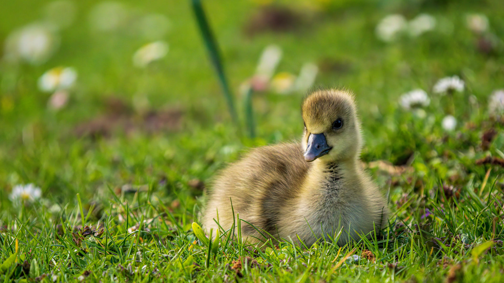

#### 20250602 Vue et reflets de Blois, Val de Loire (© boerescul/Getty Images)

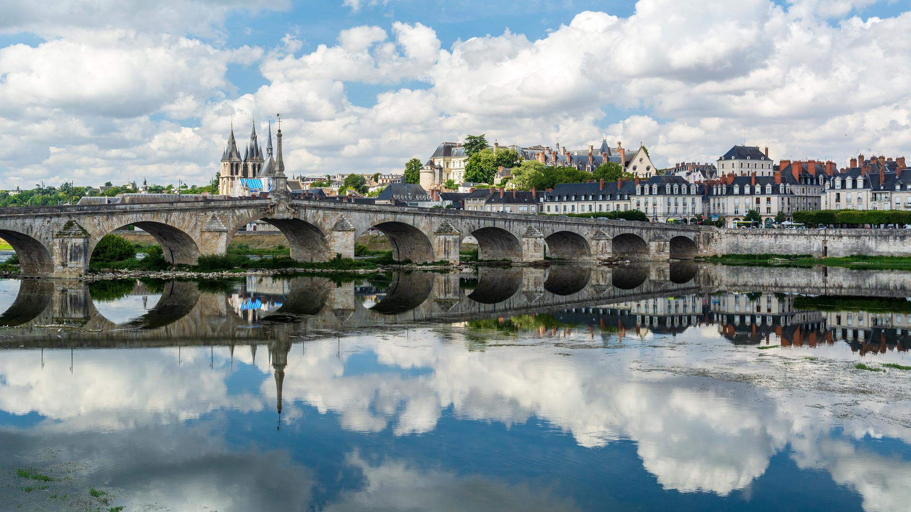

#### 20250601 Barrier reef off the island of Grande Terre in the French overseas territory of New Caledonia (© Karsten Wrobel/Getty Images)

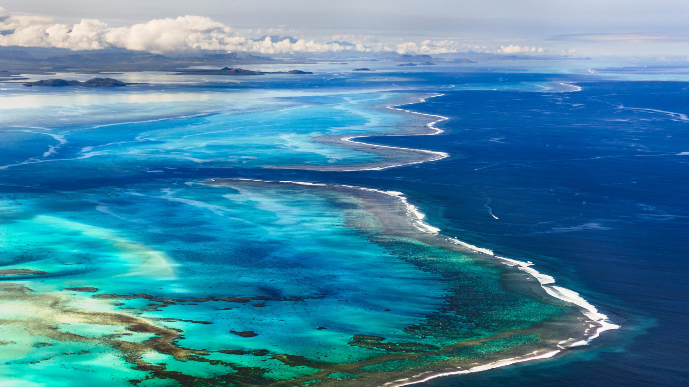

