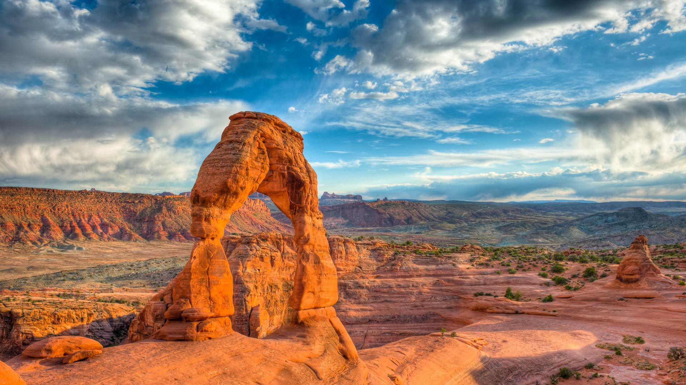
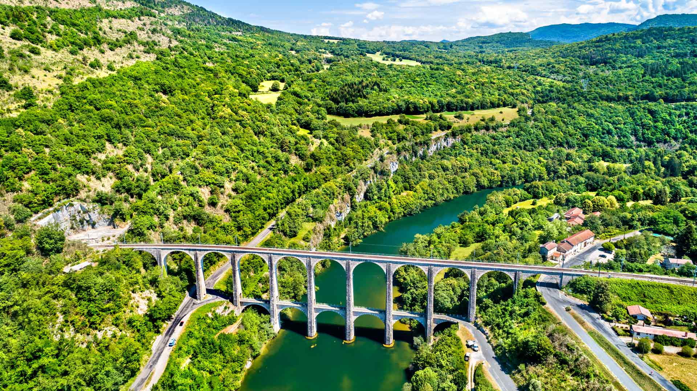
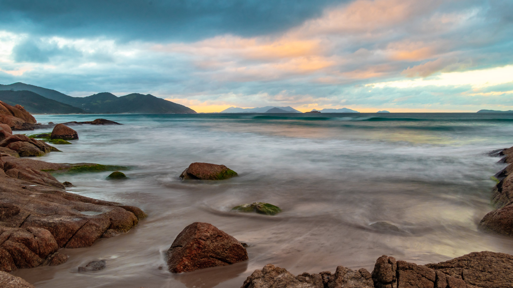
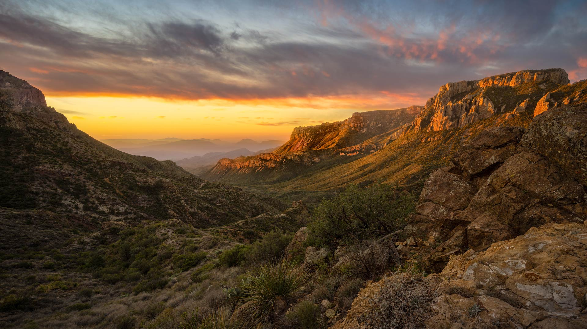

#### 20250630 Wolfe Creek Crater, Australia (© Abstract Aerial Art/Getty Images)

#### 20250629 Blue lagoon at Pulau Ay, Banda Islands, Indonesia (© fabio lamanna/Alamy)

#### 20250628 曼海姆水塔, 德国 (© no limit pictures/Getty Images)

#### 20250628 Rainbow flags at New York Pride (© Alan Schein/Getty Images)

#### 20250628 Neues Rathaus am Marienplatz, München (© Sven Hoppe/picture alliance/Getty Images)

#### 20250627 Knuthöjdsmossen自然保护区, 海勒福什市, 瑞典 (© Sven Halling/DEEPOL/plainpicture)

#### 20250627 Splendid leaf frog (© Jan Stria/Shutterstock)

#### 20250627 魚を狙うシロカツオドリ, スコットランド (© Richard Shucksmith/Minden Pictures)

#### 20250626 The Milky Way over Horse Head Rock, New South Wales, Australia (© Philip Thurston/Getty Images)

#### 20250625 St. Michael's Church Tower on Glastonbury Tor, Glastonbury, Somerset, England (© Gavin Hellier/Getty Images)

#### 20250624 Eibsee, Bayern (© NejauPhoto/Getty Images)

#### 20250624 Delicate Arch, Arches National Park, Utah (© mmac72/Getty Images)

#### 20250624 Viaduc de Cize-Bolozon enjambant la rivière d’Ain, Auvergne-Rhône-Alpes (© Leonid Andronov/Getty Images)

#### 20250623 The Elbe in Dresden, Germany (© Sean Pavone/Getty Images)

#### 20250622 Amazon rainforest, Ecuador (© Mark Fox/Getty Images)

#### 20250621 雾中莲花，中国佛山 (© huoguangliang/Getty Images)

#### 20250621 Littoral de la Côte d’Azur à Antibes (© StockByM/Getty Images)

#### 20250620 Masai giraffe mother grooming her calf in the Serengeti, Tanzania (© Alberto Cassani/Getty Images)

#### 20250620 Seljalandsfoss waterfall at sunset, Iceland (© Tom Mackie/AWL/plainpicture)

#### 20250619 圣卡塔琳娜州的海滩, 巴西 (© CaioCarvalhoPhotography/Getty Images)

#### 20250619 Texas State Capitol in Austin (© joe daniel price/Getty Images)

#### 20250619 Vila Franca Islet, São Miguel Island, Azores, Portugal (© ARoxo/Getty Images)

#### 20250619 ホタルが光る森, 岡山県 (© JGalione/Getty Images)

#### 20250618 Asian swallowtail butterfly on a red spider lily (© lzh/Getty Images)

#### 20250617 Maritime forest in Cumberland Island National Seashore, Georgia (© Chris Moore/TANDEM Stills + Motion)

#### 20250616 Sea turtle, Fernando de Noronha, Brazil (© João Vianna/Getty Images)

#### 20250615 Wasserturm, Mannheim, Baden-Württemberg (© no_limit_pictures/Getty Images)

#### 20250615 Lesser rhea adult male with chicks, Torres del Paine National Park, Patagonia, Chile (© Ignacio Yufera/Minden Pictures)

#### 20250614 日光東照宮, 栃木県 日光市 (© Pavel Nesvadba/shutterstock)

#### 20250614 Flag display at the US Capitol, Washington, DC (© kmiragaya/Adobe Stock)

#### 20250614 五塔峰，多洛米蒂山脉，科尔蒂纳丹佩佐，贝卢诺省，意大利威尼托大区 (© usabin/Getty Images)

#### 20250613 Vila Franca Islet, São Miguel Island, Azores, Portugal (© ARoxo/Getty Images)

#### 20250613 Montreal skyline reflecting in St. Lawrence River, Quebec (© Walter Bibikow/Stone/Getty Images)

#### 20250612 Chisos Mountains, Big Bend National Park, Texas (© Dean Fikar/Getty Images)

#### 20250611 あじさいの丘, 静岡県 賀茂郡 (© Tommy Tsutsui/Getty Images)

#### 20250610 Aerial view of Everglades National Park, Florida (© Robert DelVecchio - OcuDrone/Getty Images)

#### 20250609 Mühle im LWL-Freilichtmuseum Detmold, NRW (© ullstein bild/Getty Images)

#### 20250608 Steller sea lions, Vancouver Island, British Columbia, Canada (© Steve Woods Photography/Getty Images)

#### 20250607 Common pheasant, Normandy, France (© slowmotiongli/Getty Images)

#### 20250607 Summit of Pine Mountain, Angeles National Forest, California (© Matthew Kuhns/TANDEM Stills + Motion)

#### 20250607 Vue aérienne de Paris au crépuscule avec le Jardin des Tuileries, le Louvre et le Sacré-Cœur de Montmartre (© Francois Roux/Alamy Stock Photo)

#### 20250606 Arromanches-les-Bains in Normandy, France (© Horia Merla/Getty Images)

#### 20250606 Greater flamingos, Lüderitz, Namibia (© Karine Aigner/TANDEM Stills + Motion)

#### 20250606 Old City of Dubrovnik in Dalmatia, Croatia (© bluejayphoto/Getty Images)

#### 20250605 Moritzburg Castle, Saxony, Germany (© Hans-Peter Szyszka/eStock Photo)

#### 20250605 Bottle-cap mural made by Oscar Olivares in Guatire, Venezuela (© FEDERICO PARRA/AFP via Getty Images)

#### 20250605 福玛萨瀑布，迪亚曼蒂纳，巴西 (© Pulsar Images/Alamy)

#### 20250604 The beach at Cala Luna, Sardinia, Italy (© guenterguni/Getty Images)

#### 20250603 Bicycles on a bridge in Utrecht, Netherlands (© George Pachantouris/Getty Images)

#### 20250602 みなとみらい 21 地区, 神奈川県 横浜市 (© Shingo Tamura/Getty Images)

#### 20250602 Fogo Island, Newfoundland and Labrador (© Greg Johnston/Photodisc/Getty Images)

#### 20250602 Skipper butterfly on a coneflower, Rockefeller State Park Preserve, New York (© Marianne A. Campolongo/Alamy)

#### 20250602 Gänseküken auf einer Wiese im Ahnepark, Vellmar, Hessen (© Gerhard Hagen/Getty Images)

#### 20250602 Vue et reflets de Blois, Val de Loire (© boerescul/Getty Images)

#### 20250601 Barrier reef off the island of Grande Terre in the French overseas territory of New Caledonia (© Karsten Wrobel/Getty Images)

