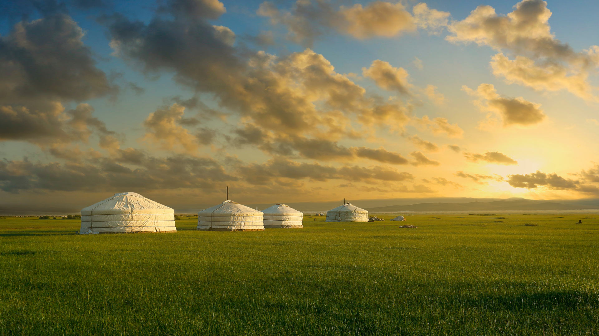
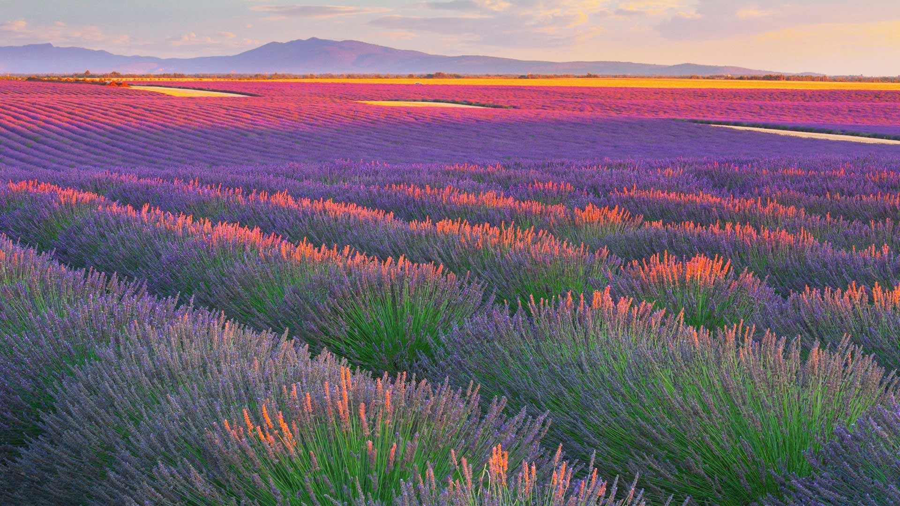
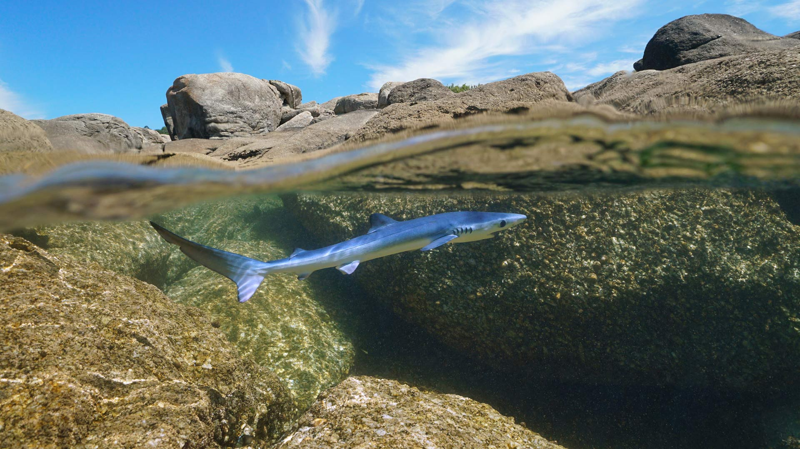
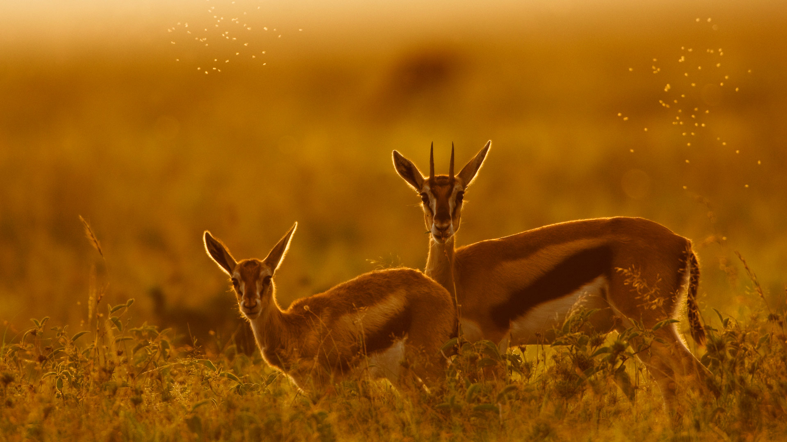
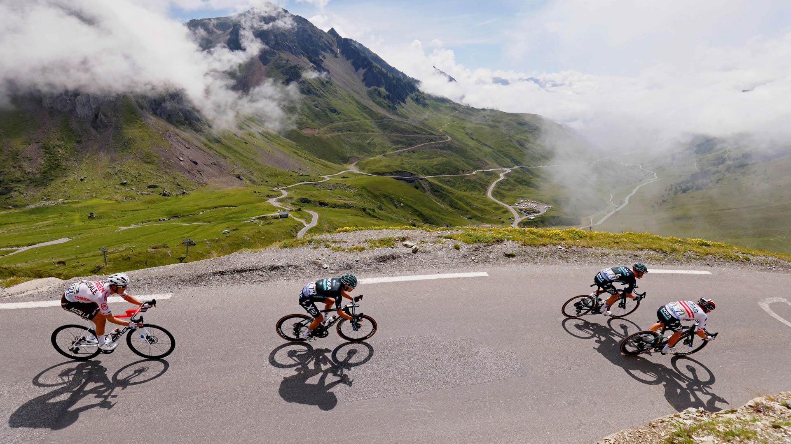

#### 20250731 Kalalau Beach on the Nā Pali Coast, Kauai, Hawaii (© Russ Bishop/DanitaDelimont.com)

#### 20250731 Ring-tailed lemur infant playing with its own tail, Madagascar (© Andy Rouse/Nature Picture Library)

#### 20250730 'Beyond Walls' land-art installation by Saype at Expo 2020 Dubai, United Arab Emirates (© VALENTIN FLAURAUD/EPA-EFE/Shutterstock)

#### 20250730 里瓦德塞利亚，阿斯图里亚斯，西班牙 (© Agnieszka Glowala/Getty Images)

#### 20250729 Female Bengal tiger, Kanha National Park, India (© Axel Gomille/Nature Picture Library)

#### 20250728 Yurts in the grasslands of Mongolia (© Michel Arnault/Shutterstock)

#### 20250727 Le peloton du Tour de France 2019, Arc de Triomphe du Tour de France, Paris (© Kiran Ridley/Getty Images)

#### 20250726 Mangrove trees at twilight, Walakiri Beach, island of Sumba, Indonesia (© Boonchet Ch./Getty Images)

#### 20250725 Aerial view of colorful houses, Las Palmas de Gran Canaria, Spain (© Marco Bottigelli/Getty Images)

#### 20250725 School of blackfin barracuda, Shark Reef, Ras Mohammed National Park, Sinai Peninsula, Egypt (© Alex Mustard/Nature Picture Library)

#### 20250724 Innenansicht des Bayreuther Festspielhauses, Bayreuth, Bayern (© Bruce Yuanyue Bi/Getty Images)

#### 20250724 Family of ashy woodswallows perched on a branch in Thailand (© Captain Skyhigh/Getty Images)

#### 20250723 提灯の灯りに照らされた南観音山, 京都市 (© Route16/Adobe Stock)

#### 20250722 夏季的赛里木湖，博尔塔拉蒙古自治州博乐县, 中国新疆维吾尔自治区 (© Feng Wei Photography/Getty Images)

#### 20250722 Sunset over Badlands National Park, South Dakota (© Petr Bednarik/Danita Delimont/Alamy)

#### 20250721 青い海に浮かぶ種子島の無人島, 鹿児島県 (© Ippei Naoi/Getty Images)

#### 20250721 Staghorn coral off the island of Bonaire, Caribbean Netherlands (© blue-sea.cz/Shutterstock)

#### 20250720 The moon's surface photographed through a telescope (© Sergey Kuznetsov/Getty Images)

#### 20250719 幽鹤国家公园的伯吉斯山和翡翠湖, 不列颠哥伦比亚省, 加拿大 (© Feng Wei Photography/Getty Images)

#### 20250719 Vatican City with St. Peter's Basilica (© RudyBalasko/Getty Images)

#### 20250719 Jackson's Point Lighthouse on Lake Simcoe, Ontario (© AWSeebaran/E+/Getty Images)

#### 20250719 Saumur et son château au crépuscule, Vallée de la Loire (© Hiroshi Higuchi/Getty Images)

#### 20250719 Luna moth resting on cedar elm, New Braunfels, Texas, USA (© Rolf Nussbaumer/Nature Picture Library)

#### 20250719 Eucalyptus forest, Urubici, Santa Catarina, Brazil (© YES BRASIL/Getty Images)

#### 20250718 Jeune requin bleu nageant au large des côtes de Galice, Espagne (© Damocean/Getty Images)

#### 20250718 Orosei, Sardinia, Italy (© EyeEm Mobile GmbH/Getty Images)

#### 20250718 Miravet am Fluss Ebro, Tarragona, Katalonien, Spanien (© Eloi_Omella/Getty Images)

#### 20250718 塞里雅兰瀑布日落美景，冰岛 (© Tom Mackie/AWL/plainpicture)

#### 20250718 Beach at sunrise, Gulf Islands National Seashore, Florida (© Tim Fitzharris/Minden Pictures)

#### 20250718 ドロミーティのチンクェトッリ, イタリア (© usabin/Getty Images)

#### 20250717 Blühender Lavendel und Leuchtturm Westerheversand in Westerhever, Nordfriesland, Schleswig-Holstein (© Sven-Erik Arndt/Arterra/Universal Images Group/Getty Images)

#### 20250717 Lavender fields in Plateau de Valensole, France (© zpagistock/Getty Images)

#### 20250716 Temple of Philae (aka Temple of Isis), Aswan, Egypt (© Ratnakorn Piyasirisorost/Getty Images)

#### 20250715 Perseid meteor shower and an ancient bristlecone pine, Great Basin National Park, Nevada (© Wirestock Creators/Shutterstock)

#### 20250714 Young blue shark swimming off the coast of Galicia, Spain (© Damocean/Getty Images)

#### 20250714 Feu d'artifice du 14 juillet au-dessus de la citadelle de Sisteron au crépuscule, Provence (© francois-roux/Getty Images)

#### 20250713 Basalt columns at Kálfshamarsvík, Skagi Peninsula, Iceland (© Arterra Picture Library/Alamy)

#### 20250712 Thomson's gazelle mother and fawn, Maasai Mara, Kenya (© Gallo Images/DanitaDelimont.com)

#### 20250711 Tokyo at sunrise (© pongnathee kluaythong/Getty Images)

#### 20250710 Turquoise waters of the Bahamas (© BlueOrange Studio/Adobe Stock)

#### 20250709 Constitución railway station, Buenos Aires, Argentina (© Grafissimo/Getty Images)

#### 20250708 パッチワークの路, 北海道 美瑛町 (© DoctorEgg/Getty Images)

#### 20250708 Vue aérienne de la Baie d'Authie, Somme, Haut-de-France (© Tuul & Bruno Morandi/Getty Images)

#### 20250707 鴨川河川敷に灯る風鈴灯, 京都市 (© Kaoru Hayashi/Getty Images)

#### 20250707 Northern gannets diving for fish, Shetland Islands, Scotland (© Richard Shucksmith/Minden Pictures)

#### 20250706 Mesquite Flat Sand Dunes in Death Valley National Park, California (© Bryan Jolley/TANDEM Stills + Motion)

#### 20250705 Descending the Col du Tourmalet in the French Pyrenees during the 2021 Tour de France (© THOMAS SAMSON/AFP via Getty Images)

#### 20250705 Cize-Bolozon viaduct crossing the Ain gorge, France (© Leonid Andronov/Getty Images)

#### 20250704 Seceda, a peak in the Dolomites, South Tyrol, Italy (© Kalyakan/Adobe Stock)

#### 20250704 Fourth of July fireworks over Lake Union in Seattle (© Dixin Yan)

#### 20250704 奥罗塞，撒丁岛，意大利 (© EyeEm Mobile GmbH/Getty Images)

#### 20250704 Skipper butterfly on an Echinacea flower, Rockefeller State Park, New York (© Marianne A. Campolongo/Alamy)

#### 20250703 Rainbow River in Rainbow Springs State Park, Florida (© Michel Roggo/Minden Pictures)

#### 20250702 Spine-cheeked anemonefish surrounded by bubble-tip anemone, Milne Bay, Papua New Guinea (© Fred Bavendam/Nature Picture Library)

#### 20250702 Historische Fachwerkhäuser am Marktplatz, Calw, Baden-Württemberg (© imageBROKER/Getty Images)

#### 20250701 Parliament Hill in Ottawa, Ontario (© f11photo/Shutterstock)

#### 20250701 Fishing village of Tilting, Fogo Island, Newfoundland and Labrador, Canada (© FedevPhoto/Getty Images)

#### 20250701 Papillon et abeille butinant délicatement une fleur aster (© Viviane Caballero/500px Viviane Caballero/500px/Getty Images)

