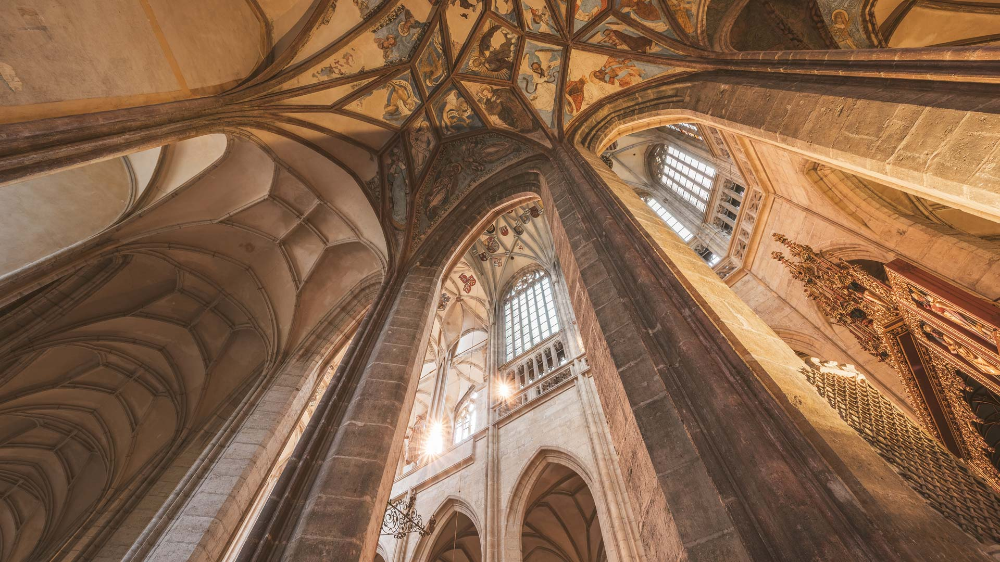
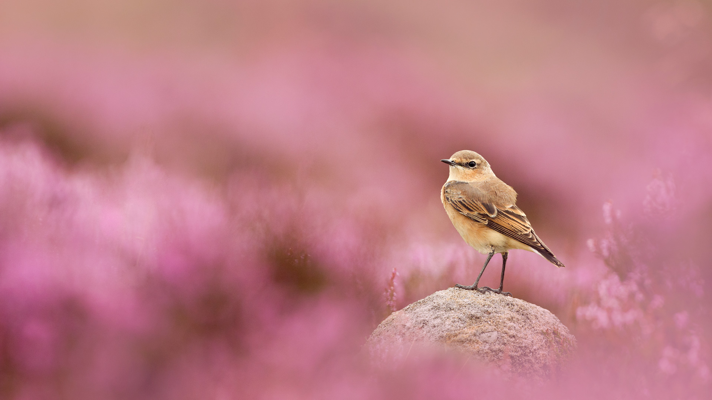
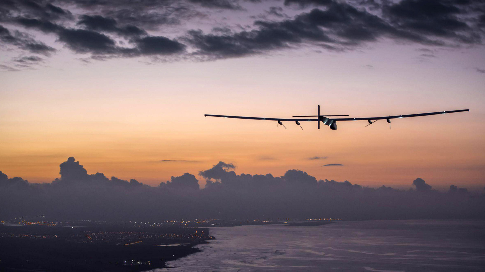
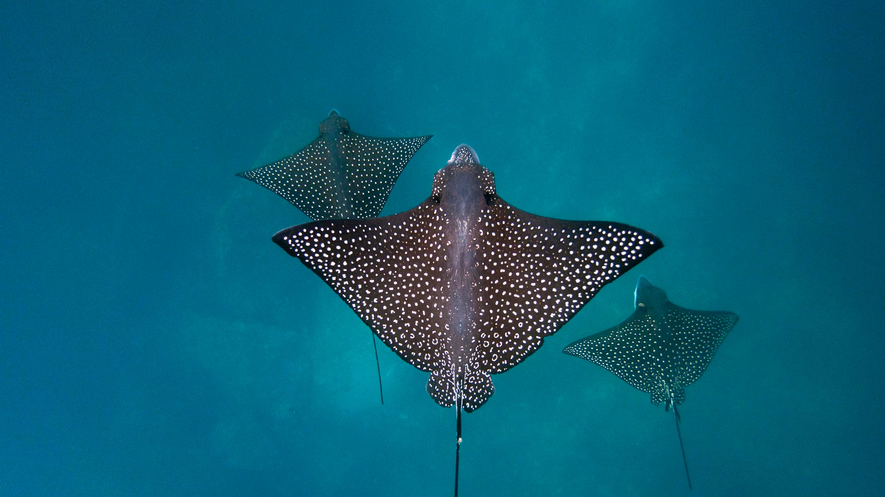
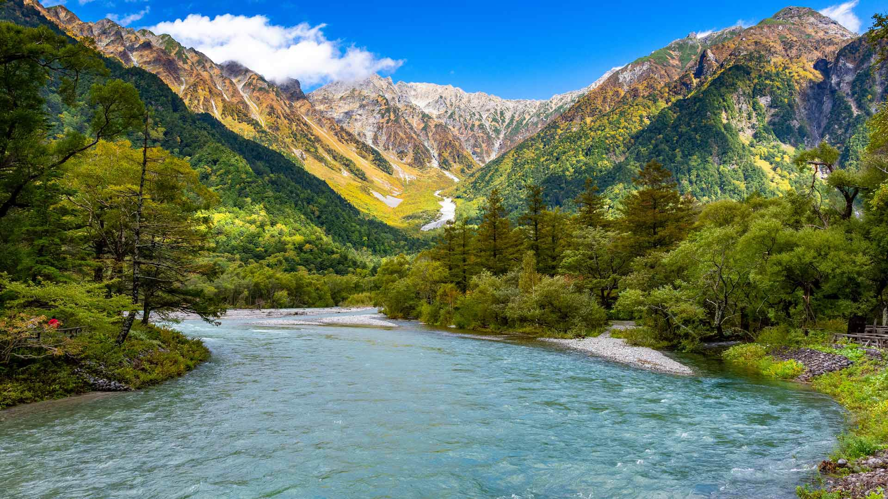
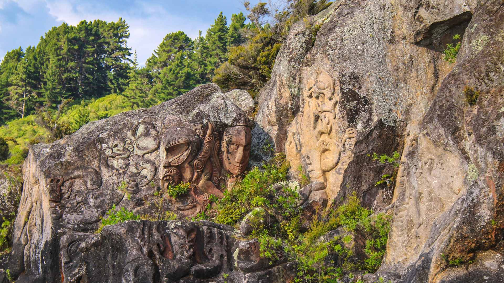
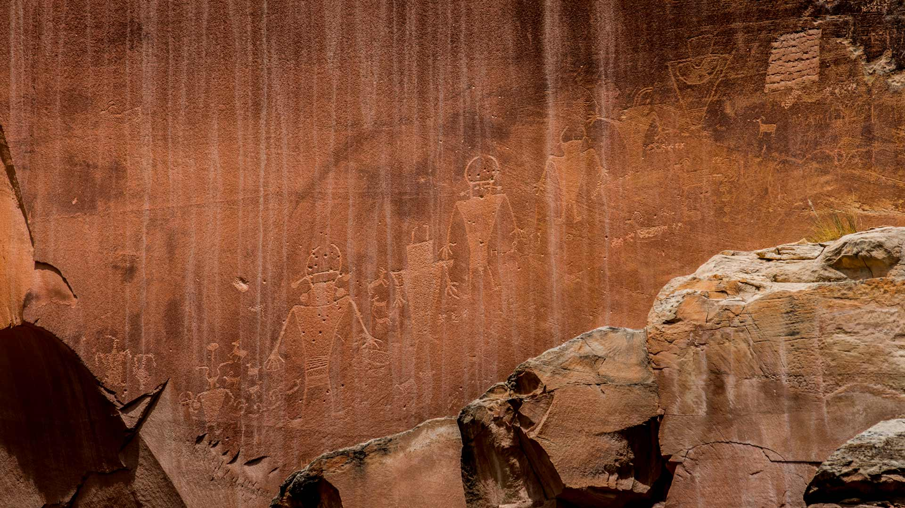

#### 20250831 Scotts Bluff National Monument in Gering, Nebraska (© Hawk Buckman/Getty Images)

#### 20250830 全国花火競技大会, 秋田県, 大仙市 (© Toru Hanai/寄稿者/Getty Images)

#### 20250830 Whale shark off the coast of Alifu Dhaalu Atoll, Maldives (© Bachir Moukarzel/Amazing Aerial Agency)

#### 20250829 Aerial view of Plaza Mayor, Madrid, Spain (© AirPano LLC/Amazing Aerial Agency)

#### 20250828 Great white egret, Hungary (© Markus Varesvuo/Nature Picture Library)

#### 20250827 Sørvágsvatn lake, island of Vágar, Faroe Islands, Denmark (© Anton Petrus/Getty Images)

#### 20250826 Trullo buildings in Alberobello, Apulia, Italy (© Feng Wei Photography/Getty Images)

#### 20250826 Silhouette eines springenden Kitesurfers bei Sonnenuntergang im baltischen Meer (© Jens Breuer/Getty Images)

#### 20250825 Calcite Springs Overlook and Yellowstone River, Yellowstone National Park, Wyoming (© Rebecca L. Latson/Getty Images)

#### 20250825 Colony of northern gannets, Quebec (© Vladone/Getty Images)

#### 20250824 Greater flamingos, Saintes-Maries-de-la-Mer, Camargue Regional Nature Park, France (© Raimund Linke/Getty Images)

#### 20250824 European fallow deer, England (© Enrique Aguirre Aves/Getty Images)

#### 20250823 St. Barbara's Cathedral, Kutná Hora, Czechia (© Castka/Getty Images)

#### 20250823 早朝に開花する美しいアサガオ (© borchee/Getty Images)

#### 20250823 秋季九寨沟国家公园里的诺日朗瀑布, 四川省, 中国 (© tawatchaiprakobkit/Getty images)

#### 20250822 Domaine national de Saint-Cloud, Grande Cascade, Île de France (© GUIZIOU Franck/hemis.fr)

#### 20250822 Rolling hills of the Palouse, Washington (© svetlana57/Getty Images)

#### 20250822 Ansicht eines landwirtschaftlichen Feldes, Kaiserstuhl, Baden-Württemberg (© EyeEM Mobile GmbH/Getty Images)

#### 20250821 Wheatear and flowering heather, Peak District National Park, England (© Ben Hall/Nature Picture Library)

#### 20250820 The citadel in Bonifacio, Southern Corsica, France (© Marc Dozier/Getty Images)

#### 20250819 Aerial view of Vancouver Island, British Columbia (© edb3_16/Getty Images)

#### 20250819 Solar Impulse 2 at Kalaeloa Airport, Honolulu, Hawaii (© Solar Impulse/Revillard/Sipa/Shutterstock)

#### 20250819 サンタ・マッダレーナ, イタリア (© Sakrapee Nopparat/Getty Images)

#### 20250819 祖马亚的复理层，巴斯克地区，西班牙 (© Eloi_Omella/Getty Images)

#### 20250818 Wanderer bei Sonnenaufgang auf einem Bergkamm, Nationalpark Gesäuse, Steiermark, Österreich (© AscentXmedia/Getty Images)

#### 20250818 Ruches colorées, Italie (© Roberto Caucino/Shutterstock)

#### 20250818 Avalanche Lake Trail at Adirondack High Peaks, New York (© Posnov/Getty Images)

#### 20250817 Lyngvig Lighthouse, Hvide Sande, Denmark (© Caroline Brundle Bugge/Getty Images)

#### 20250816 大の字の中心・金尾の火床, 京都府 京都市 (© kumikomini/Getty Images)

#### 20250816 Cerfs-volants dans le ciel de Fréjus, Var, Provence-Alpes-Côte d’Azur (© ICHAUVEL/Getty Images)

#### 20250816 Colorful beehives in Italy (© Roberto Caucino/Shutterstock)

#### 20250815 Spotted eagle rays, San Cristóbal Island, Galápagos Islands, Ecuador (© Tui De Roy/Minden Pictures)

#### 20250815 The Orbitor ride at the Canadian National Exhibition, Toronto (© James Hackland/Alamy Stock Photo)

#### 20250814 Cable car station on Piz Nair mountain, Graubünden, Switzerland (© Roberto Moiola/Alamy)

#### 20250813 Flamant rose, Saintes-Maries-de-la-Mer, Parc naturel régional de Camargue, Languedoc-Roussillon (© Raimund Linke/Getty Images)

#### 20250813 A man rappels off Corona Arch near Moab, Utah (© Grant Ordelheide/TANDEM Stills + Motion)

#### 20250812 African elephant herd, Amboseli National Park, Kenya (© Chase Dekker/Minden Pictures)

#### 20250811 Village of Santa Maddalena, Dolomites, Italy (© Sakrapee Nopparat/Getty Images)

#### 20250811 中部山岳国立公園の上高地, 長野県 松本市 (© Poca Wander/Getty Images)

#### 20250810 Letters Square Roundabout, Manaus, Brazil (© Cristian Lourenço/Getty Images)

#### 20250810 Lioness in Maasai Mara National Reserve, Kenya (© Tandem Stock/Adobe Stock)

#### 20250809 Feuerwerk Rhein in Flammen, Spay/Koblenz, Rheinland-Pfalz (© EKH-Pictures/Getty Images)

#### 20250809 Ngātoroirangi Mine Bay Māori Rock Carvings on Lake Taupō, New Zealand (© Joppi/Getty Images)

#### 20250808 Three Musketeers Falls at Iguazú Falls, Argentina (© Mark Meredith/Getty Images)

#### 20250807 Monoliths of the Mingan Archipelago, Quebec (© David Boutin Photography/Getty Images)

#### 20250807 Gasparilla Island Rear Range Light, Boca Grande, Florida (© Wiltser/Getty Images)

#### 20250807 Ring-tailed lemur infant playing with its own tail, Madagascar (© Andy Rouse/Nature Picture Library)

#### 20250806 Kalalau Beach on the Nā Pali Coast, Kauai, Hawaii (© Russ Bishop/DanitaDelimont.com)

#### 20250806 平和のピースキャンドル, 長崎県 長崎市 (© NurPhoto/寄稿者/Getty Images)

#### 20250805 Mohnfelder, Adelschlag, Bayern (© Michael Rucker/Getty Images)

#### 20250805 Tide pools in La Jolla, California (© Andrew Shoemaker/DanitaDelimont.com)

#### 20250804 Great gray owls in their nest, Finland (© imageBROKER.com/Alamy)

#### 20250803 優美な扇ねぷた, 青森県 弘前市 (© John S Lander/寄稿者/Getty Images)

#### 20250803 Sunflowers in a field in summer (© Arsgera/Shutterstock)

#### 20250802 Herrenhäuser und Gärten am Abend, Hannover, Niedersachsen (© Westend61/Getty Images)

#### 20250802 Petroglyphs near Fruita in Capitol Reef National Park, Utah (© Nicolas VINCENT/Adobe Stock)

#### 20250801 Costumes folkloriques bretons, Lorient, Finistère (© guy-ozenne/Getty images)

#### 20250801 Royal Mile, Edinburgh, Scotland (© MEDITERRANEAN/Getty Images)

