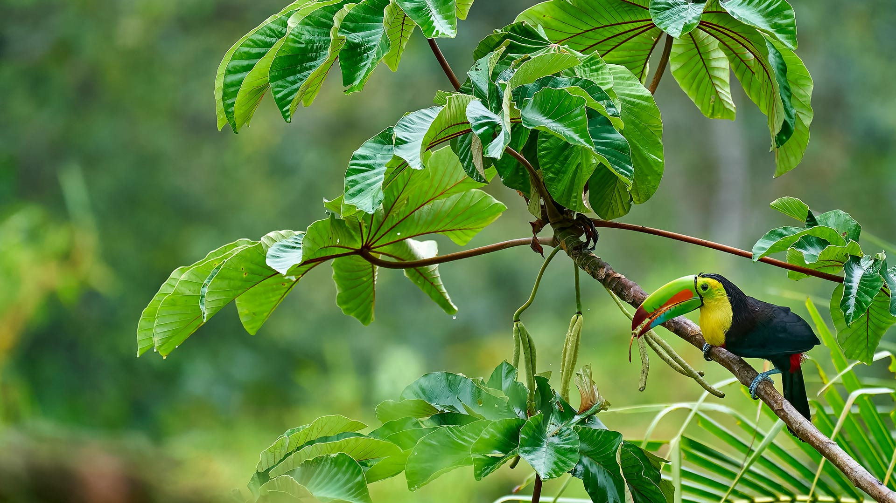
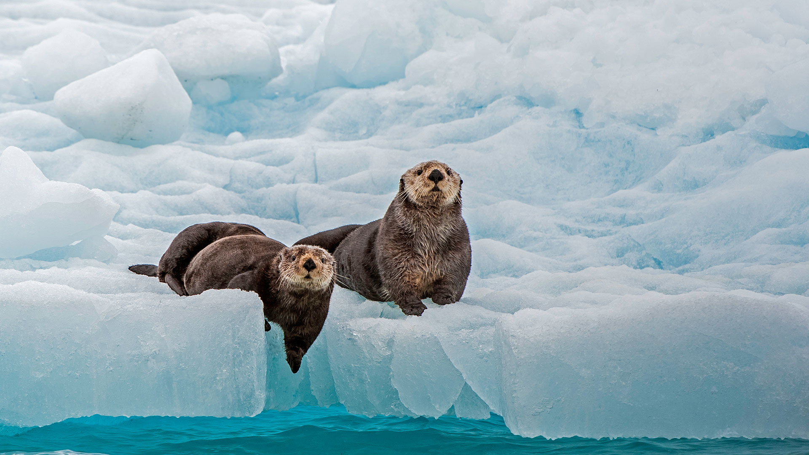
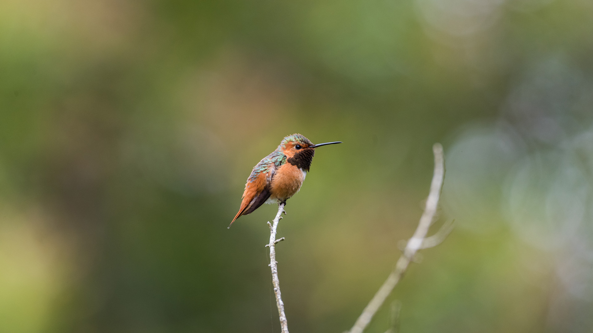
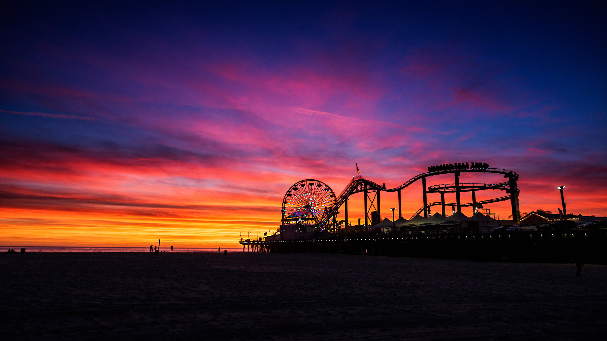
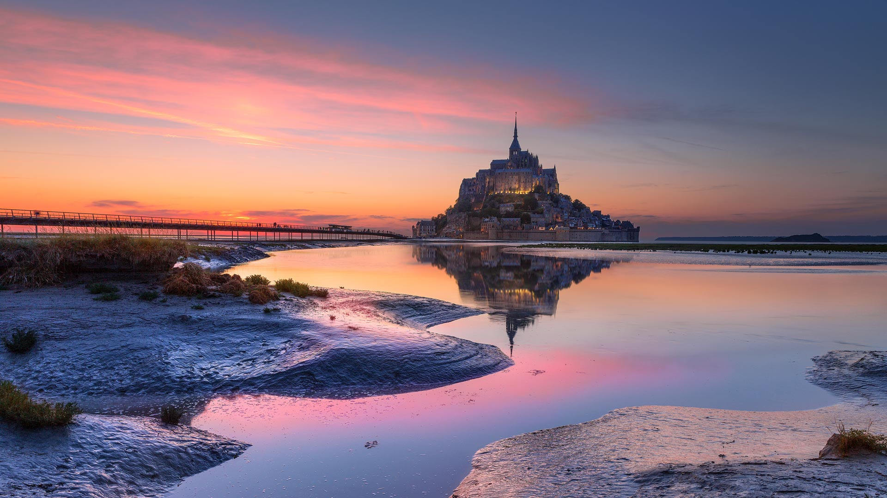
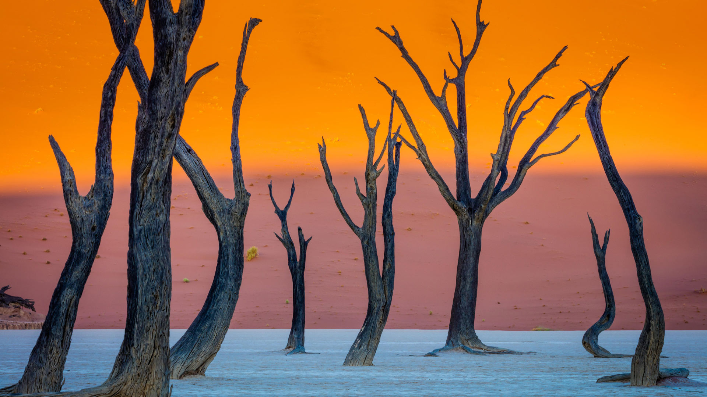

#### 20250930 Koala in a eucalyptus tree, Great Otway National Park, Australia (© Jamie Lamb - elusive-images.co.uk/Getty Images)

#### 20250929 豪徳寺の招き猫, 東京都 (© Maria S./Alamy Stock Photo)

#### 20250929 The Rainbow Houses of Houten, Netherlands (© George Pachantouris/Getty Images)

#### 20250928 Town of Pienza in Tuscany, Italy (© zpagistock/Getty Images)

#### 20250927 Tank Lakes, Alpine Lakes Wilderness, Washington (© Austin Trigg/TANDEM Stills + Motion)

#### 20250927 Red maple in fall, Canada (© LiuSol/Getty Images)

#### 20250927 Herbstliche Farben in Berlin (© Sergio Saavedra Ruiz/Getty Images)

#### 20250926 Least chipmunk, Kootenai National Forest, Montana (© Donald M. Jones/Minden Pictures)

#### 20250925 Chittorgarh Fort, Rajasthan, India (© chetansoni/Shutterstock)

#### 20250924 Devils Tower National Monument, Wyoming (© Laura Hedien/Getty Images)

#### 20250923 航拍中国江苏省常州翠竹公园 (© Xu Changyu/Getty images)

#### 20250923 秋の七草 ハギ (© kororokerokero/Getty Images)

#### 20250922 Keel-billed toucan in Costa Rica (© Juan Carlos Vindas/Getty Images)

#### 20250922 Aspen trees during fall, Fishlake National Forest, Utah (© Danita Delimont/Getty Images)

#### 20250921 Sea otters, Prince William Sound, Alaska (© Gerald Corsi/Getty Images)

#### 20250921 L’aiguille et la Porte d’Aval, falaises d’Étretat, Normandie (© Luis Henrique Boucault/Getty Images)

#### 20250920 Swing carousel at Oktoberfest, Munich, Germany (© LOOK-foto/Alamy)

#### 20250920 Hacker-Festzelt auf dem Oktoberfest, München, Bayern (© Westend61/Getty Images Plus)

#### 20250919 Thousand Islands region, St. Lawrence River, US-Canada border (© benedek/Getty Images)

#### 20250919 Vue aérienne du circuit Paul Ricard, Le Castellet (© Sami Sarkis/Getty Images)

#### 20250918 Serpentine stairs of Dunquin Pier, County Kerry, Ireland (© Hugh O'Connor/Getty Images)

#### 20250917 Young bull moose in Denali National Park, Alaska (© Grant Ordelheide/TANDEM Stills + Motion)

#### 20250916 Nighttime view of the Gulf Coast states from 225 miles above Earth (© Stocktrek Images/Getty Images)

#### 20250915 黑翅长脚鹬, 法国 (© Antonio Sementa/500px/Getty Images)

#### 20250915 Latino Cultural Center designed by Ricardo Legorreta, Dallas, Texas (© Ken Hurst/Alamy)

#### 20250915 Coastline at Cape Breton Highlands National Park, Nova Scotia (© Tiago_Fernandez/Getty Images)

#### 20250915 アメリカワシミミズク (© Scott Suriano/Getty Images)

#### 20250914 A waterfall in Olympic National Park, Washington (© Chris Moore/TANDEM Stills + Motion)

#### 20250914 Orangerie Gera, Thüringen (© luchschenF/Shutterstock)

#### 20250913 Chimney Rock, Point Reyes National Seashore, California (© Enrique Aguirre Aves/Getty Images)

#### 20250912 Spinner dolphin pod in the Red Sea, Marsa Alam, Egypt (© Franco Banfi/Nature Picture Library)

#### 20250912 種子島宇宙センター, 鹿児島県 (© norinori303/Adobe Stock)

#### 20250911 Statue of Liberty and Lower Manhattan, New York City (© Tetra Images/Getty Images)

#### 20250911 蒙弗拉圭国家公园塔霍河畔的猎鹰岩，西班牙 (© Daniel Viñé Garcia/Getty Images)

#### 20250910 Hay bales, North Yorkshire, England (© Nick Brundle Photography/Getty Images)

#### 20250909 A female Eurasian red squirrel carrying moss, Switzerland (© Jean-Luc and Francoise Ziegler/Minden Pictures)

#### 20250908 Library@orchard, Singapore (© Darwin Fan/Getty Images)

#### 20250907 Gdańsk on the banks of the Motława, Poland (© Oscar Dominguez/TANDEM Stills + Motion)

#### 20250906 Rufous hummingbird, Golden Gate Park, San Francisco, California (© jeremyborkat/Getty Images)

#### 20250906 Le beffroi de la Chambre de Commerce, Lille, Hauts-de-France (© Wirestock/Getty Images)

#### 20250906 Frankfurter Skyline im violetten Licht und Alte Brücke, Frankfurt am Main, Hessen (© diegograndi/iStock/Getty Images Plus)

#### 20250905 Pacific Park at Santa Monica State Beach, California (© EXTREME-PHOTOGRAPHER/Getty Images)

#### 20250904 ヨーホー国立公園, カナダ (© Feng Wei Photography/Getty Images)

#### 20250904 CN Tower illuminated at night in Toronto, Ontario (© R.M. Nunes/Shutterstock)

#### 20250903 Grizzly bears wrestling, Katmai National Park and Preserve, Alaska (© Cavan Images/Adobe Stock)

#### 20250903 Abbaye du Mont Saint-Michel au crépuscule, Manche, Normandie (© Ilhan Eroglu/500px/Getty Images)

#### 20250902 Kaiserstuhl, Baden-Württemberg, Germany (© EyeEM Mobile GmbH/Getty Images)

#### 20250902 Camel thorn trees, Deadvlei, Namib-Naukluft Park, Namibia (© Inge Johnsson/Alamy)

#### 20250901 Calcite Springs Overlook and Yellowstone River, Yellowstone National Park, Wyoming (© Rebecca L. Latson/Getty Images)

#### 20250901 Trulli in Alberobello, Apulien, Italien (© Feng Wei Photography/Getty Images)

#### 20250901 聖バルボラ教会, チェコ共和国 (© Castka/Getty Images)

#### 20250901 Boundary Waters Canoe Area Wilderness, Minnesota (© s.tomas/Shutterstock)

#### 20250901 Amalgamated Clothing Workers of America in a Labor Day parade, May 1915, Chicago (© Chicago Sun-Times/Chicago Daily News collection/Chicago History Museum/Getty Images)

