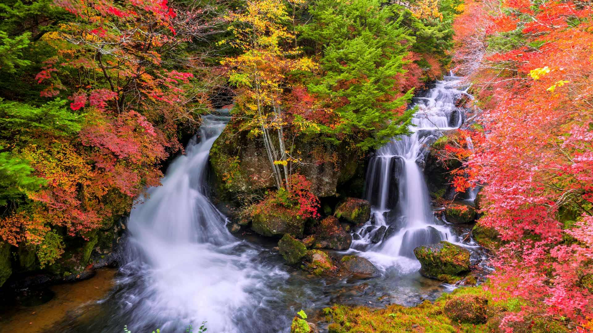
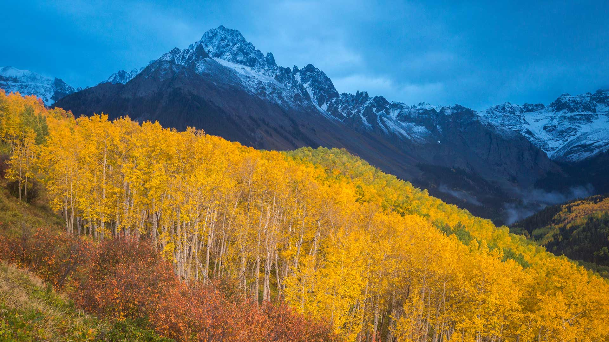
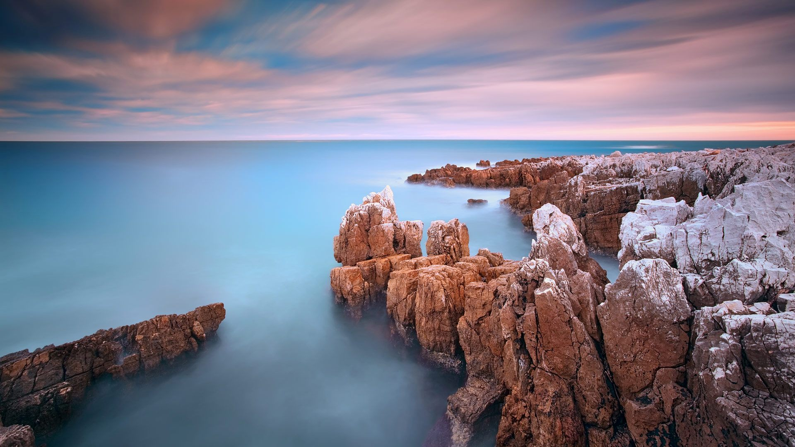
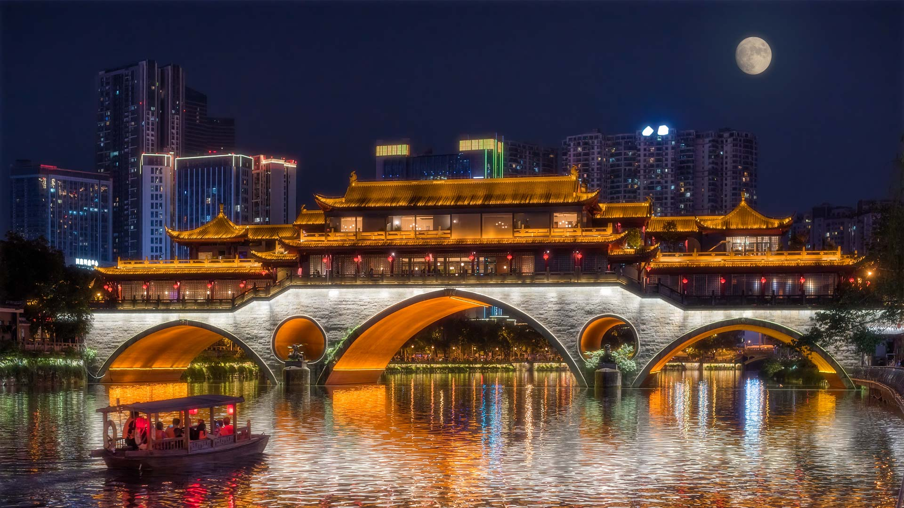
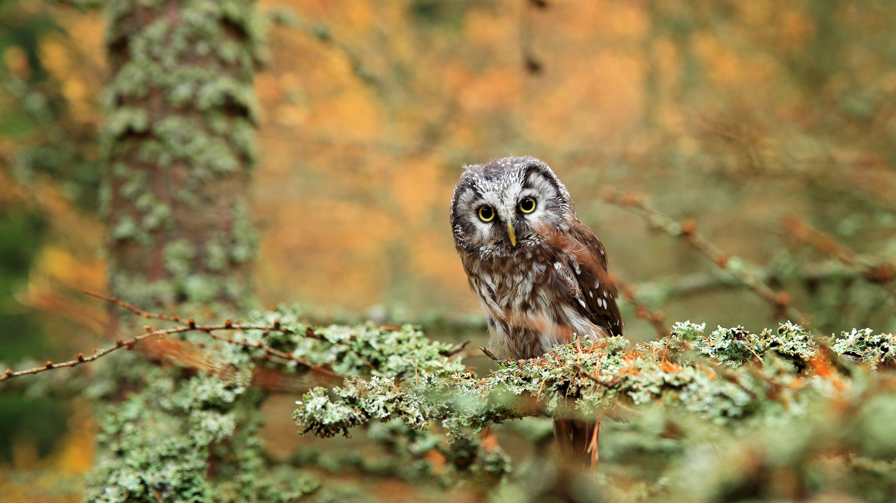
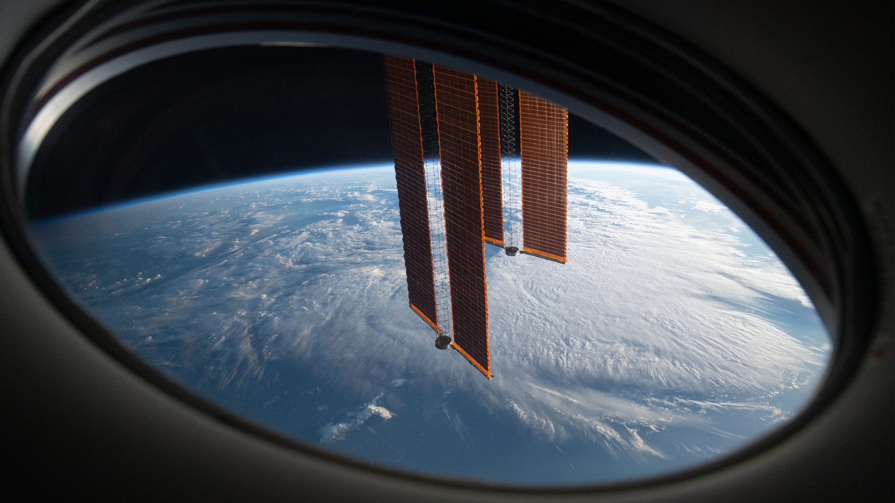
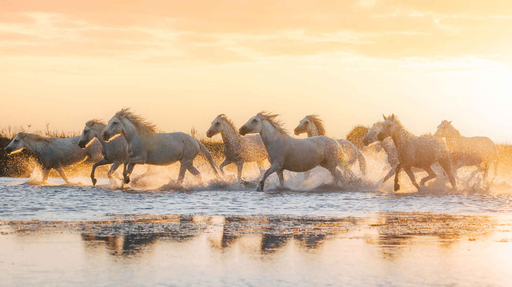
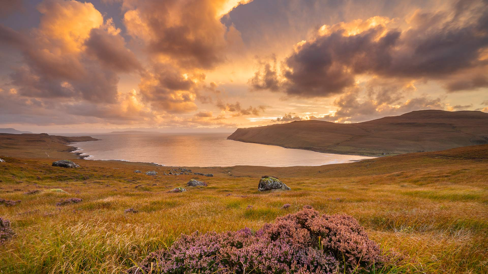
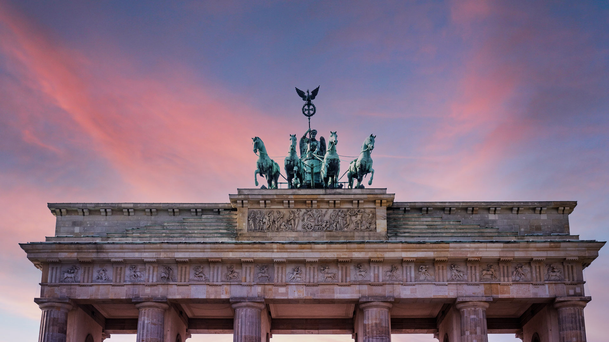
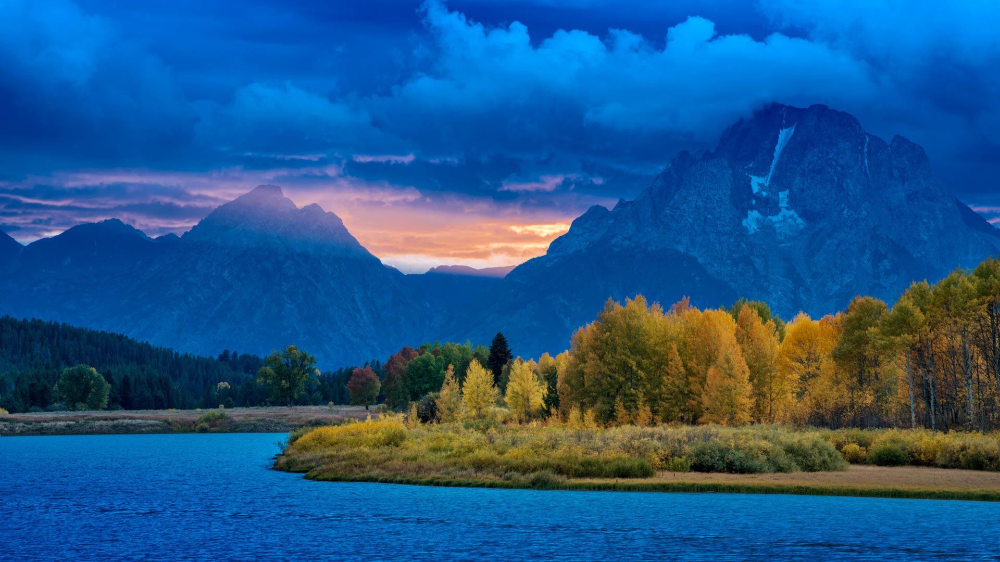

#### 20251008 竜頭の滝, 栃木県 日光市 (© kecl/Getty images)

#### 20251008 Day octopus in the waters off Maui, Hawaii (© Dave Fleetham/plainpicture)

#### 20251007 Fall colors below Mount Sneffels near Ridgway, Colorado (© Grant Ordelheide/TANDEM Stills + Motion)

#### 20251007 Rochers dans la mer au coucher du soleil, au Cap d’Antibes, Provence-Alpes-Côte d’Azur (© Eric Rousset/Getty Images)

#### 20251006 Anshun Bridge illuminated for the Mid-Autumn Festival, Chengdu, China (© Philippe LEJEANVRE/Getty Images)

#### 20251005 Boreal owl in a forest in Central Europe (© Ondrej Prosicky/Alamy)

#### 20251004 'Inside Out' by JR at the Nathan Phillips Square, Nuit Blanche 2015, Toronto (© Melissa Renwick/Contributor/Getty Images)

#### 20251004 ISS main solar arrays seen from SpaceX Crew Dragon Endeavour (© NASA)

#### 20251004 Chevaux de Camargue, Aigues-Mortes, Occitanie (© Francesco Riccardo Lacomino/Getty Images)

#### 20251003 Heather growing in Glen Brittle, Isle of Skye, Scotland (© Adam Mowery/TANDEM Stills + Motion)

#### 20251003 Brandenburger Tor bei Sonnenuntergang, Berlin (© Craig Hastings/Getty Images)

#### 20251002 Oxbow Bend on the Snake River, Grand Teton National Park, Wyoming (© DanitaDelimont.com/AWL Images/SuperStock)

#### 20251001 Clark Range, Sierra Nevada, Yosemite National Park, California (© Robb Hirsch/TANDEM Stills + Motion)

