#### 20251031 Different kinds of pumpkins and gourds (© davidfillion/Getty Images)

#### 20251031 Entrance of Bran Castle in Bran, Brașov, Romania (© blue sky in my pocket/Getty Images)

#### 20251030 Camels at Jaisalmer, Rajasthan, India (© f9photos/Getty Images)

#### 20251029 Ancient til trees in Fanal Forest, island of Madeira, Portugal (© Lukas Jonaitis/Shutterstock)

#### 20251028 The Gothic Gate in the Adršpach-Teplice Rocks, Czechia (© Kseniya_Milner/Getty Images)

#### 20251027 Grappe de raisins noirs, vignoble de Champagne (© Daniele SCHNEIDER/Photononstop/Alamy Stock Photo)

#### 20251027 被胡杨树围绕着的湖, 金塔县, 酒泉, 甘肃, 中国 (© Feng Wei Photography/Getty images)

#### 20251027 Thick-billed raven, Simien Mountains, Ethiopia (© Ignacio Yufera/FLPA/Minden Pictures)

#### 20251026 Pumpkin farm in North Carolina (© Matthew H Irvin/Getty Images)

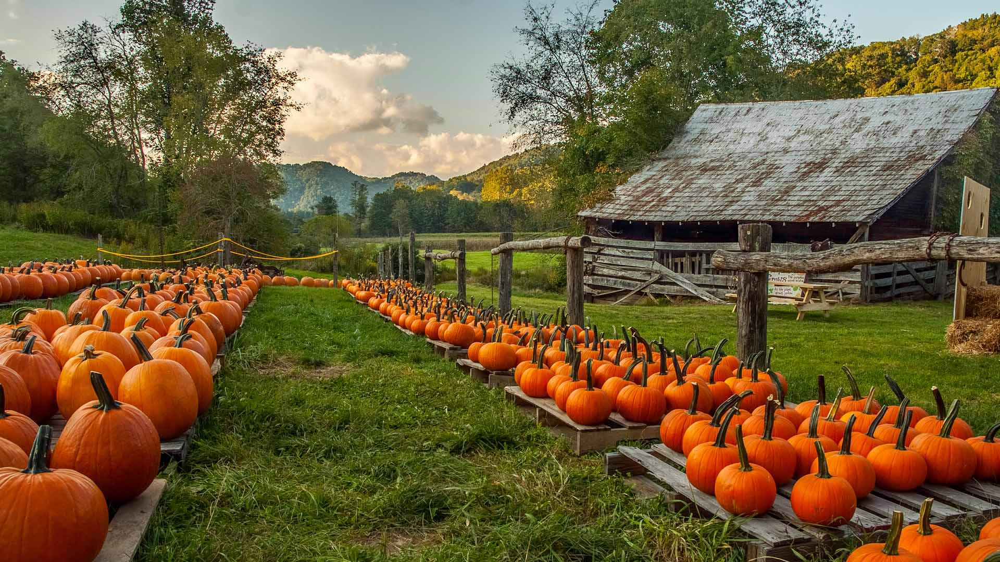

#### 20251025 Aerial view of peatland in Martimoaapa Mire Reserve, Finland (© romikatarina/Shutterstock)

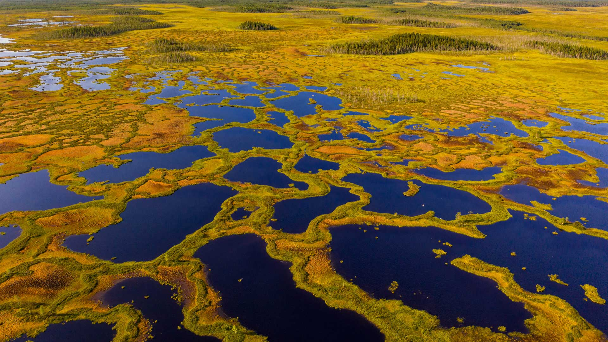

#### 20251024 Alte Bibliothek, Kloster Sankt Mang, Füssen, Bayern (© marcobriviophoto/Shutterstock)

#### 20251024 Night view of the RMS Queen Mary, Long Beach, California (© Kit Leong/Shutterstock)

#### 20251023 Snow leopard with her cubs, Spiti Valley, Cold Desert Biosphere Reserve, India (© Oriol Alamany/naturepl.com)

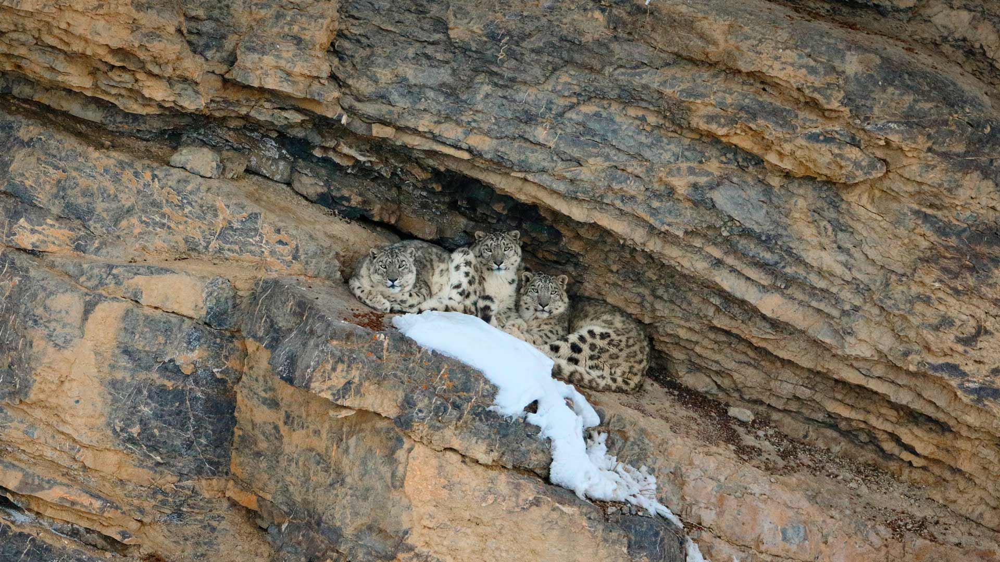

#### 20251023 八甲田山の紅葉, 青森県青森市 (© Mekdet/Getty images)

#### 20251022 平安神宮の泰平閣, 京都府 京都市 (© Trevor Chriss/Alamy)

#### 20251022 Cap d'Antibes, Provence-Alpes-Côte d'Azur, France (© Eric Rousset/Getty Images)

#### 20251022 Belogradchik Rocks, Bulgaria (© EvaL Miko/Shutterstock)

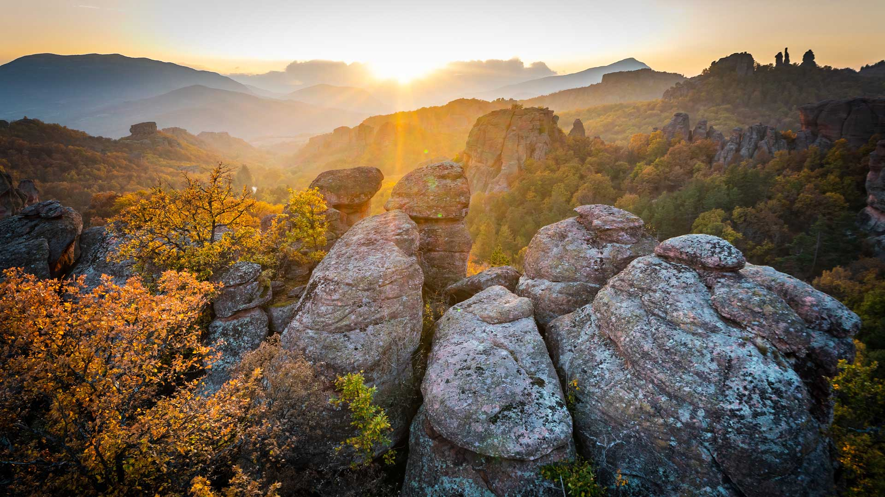

#### 20251021 哥斯达黎加的厚嘴巨嘴鸟 (© Juan Carlos Vindas/Getty Images)

#### 20251021 A diya at the Golden Temple during Diwali, Amritsar, India (© EyeEm Mobile GmbH/Getty Images)

#### 20251020 A Hoffmann's two-toed sloth in Ecuador (© Murray Cooper/Minden Pictures)

#### 20251019 Apples ready for harvest, Minnesota (© Tammi Mild/Getty Images)

#### 20251018 Neolithic site of Silbury Hill, Tilshead, Wiltshire, England (© dbstockphoto/Getty Images)

#### 20251017 Rock River Falls, Upper Peninsula, Michigan (© Matt Anderson Photography/Getty Images)

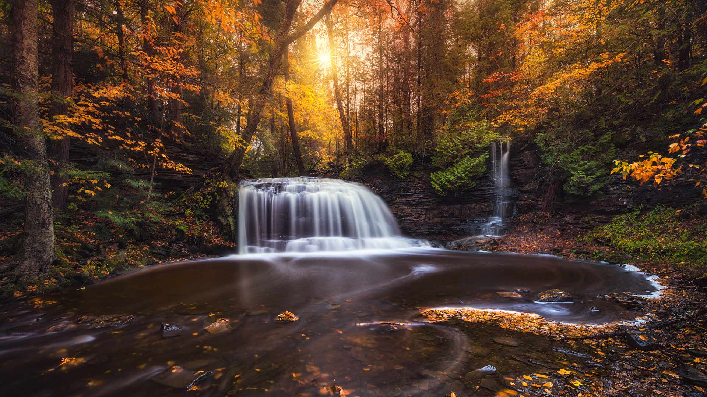

#### 20251017 Blick auf die Saar im Herbst, Saarschleife, Mettlach, Saarland (© Sus Bogaerts/Getty Images)

#### 20251017 Northern lights over Patricia Lake in Jasper National Park, Alberta (© Daniel Viñé Garcia/Getty Images)

#### 20251017 Lumière du soir sur le village de Speloncato, Corse (© joningall/Getty Images)

#### 20251016 Eurasian lynx in Siberia (© Mario Plechaty Photograph/Shutterstock)

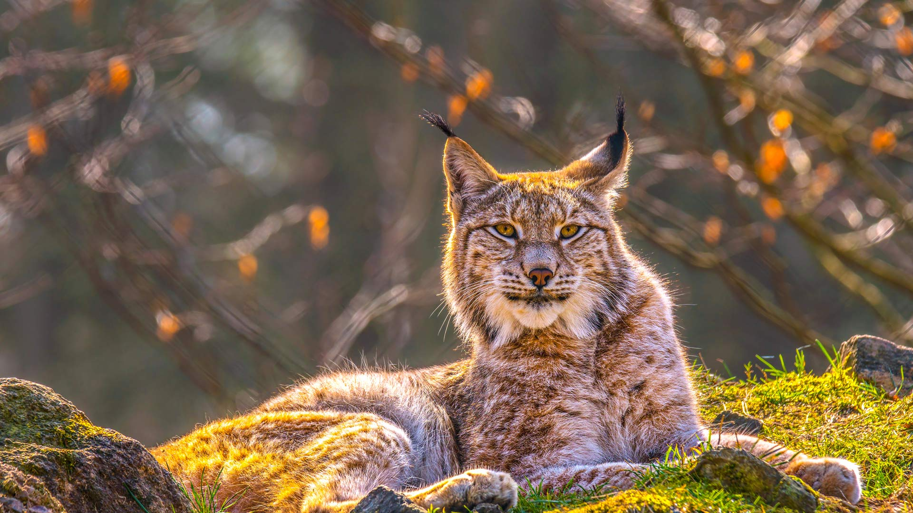

#### 20251015 ハウテン町, オランダ (© George Pachantouris/Getty Images)

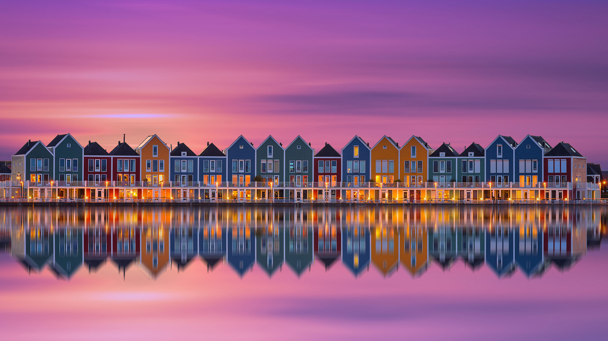

#### 20251015 Amethyst laccaria mushrooms, Seabeck, Washington (© Danita Delimont/Shutterstock)

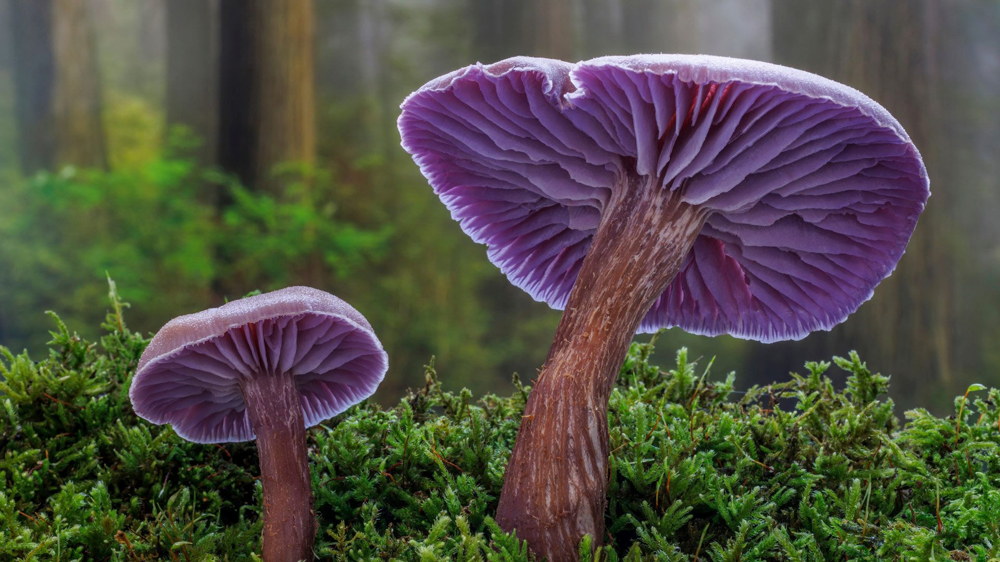

#### 20251014 第一只見川橋梁, 福島県 大沼郡 (© Doctor Egg/Getty Images)

#### 20251013 Village of Oia, Santorini, Greece (© f9photos/Getty Images)

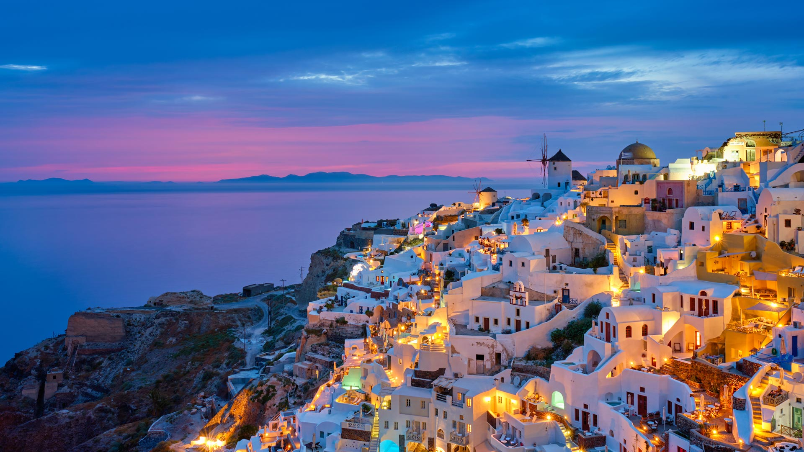

#### 20251013 House on Fire Ruin in Mule Canyon, Cedar Mesa, Utah (© Pete Lomchid/Getty Images)

#### 20251013 温巴赫峡谷瀑布，巴伐利亚州，德国 (© EyeEm Mobile GmbH/Getty Images)

#### 20251013 River rapids in Algonquin Provincial Park, Ontario (© Pgiam/Getty Images)

#### 20251012 Village of Saranac Lake, Adirondack Mountains, New York (© DenisTangneyJr/Getty Images)

#### 20251011 Wood duck hen (© ps50ace/iStock/Getty Images)

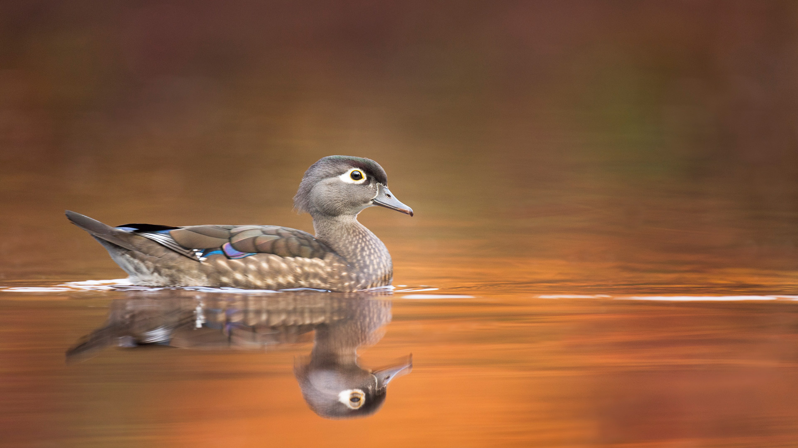

#### 20251010 Coral reef surrounding the island of Monuriki, Mamanuca Islands, Fiji (© David Wall/SuperStock)

#### 20251009 The Pillars of Creation viewed by the James Webb Space Telescope (© NASA)

#### 20251008 竜頭の滝, 栃木県 日光市 (© kecl/Getty images)

#### 20251008 Day octopus in the waters off Maui, Hawaii (© Dave Fleetham/plainpicture)

#### 20251007 Fall colors below Mount Sneffels near Ridgway, Colorado (© Grant Ordelheide/TANDEM Stills + Motion)

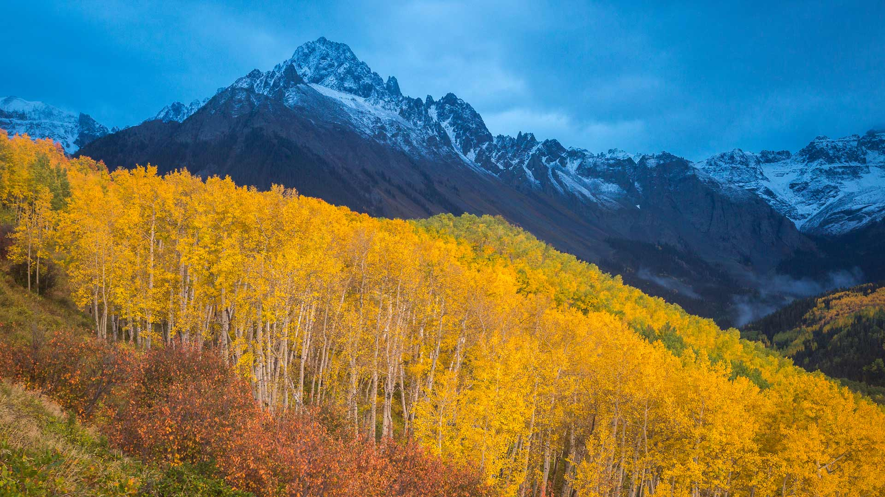

#### 20251007 Rochers dans la mer au coucher du soleil, au Cap d’Antibes, Provence-Alpes-Côte d’Azur (© Eric Rousset/Getty Images)

#### 20251006 Anshun Bridge illuminated for the Mid-Autumn Festival, Chengdu, China (© Philippe LEJEANVRE/Getty Images)

#### 20251005 Boreal owl in a forest in Central Europe (© Ondrej Prosicky/Alamy)

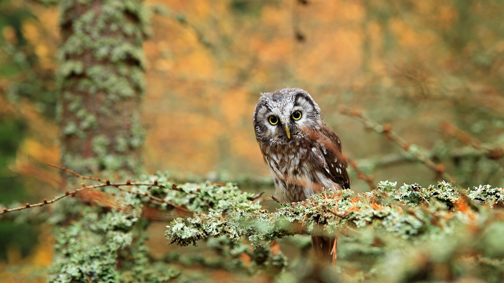

#### 20251004 'Inside Out' by JR at the Nathan Phillips Square, Nuit Blanche 2015, Toronto (© Melissa Renwick/Contributor/Getty Images)

#### 20251004 ISS main solar arrays seen from SpaceX Crew Dragon Endeavour (© NASA)

#### 20251004 Chevaux de Camargue, Aigues-Mortes, Occitanie (© Francesco Riccardo Lacomino/Getty Images)

#### 20251003 Heather growing in Glen Brittle, Isle of Skye, Scotland (© Adam Mowery/TANDEM Stills + Motion)

#### 20251003 Brandenburger Tor bei Sonnenuntergang, Berlin (© Craig Hastings/Getty Images)

#### 20251002 Oxbow Bend on the Snake River, Grand Teton National Park, Wyoming (© DanitaDelimont.com/AWL Images/SuperStock)

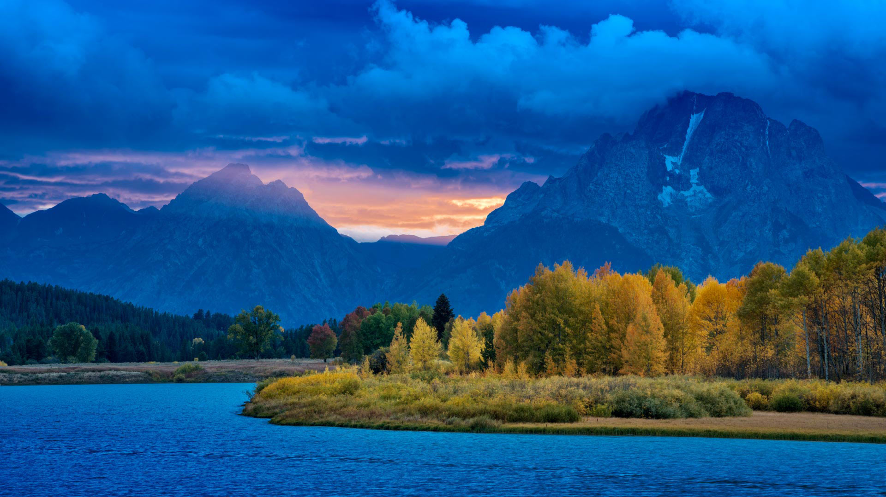

#### 20251001 Clark Range, Sierra Nevada, Yosemite National Park, California (© Robb Hirsch/TANDEM Stills + Motion)

