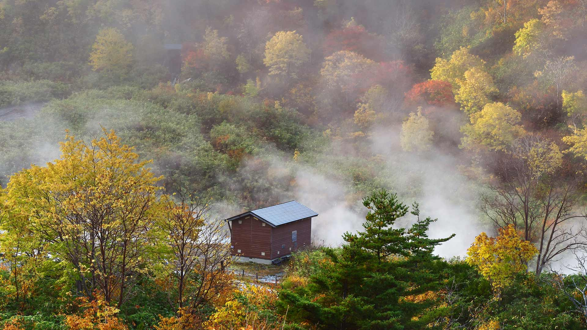
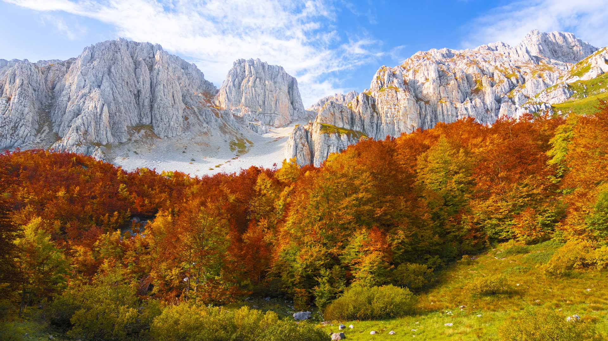
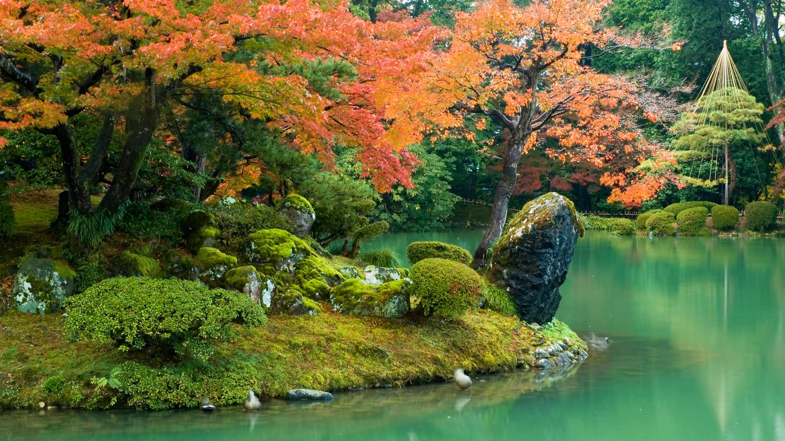
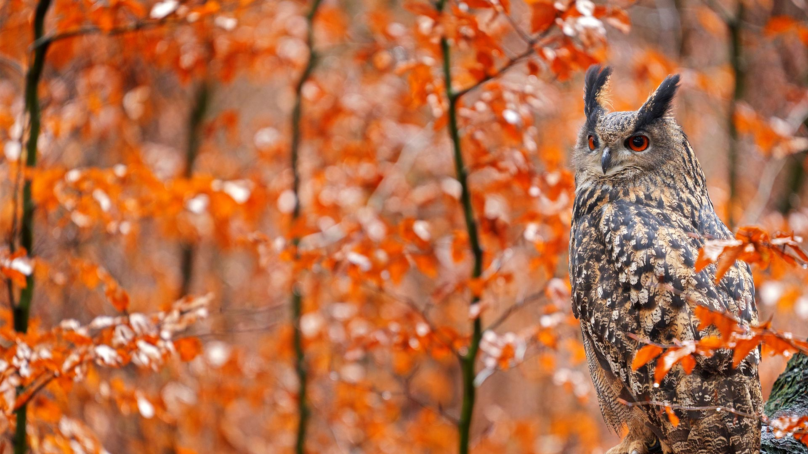
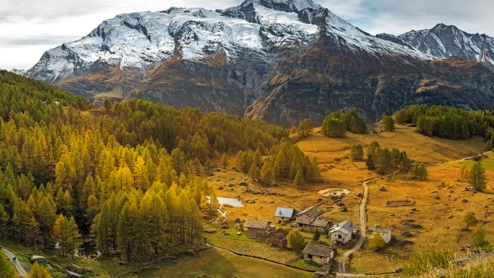
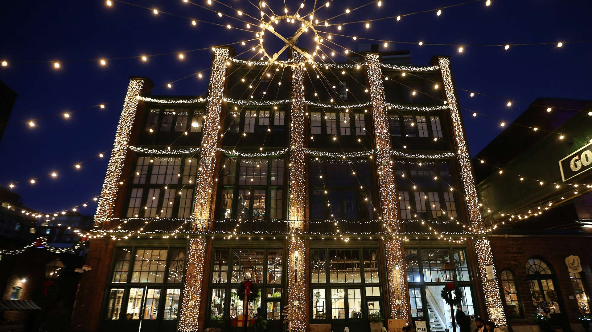
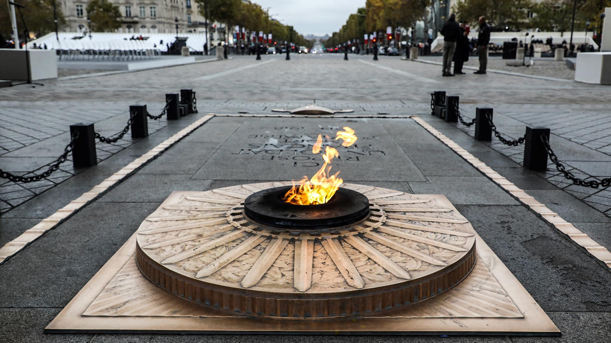
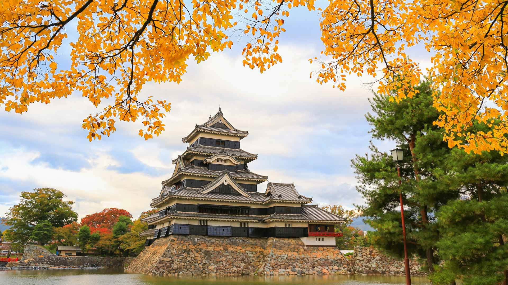
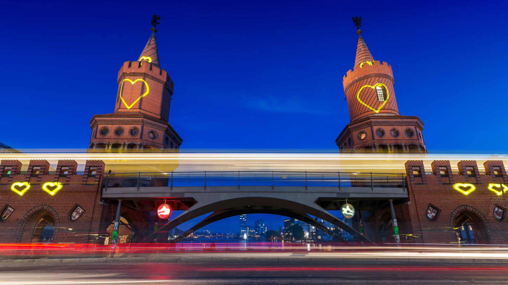
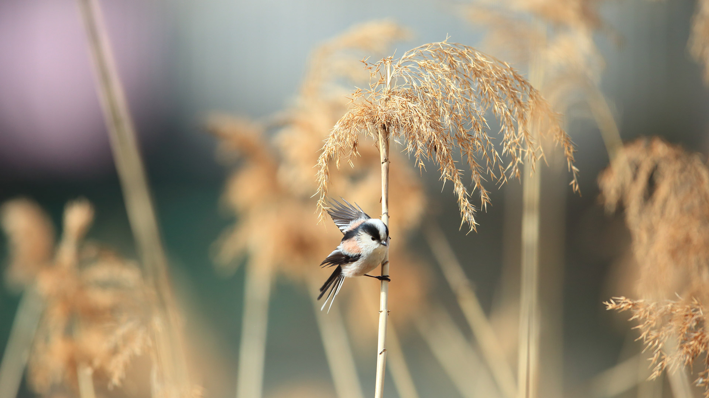

#### 20251130 Christmas market in Leipzig, Germany (© Krzysztof Baranowski/Getty Images)

#### 20251129 Red deer stag in De Hoge Veluwe National Park, Netherlands (© CreativeNature_nl/Getty Images)

#### 20251128 瓦尔·布兰德特, 布雷西亚, 伦巴第大区, 意大利 (© ClickAlps/Alamy)

#### 20251128 Collection of silver Native American concho belts, Santa Fe, New Mexico (© julien mcroberts/Shutterstock)

#### 20251127 Male wild turkey plumage, Aransas Natural Wildlife Refuge, Texas (© George McCarthy/Minden Pictures)

#### 20251127 伊斯特本码头, 东萨塞克斯郡, 英格兰 (© Tolga_TEZCAN/Getty Images)

#### 20251127 楽山大仏, 中国 四川省 (© www.anotherdayattheoffice.org/Getty Images)

#### 20251126 玉川温泉, 秋田県 仙北市 (© jiraphoto/Shutterstock)

#### 20251126 Olive orchard in the Serra de Tramuntana, Mallorca, Balearic Islands, Spain (© cinoby/Getty Images)

#### 20251126 Décorations artisanales d’un marché de Noël (© 31etc/Adobe Stock)

#### 20251125 The Trevi Fountain in Rome, Italy (© Nico De Pasquale Photography/Getty Images)

#### 20251125 Weihnachtsmarkt Erfurt, Thüringen (© Jareck/Getty Images)

#### 20251124 Gwalior Fort, Madhya Pradesh, India (© ImagesofIndia/Shutterstock)

#### 20251123 Monte Sirente, Abruzzo, Italy (© ValerioMei/Getty Images)

#### 20251123 Ammonite fossil from Madagascar (© ThomasLENNE/Shutterstock)

#### 20251122 Leshan Giant Buddha, Sichuan, China (© www.anotherdayattheoffice.org/Getty Images)

#### 20251122 兼六園, 石川県 金沢市 (© Darby Sawchuk/Alamy)

#### 20251121 Harbor seals at Robert Moses State Park, Long Island, New York (© Vicki Jauron, Babylon and Beyond Photography/Getty Images)

#### 20251120 Artist Saype poses with his land art painting at UN Headquarters, Geneva, Switzerland (© Valentin Flauraud/EPA-EFE/Shutterstock)

#### 20251120 查帕达迪亚曼蒂纳国家公园，巴伊亚州，巴西 (© Marcio Dufranc/Getty Images)

#### 20251119 Hungarian Parliament Building, Budapest, Hungary (© Alexander Spatari/Getty Images)

#### 20251118 Male hooded merganser, Oregon (© Eric Vogt/TANDEM Stills + Motion)

#### 20251117 Fall colors in Shenandoah National Park, Virginia (© Michael Ver Sprill/Getty Images)

#### 20251117 Red fox, Canada (© RT-Images/Getty Images)

#### 20251117 Europäischer Uhu auf einem herbstlichen Baumstamm, Deutschland (© Ondrej Prosicky/Shutterstock)

#### 20251117 Forêt de mélèzes dorés, Alpes (© Jose Manuel Perez/Getty Images)

#### 20251116 A traboule in Lyon, France (© TPopova/Getty Images)

#### 20251115 Irohazaka Road in fall, Nikko, Tochigi, Japan (© oneinchpunch/Shutterstock)

#### 20251114 Mother manatee and calf, Crystal River, Florida (© Gregory Sweeney/Getty Images)

#### 20251113 The 2020 Distillery Winter Village, Toronto (© Steve Russell/Toronto Star via Getty Images)

#### 20251113 Mémorial éphémère en hommage aux victimes des attentats de Paris, Vieux-Port, Marseille (© Anne-Christine Poujoulat/Getty Images)

#### 20251112 Aerial view of the Colosseum, Rome, Italy (© Nico De Pasquale Photography/Getty Images)

#### 20251111 Marine Corps War Memorial, Arlington, Virginia (© f11photo/Shutterstock)

#### 20251111 条顿堡森林的伊克斯坦岩石层，德国 (© Michael Sroka/Getty Images)

#### 20251111 ベログラトチク岩, ブルガリア (© EvaL Miko/Shutterstock)

#### 20251111 Tombe du soldat inconnu sous l’Arc de Triomphe à Paris lors des commémorations du 11 novembre (© Ludovic Marin/Getty Images)

#### 20251111 Quiver trees under the Milky Way, Keetmanshoop, Namibia (© Wim van den Heever/naturepl.com)

#### 20251110 Black-tailed prairie dogs at Roberts Prairie Dog Town, Badlands National Park, South Dakota (© Greg Vaughn/Getty Images)

#### 20251110 松本城, 長野県 松本市 (© Sangchai Olanrittinunt/Shutterstock)

#### 20251109 Interstellar clouds in the Lagoon Nebula, captured by the Hubble Space Telescope (© ESA/NASA)

#### 20251109 Herzen auf den Türmen der Oberbaumbrücke, Berlin (© fhm/Getty Images)

#### 20251108 Sea stacks of Bandon Beach in Bandon, Oregon (© Grant Ordelheide/TANDEM Stills + Motion)

#### 20251107 Polar bear in Churchill, Manitoba, Canada (© karen crewe/Getty Images)

#### 20251107 エナガ, 日本 (© feathercollector/Shutterstock)

#### 20251106 Colorful lanterns at the temple of Wat Phra That Hariphunchai, Lamphun, Thailand (© MR. ANUJAK JAIMOOK/Getty Images)

#### 20251105 Peña Roya beech forest, Moncayo Natural Park, Zaragoza, Aragon, Spain (© David Santiago Garcia/DEEPOL by plainpicture)

#### 20251104 Tower Bridge, London, England (© Nick Brundle Photography/Getty Images)

#### 20251103 Jellyfish swimming in the Pacific, Guerrero, Mexico (© Christian Vizl/TANDEM Stills + Motion)

#### 20251103 ウィンバッハ峡谷, ドイツ (© EyeEm Mobile GmbH/Getty Images)

#### 20251102 Colorful maple leaves and bamboo forest in Arashiyama, Kyoto, Japan (© DoctorEgg/Getty Images)

#### 20251101 Bison grazing at thermal hot springs, Yellowstone National Park, Wyoming (© Cheryl Ramalho/Getty Images)

