#### 20251231 輪王寺の梵鐘, 宮城県 仙台市 (© Grandbrothers/Alamy)

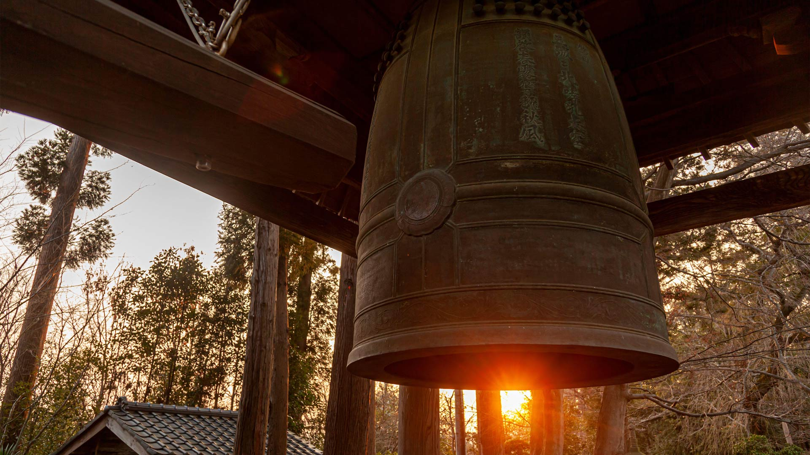

#### 20251231 New Year's Eve fireworks in Toronto (© LeoPatrizi/Getty Images)

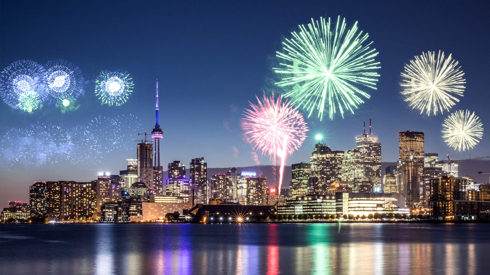

#### 20251231 New Year's Eve, Oberbaum Bridge, Berlin, Germany (© spreephoto.de/Getty Images)

#### 20251231 Le nouvel an à Paris, France (© Kiran Ridley/Getty Images)

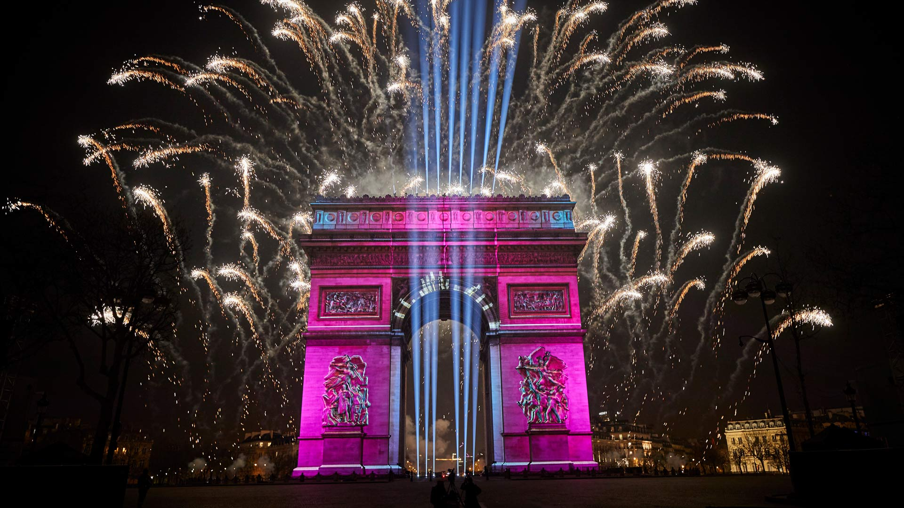

#### 20251230 晨光透过结霜的树木洒下，瑞典 (© Schon/Getty Images)

#### 20251230 Whooper swans, Kotoku Pond, Japan (© Martin Bailey/Shutterstock)

#### 20251230 Étretat, Normandy, France (© Luis Henrique Boucault/Getty Images)

#### 20251229 Markus Eisenbichler (GER) beim ersten Sprung am zweiten Tag der Vierschanzentournee, 30. Dezember 2016, Oberstdorf, Bayern (© Adam Pretty/Getty Images)

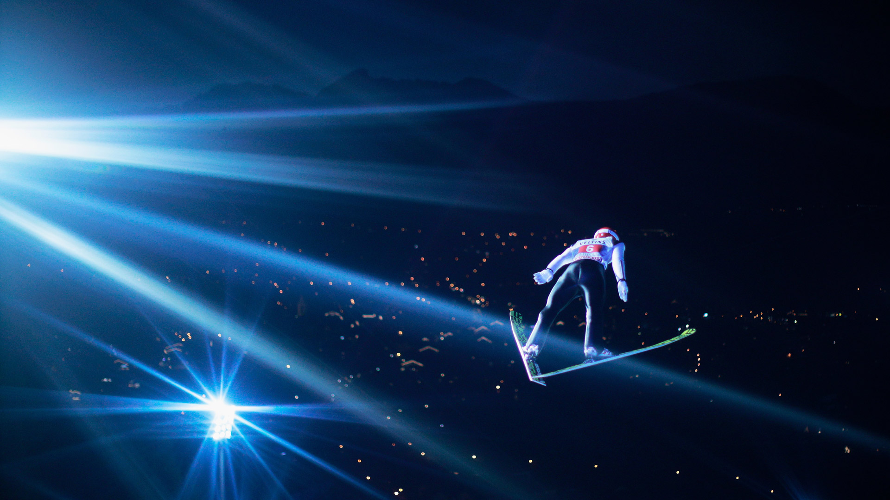

#### 20251229 St. Gregory Church in Ani Ruins, Kars, Türkiye (© Kenan Talas/Getty Images)

#### 20251228 Black-and-white ruffed lemur in Madagascar (© Cyrielle Beaubois/Getty Images)

#### 20251228 アルザス地域圏の森, フランス (© alekseystemmer/Getty Images)

#### 20251227 Lakes of Covadonga, Asturias, Spain (© emiliozv/Getty Images)

#### 20251227 Plate ice along Lake Superior, Grand Marais, Minnesota (© wanderluster/Getty Images)

#### 20251226 Salisbury Cathedral, Wiltshire, England (© Julian Elliott Photography/Getty Images)

#### 20251226 Reindeer during winter snowfall, Lapland, Finland (© Roberto Moiola/Getty Images)

#### 20251226 Nuuk, Groenland (© nevereverro/Getty Images)

#### 20251225 Christmas trees in Old Quebec (© Jean Surprenant/Getty Images)

#### 20251225 Starling murmuration over the ruins of Brighton's West Pier, England (© Philip Reeve/Photodisc/Getty Images)

#### 20251225 Snow globes at a Christmas market in Heidelberg, Germany (© George Pachantouris/Getty Images)

#### 20251224 Lagazzuolo Lake, Valmalenco, Lombardy, Italy (© Francesco Bergamaschi/Getty Images)

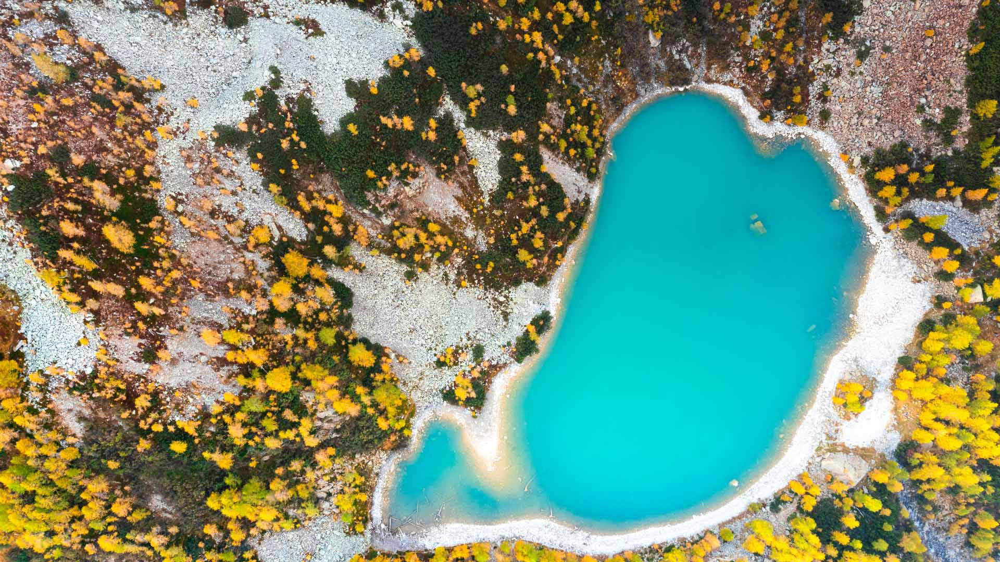

#### 20251224 Kapelle und Weihnachtsbaum in winterlicher Landschaft, Elmau, Bayern (© Michael Thaler/Shutterstock)

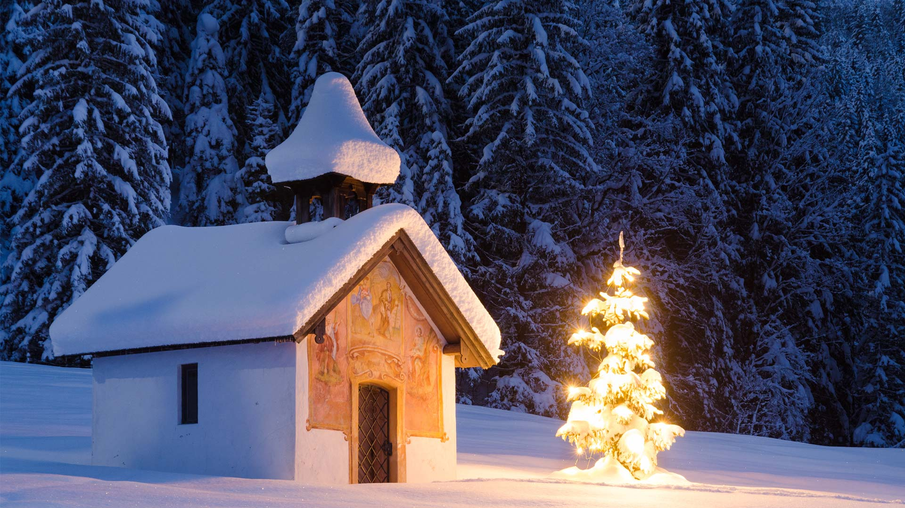

#### 20251224 Snowy chapel with Christmas tree in the Bavarian Alps, Germany (© mauritius images GmbH/Alamy)

#### 20251223 ライトアップされた夜の東京タワー, 東京 (© Najjsiri Nimyizhune/Getty Images)

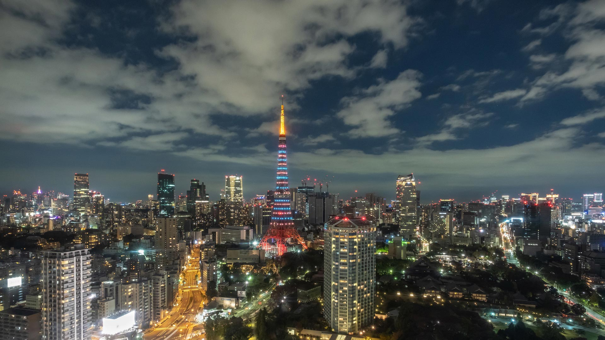

#### 20251222 Reindeer during winter snowfall, Lapland, Finland (© Roberto Moiola/Getty Images)

#### 20251222 'The Nutcracker' performed by the Turkish State Opera and Ballet in Ankara, Türkiye (© Anadolu/Getty Images)

#### 20251222 法兰克福老桥，德国 (© diegograndi/Getty Images)

#### 20251221 美丽的雾凇景色，大庆市，黑龙江省，中国 (© Dashu Xinganling/shutterstock)

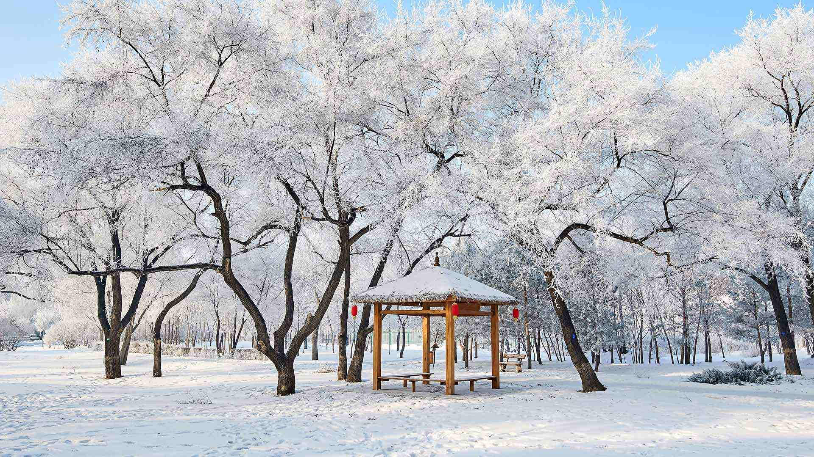

#### 20251221 屈斜路湖のオオハクチョウ, 北海道 (© Jan Vermeer/Minden)

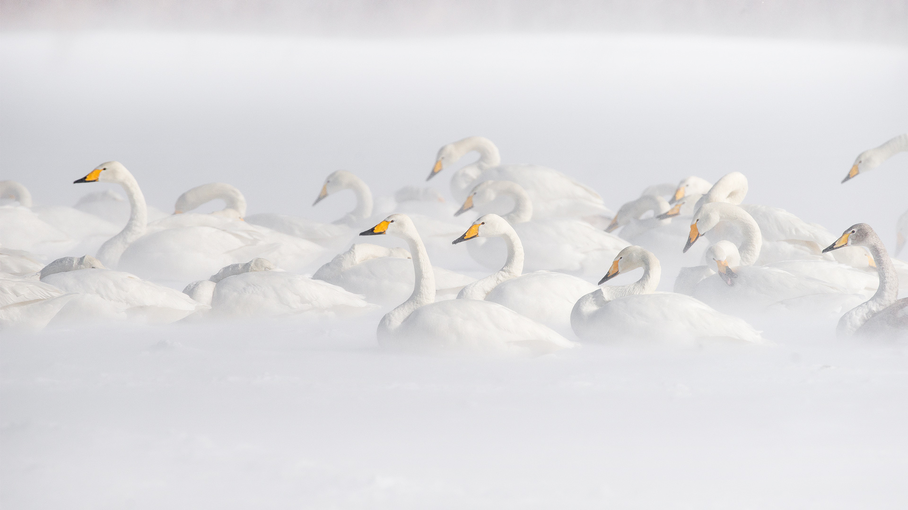

#### 20251221 Dawn light through frosty trees, Sweden (© Schon/Getty Images)

#### 20251221 Red fox, Canada (© RT-Images/Getty Images)

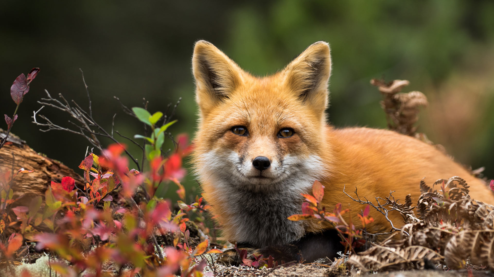

#### 20251220 Christmas star lanterns, Germany (© artas/Getty Images)

#### 20251220 Cirque de Mafate, Dos d'Ane, Île de la Réunion (© Gael Fontaine/Alamy)

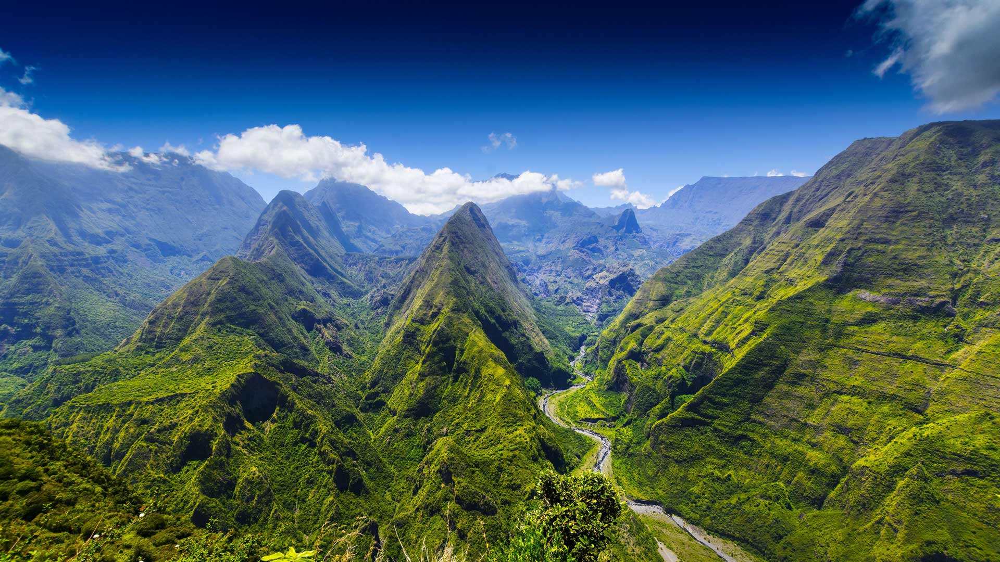

#### 20251219 Rivière Merced, parc national de Yosemite, Californie, États-Unis (© Ron and Patty Thomas/Getty Images)

#### 20251219 Snow-covered landscape at Bormio, Lombardy, Italy (© Roberto Moiola/Getty Images)

#### 20251218 Christmas star lanterns, Germany (© artas/Getty Images)

#### 20251218 Schneebedecktes Feld bei Sonnenuntergang, Ostfriesland, Niedersachsen (© photo art/500px/Getty Images)

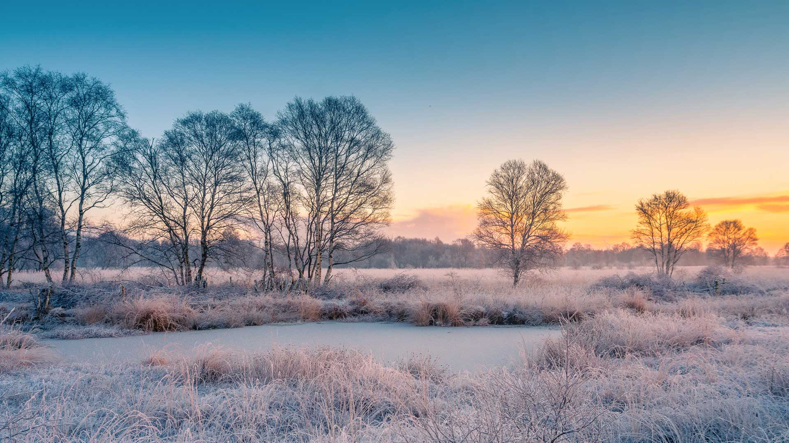

#### 20251218 Temple of the Sun, Capitol Reef National Park, Utah (© Austin Cronnelly/TANDEM Stills + Motion)

#### 20251217 Medieval Aqueduct, Perugia, Italy (© Sean Pavone/Getty Images)

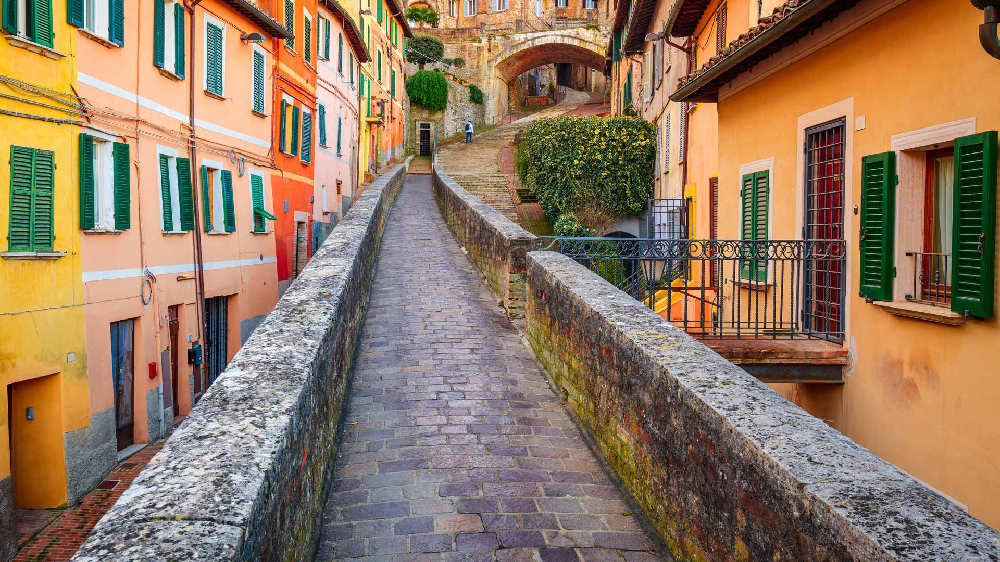

#### 20251217 Eurasian red squirrel in Northumberland, England (© Michael_Conrad/Getty Images)

#### 20251216 Handmade gnomes at a Christmas market (© Veronika Seppanen/Shutterstock)

#### 20251215 Lights on Spiegelgracht canal, Amsterdam, Netherlands (© Amith Nag Photography/Getty Images)

#### 20251214 Tufted titmouse perched on pine boughs, Massachusetts (© Tim Laman/NPL/Minden Pictures)

#### 20251213 Merced River, Yosemite National Park, California (© Ron and Patty Thomas/Getty Images)

#### 20251213 Vue sur un village de montagne illuminé, France (© Dario Berardi/500px)

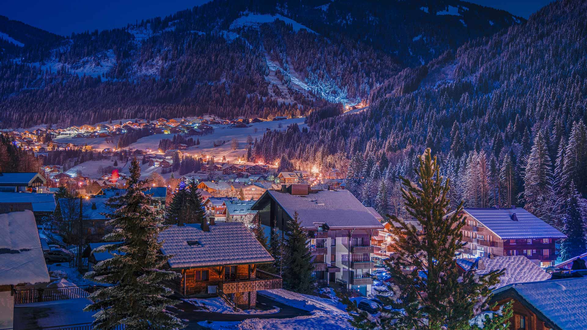

#### 20251212 Illuminated Capilano Suspension Bridge Park, Vancouver, British Columbia (© Brian Caissie/Getty Images)

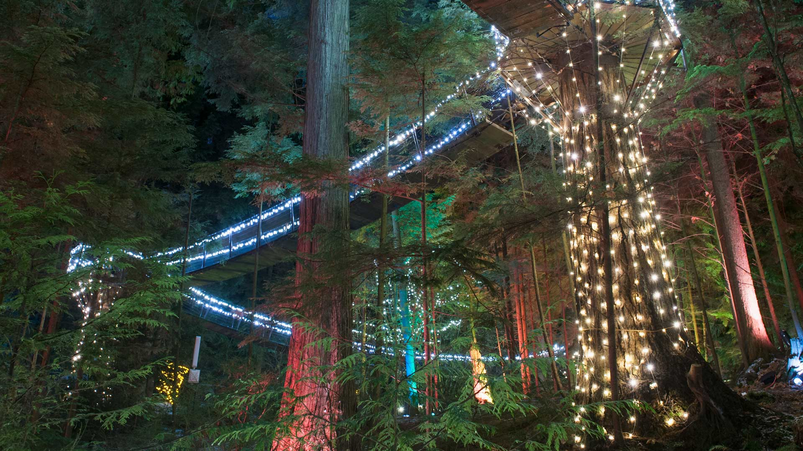

#### 20251212 Spotted poinsettia (© DigiPub/Getty Images)

#### 20251211 Summit of Mount Everest at sunset, seen from Renjo La, Nepal (© shoults/Alamy)

#### 20251211 Castle of Rocca Calascio, Abruzzo, Italy (© carlo alberto conti/Getty Images)

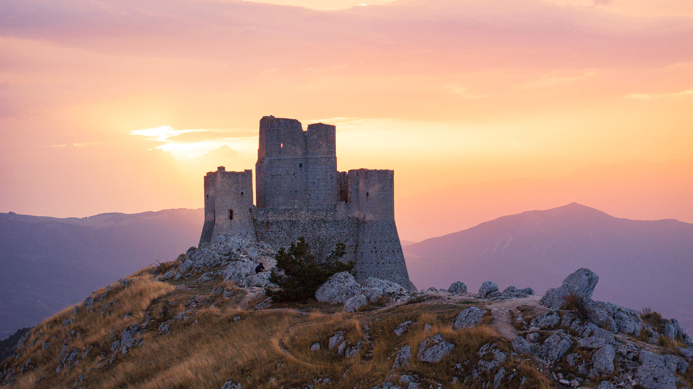

#### 20251210 Interior of the Mosque-Cathedral of Córdoba, Andalusia, Spain (© Elena Zolotova/Getty Images)

#### 20251209 Guanaco in Punta Norte, Argentina (© Sylvain Cordier/naturepl.com)

#### 20251208 Christmas lights in Domaso, Lake Como, Italy (© Roberto Moiola/Getty Images)

#### 20251207 雪中的故宫，中国北京 (© Ian.CuiYi/Getty Images)

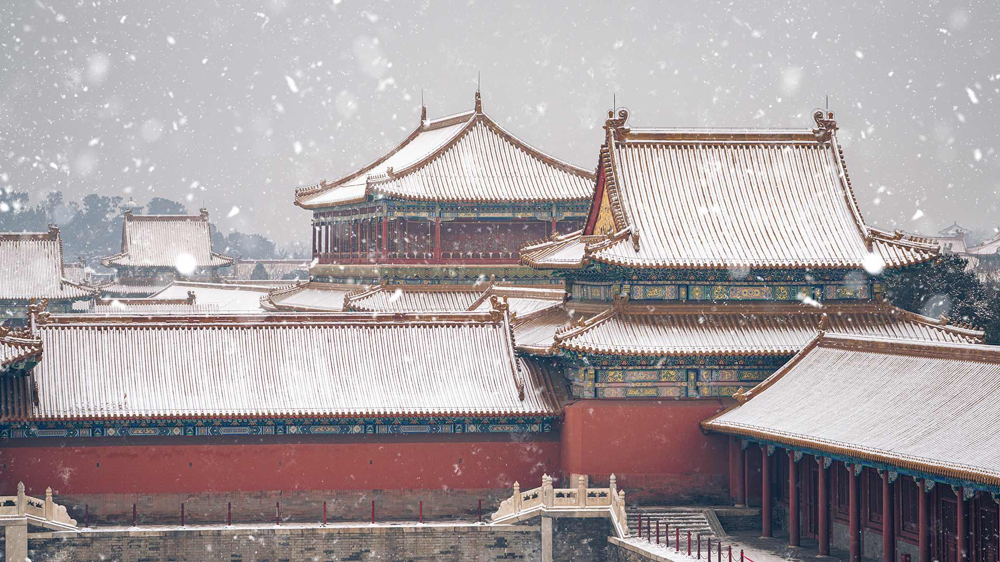

#### 20251207 USS Arizona Memorial, Pearl Harbor, Honolulu, Hawaii (© Jessica O. Blackwell/APFootage/Alamy)

#### 20251207 Ein Kiefernwald im Elsass, Frankreich (© alekseystemmer/Getty Images)

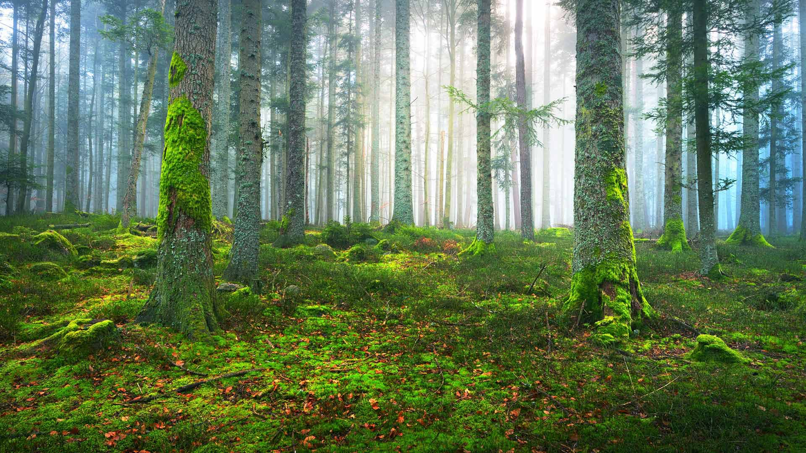

#### 20251207 白馬三山の雪景色 (© Thirawatana Phaisalratana/Getty Images)

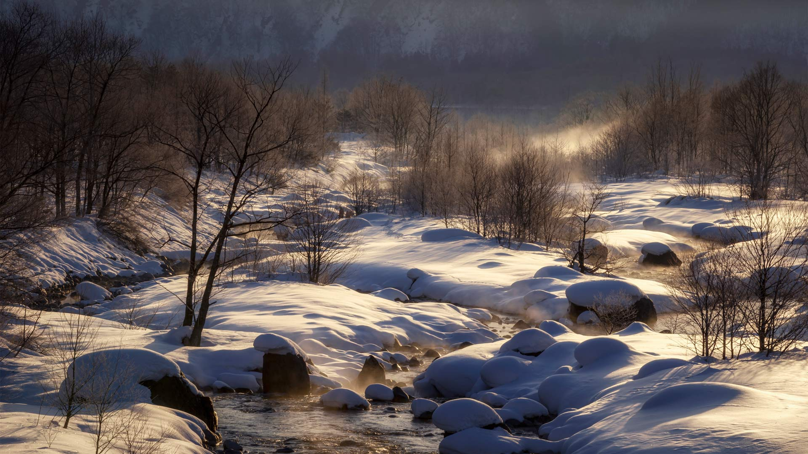

#### 20251206 Marché deNoël dans le quartier historique de la Petite France, Strasbourg, Alsace (© Alpineguide/Alamy)

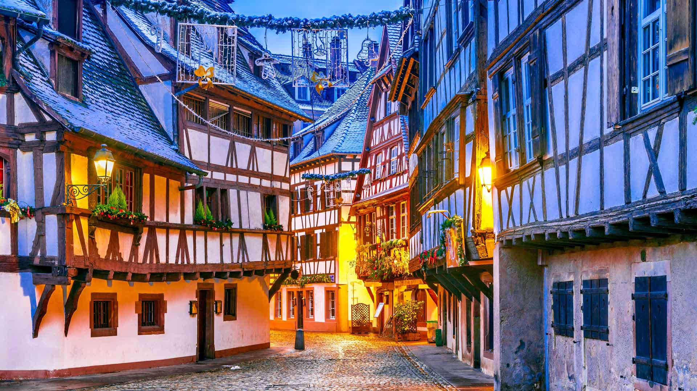

#### 20251206 Schokoladennikoläuse in einem Supermarktregal (© hydebrink/Shutterstock)

#### 20251206 Spider webs in Everglades National Park, Florida (© Troy Harrison/Getty Images)

#### 20251205 Maya site of Copán, Honduras (© diegograndi/Getty Images)

#### 20251204 Cheetah in Maasai Mara National Reserve, Narok, Kenya (© Andy Rouse/naturepl.com)

#### 20251203 秩父夜祭の屋台, 埼玉県 秩父市 (© Joshua Hawley/Alamy)

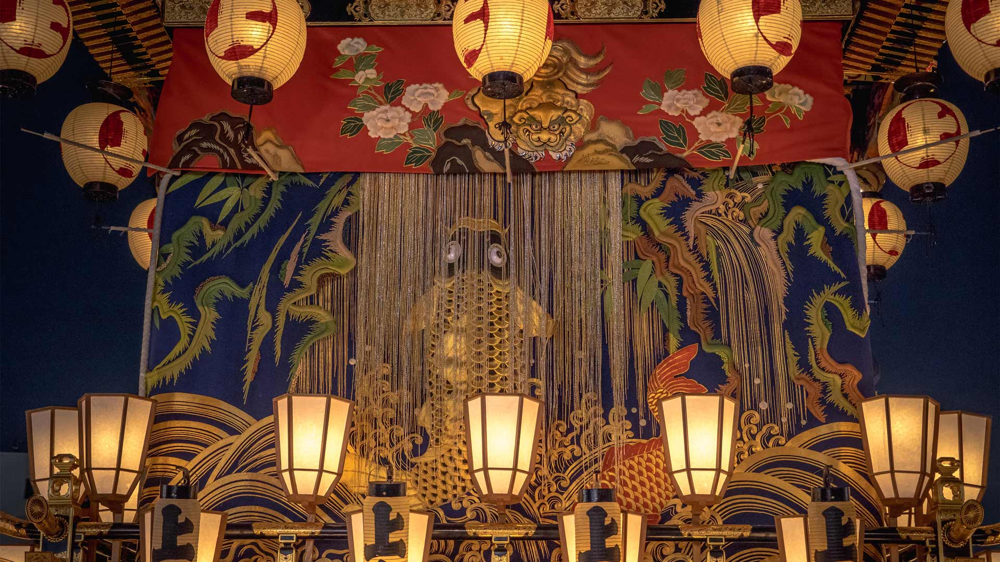

#### 20251203 Sandhill cranes at sunrise, Bosque del Apache National Wildlife Refuge, New Mexico (© Jack Dykinga/Minden Pictures)

#### 20251202 Willow Lake and Mount Blackburn, Wrangell-St. Elias National Park and Preserve, Alaska (© Patrick J. Endres/Getty Images)

#### 20251202 Whistler, British Columbia (© VisualCommunications/Getty Images)

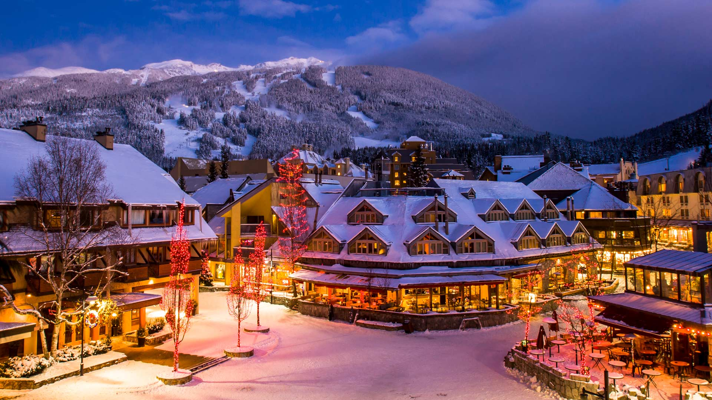

#### 20251201 Natural arch carved in an iceberg, Antarctica (© Gabrielle/Adobe Stock)

#### 20251201 Adventskalendersäckchen mit süßen Überraschungen (© wideonet/Getty Images)

