#### 20251217 Medieval Aqueduct, Perugia, Italy (© Sean Pavone/Getty Images)

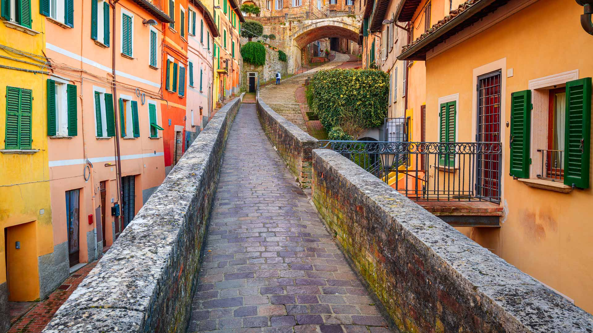

#### 20251216 Handmade gnomes at a Christmas market (© Veronika Seppanen/Shutterstock)

#### 20251215 Lights on Spiegelgracht canal, Amsterdam, Netherlands (© Amith Nag Photography/Getty Images)

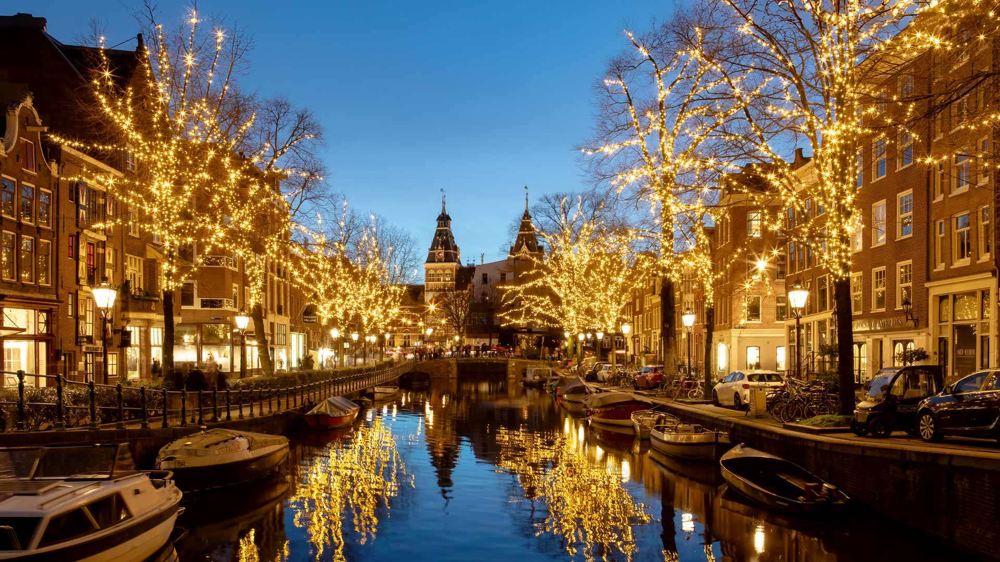

#### 20251214 Tufted titmouse perched on pine boughs, Massachusetts (© Tim Laman/NPL/Minden Pictures)

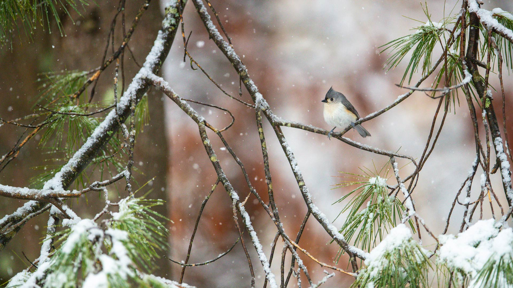

#### 20251213 Merced River, Yosemite National Park, California (© Ron and Patty Thomas/Getty Images)

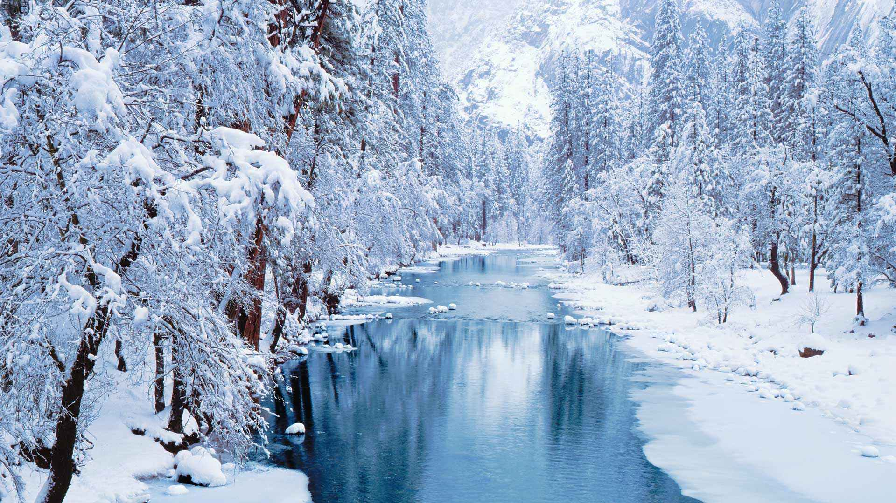

#### 20251213 Vue sur un village de montagne illuminé, France (© Dario Berardi/500px)

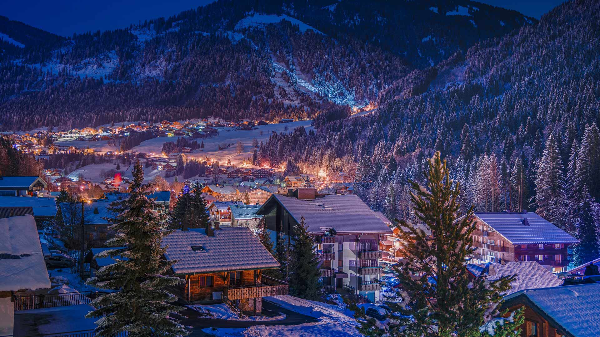

#### 20251212 Illuminated Capilano Suspension Bridge Park, Vancouver, British Columbia (© Brian Caissie/Getty Images)

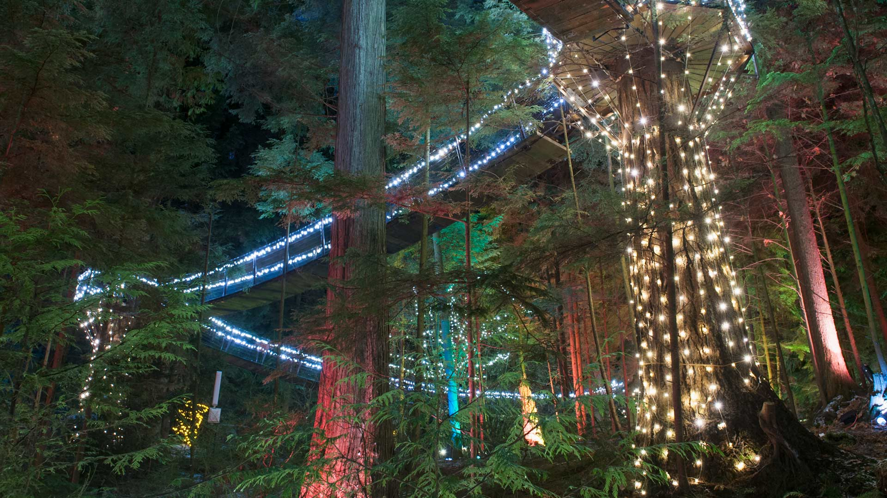

#### 20251212 Spotted poinsettia (© DigiPub/Getty Images)

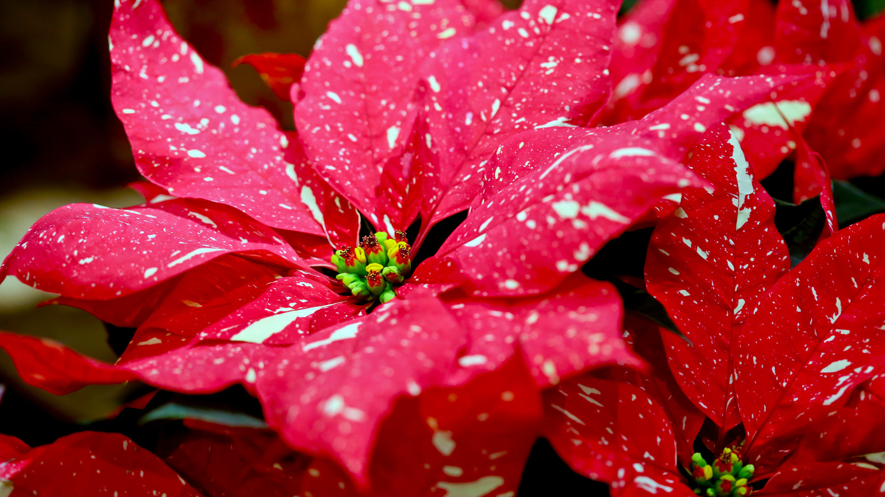

#### 20251211 Summit of Mount Everest at sunset, seen from Renjo La, Nepal (© shoults/Alamy)

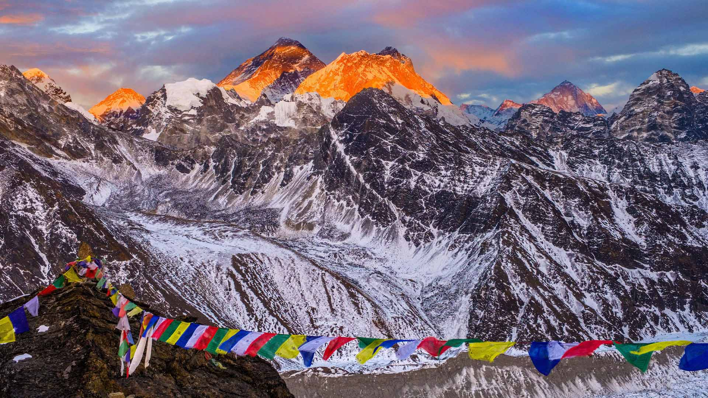

#### 20251211 Castle of Rocca Calascio, Abruzzo, Italy (© carlo alberto conti/Getty Images)

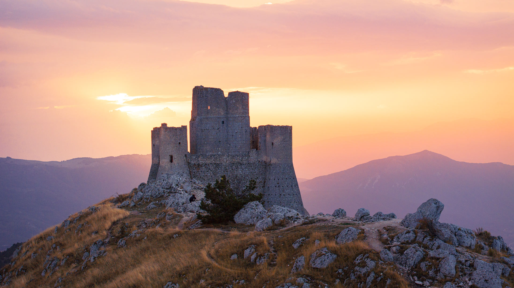

#### 20251210 Interior of the Mosque-Cathedral of Córdoba, Andalusia, Spain (© Elena Zolotova/Getty Images)

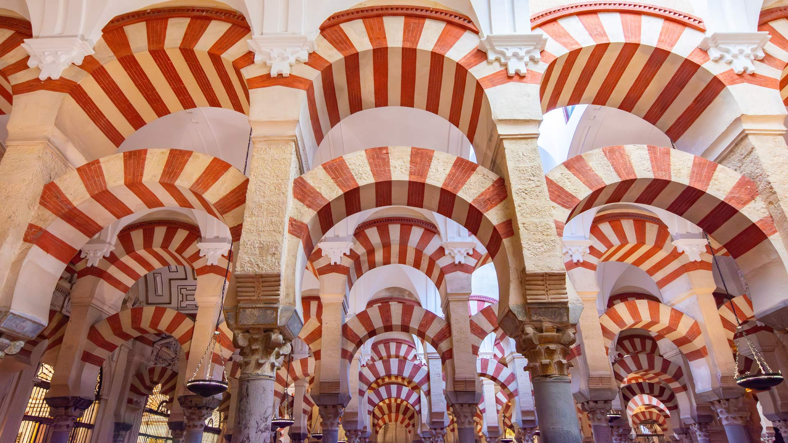

#### 20251209 Guanaco in Punta Norte, Argentina (© Sylvain Cordier/naturepl.com)

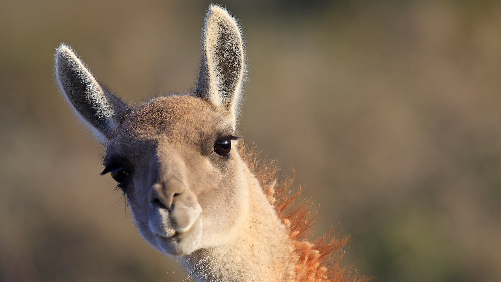

#### 20251208 Christmas lights in Domaso, Lake Como, Italy (© Roberto Moiola/Getty Images)

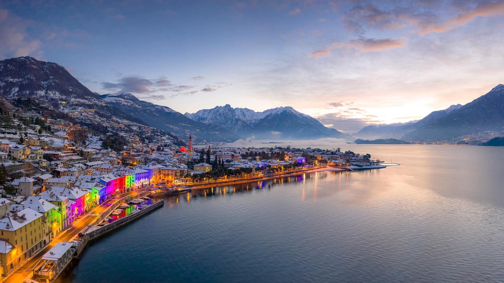

#### 20251207 雪中的故宫，中国北京 (© Ian.CuiYi/Getty Images)

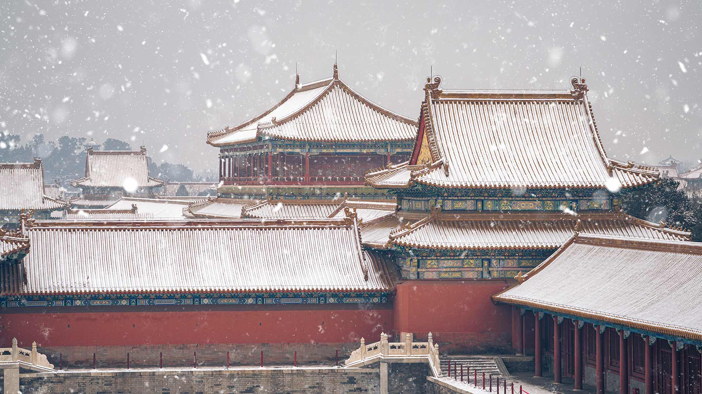

#### 20251207 USS Arizona Memorial, Pearl Harbor, Honolulu, Hawaii (© Jessica O. Blackwell/APFootage/Alamy)

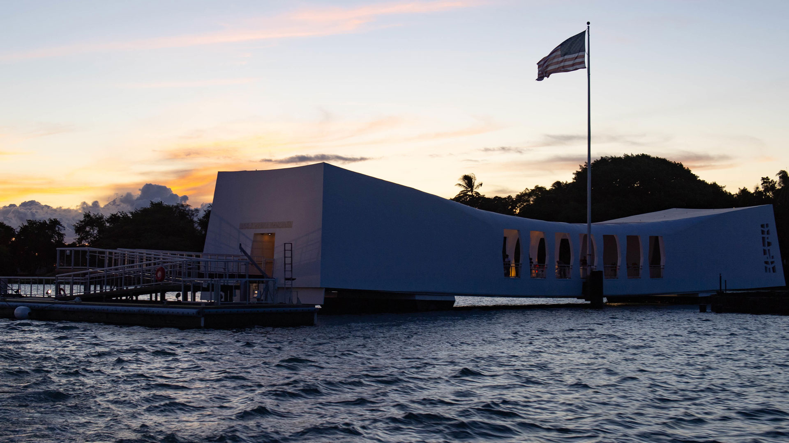

#### 20251207 Ein Kiefernwald im Elsass, Frankreich (© alekseystemmer/Getty Images)

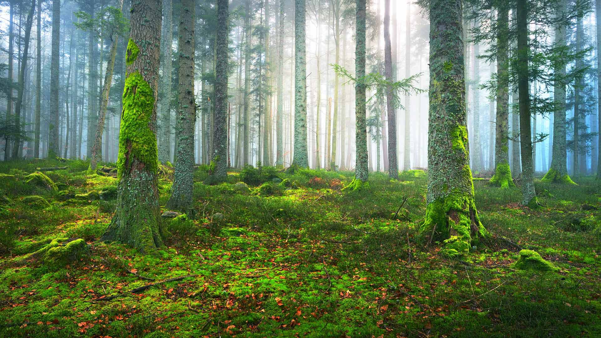

#### 20251207 白馬三山の雪景色 (© Thirawatana Phaisalratana/Getty Images)

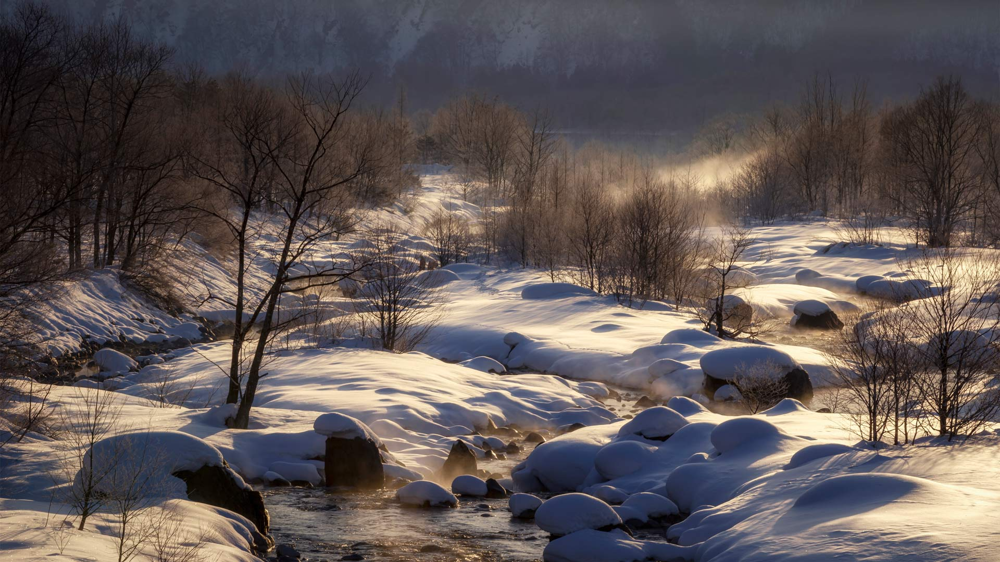

#### 20251206 Marché deNoël dans le quartier historique de la Petite France, Strasbourg, Alsace (© Alpineguide/Alamy)

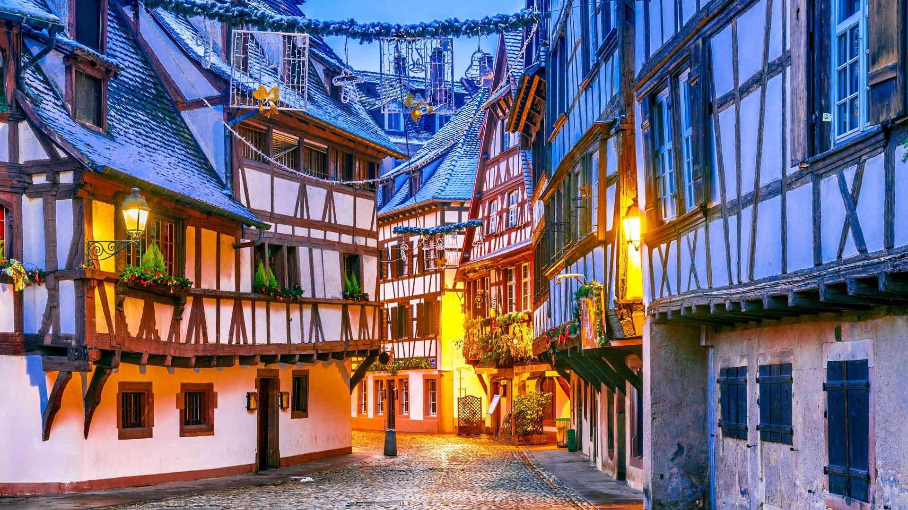

#### 20251206 Schokoladennikoläuse in einem Supermarktregal (© hydebrink/Shutterstock)

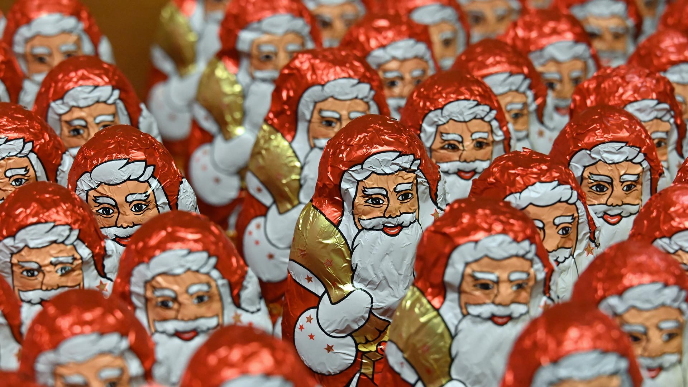

#### 20251206 Spider webs in Everglades National Park, Florida (© Troy Harrison/Getty Images)

#### 20251205 Maya site of Copán, Honduras (© diegograndi/Getty Images)

#### 20251204 Cheetah in Maasai Mara National Reserve, Narok, Kenya (© Andy Rouse/naturepl.com)

#### 20251203 秩父夜祭の屋台, 埼玉県 秩父市 (© Joshua Hawley/Alamy)

#### 20251203 Sandhill cranes at sunrise, Bosque del Apache National Wildlife Refuge, New Mexico (© Jack Dykinga/Minden Pictures)

#### 20251202 Willow Lake and Mount Blackburn, Wrangell-St. Elias National Park and Preserve, Alaska (© Patrick J. Endres/Getty Images)

#### 20251202 Whistler, British Columbia (© VisualCommunications/Getty Images)

#### 20251201 Natural arch carved in an iceberg, Antarctica (© Gabrielle/Adobe Stock)

#### 20251201 Adventskalendersäckchen mit süßen Überraschungen (© wideonet/Getty Images)

