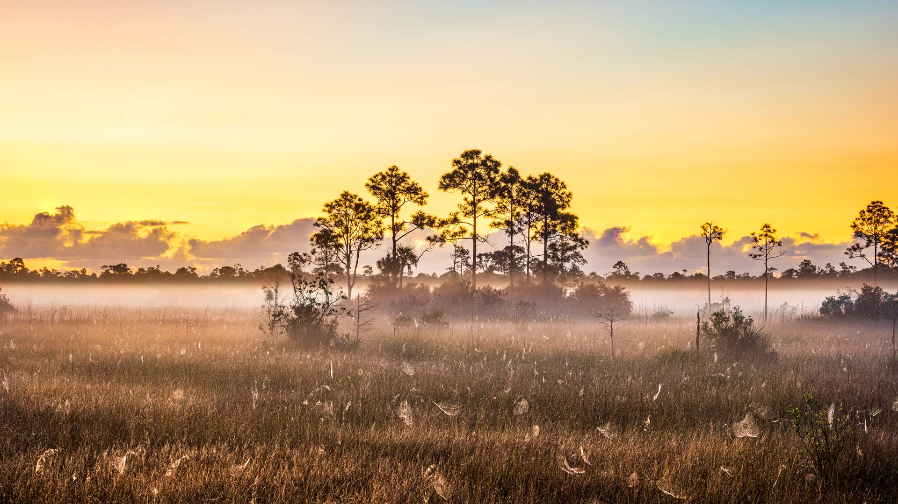
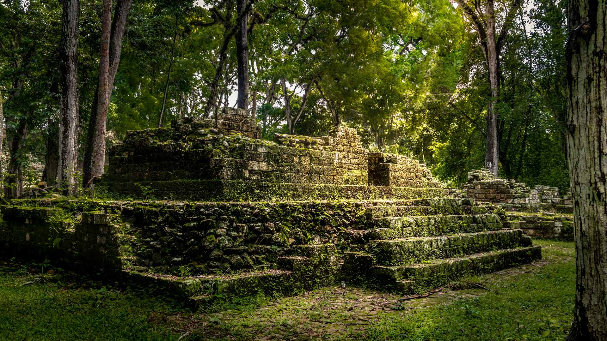
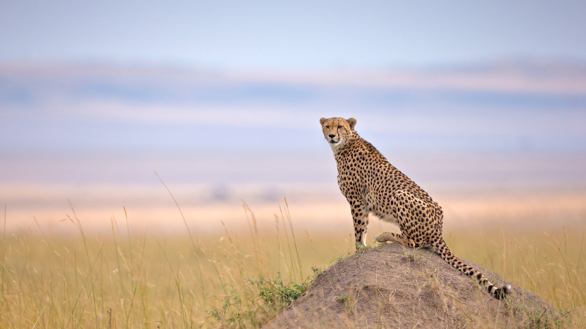
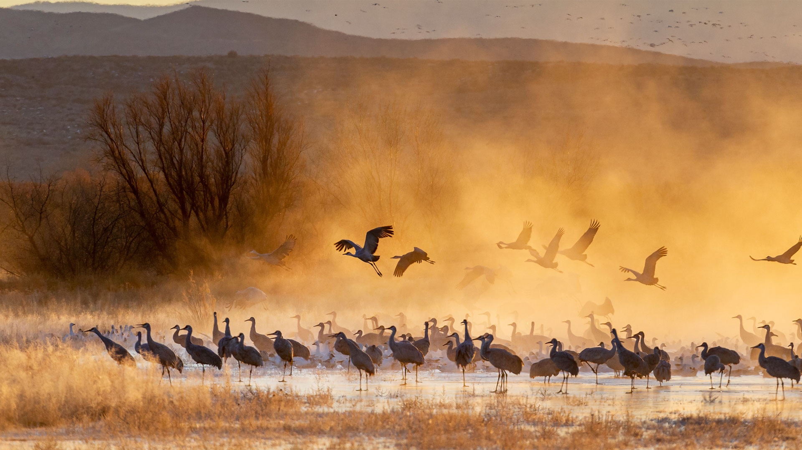
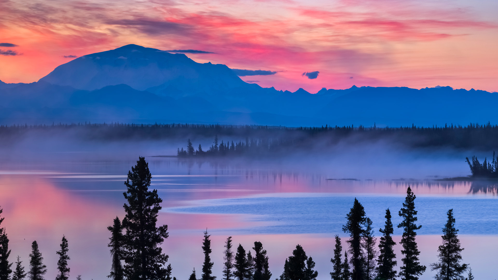
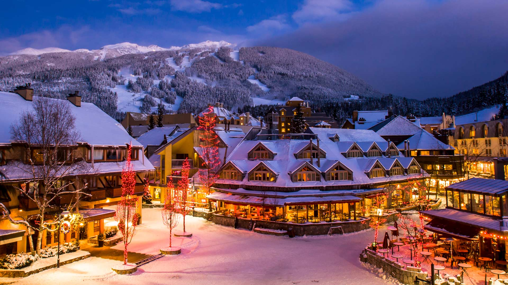
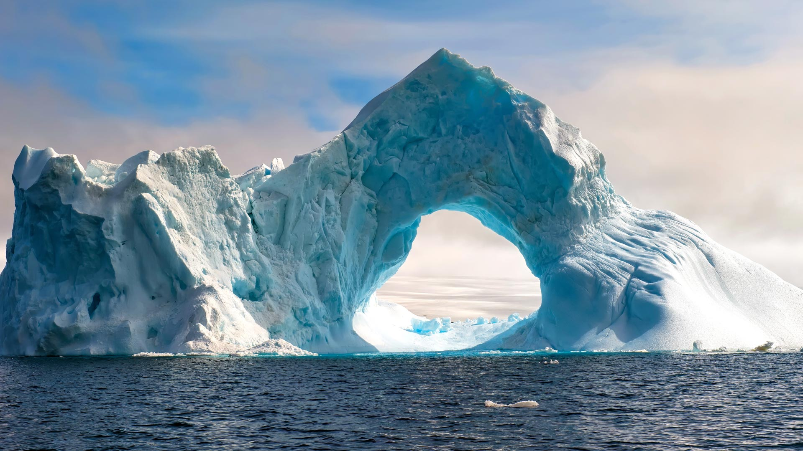

#### 20251206 大沼泽地国家公园的蜘蛛网，佛罗里达州，美国 (© Troy Harrison/Getty Images)

#### 20251205 Maya site of Copán, Honduras (© diegograndi/Getty Images)

#### 20251204 Cheetah in Maasai Mara National Reserve, Narok, Kenya (© Andy Rouse/naturepl.com)

#### 20251203 秩父夜祭の屋台, 埼玉県 秩父市 (© Joshua Hawley/Alamy)

#### 20251203 Sandhill cranes at sunrise, Bosque del Apache National Wildlife Refuge, New Mexico (© Jack Dykinga/Minden Pictures)

#### 20251202 Willow Lake and Mount Blackburn, Wrangell-St. Elias National Park and Preserve, Alaska (© Patrick J. Endres/Getty Images)

#### 20251202 Whistler, British Columbia (© VisualCommunications/Getty Images)

#### 20251201 Natural arch carved in an iceberg, Antarctica (© Gabrielle/Adobe Stock)

#### 20251201 Adventskalendersäckchen mit süßen Überraschungen (© wideonet/Getty Images)

