#### 20260129 The eight-story open atrium of Milwaukee City Hall, Wisconsin (© lavin photography/Getty Images)

#### 20260128 Whanganui National Park, Retaruke, New Zealand (© Matthew Micah Wright/Getty Images)

#### 20260127 Retiro Park, Madrid, Spain (© All rights reserved-Copyright/Getty Images)

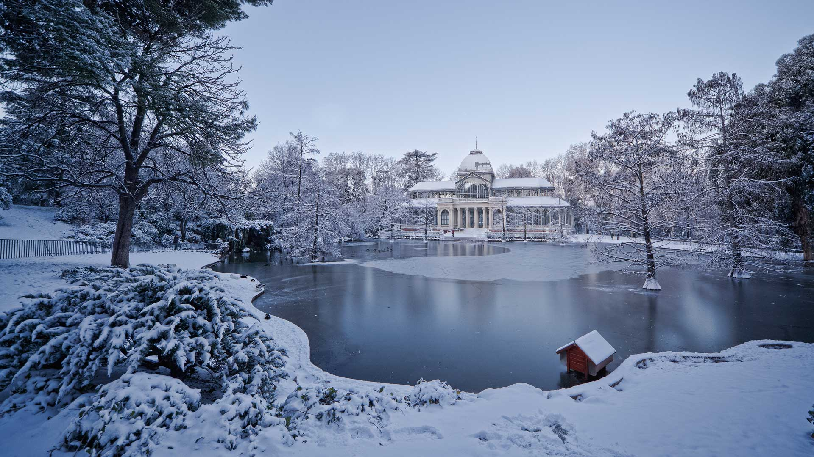

#### 20260127 Dalmatian pelicans, Lake Kerkini, Greece (© Guy Edwardes/naturepl.com)

#### 20260126 Neuschwanstein Castle, Bavaria, Germany (© www.fredconcha.com @ All Rights Reserved/Getty Images)

#### 20260126 Une mésange bleue en hiver (© Marc Andreu/Getty Images)

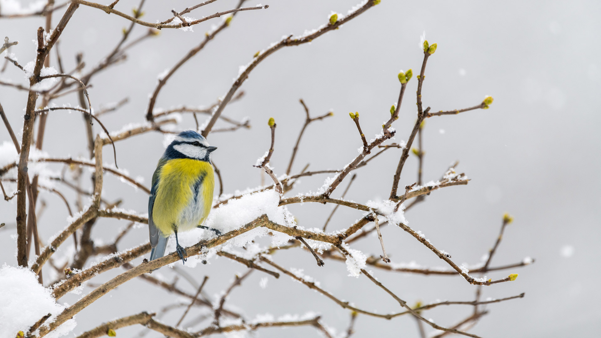

#### 20260125 Burns National Heritage Park, Ayr, Ayrshire, Scotland (© Alister Firth/Alamy)

#### 20260124 Andermatt village in the Alps, Switzerland (© Xantana/Getty Images)

#### 20260123 Sheep grazing in snow, Iceland (© Christophe Lehenaff/Getty Images)

#### 20260122 Mimram-Fußgängerbrücke über den Rhein zwischen Frankreich und Deutschland (© Leonid Andronov/Alamy)

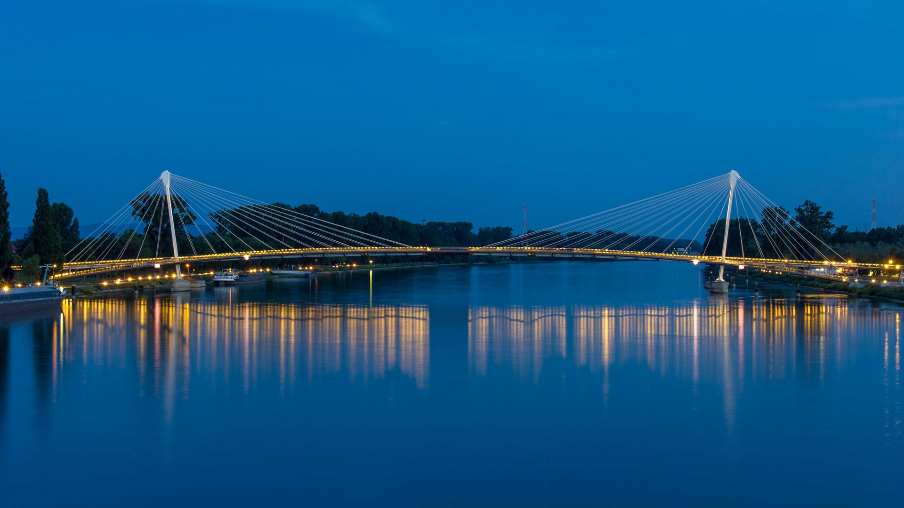

#### 20260122 Karlovy Vary, Bohemia, Czechia (© Henryk Sadura/Getty Images)

#### 20260121 Eurasian red squirrel (© Galina Jacyna/Getty Images)

#### 20260120 栖息在树枝上的北长尾山雀，大庆市，中国黑龙江省 (© Visual China Group/Getty Images)

#### 20260120 Gentoo penguin, Petermann Island, Antarctica (© Paul Souders/DanitaDelimont.com/Alamy)

#### 20260120 雪に覆われた星峠の棚田, 新潟県 十日町市 (© solakoudai/Shutterstock)

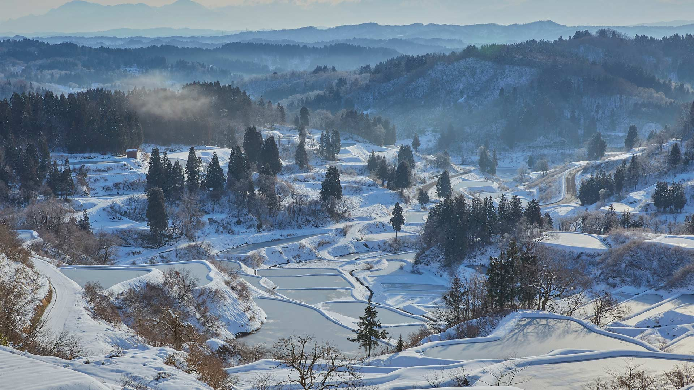

#### 20260119 Washington Monument seen from Lincoln Memorial, Washington, DC (© RickSause/Getty Images)

#### 20260119 エクスターンシュタイネ岩塔群, ドイツ (© Michael Sroka/Getty Images)

#### 20260119 亚伯拉罕湖冰封景象，艾伯塔省，加拿大 (© Luis F Arevalo/Getty Images)

#### 20260118 White Sands National Park, New Mexico (© Francesco Carucci/Getty Images)

#### 20260118 Fernando de Noronha, Pernambuco, Brazil (© Stephanie Kenner/Getty Images)

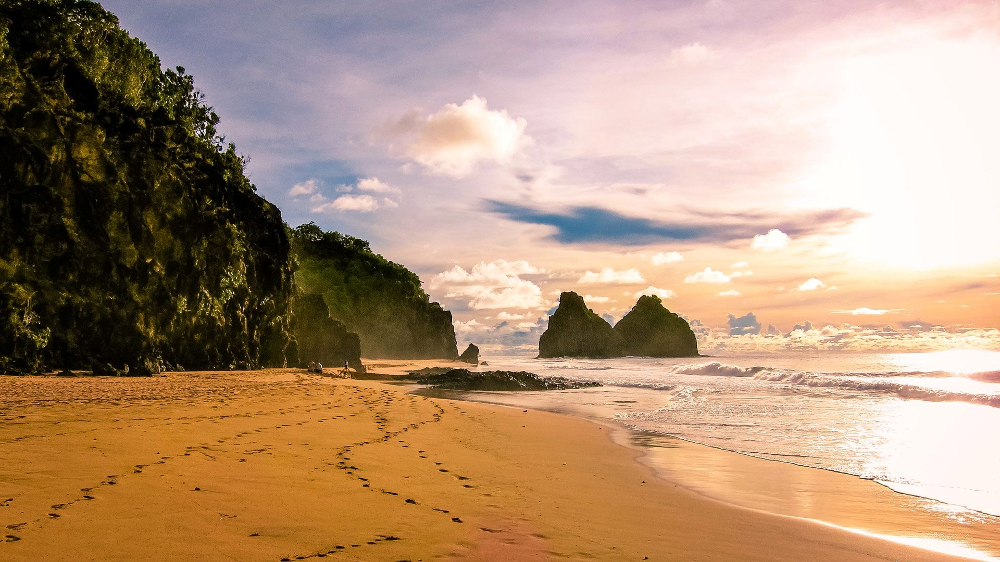

#### 20260117 Basilica of San Francesco di Paola, Naples, Italy (© javarman3/Getty Images)

#### 20260116 Leopard at Etosha National Park, Namibia (© Norbert Achtelik/Cavan Images)

#### 20260116 Cerf cachés dans la forêt (© AB Photography/Getty images)

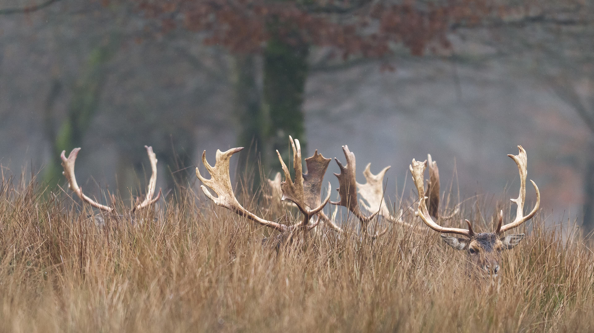

#### 20260115 The fishing village of Reine, Norway (© Roberto Moiola/Cavan Images/SuperStock)

#### 20260114 The staircase of the Fortress of Palamidi, Nafplio, Greece (© George Pachantouris/Getty Images)

#### 20260113 Vale of Clwyd, Wales (© Valerie Blencowe/Getty Images)

#### 20260112 Eurasian otter and pup, Estonia (© Sven Zacek/naturepl.com)

#### 20260112 ガーラ湯沢スキー場, 新潟県 (© Metta Bunkeaw/Alamy)

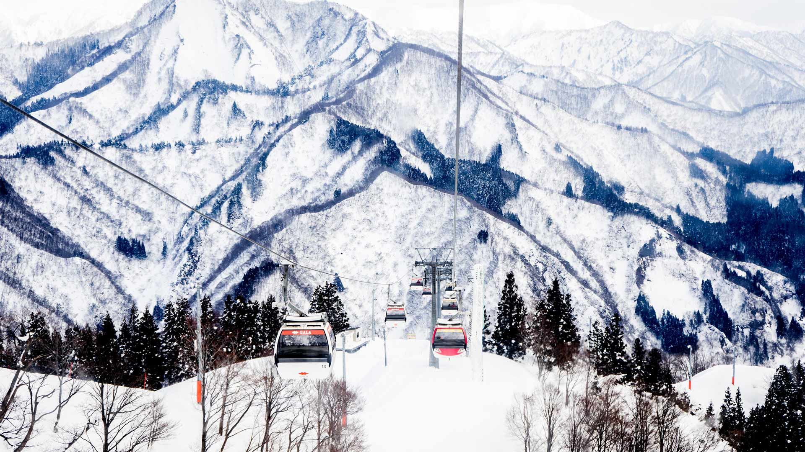

#### 20260111 Blue walls of Chefchaouen, Morocco (© AnetteAndersen/Getty Images)

#### 20260110 The Matterhorn reflected in Lake Stellisee at sunrise, Zermatt, Switzerland (© Andy Trowbridge/naturepl.com)

#### 20260109 Giant redwood trees in Muir Woods National Monument, California (© photo by canderson/Getty Images)

#### 20260109 Eurasische Luchse beim Spielen im Schnee im Wald, Bayern (© imagebroker/david & micha sheldon/Getty Images)

#### 20260109 Coucher de soleil à Bonifacio, Corse, France (© Wirestock/Getty Images)

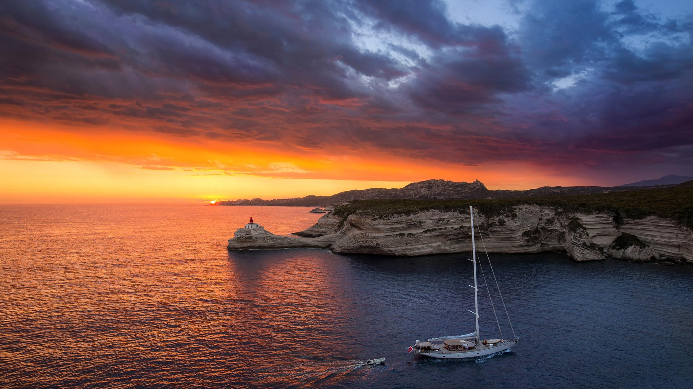

#### 20260109 Yellow-chevroned parakeets in a mango tree, Pantanal, Brazil (© Uwe-Bergwitz/Getty Images)

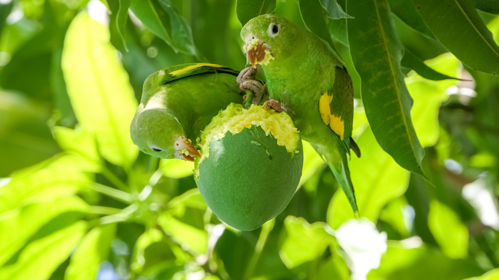

#### 20260108 Starling murmuration over the ruins of Brighton's West Pier, England (© Philip Reeve/Photodisc/Getty Images)

#### 20260107 Turret Arch framed by North Window in Arches National Park, Utah (© Jim Patterson/TANDEM Stills + Motion)

#### 20260106 Nuuk, Greenland (© nevereverro/Getty Images)

#### 20260106 Château de Versailles, France (© Mistervlad/Shutterstock)

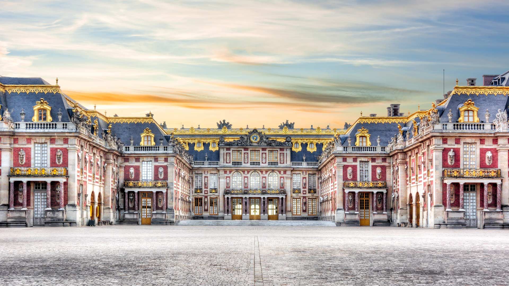

#### 20260105 A herd of impalas, Londolozi Game Reserve, South Africa (© Mint Images/Getty Images)

#### 20260104 Kings Mountain, Chugach Mountains, Alaska (© Chris Moore - Exploring Light Photography/TANDEM Stills + Motion)

#### 20260103 Staubbach Falls at Lauterbrunnen, Canton of Bern, Switzerland (© pongnathee kluaythong/Getty Images)

#### 20260102 Aerial view of Venice, Italy (© Clement Leonard/Getty Images)

#### 20260101 えびす岩・大黒岩, 北海道 (© Ambling Images/Alamy)

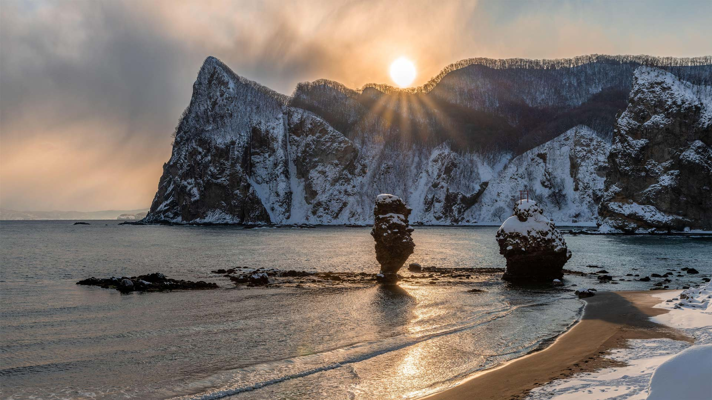

#### 20260101 Arctic fox sleeping (© Chansak Joe/Getty Images)

#### 20260101 Frostbedeckte Bäume entlang des Flusses Loisach, Kochelsee, Bayern (© Malorny/Getty Images)

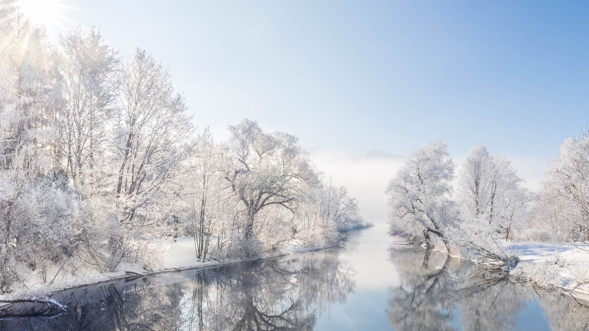

