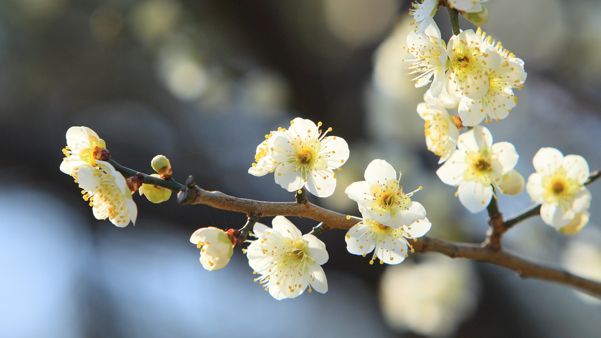
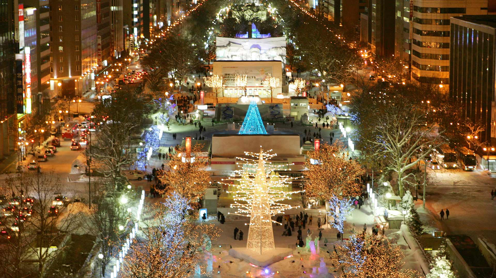
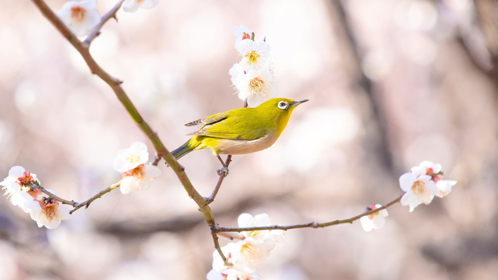
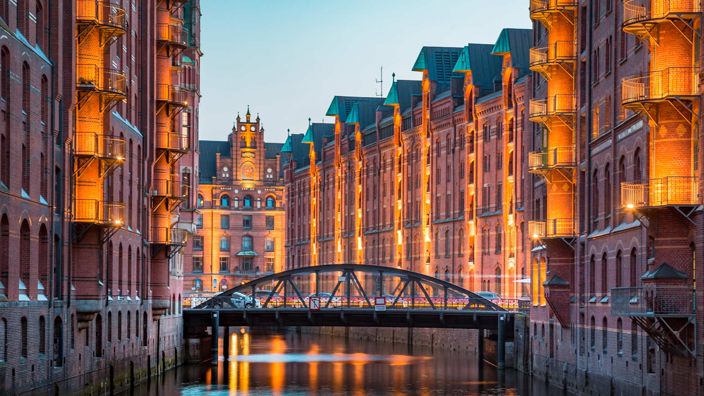
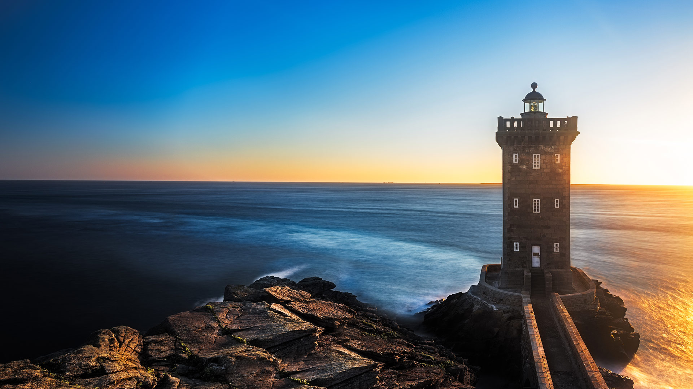

#### 20260214 荷包牡丹 (© Dorene Hookey/Cavan Images)

#### 20260213 Third Thai-Lao Friendship Bridge connecting Laos and Thailand (© chaiyut samsuk/Getty Images)

#### 20260212 Blue-footed booby, Galápagos Islands, Ecuador (© Karine Aigner/TANDEM Stills + Motion)

#### 20260212 Innenansicht des Hauptsaals des Kinos Zoo Palast in Berlin (© dpa picture alliance/Alamy)

#### 20260211 Détails d’un masque du Carnaval de Nice, Alpes-Maritimes (© litchi cyril photographe/Shutterstock)

#### 20260211 白梅の花 (© EarthScapeImageGraphy/Getty Images)

#### 20260211 Salt flats in Badwater Basin, Death Valley National Park, California (© Jim Patterson/TANDEM Stills + Motion)

#### 20260210 Islets of Es Vedrà and Es Vedranell, Ibiza, Spain (© L. Apolli/Getty Images)

#### 20260209 Amur leopard cat, Russia (© Valeriy Maleev/naturepl.com)

#### 20260208 Corfu at night, Greece (© whitewizzard/Getty Images)

#### 20260207 大通公園, 札幌市 (© Reuters/Kimimasa Mayama)

#### 20260207 Salar de Uyuni salt flats in Bolivia (© Abstract Aerial Art/Getty Images)

#### 20260206 Ra Gusela peak at Giau Pass, near Cortina d'Ampezzo, Italy (© Tomasz Podolski/Getty Images)

#### 20260205 Salt evaporation ponds on the island of Gozo, Malta (© Marius Roman/Getty Images)

#### 20260204 梅の枝に止まるメジロ (© naotoshinkai/Getty Images)

#### 20260204 Rosa Parks in stained glass window, Shorter Community African Methodist Episcopal Church, Denver (© Cyrus McCrimmon/The Denver Post via Getty Images)

#### 20260204 Speicherstadt in der Dämmerung, Hamburg (© bluejayphoto/Getty Images)

#### 20260204 雪中​​的红鸢 (© Carl Mckie/500px/Getty Images)

#### 20260203 Emerald Bay and Fannette Island, Lake Tahoe, California (© Bill Stevenson/Cavan Images)

#### 20260202 Le phare de Kermorvan au coucher de soleil, Bretagne, France (© Fisfra/Getty Images)

#### 20260201 奥林达的彩色房子, 巴西 (© Robert Pekar/Alamy)

#### 20260201 セイタカシギ, フランス (© Antonio Sementa/500px/Getty Images)

#### 20260201 US Army nurses arrive in Greenock, Scotland, 1944 (© Stocktrek Images, Inc/Alamy)

#### 20260201 Alpine marmots, Hohe Tauern National Park, Austria (© Raimund Linke/Getty Images)

