#### 20260331 Paradise Cave, Phong Nha-Ke Bang National Park, Vietnam (© Pakawat Thongcharoen/Getty Images)

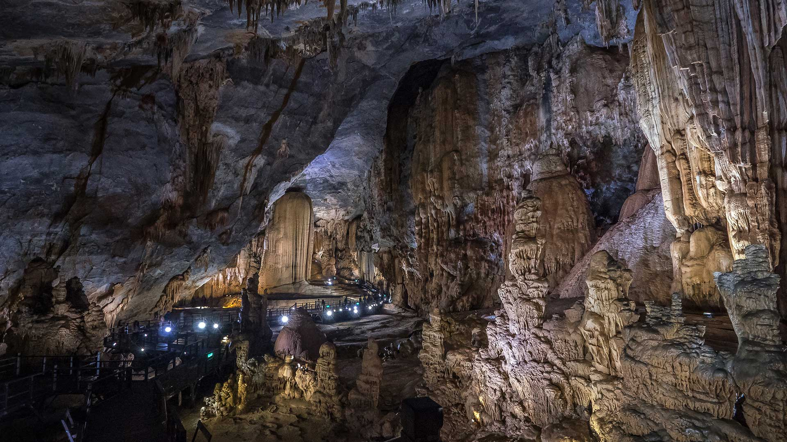

#### 20260330 Demoiselle cranes, India (© Axel Gomille/Nature Picture Library)

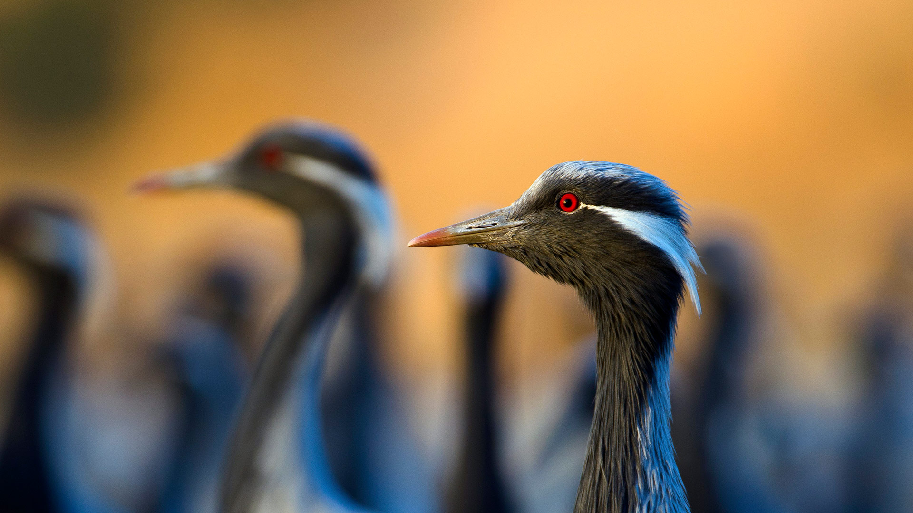

#### 20260329 Astronomische Uhr am Rathaus von Ulm, Baden‑Württemberg (© Tomekbudujedomek/Getty Images)

#### 20260329 Peggy's Point Lighthouse, Atlantic Coast, Nova Scotia, Canada (© Prashanth Bala/Shutterstock)

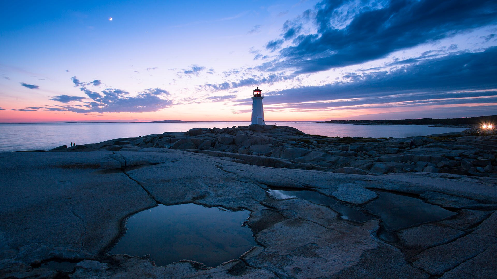

#### 20260328 African buffalo, Ngorongoro Crater, Tanzania (© jesuss8/500px/Getty Images)

#### 20260328 Aurora over Spirit Island on Maligne Lake, Jasper National Park, Alberta, Canada (© Mumemories/Getty Images)

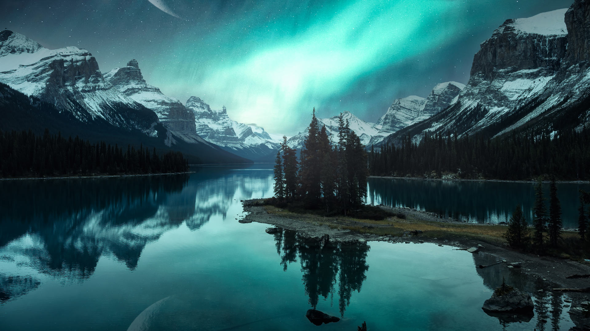

#### 20260327 日本一早い桜、沖縄 (© @hapidayss/Getty Images)

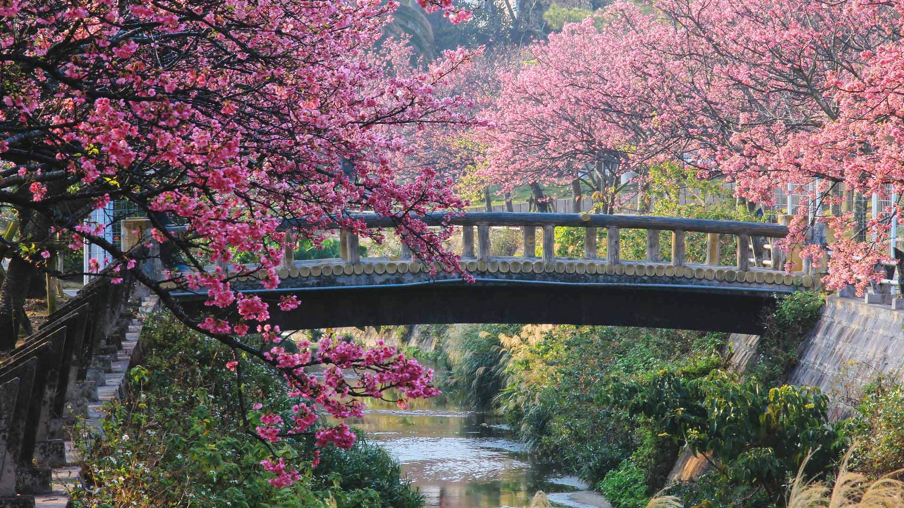

#### 20260327 Radio City Music Hall in New York City (© Clarence Holmes Photography/Alamy)

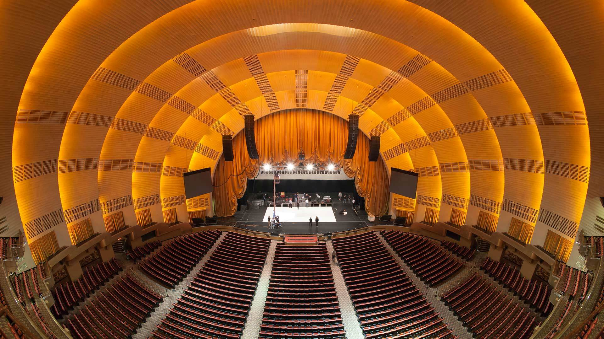

#### 20260326 Logan Creek Suspension Bridge, West Coast Trail, Canada (© Tandem Stock/Adobe Stock)

#### 20260325 Juvenile manatees in a freshwater spring, Crystal River, Florida (© Gregory Sweeney/Getty Images)

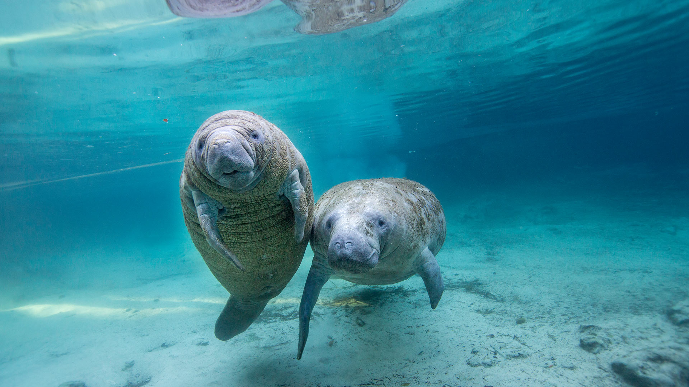

#### 20260325 Königssee Lake, Bavaria, Germany (© EyeEm Mobile GmbH/Getty Images)

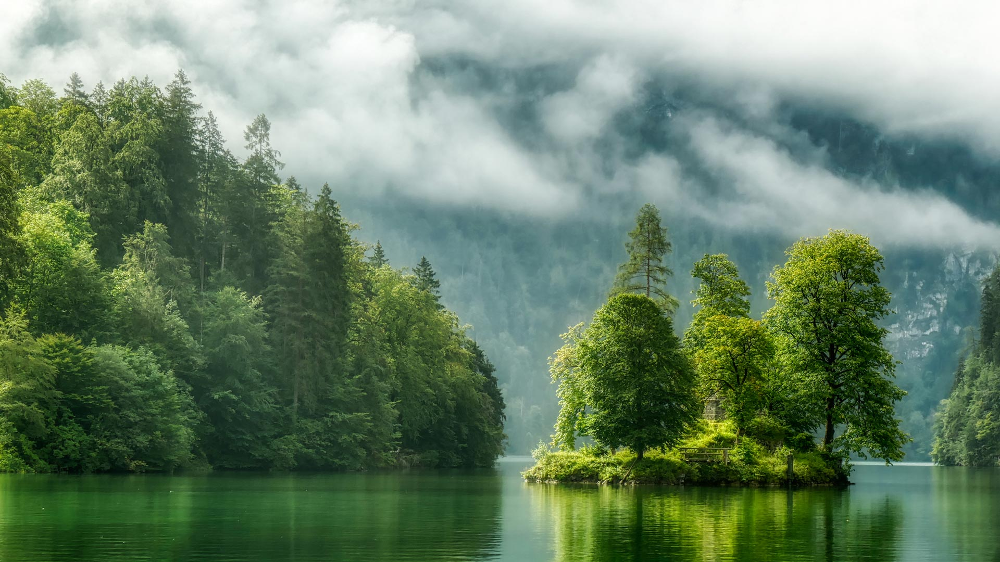

#### 20260325 Pine trees reflected in the Forgetmenot Pond in Kananaskis Country, Alberta (© chinaface/Getty images)

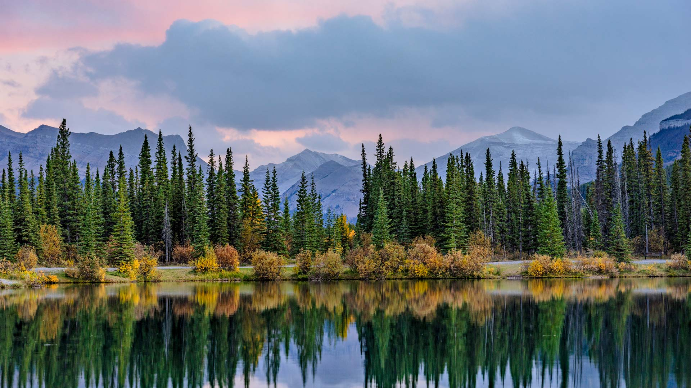

#### 20260324 Cherry blossoms at East Lake Cherry Blossom Park, Wuhan, China (© Zhang Qiao/VCG/Getty Images)

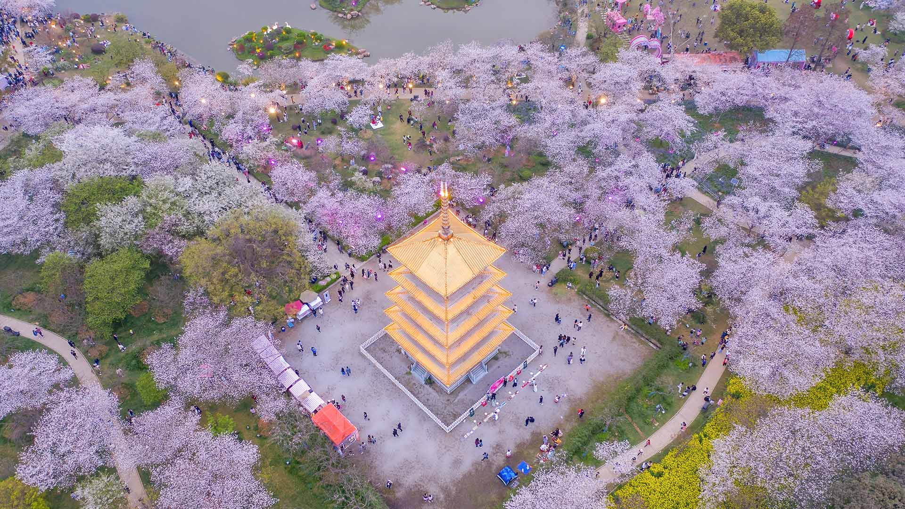

#### 20260324 Drohnenaufnahme des Peilturms am Kap Arkona, Rügen, Mecklenburg‑Vorpommern (© Stefan Dinse/Getty Images)

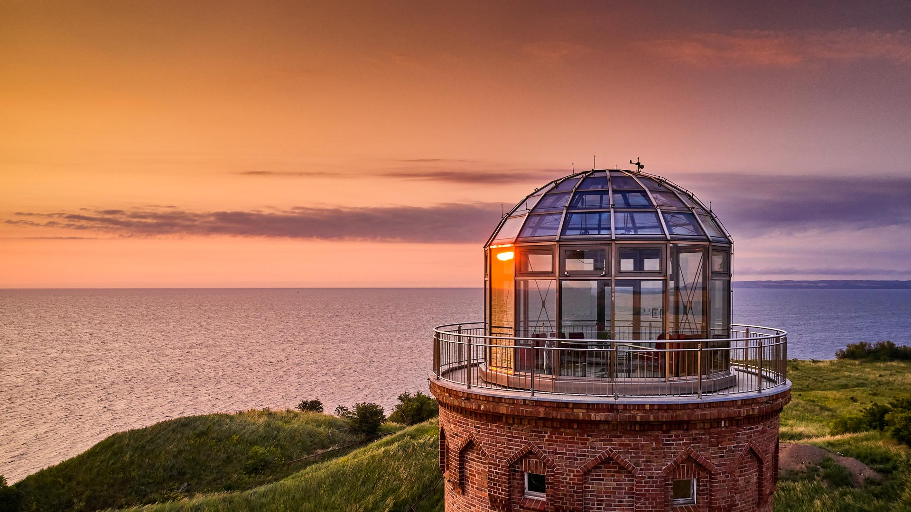

#### 20260323 Lightning storm over saguaro cacti, Sonoran Desert, Arizona (© Jack Dykinga/Nature Picture Library)

#### 20260322 Lake Tanganyika, Africa (© BEST-BACKGROUNDS/NASA/Shutterstock)

#### 20260321 Letea Forest, Danube Delta, Romania (© Wild Wonders of Europe/Widstrand/Nature Picture Library)

#### 20260320 Snowdrops in spring (© klagyivik/Getty Images)

#### 20260320 春日樱花，上海，中国 (© junyyeung/Getty Images)

#### 20260320 Vue sur le quartier d’Endoume, les Îles du Frioul et le Château d'If, Marseille (© RIEGER Bertrand/hemis.fr/Alamy)

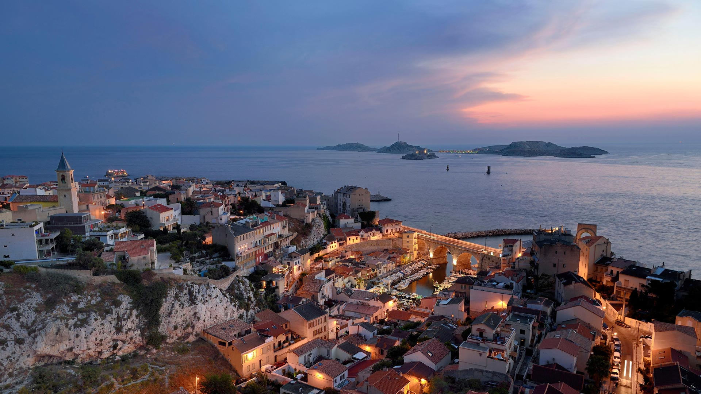

#### 20260319 Short-beaked echidna, Adelaide Hills, Australia (© Etienne Littlefair/naturepl.com)

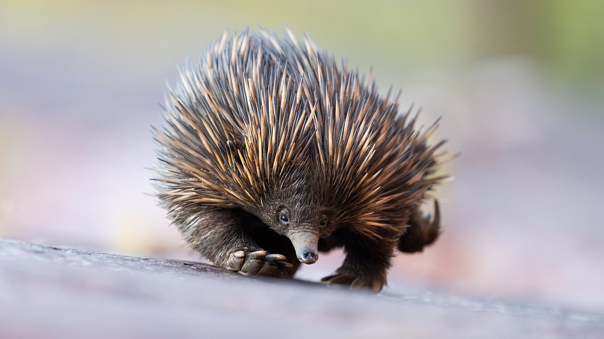

#### 20260318 Cherry blossoms at Tom McCall Waterfront Park, Portland, Oregon (© Eric Vogt/Tandem Stills + Motion)

#### 20260317 Grianan of Aileach ring fort, Donegal, Ireland (© aluxum/Getty Images)

#### 20260317 Cable car and Sugarloaf Mountain, Rio de Janeiro, Brazil (© f11photo/Shutterstock)

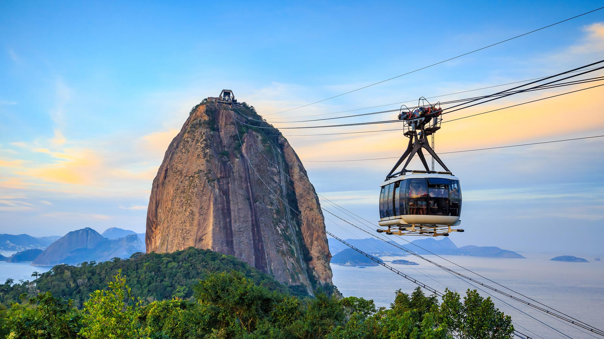

#### 20260316 Giant panda eating bamboo, China (© Entwicklungsknecht/Getty Images)

#### 20260316 Aurora over Spirit Island on Maligne Lake, Jasper National Park, Alberta (© Mumemories/istock/Getty Images)

#### 20260315 Pacific Rim National Park Reserve, Vancouver Island, Canada (© EmilyNorton/Getty Images)

#### 20260315 Königssee bei Schönau am Königssee, Bayern (© EyeEm Mobile GmbH/Getty Images)

#### 20260314 Mute swan with chicks, Hesse, Germany (© Wilfried Martin/Getty Images)

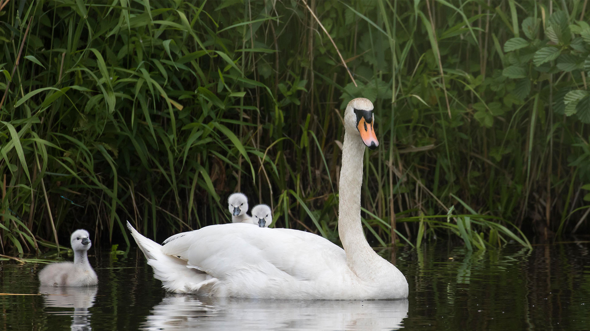

#### 20260314 Lanyon Quoit, a Neolithic dolmen in Cornwall, England (© Helen Hotson/Alamy)

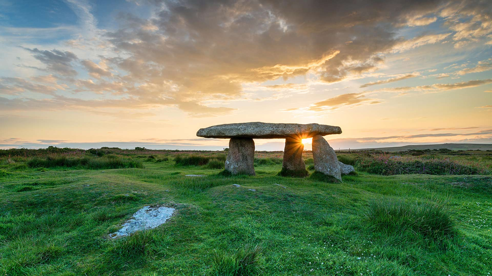

#### 20260313 Vaults of the Church of Notre Dame de Bon-Port, Les Sables-d'Olonne, France (© Helmut Meyer zur Capellen/Alamy)

#### 20260312 東大寺, 奈良県 奈良市 (© Sean Pavone/Alamy)

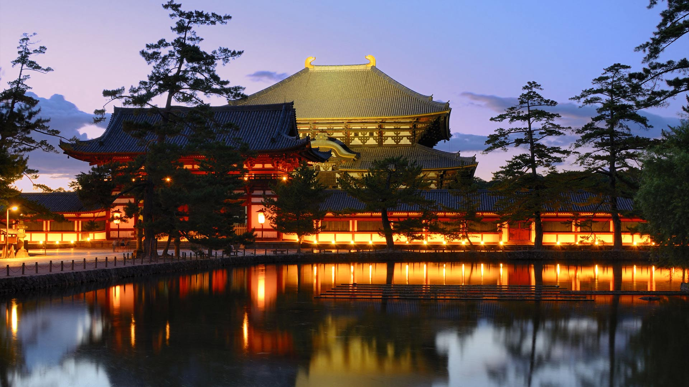

#### 20260312 Juvenile sunbittern displaying at nest, Ecuador (© Andy Rouse/naturepl.com)

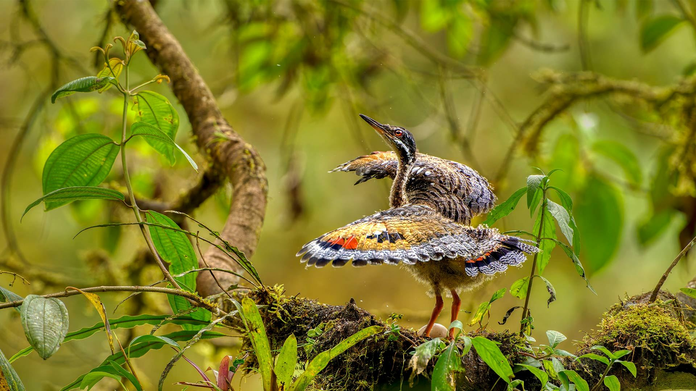

#### 20260311 復興の願いが書かれた灯籠, 宮城県 名取市 (© NurPhoto/Getty Images)

#### 20260311 Peach trees in bloom, Cieza, Murcia, Spain (© Juan Maria Coy Vergara/Getty Images)

#### 20260310 Geothermal blue pool Bláhver at Hveravellir, Iceland (© Juan Maria Coy Vergara/Getty Images)

#### 20260309 Gray seal sleeping on the beach, Orkney Islands, Scotland (© Andrew Mason/Minden Pictures)

#### 20260308 Astronomical clock at Town Hall of the City of Ulm, Germany (© Tomekbudujedomek/Getty Images)

#### 20260308 Neues Schloss am Schlossplatz in Stuttgart, Baden‑Württemberg (© Jorg Greuel/Getty Images)

#### 20260308 Snowy owl near the Canadian Rockies, Canada (© www.harshadventure.com/Getty Images)

#### 20260308 Jeune cormoran (© GiovanniCaruso/GettyImages)

#### 20260307 Pacific Rim National Park Reserve, Vancouver Island, Canada (© EmilyNorton/Getty Images)

#### 20260307 Le Lac Gentau enneigé, Pyrénées Atlantiques (© MICHAUX Stéphane/Hemis.fr/Alamy)

#### 20260307 Sunrise on the Brocken, Harz National Park, Germany (© imageBROKER/AVTG/Getty Images)

#### 20260306 The Wave residential building, Vejle, Denmark (© Frank Bach/Alamy)

#### 20260305 Evening over Göreme, Cappadocia, Türkiye (© ONNAJA/Getty Images)

#### 20260304 Purple crocus flowers, Seven Rila Lakes, Bulgaria (© Maya Karkalicheva/Getty Images)

#### 20260303 元宵节期间悬挂的宫灯，北京自贡灯会现场，北京，中国 (© Grisha Bruev/Shutterstock)

#### 20260303 竹筒から顔をのぞかせる可愛いひな人形 (© Bong Grit/Getty Images)

#### 20260303 African elephant calf playing with its mother, Masai Mara National Reserve, Kenya (© Denis-Huot/naturepl.com)

#### 20260302 Harbor and longtail boats at Ko Samui, Thailand (© Foto2rich/Shutterstock)

#### 20260301 Suffragette celebrations, August 27, 1920, New York City (© Keystone/Hulton Archive/Getty Images)

#### 20260301 Snowy owl near the Canadian Rockies (© www.harshadventure.com/Moment/Getty Images)

#### 20260301 伊维萨岛, 巴利阿里群岛, 西班牙 (© tokar/Shutterstock)

