#### 20260311 復興の願いが書かれた灯籠, 宮城県 名取市 (© NurPhoto/Getty Images)

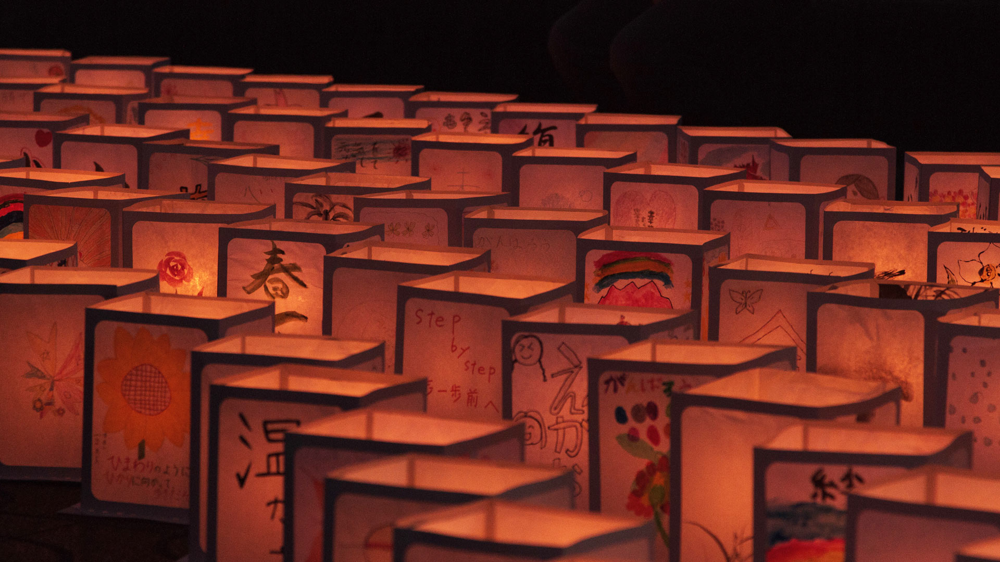

#### 20260311 盛开的桃树, 谢萨, 穆尔西亚, 西班牙 (© Juan Maria Coy Vergara/Getty Images)

#### 20260310 Geothermal blue pool Bláhver at Hveravellir, Iceland (© Juan Maria Coy Vergara/Getty Images)

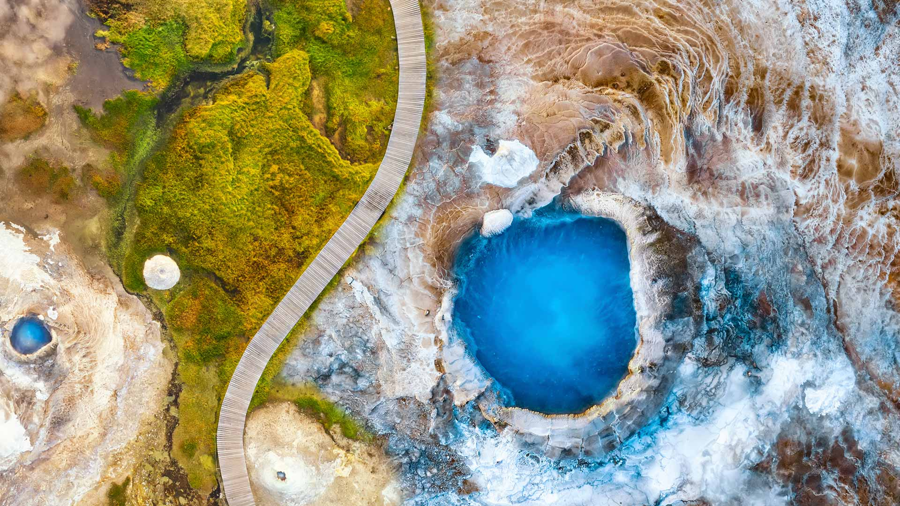

#### 20260309 Gray seal sleeping on the beach, Orkney Islands, Scotland (© Andrew Mason/Minden Pictures)

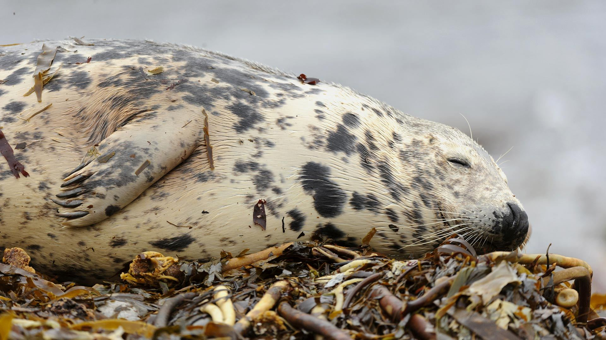

#### 20260308 Astronomical clock at Town Hall of the City of Ulm, Germany (© Tomekbudujedomek/Getty Images)

#### 20260308 Neues Schloss am Schlossplatz in Stuttgart, Baden‑Württemberg (© Jorg Greuel/Getty Images)

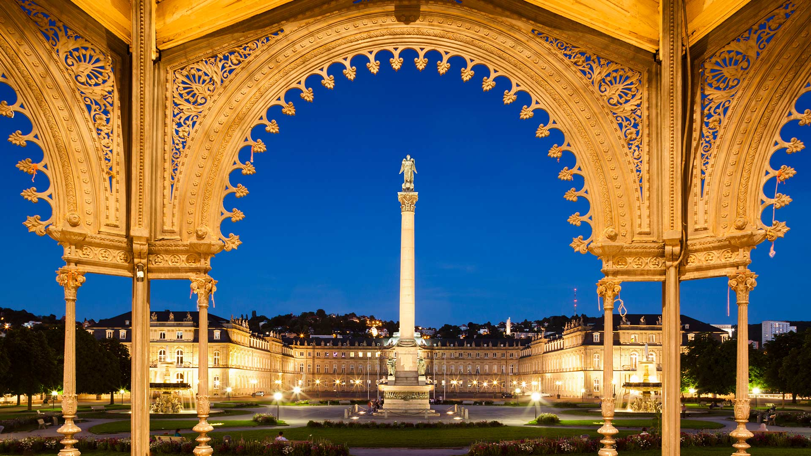

#### 20260308 Jeune cormoran (© GiovanniCaruso/GettyImages)

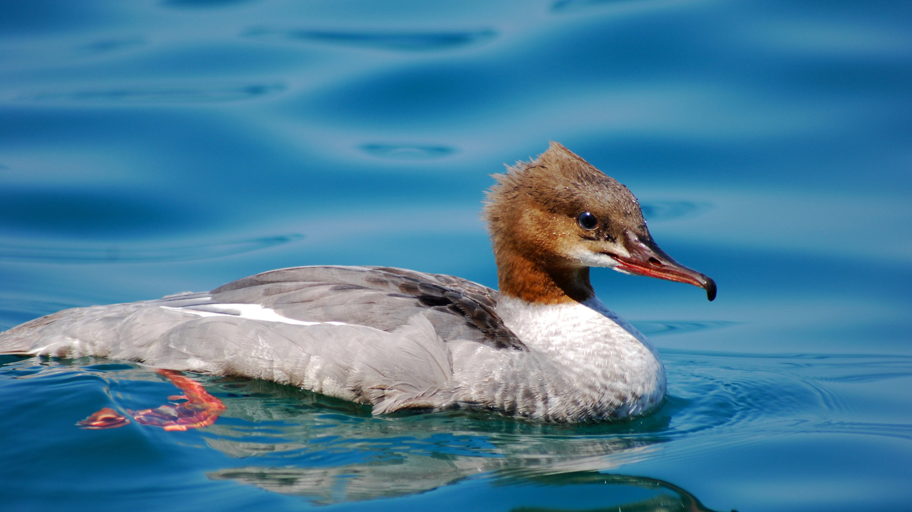

#### 20260307 Pacific Rim National Park Reserve, Vancouver Island, Kanada (© EmilyNorton/Getty Images)

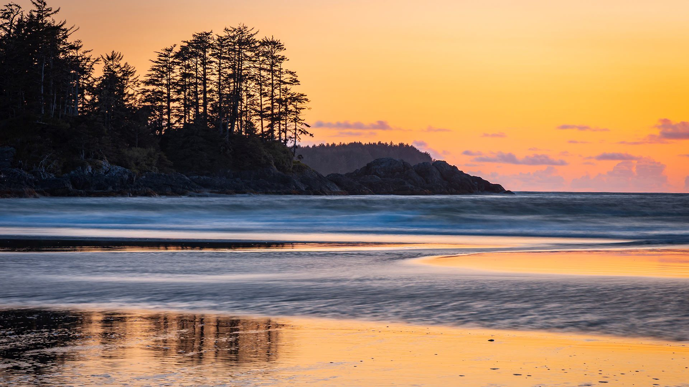

#### 20260307 Le Lac Gentau enneigé, Pyrénées Atlantiques (© MICHAUX Stéphane/Hemis.fr/Alamy)

#### 20260307 Sunrise on the Brocken, Harz National Park, Germany (© imageBROKER/AVTG/Getty Images)

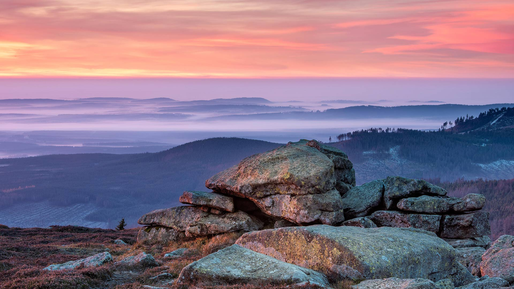

#### 20260306 The Wave residential building, Vejle, Denmark (© Frank Bach/Alamy)

#### 20260305 Evening over Göreme, Cappadocia, Türkiye (© ONNAJA/Getty Images)

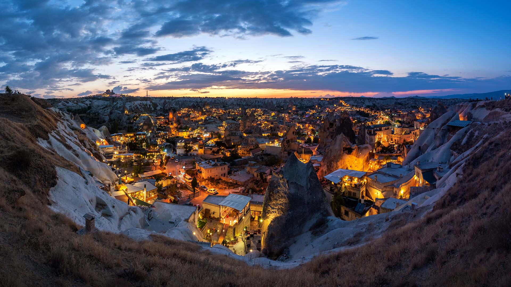

#### 20260304 Purple crocus flowers, Seven Rila Lakes, Bulgaria (© Maya Karkalicheva/Getty Images)

#### 20260303 元宵节期间悬挂的宫灯，北京自贡灯会现场，北京，中国 (© Grisha Bruev/Shutterstock)

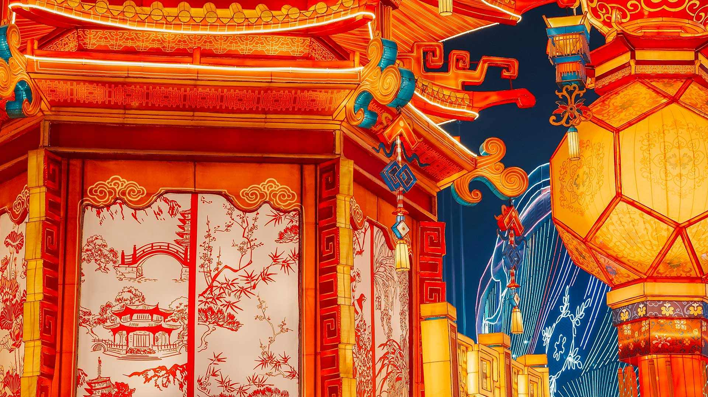

#### 20260303 竹筒から顔をのぞかせる可愛いひな人形 (© Bong Grit/Getty Images)

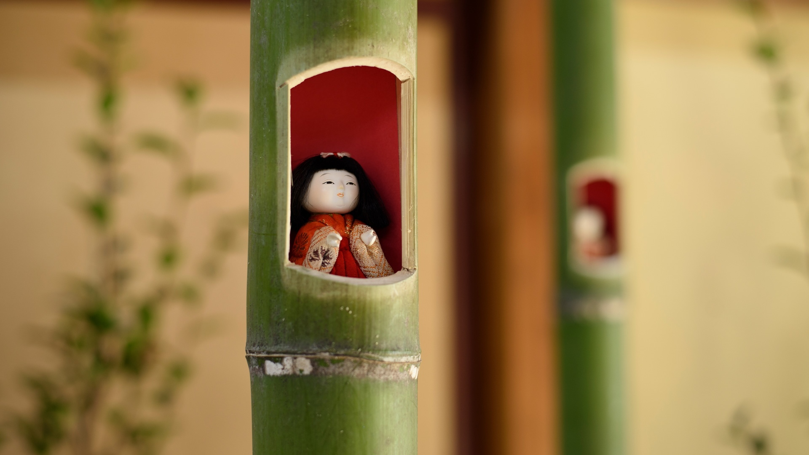

#### 20260303 African elephant calf playing with its mother, Masai Mara National Reserve, Kenya (© Denis-Huot/naturepl.com)

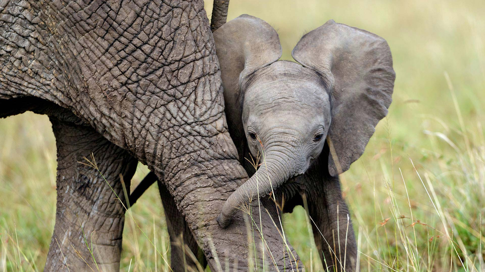

#### 20260302 Harbor and longtail boats at Ko Samui, Thailand (© Foto2rich/Shutterstock)

#### 20260301 Suffragette celebrations, August 27, 1920, New York City (© Keystone/Hulton Archive/Getty Images)

#### 20260301 Snowy owl near the Canadian Rockies (© www.harshadventure.com/Moment/Getty Images)

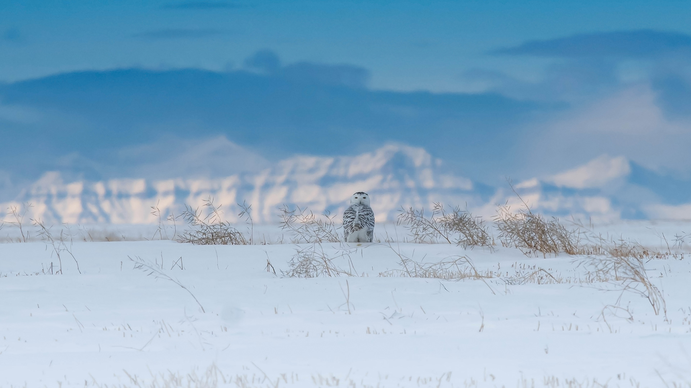

#### 20260301 伊维萨岛, 巴利阿里群岛, 西班牙 (© tokar/Shutterstock)

