#### 20260414 海葵中的普通小丑鱼, 拉贾安帕特群岛, 印度尼西亚 (© Magnus Lundgren/Nature Picture Library)

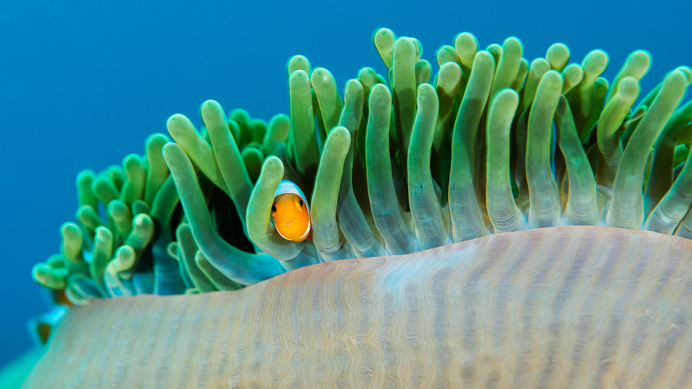

#### 20260413 Zilpzalp, Deutschland (© Andyworks/Getty Images)

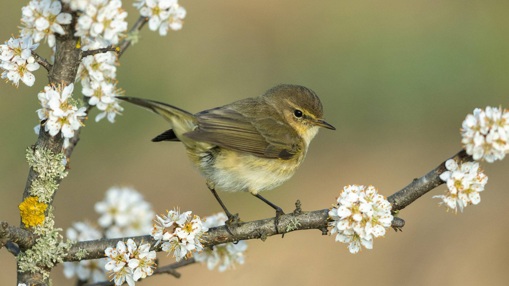

#### 20260413 Milky Way over Anza-Borrego Desert State Park, California (© Kevin Key/Slworking)/Getty Images)

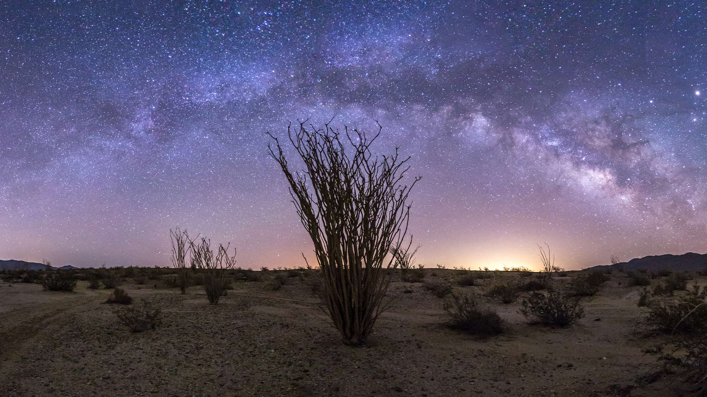

#### 20260412 City lights streak below, taken from the International Space Station (© NASA)

#### 20260411 Le Trocadéro et la Tour Eiffel à l’aube, Paris (© Alexander Spatari/Getty Images)

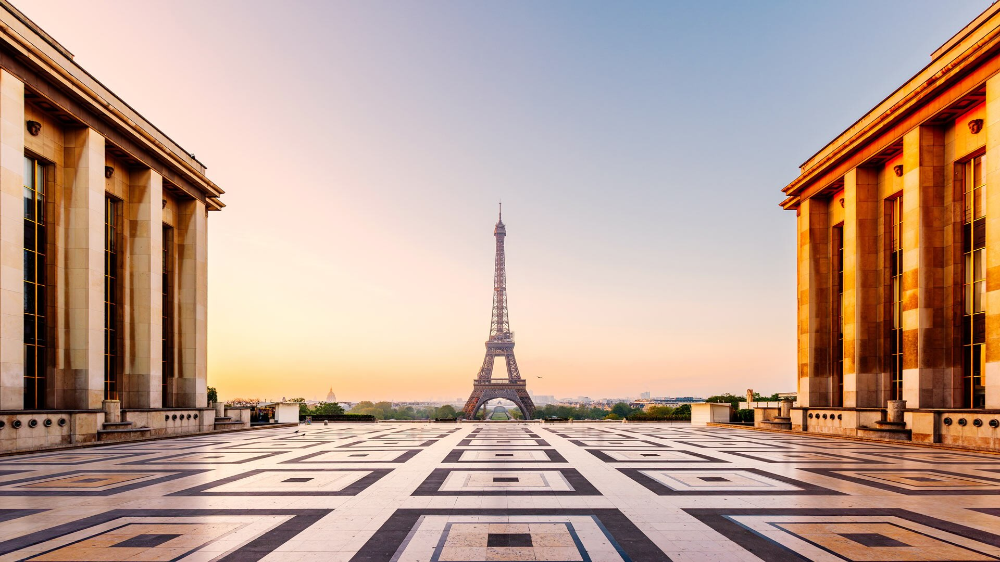

#### 20260411 A canopy of cherry blossoms in Stanley Park, Vancouver (© WendyNordvikCarr/Getty Images)

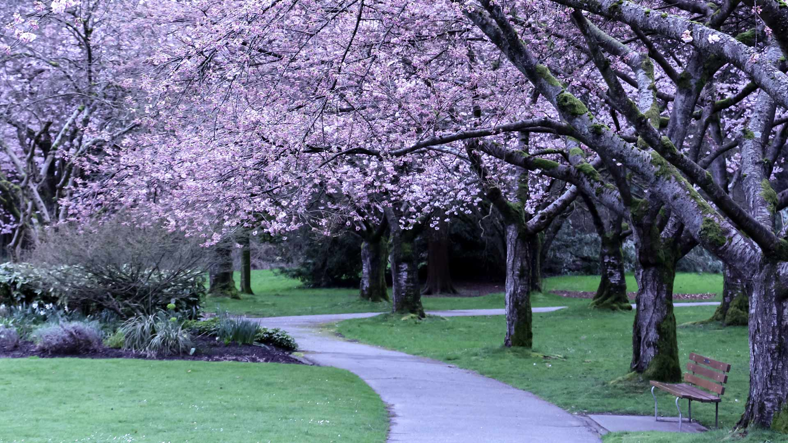

#### 20260411 Papagayo Beach, Lanzarote, Canary Islands, Spain (© Gavin Hellier/Getty Images)

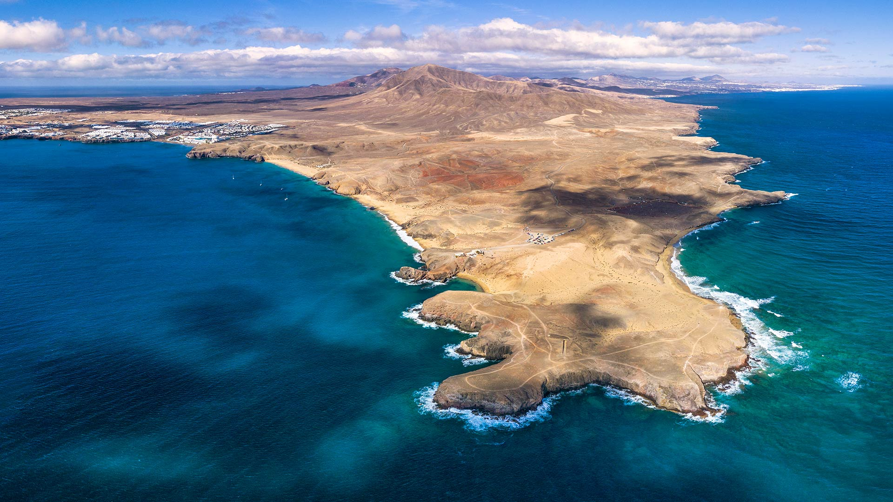

#### 20260410 Two young red foxes at Karula National Park, Estonia (© Sven Zacek/Nature Picture Library)

#### 20260409 Sgwd yr Eira waterfall, Bannau Brycheiniog National Park, Wales (© Guy Edwardes/Nature Picture Library)

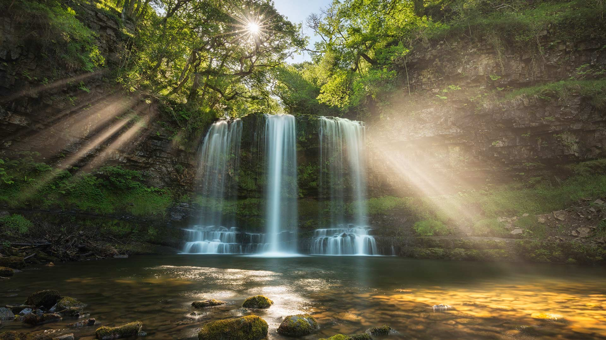

#### 20260408 Seattle, Washington (© Jim Patterson/Tandem Stills + Motion)

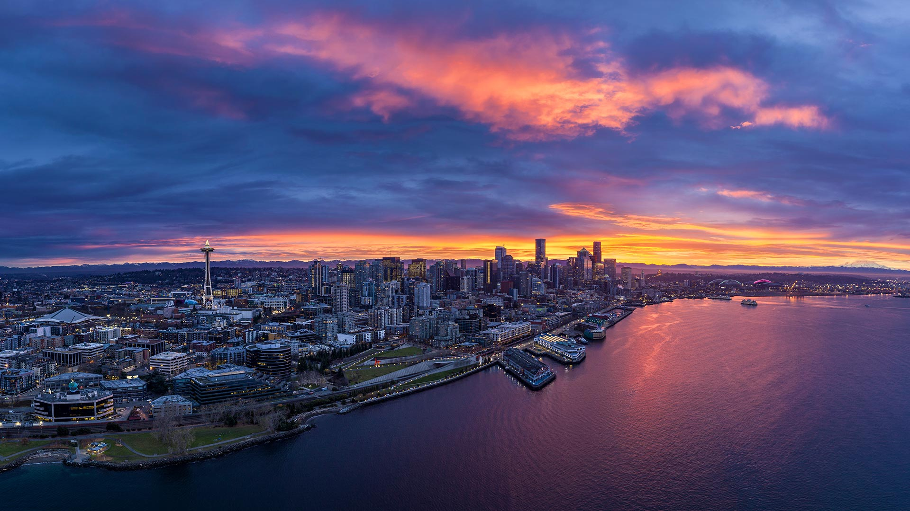

#### 20260407 Beaver, Germany (© Andyworks/Getty Images)

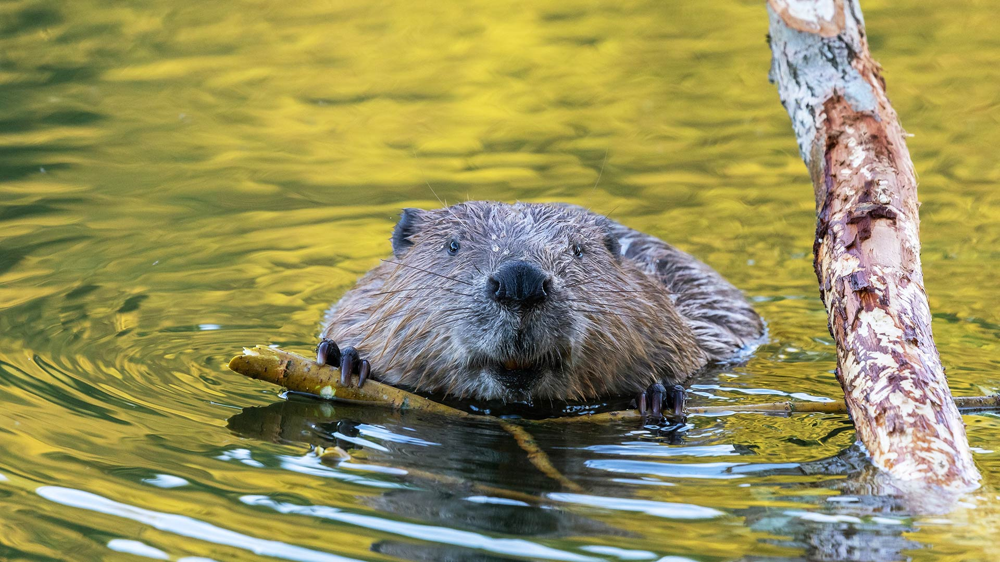

#### 20260406 Lake Gentau in the French Pyrenees, Pyrénées-Atlantiques, France (© MICHAUX Stéphane/Hemis.fr/Alamy)

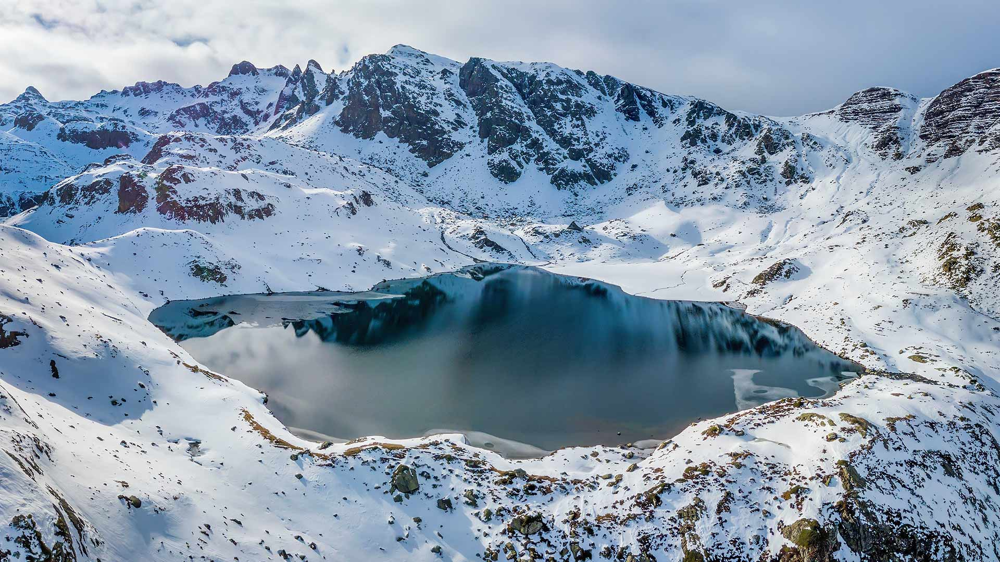

#### 20260406 Hirosaki Castle with cherry blossoms, Hirosaki, Japan (© Glenn Waters/Getty Images)

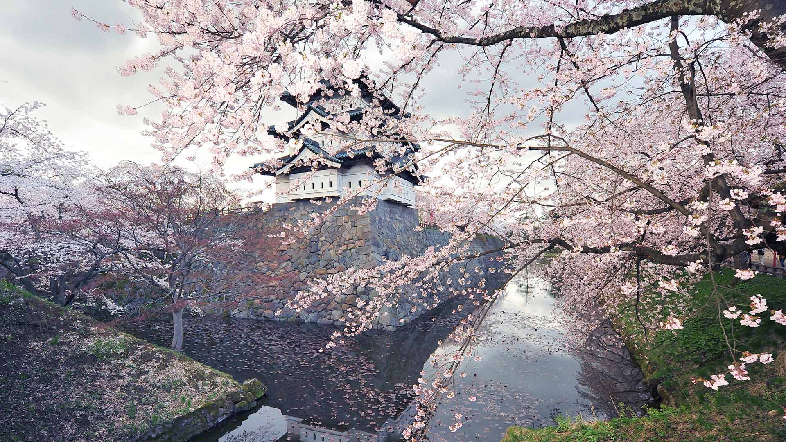

#### 20260405 春天的雪钟花 (© klagyivik/Getty Images)

#### 20260405 Bunt bemalte sorbische Ostereier aus Deutschland (© Mark Poltermann/Getty Images)

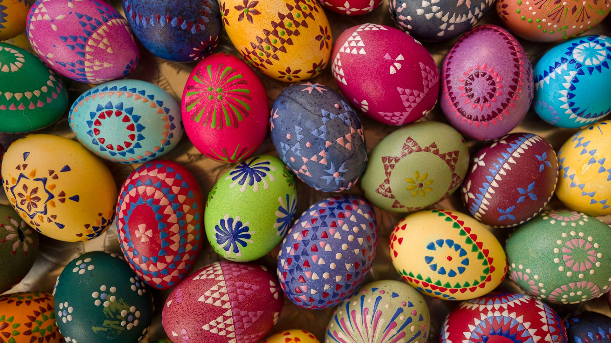

#### 20260405 Pont d’Arc, Ardèche (© Gael Fontaine/Getty Images)

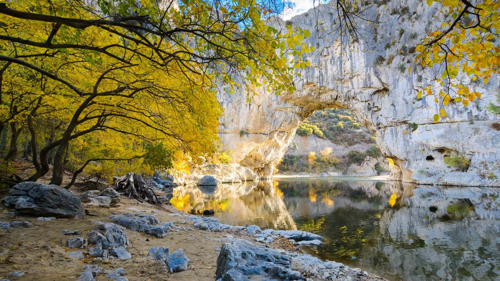

#### 20260405 Colorful handmade wooden Easter eggs, Vilnius, Lithuania (© maximkabb/Getty Images)

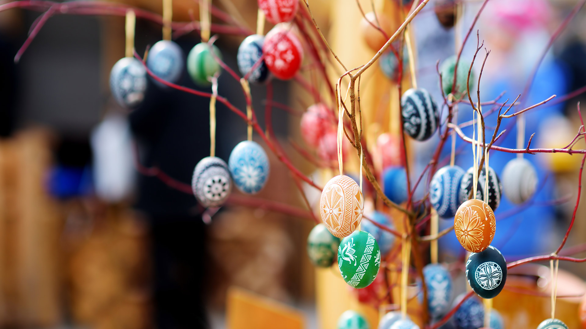

#### 20260404 首里城歓会門, 沖縄県 那覇市 (© Jui-Chi Chan/Getty images)

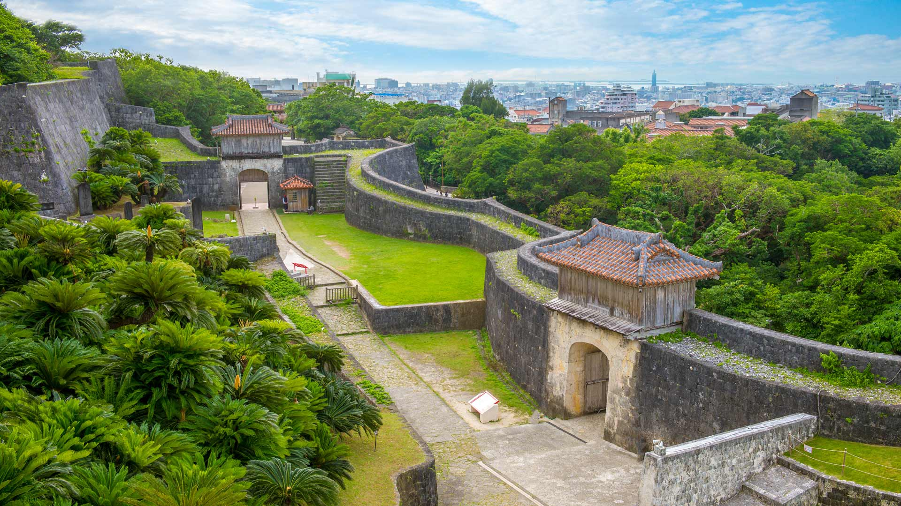

#### 20260404 Black grouse males facing off on a lekking site, Estonia (© Sven Zacek/Nature Picture Library)

#### 20260403 Armbrug bridge, Amsterdam, Netherlands (© Alexander Spatari/Getty Images)

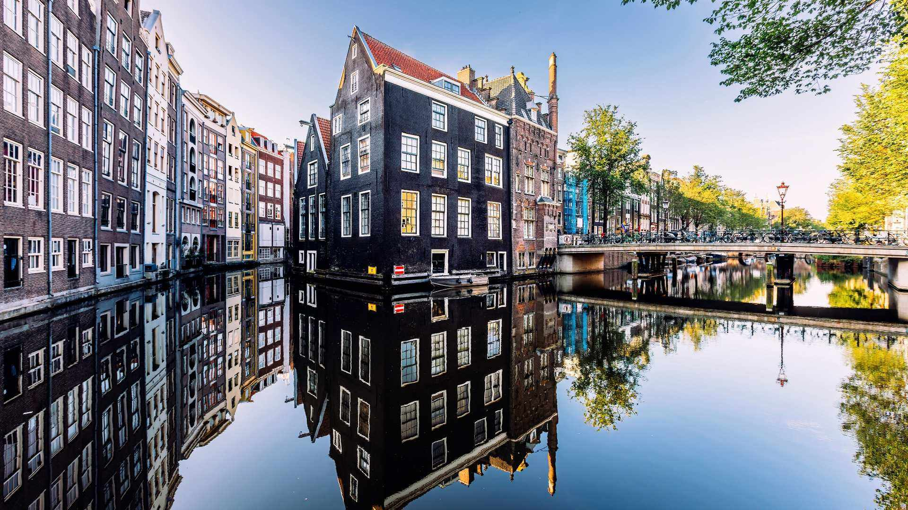

#### 20260402 Muscardin à l’entrée de leur nid, Normandie (© slowmotiongli/Getty Images)

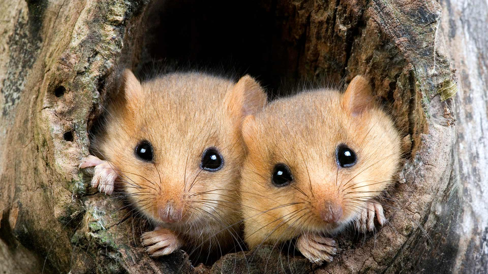

#### 20260402 シモクレン (© Aflo Co., Ltd./Alamy)

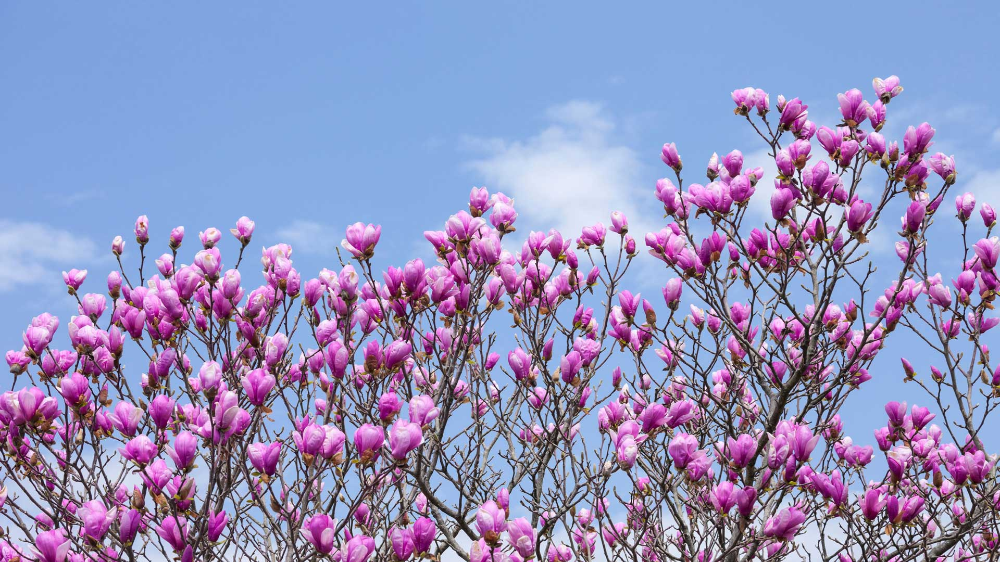

#### 20260401 Wildflower bloom, Central Valley, California (© Jeff Lewis/Tandem Stills + Motion)

#### 20260401 Japanese tree frog in a pink morning glory (© Tetsuya Tanooka/Getty Images)

