#### 20260422 Alam-Pedja Nature Reserve in Tartu County, Estonia (© Sven Zacek/Nature Picture Library)

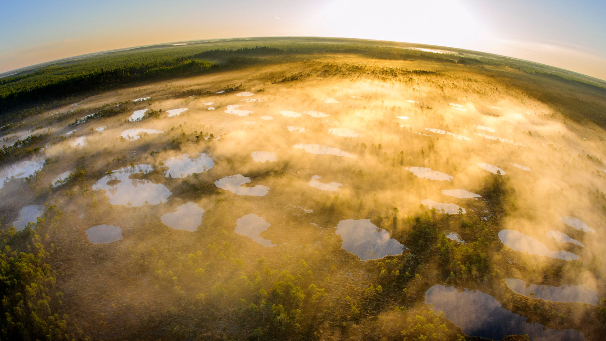

#### 20260421 European hedgehog, France (© Klein & Hubert/Nature Picture Library)

#### 20260420 Sunset in Canyonlands National Park, Moab, Utah (© Jason Hatfield/Tandem Stills + Motion)

#### 20260420 Rathaus St. Johann, Saarbrücken, Saarland (© frantic00/Getty Images)

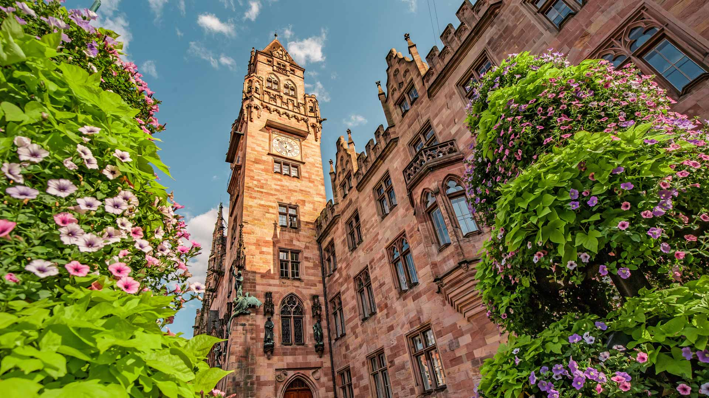

#### 20260420 Buckets on maple trees collecting sap for maple syrup (© capecodphoto/Getty Images)

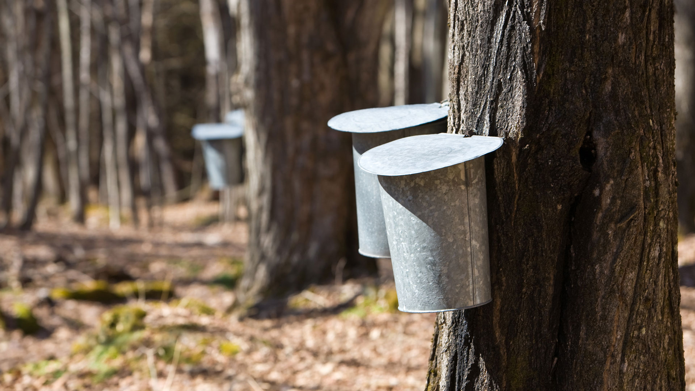

#### 20260419 镜面海滩，塞古罗港，巴伊亚州，巴西 (© Marcelo Nacinovic/Getty Images)

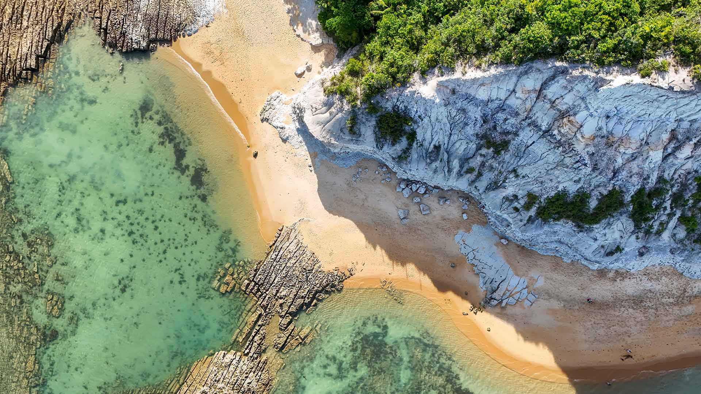

#### 20260419 Rolling hills of Tuscany, Italy (© Andyworks/Getty Images)

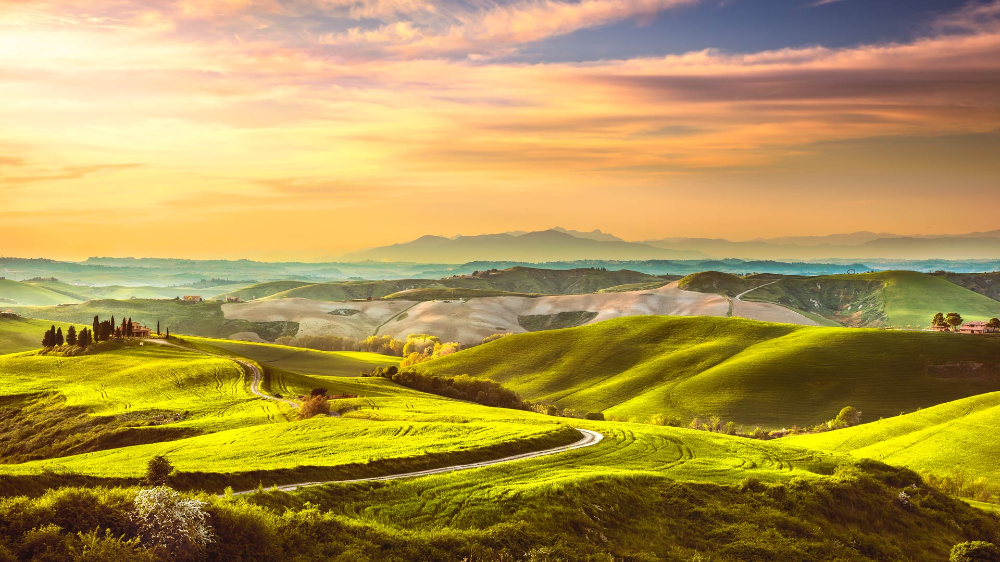

#### 20260419 Books in the children's section of The New York Public Library, New York (© Ken Welsh/Alamy)

#### 20260419 ベレンの塔, ポルトガル (© f9photos/Getty Images)

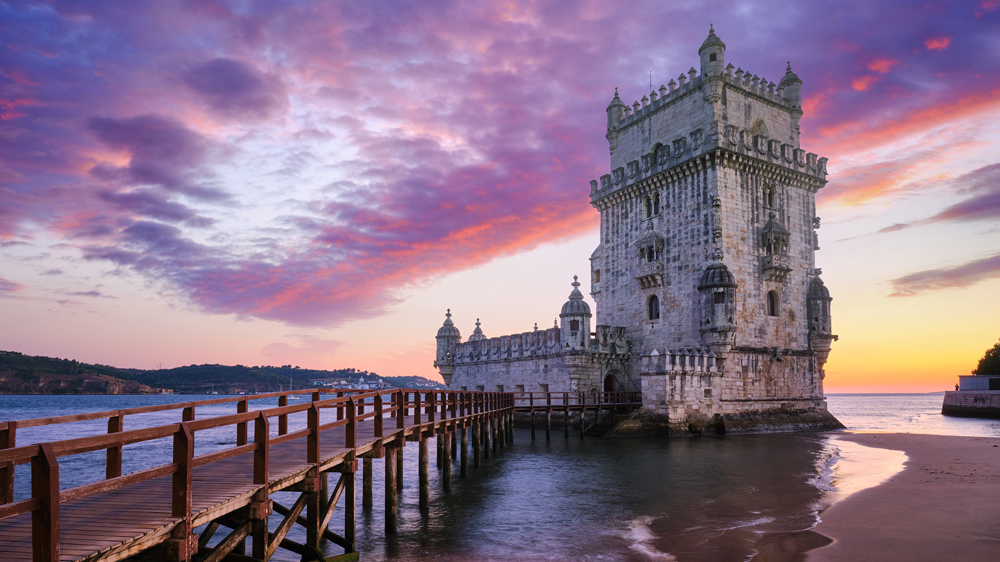

#### 20260418 Vue aérienne du Viaduc de Millau (© Sergi Reboredo/Alamy)

#### 20260418 Moai statue quarry, Rano Raraku, Easter Island, Chile (© Gavin Hellier/Alamy)

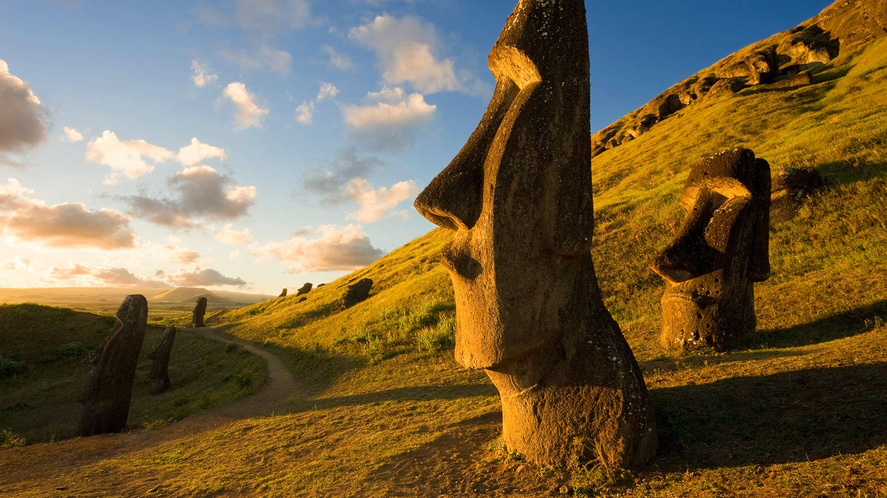

#### 20260418 Eingangsbereich des Kölner Doms, Nordrhein‑Westfalen (© ALFSnaiper/Getty Images)

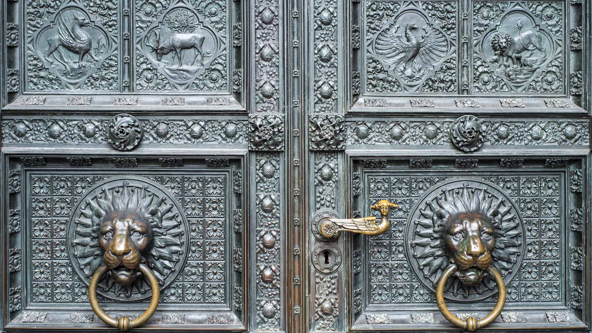

#### 20260417 Grey-headed flying fox carrying her pup, Yarra Bend Park, Australia (© Doug Gimesy/Nature Picture Library)

#### 20260416 Blooming lupines in Newfoundland (© Nature, Parks/Outdoor/Shutterstock)

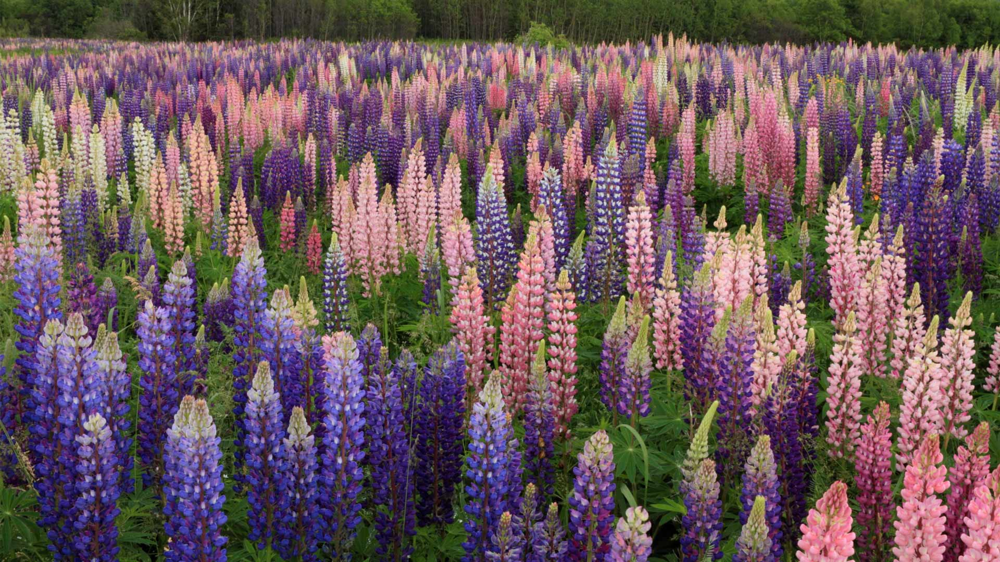

#### 20260416 Skagit Valley Tulip Fields, Washington (© Alan Majchrowicz/Getty Images)

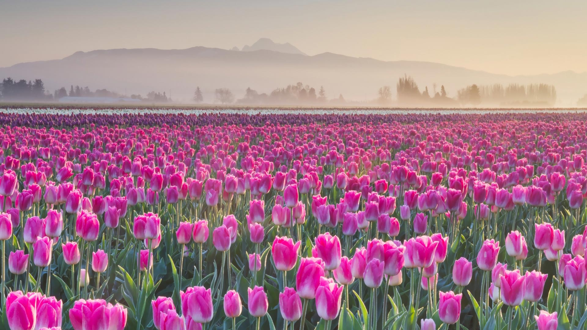

#### 20260416 Pine trees reflected in the Forgetmenot Pond in Kananaskis Country, Alberta, Canada (© chinaface/Getty images)

#### 20260415 The Carrières des Lumières exhibit of Vincent Van Gogh, Les Baux-de-Provence, France (© Patrick Aventurier/Getty Images)

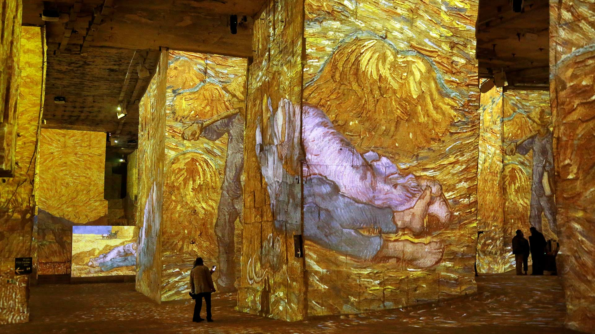

#### 20260415 芝桜, 山梨県 (© DoctorEgg/Getty images)

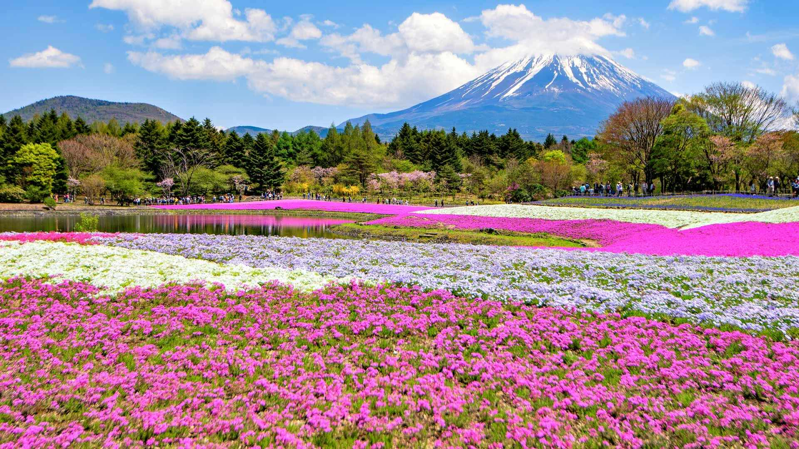

#### 20260414 Common clownfish in a sea anemone, Raja Ampat Islands, Indonesia (© Magnus Lundgren/Nature Picture Library)

#### 20260413 Zilpzalp, Deutschland (© Andyworks/Getty Images)

#### 20260413 Milky Way over Anza-Borrego Desert State Park, California (© Kevin Key/Slworking)/Getty Images)

#### 20260412 City lights streak below, taken from the International Space Station (© NASA)

#### 20260411 Le Trocadéro et la Tour Eiffel à l’aube, Paris (© Alexander Spatari/Getty Images)

#### 20260411 A canopy of cherry blossoms in Stanley Park, Vancouver (© WendyNordvikCarr/Getty Images)

#### 20260411 Papagayo Beach, Lanzarote, Canary Islands, Spain (© Gavin Hellier/Getty Images)

#### 20260410 Two young red foxes at Karula National Park, Estonia (© Sven Zacek/Nature Picture Library)

#### 20260409 Sgwd yr Eira waterfall, Bannau Brycheiniog National Park, Wales (© Guy Edwardes/Nature Picture Library)

#### 20260408 Seattle, Washington (© Jim Patterson/Tandem Stills + Motion)

#### 20260407 Beaver, Germany (© Andyworks/Getty Images)

#### 20260406 Lake Gentau in the French Pyrenees, Pyrénées-Atlantiques, France (© MICHAUX Stéphane/Hemis.fr/Alamy)

#### 20260406 Hirosaki Castle with cherry blossoms, Hirosaki, Japan (© Glenn Waters/Getty Images)

#### 20260405 春天的雪钟花 (© klagyivik/Getty Images)

#### 20260405 Bunt bemalte sorbische Ostereier aus Deutschland (© Mark Poltermann/Getty Images)

#### 20260405 Pont d’Arc, Ardèche (© Gael Fontaine/Getty Images)

#### 20260405 Colorful handmade wooden Easter eggs, Vilnius, Lithuania (© maximkabb/Getty Images)

#### 20260404 首里城歓会門, 沖縄県 那覇市 (© Jui-Chi Chan/Getty images)

#### 20260404 Black grouse males facing off on a lekking site, Estonia (© Sven Zacek/Nature Picture Library)

#### 20260403 Armbrug bridge, Amsterdam, Netherlands (© Alexander Spatari/Getty Images)

#### 20260402 Muscardin à l’entrée de leur nid, Normandie (© slowmotiongli/Getty Images)

#### 20260402 シモクレン (© Aflo Co., Ltd./Alamy)

#### 20260401 Wildflower bloom, Central Valley, California (© Jeff Lewis/Tandem Stills + Motion)

#### 20260401 Japanese tree frog in a pink morning glory (© Tetsuya Tanooka/Getty Images)

