#### 20260519 Formentor Lighthouse, Mallorca, Balearic Islands, Spain (© Allard Schager/Getty Images)

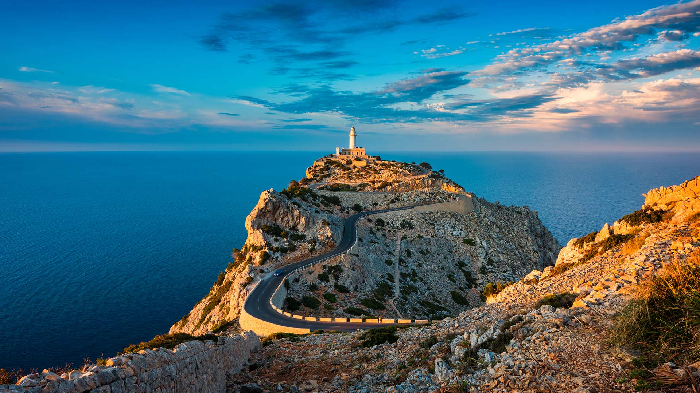

#### 20260519 Dolbadarn Castle, Llanberis, Wales (© Allan Hartley/Alamy)

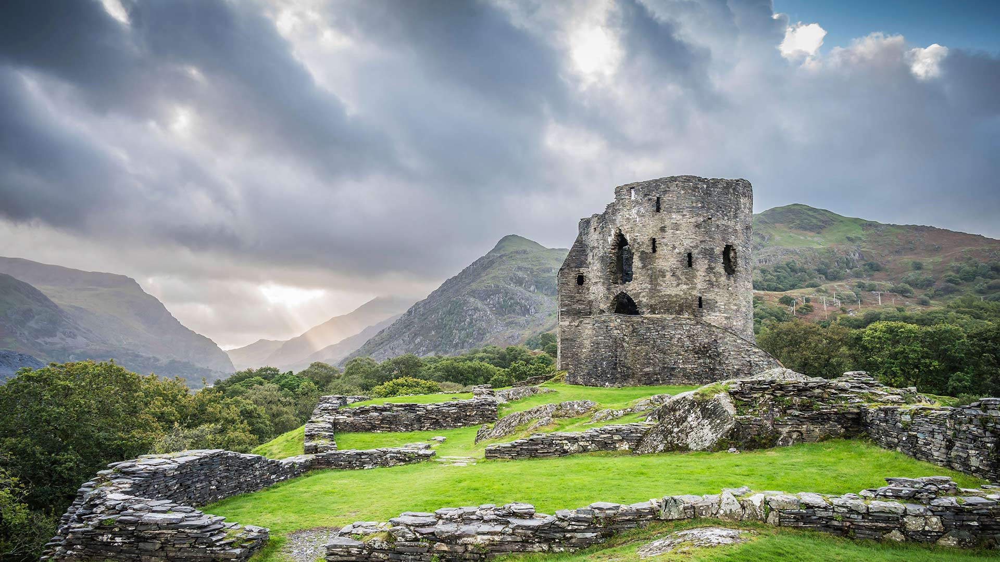

#### 20260518 Natural History Museum, London, England (© Colm Keating/Tandem Stills + Motion)

#### 20260518 国立科学博物館, 東京 (© cowardlion/Shutterstock)

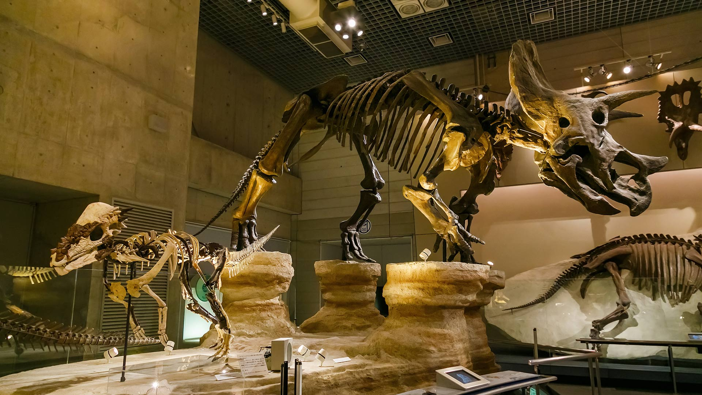

#### 20260518 Chapeaux de paille dans les tribunes de Roland-Garros, Paris (© Horacio Villalobos/Corbis)

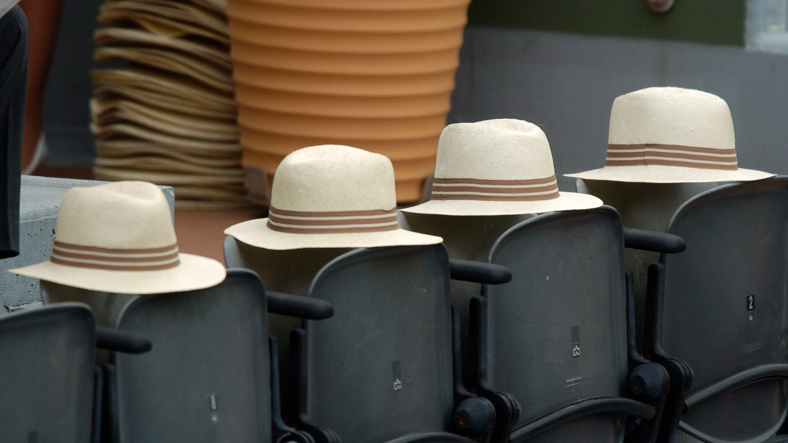

#### 20260517 Hawksbill Mountain in Shenandoah National Park, Virginia (© John Baggaley/Getty Images)

#### 20260516 Smith Rock State Park, Oregon (© Alex Ratson/Getty Images)

#### 20260516 Argus‑Bläuling auf einer Blüte (© Remus86/Getty Images)

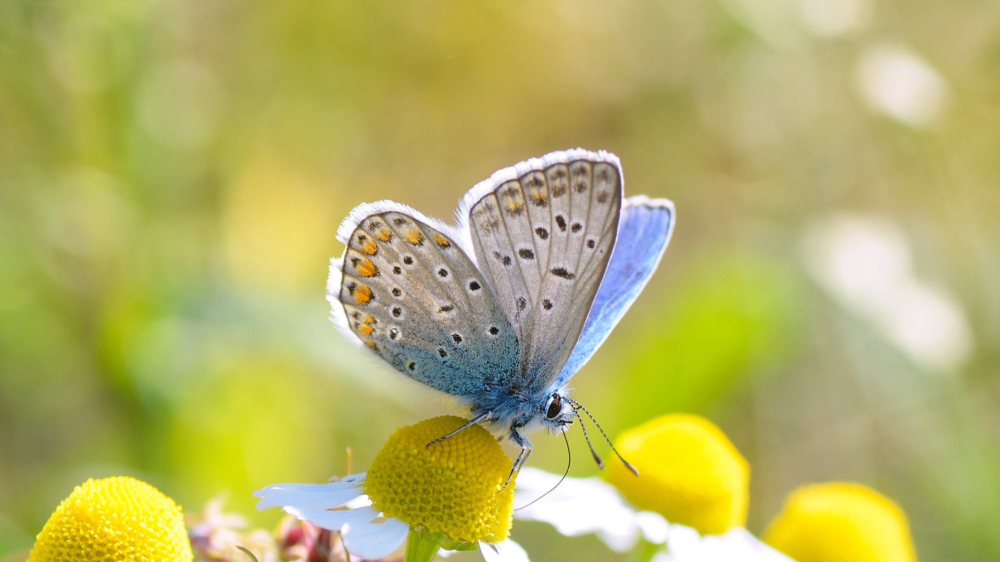

#### 20260516 Forêt de bouleaux, Bourgogne (© Wenphotos/Alamy)

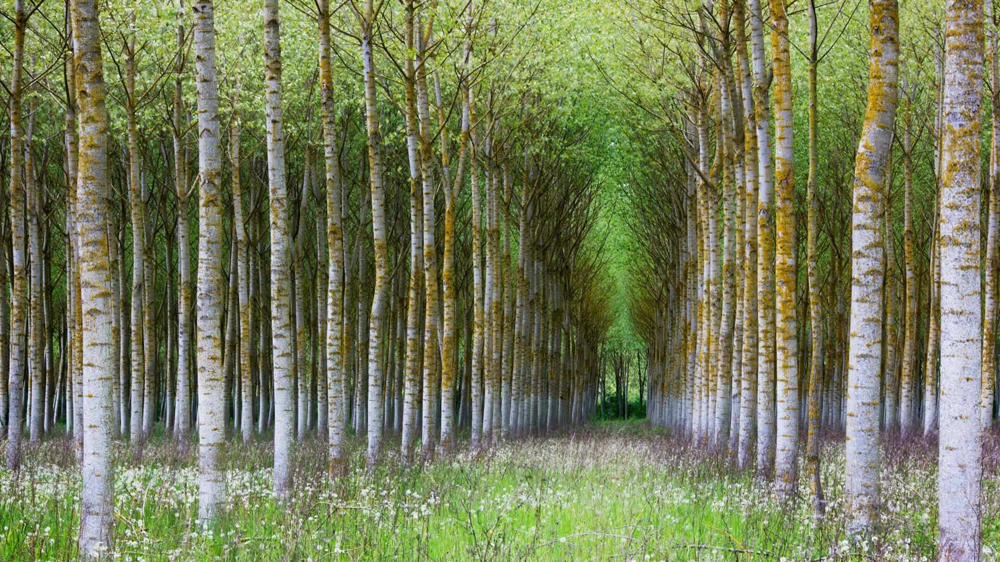

#### 20260515 A family of sperm whales, Indian Ocean (© Tony Wu/Nature Picture Library)

#### 20260514 Medieval town of Pitigliano, Tuscany, Italy (© bluejayphoto/Getty Images Plus)

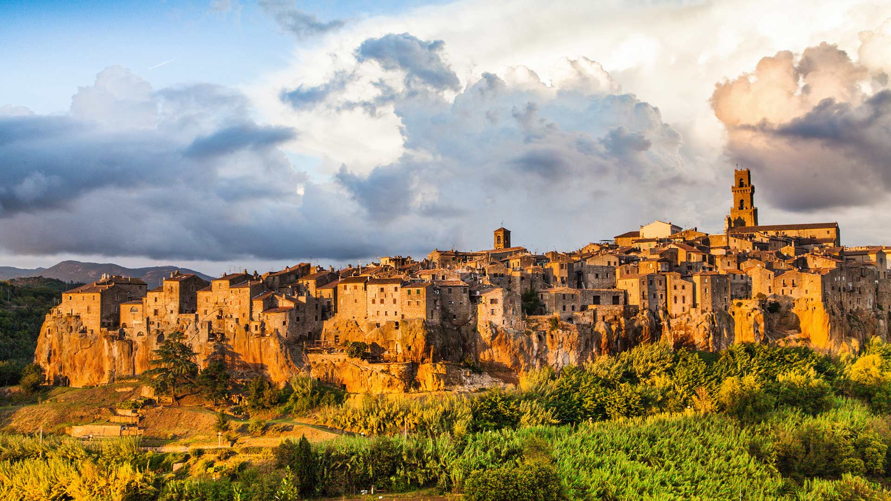

#### 20260514 Löwenmännchen mit Jungtier (© JasonPrince/iStock/Getty Images)

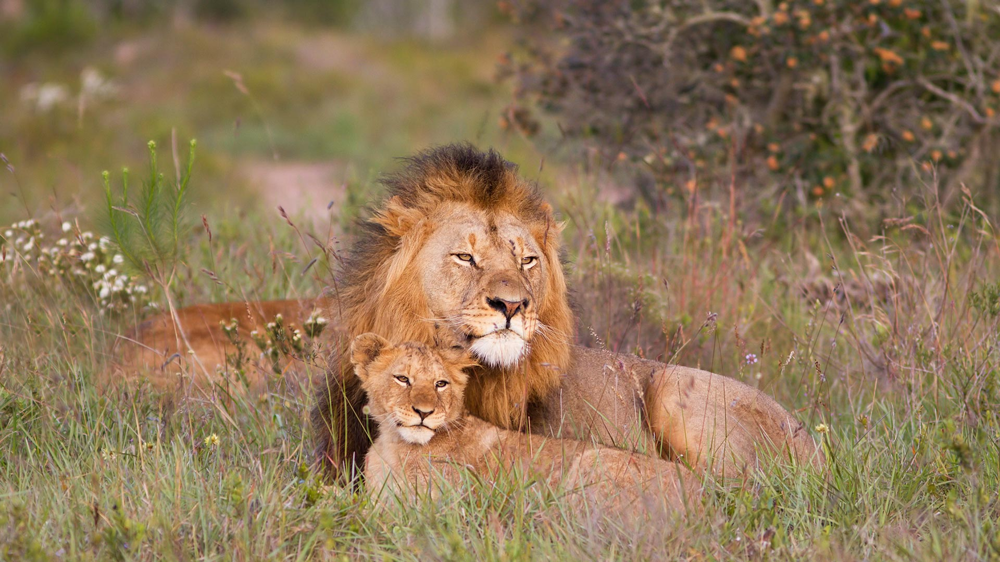

#### 20260513 Arch and Milky Way, Alabama Hills, Sierra Nevada, California (© Tim Fitzharris/Minden Pictures)

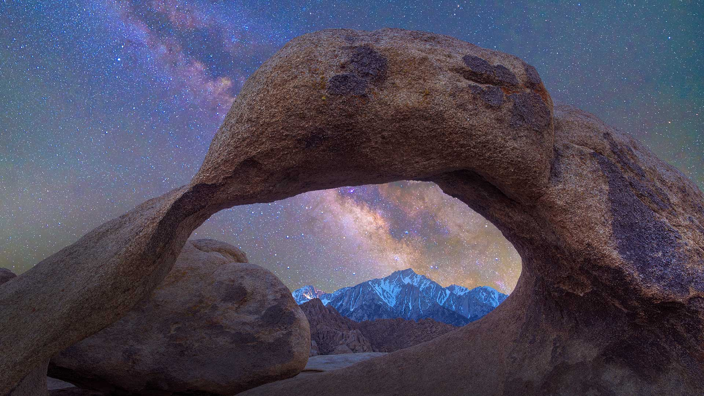

#### 20260512 Des chaises attendent l'arrivée des célébrités et des cinéphiles au Festival de Cannes (© Christopher Furlong/Getty Images)

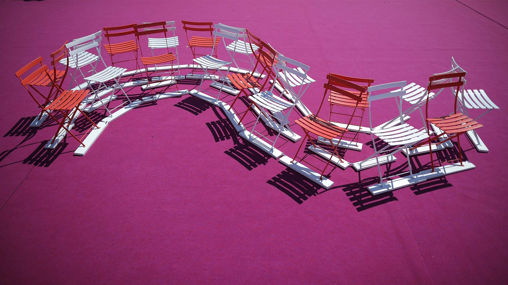

#### 20260511 Great Barrier Reef from above, Queensland, Australia (© Francesco Riccardo Iacomino/Getty Images)

#### 20260510 Polar bear mother and cubs playing in Wapusk National Park, Manitoba, Canada (© Hao Jiang/Getty Images)

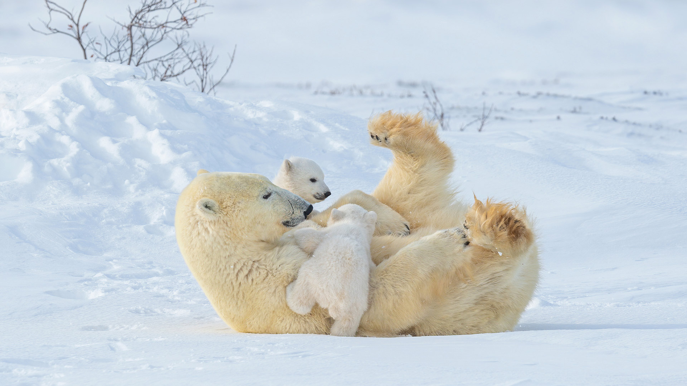

#### 20260510 Atlantic puffins, Wales (© FLPA/Alamy)

#### 20260509 Skradinski Buk Waterfall in Krka National Park, Croatia (© Amazing Aerial Agency/Adobe Stock)

#### 20260508 Tulips and cherry blossoms at the Rideau Canal, Ottawa, Ontario (© J Duquette/Getty Images)

#### 20260508 Sardinian donkey mare and foal, France (© Klein & Hubert/Nature Picture Library)

#### 20260507 Kofa National Wildlife Refuge, Arizona (© Denis Tangney Jr/Getty Images)

#### 20260506 Thunderstorm above the plains, Bulgaria (© Revolu7ion93/Getty Images)

#### 20260505 Field of blue agave near Tequila, Jalisco, Mexico (© Brian Overcast/Alamy)

#### 20260505 Strandkörbe am Ostseestrand von Grömitz, Schleswig‑Holstein (© Sabine Lubenow/Image Professionals GmbH/Alamy)

#### 20260505 姫の沢公園, 静岡県 熱海市 (© SKY Stock/Shutterstock)

#### 20260505 A majestic bull moose foraging through the green undergrowth, Quebec (© pchoui/Getty Images)

#### 20260505 莲花与莲花植株 (© real444/Getty Images)

#### 20260504 Ksar Ouled Soltane, Tataouine district in southern Tunisia (© Dark_Eni/Getty Images Plus)

#### 20260503 Leopard sleeping in a tree in savanna, Masai Mara National Reserve, Kenya (© Klein & Hubert/Nature Picture Library)

#### 20260502 和束の茶畑, 京都府 和束町 (© Tuul and Bruno Morandi/Alamy)

#### 20260501 Leuchtturm Tŵr Mawr, Ynys Llanddwyn, Anglesey, Wales (© Lukas Bischoff/Getty Images)

#### 20260501 中国的长城 (© aphotostory/Getty Images)

#### 20260501 Brin de muguet, Ukraine (© tomch/Getty Images Plus)

#### 20260501 Koi fish, Lan Su Chinese Garden, Portland, Oregon (© Greg Vaughn/Getty Images)

#### 20260501 Small lake and marsh in Jasper National Park in Alberta, Canada (© Don White/Getty Images)

