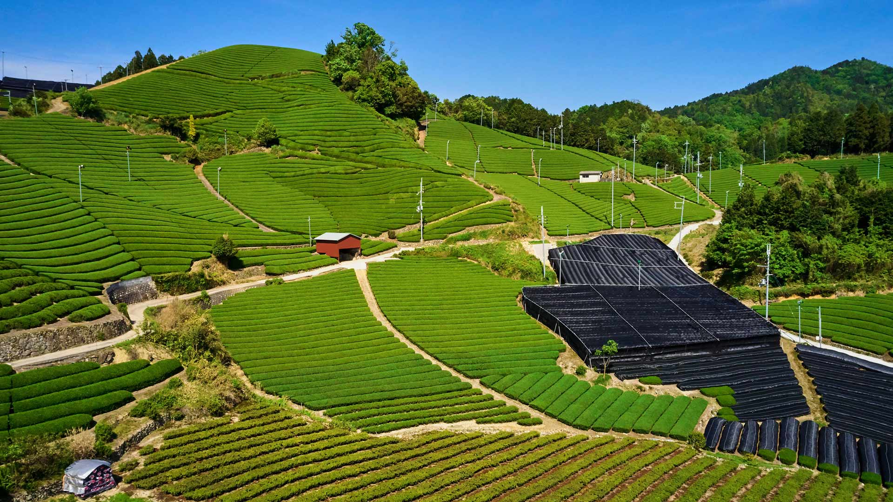
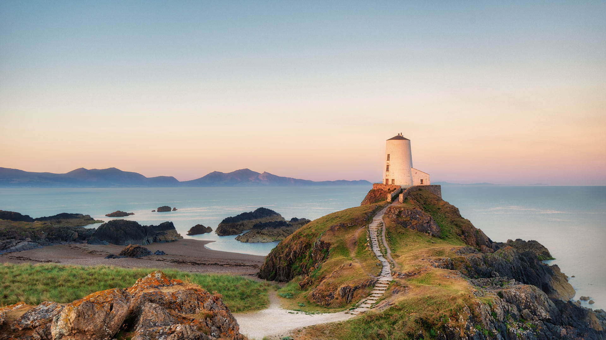
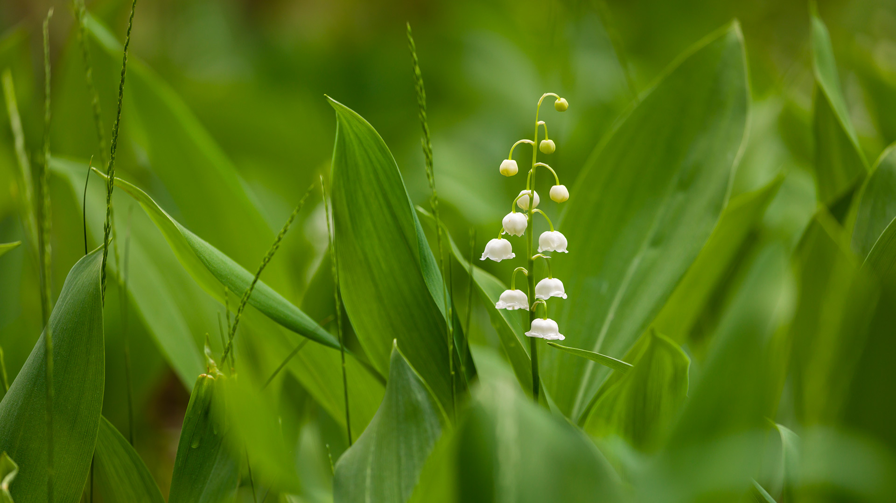
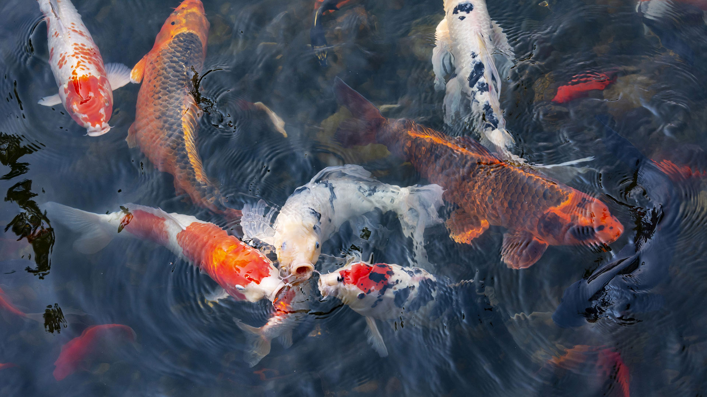

#### 20260504 乌莱德·索尔坦克萨尔，塔塔温区，突尼斯南部 (© Dark_Eni/Getty Images Plus)

#### 20260503 Leopard sleeping in a tree in savanna, Masai Mara National Reserve, Kenya (© Klein & Hubert/Nature Picture Library)

#### 20260502 和束の茶畑, 京都府 和束町 (© Tuul and Bruno Morandi/Alamy)

#### 20260501 Leuchtturm Tŵr Mawr, Ynys Llanddwyn, Anglesey, Wales (© Lukas Bischoff/Getty Images)

#### 20260501 中国的长城 (© aphotostory/Getty Images)

#### 20260501 Brin de muguet, Ukraine (© tomch/Getty Images Plus)

#### 20260501 Koi fish, Lan Su Chinese Garden, Portland, Oregon (© Greg Vaughn/Getty Images)

#### 20260501 Small lake and marsh in Jasper National Park in Alberta, Canada (© Don White/Getty Images)

