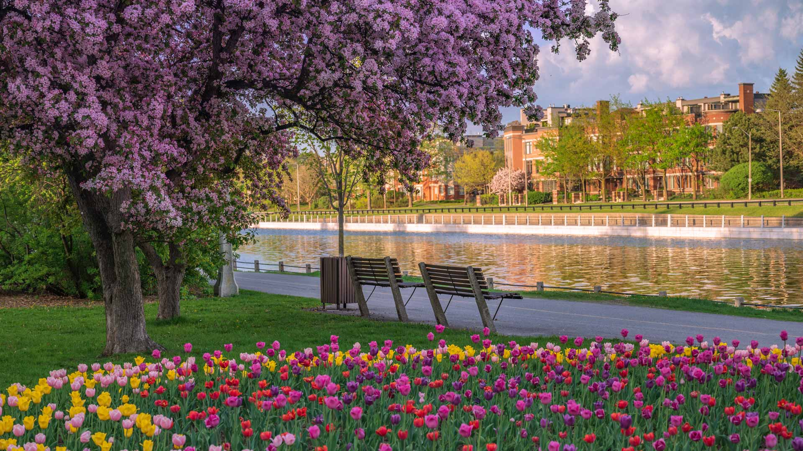
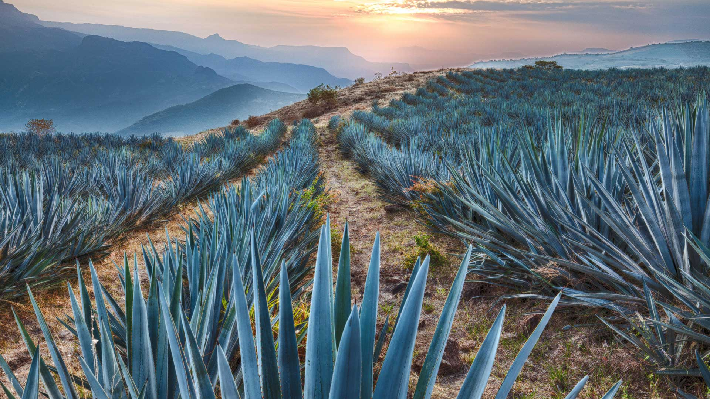
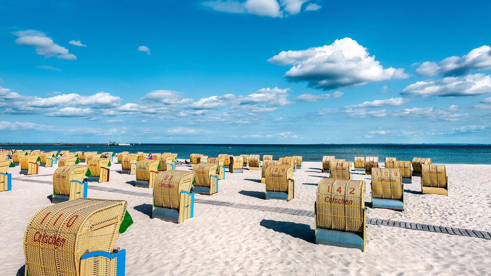
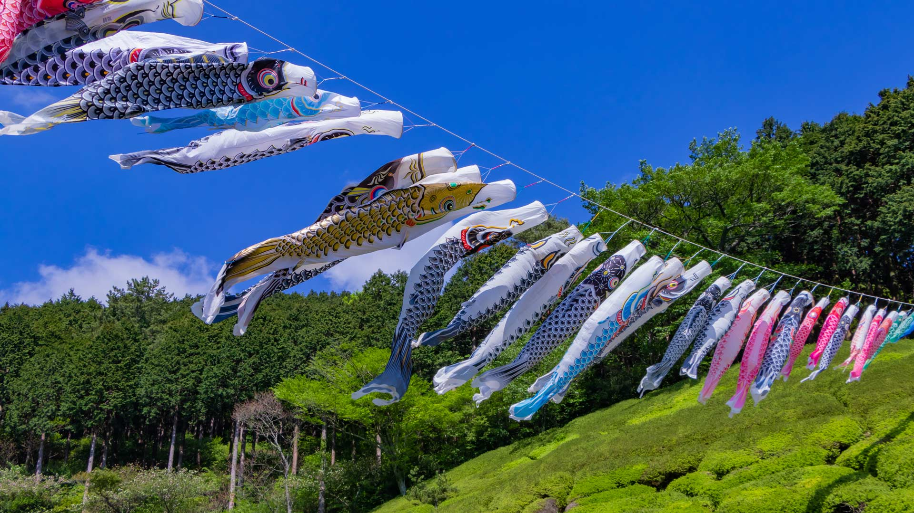
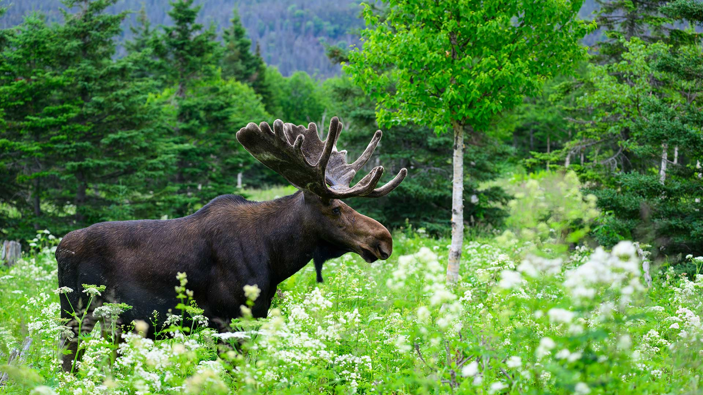

#### 20260508 Tulips and cherry blossoms at the Rideau Canal, Ottawa, Ontario (© J Duquette/Getty Images)

#### 20260508 撒丁岛母驴和幼崽, 法国 (© Klein & Hubert/Nature Picture Library)

#### 20260507 Kofa National Wildlife Refuge, Arizona (© Denis Tangney Jr/Getty Images)

#### 20260506 Thunderstorm above the plains, Bulgaria (© Revolu7ion93/Getty Images)

#### 20260505 Field of blue agave near Tequila, Jalisco, Mexico (© Brian Overcast/Alamy)

#### 20260505 Strandkörbe am Ostseestrand von Grömitz, Schleswig‑Holstein (© Sabine Lubenow/Image Professionals GmbH/Alamy)

#### 20260505 姫の沢公園, 静岡県 熱海市 (© SKY Stock/Shutterstock)

#### 20260505 A majestic bull moose foraging through the green undergrowth, Quebec (© pchoui/Getty Images)

#### 20260505 莲花与莲花植株 (© real444/Getty Images)

#### 20260504 Ksar Ouled Soltane, Tataouine district in southern Tunisia (© Dark_Eni/Getty Images Plus)

#### 20260503 Leopard sleeping in a tree in savanna, Masai Mara National Reserve, Kenya (© Klein & Hubert/Nature Picture Library)

#### 20260502 和束の茶畑, 京都府 和束町 (© Tuul and Bruno Morandi/Alamy)

#### 20260501 Leuchtturm Tŵr Mawr, Ynys Llanddwyn, Anglesey, Wales (© Lukas Bischoff/Getty Images)

#### 20260501 中国的长城 (© aphotostory/Getty Images)

#### 20260501 Brin de muguet, Ukraine (© tomch/Getty Images Plus)

#### 20260501 Koi fish, Lan Su Chinese Garden, Portland, Oregon (© Greg Vaughn/Getty Images)

#### 20260501 Small lake and marsh in Jasper National Park in Alberta, Canada (© Don White/Getty Images)

