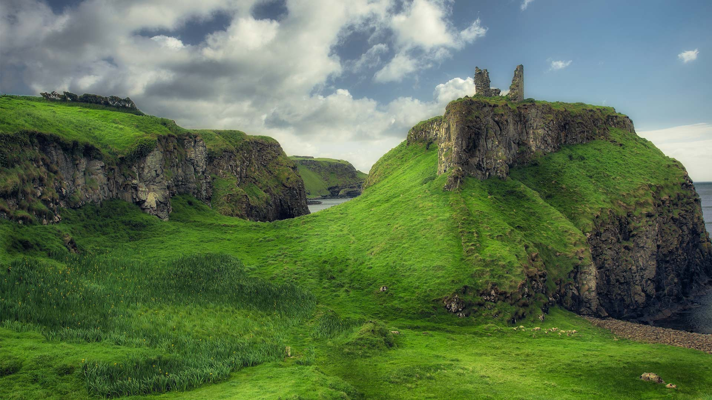
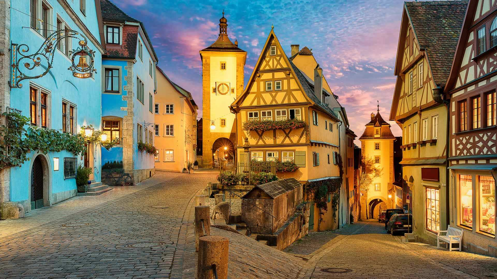
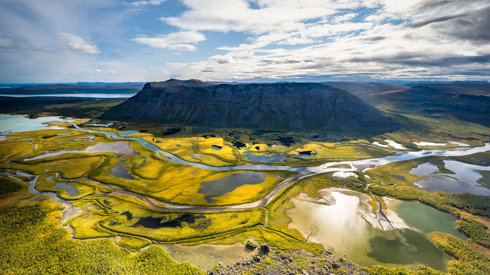

#### 20260607 プラヤ・ダ・ウルサ, ポルトガル (© Theo Bosboom/Nature Picture Library)

#### 20260607 邓塞弗里克城堡遗址, 安特里姆郡, 北爱尔兰 (© Krzysztof Rogalski/Getty Images)

#### 20260606 Plönlein mit Siebersturm und Kobolzeller Tor, Rothenburg ob der Tauber, Bayern (© Harald Nachtmann/Getty Images)

#### 20260606 Natchez Trace Parkway, Tupelo, Mississippi, USA (© The best photo is earned/Getty Images Plus)

#### 20260606 Méduse crinière de lion (© Alexander Semenov Images/Shutterstock)

#### 20260605 View from Skierffe Mountain over the Rapadalen river delta, Sarek National Park, Laponia, Lapland, Sweden (© Robert Haasmann/Getty Images)

#### 20260604 Snowy egret preening, central Florida, USA (© Donald M. Jones/Minden Pictures)

#### 20260603 Cyclist in Bardenas Reales Natural Park and Biosphere Reserve, Navarra, Spain (© Artur Debat/Getty Images)

#### 20260602 みなとみらい 21 地区, 神奈川県 横浜市 (© simpletun/Shutterstock)

#### 20260601 Rainbow flags at Rockefeller Center on June 28, 2020, New York City (© Noam Galai/Getty Images)

#### 20260601 Highway through Xitai Jinaier Lake, Qinghai Province, China (© Kaicheng Xu/Getty Images)

#### 20260601 巴勒莫暮色下的天际线，西西里岛，意大利 (© Sean Pavone/Getty Images)

