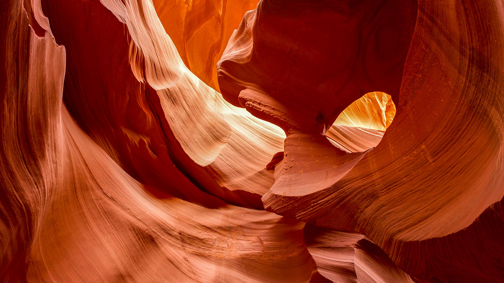
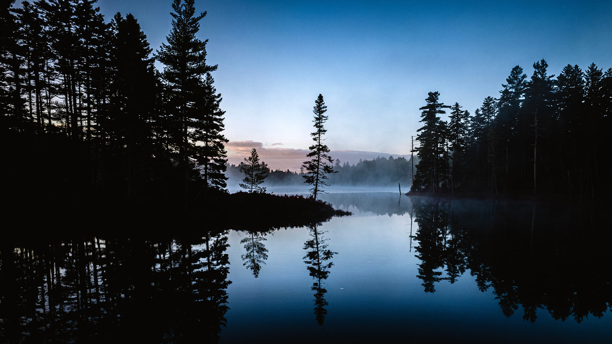
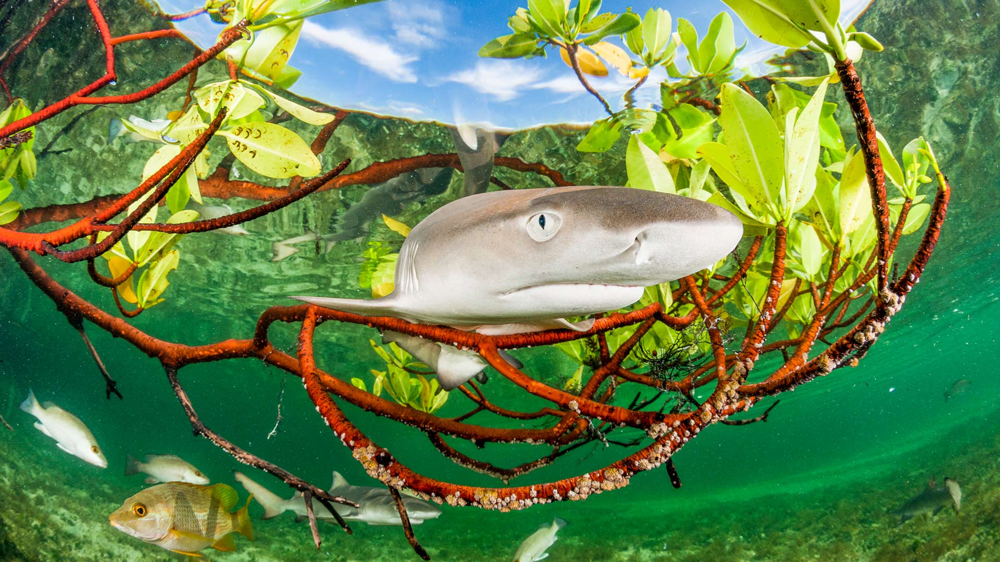
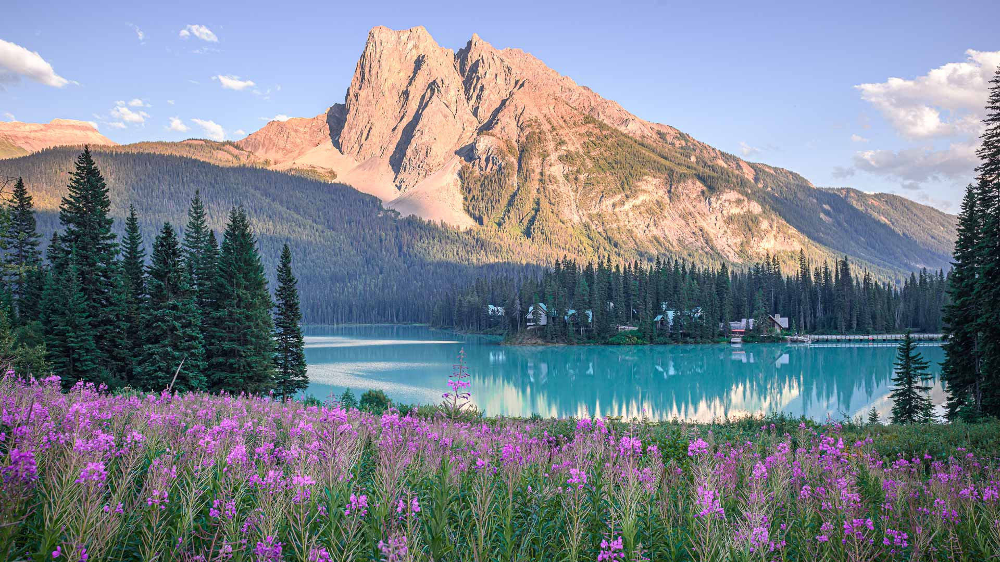
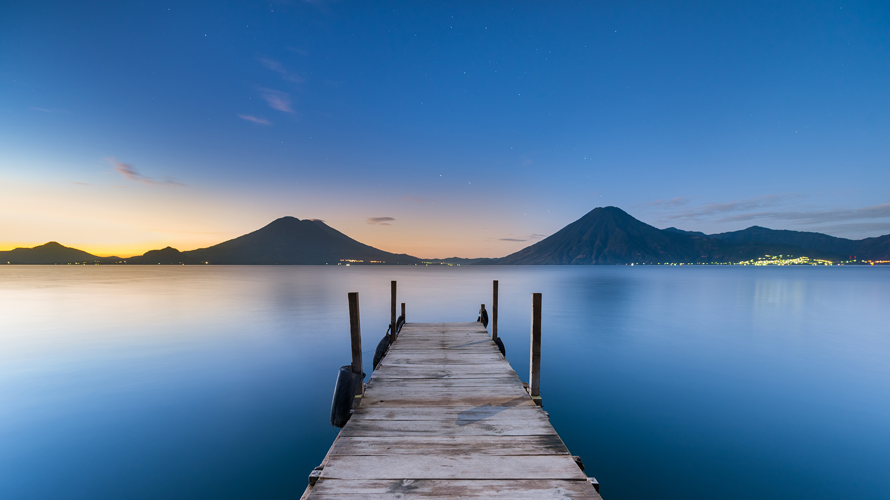
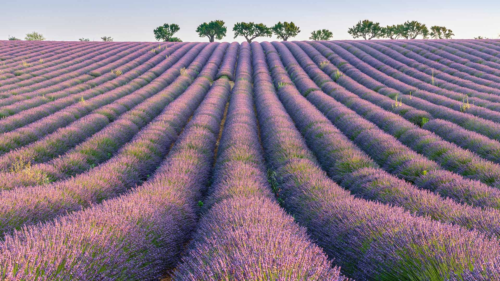
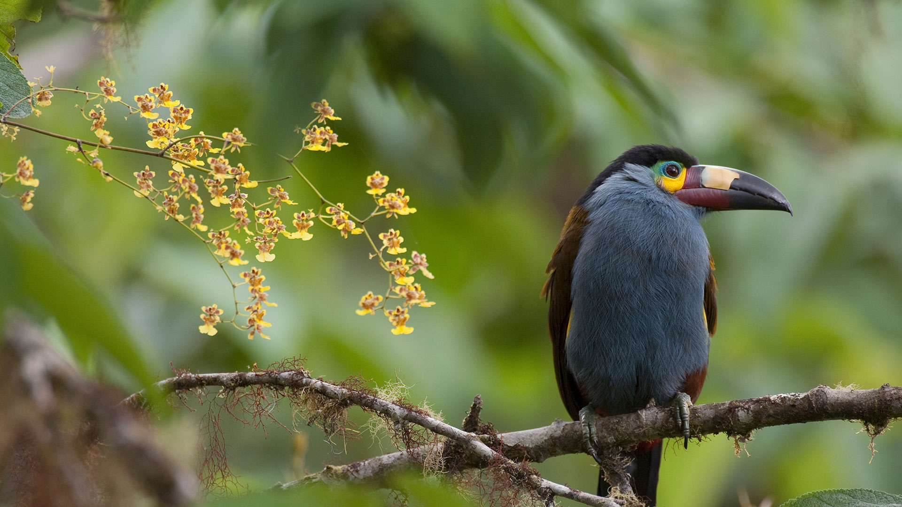
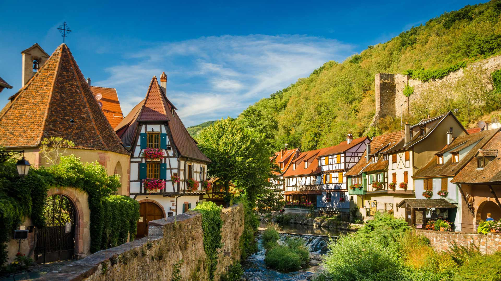
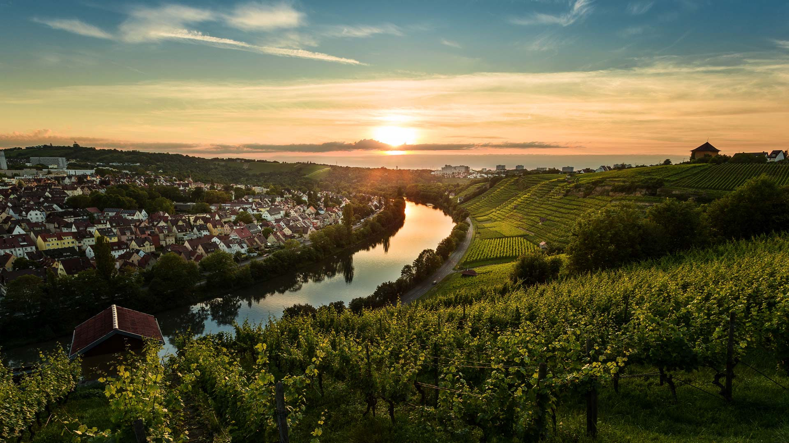

#### 20260713 羚羊峡谷，纳瓦霍族保留地，亚利桑那州，美国 (© Mark Skalny/Getty Images)

#### 20260712 Katahdin Woods and Waters National Monument, Maine (© Cavan Images/Offset/Shutterstock)

#### 20260712 Coral reef and beach in Raja Ampat, Indonesia (© SergeUWPhoto/Shutterstock)

#### 20260711 Lemon shark pup in mangrove forest, Eleuthera, Bahamas (© Shane Gross/Nature Picture Library)

#### 20260711 Driftwood on Boneyard Beach, Hunting Island, South Carolina (© Frances/Adobe Stock)

#### 20260711 Port de Saint-Goustan, Auray, Brittany, France (© Rolf E. Staerk/Shutterstock)

#### 20260710 Aerial view of land and ocean, Victoria, Australia (© Nearmap/Getty Images)

#### 20260710 Pink wildflowers by Emerald Lake in summer, Yoho National Park, British Columbia (© Olga Matveeva/Getty Images)

#### 20260709 Rice fields at Sapa, Lào Cai, Vietnam (© Anujak Jaimook/Getty Images)

#### 20260708 Sunrise at Lake Atitlán, Guatemala (© shayes17/Getty Images)

#### 20260707 七夕まつりの吹き流し, 宮城県 仙台市 (© kororokerokero/Getty Images)

#### 20260706 Syracuse at sunset, Sicily, Italy (© Balate Dorin/Getty Images)

#### 20260705 Lavender rows, Plateau de Valensole, Provence, France (© Robert Harding/Shutterstock)

#### 20260704 Plate-billed mountain toucan with orchids, Ecuador (© Murray Cooper/Minden Pictures)

#### 20260704 Liberty Bell and Independence Hall, Independence National Historical Park, Philadelphia, Pennsylvania (© f11photo/Shutterstock)

#### 20260704 凯泽斯堡，阿尔萨斯，法国 (© Federica Gentile/Getty Images)

#### 20260703 Fireflies glowing above a stream, Okayama Prefecture, Japan (© tdub303/Getty Images)

#### 20260702 Ceiling of the Temple of Esna, Egypt (© Nick Brundle Photography/Getty Images)

#### 20260701 Sonnenuntergang über den Weinbergen von Steinhaldenfeld im Neckartal bei Stuttgart, Baden-Württemberg (© Cyril Gosselin/Getty Images)

#### 20260701 Dungeon Provincial Park, Newfoundland and Labrador, Canada (© Kaitlyn McLachlan/Getty Images)

