#### 20260831 Building detail of Registan Square, Samarkand, Uzbekistan (© Piero M. Bianchi/Getty Images)

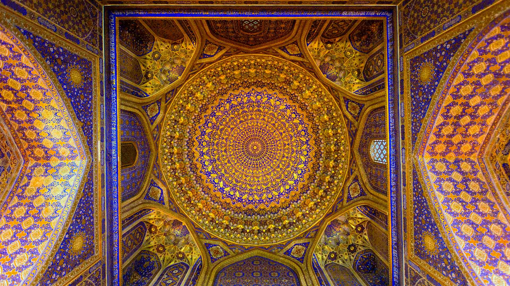

#### 20260830 Whale shark and golden trevally, Cenderawasih Bay, West Papua, Indonesia (© Pete Oxford/Nature Picture Library)

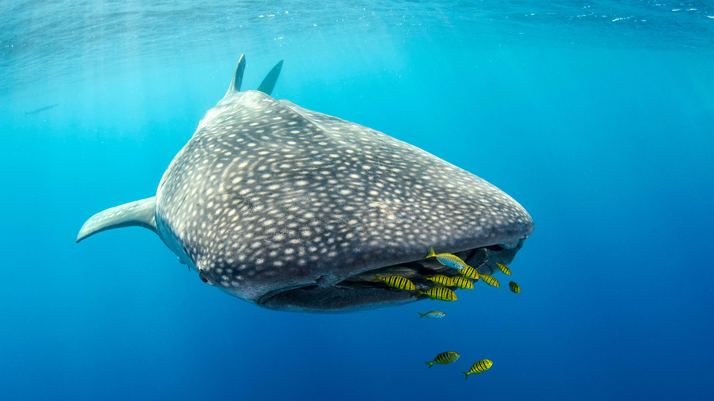

#### 20260830 Camí de Ronda, Lloret de Mar, Catalonia, Spain (© MEDITERRANEAN/Getty Images)

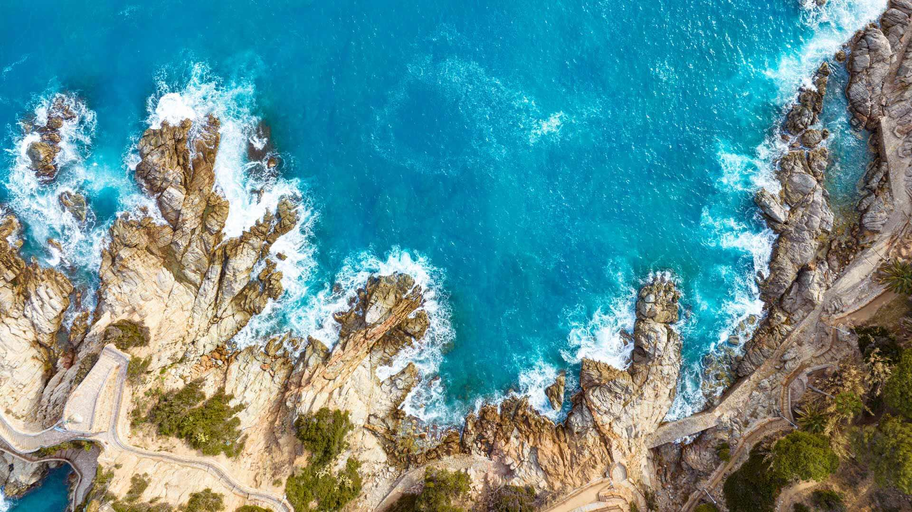

#### 20260829 Aerial view of surfers, Santa Catarina, Brazil (© Wonderful Nature/Shutterstock)

#### 20260829 全国花火競技大会, 秋田県, 大仙市 (© Toru Hanai/Getty Images)

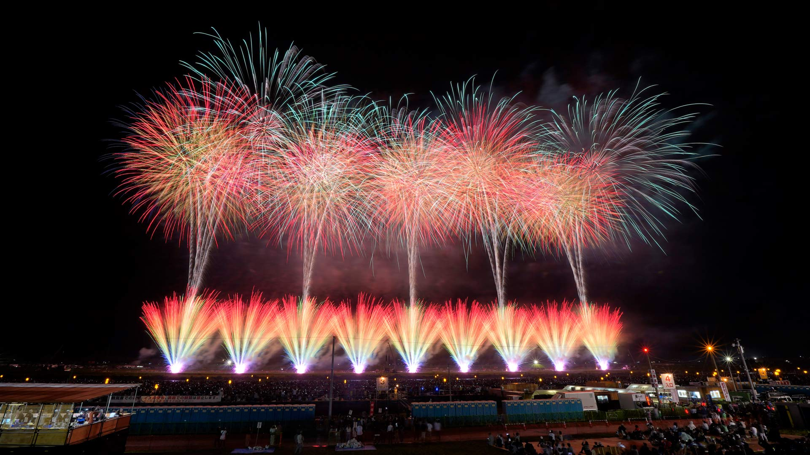

#### 20260828 Mont-Saint-Michel during high tide, Manche, Normandy, France (© Clement LEONARD/Getty Images)

#### 20260827 Lesser flamingo flock at sunrise, Lake Magadi, Kenya (© Denis-Huot/Nature Picture Library)

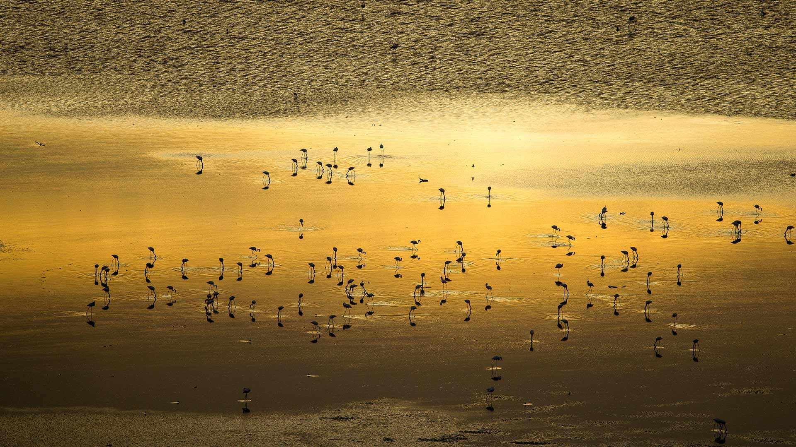

#### 20260826 Auroras over Kirkjufell, Iceland (© Cavan Images/Alamy)

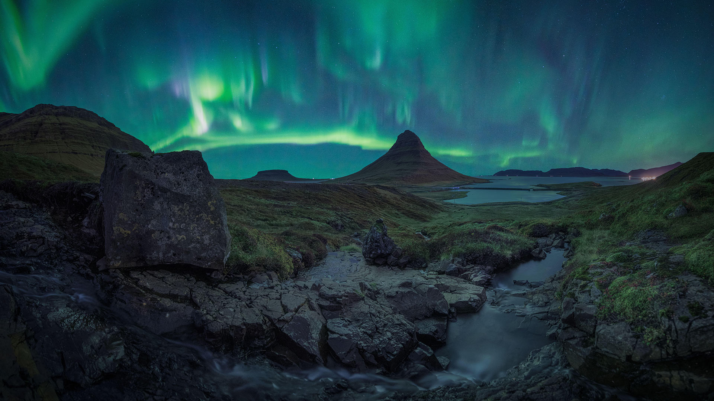

#### 20260825 Sunrise in Redwood National and State Parks, California (© HadelProductions/Getty Images)

#### 20260825 Atlantic puffin holding a wild iris in his beak in Elliston, Newfoundland (© mlorenzphotography/Getty Images)

#### 20260825 Kitesurfer bei Sonnenuntergang in Deutschland (© Jens Breuer/Getty Images)

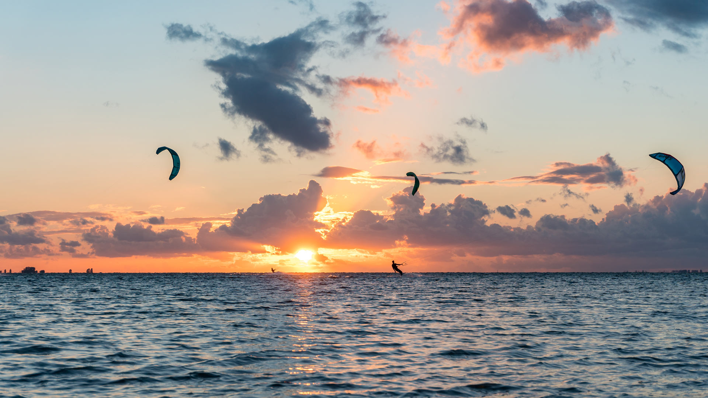

#### 20260825 Plage de sable blanc sur l’archipel des Glénan, Bretagne (© HadelProductions/Getty Images)

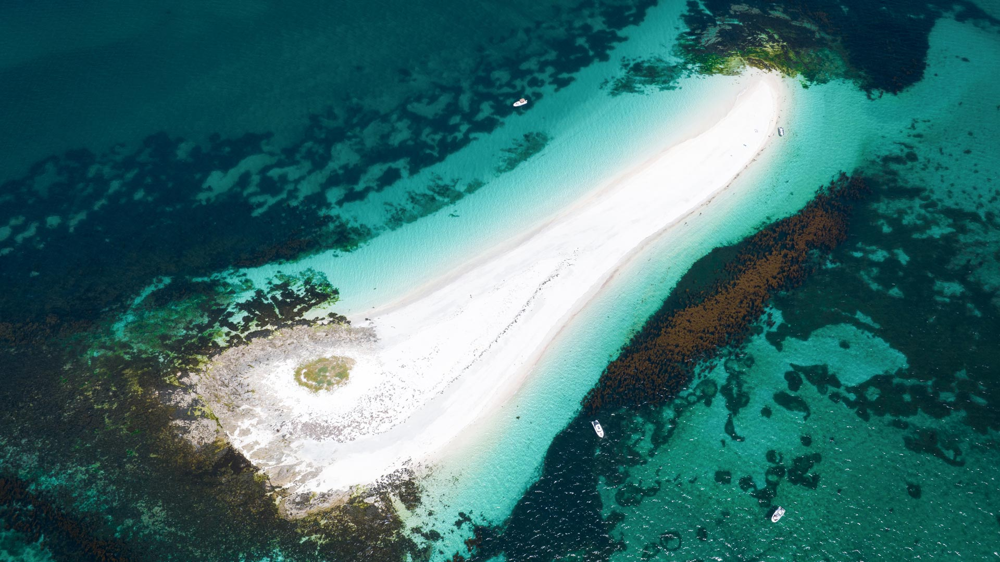

#### 20260824 Brooklyn Bridge, New York City (© shayes17/Getty Images)

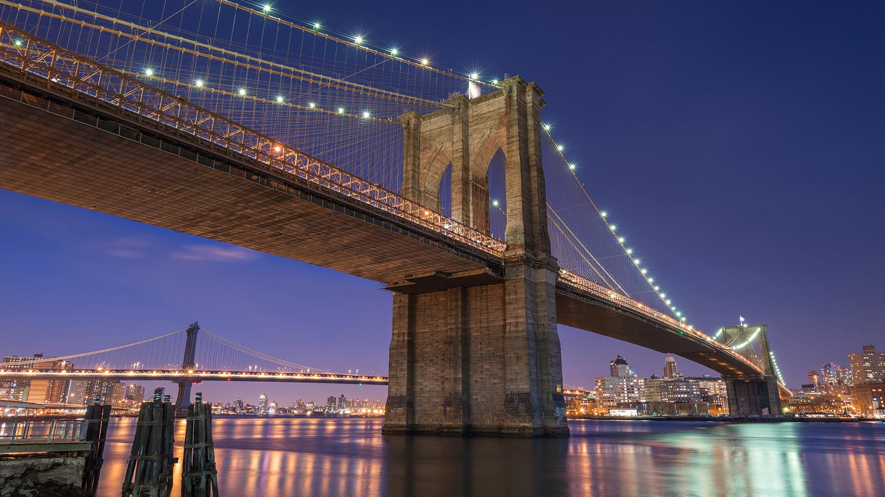

#### 20260823 夏の森を潤す清流, 静岡県 (© Keiji Komatsu/AFLO/Getty Images)

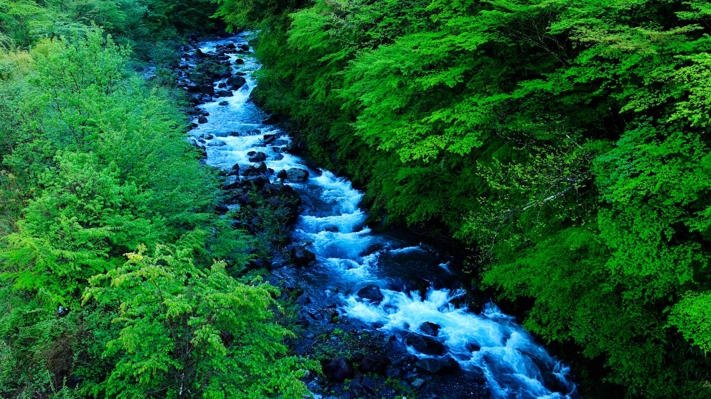

#### 20260823 Brown bear fishing in river, Katmai National Park, Alaska (© Pal Hermansen/Nature Picture Library)

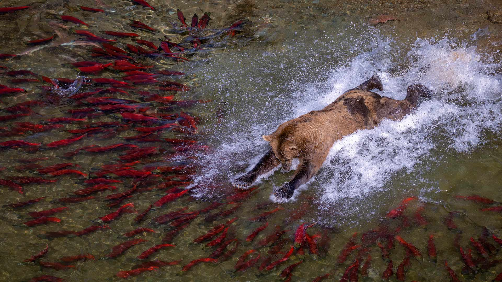

#### 20260823 在处暑时节的村庄田野与寺庙佛塔，江阴市，江苏省，中国 (© jia yu/Getty Images)

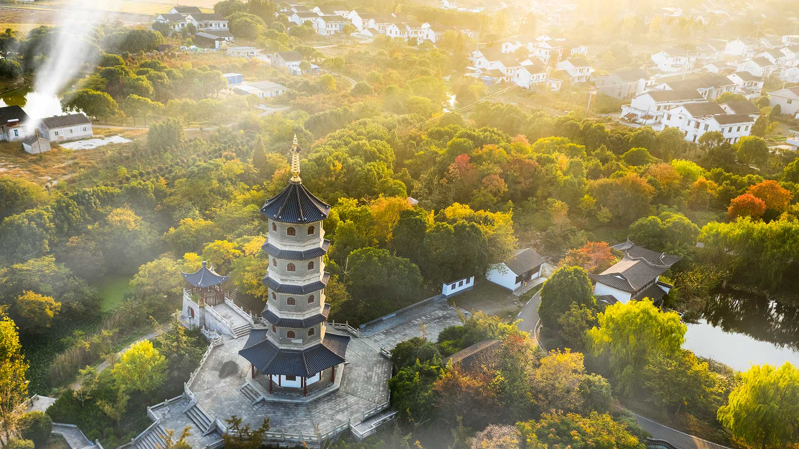

#### 20260822 Common blue butterfly, Devon, England (© Ross Hoddinott/Nature Picture Library)

#### 20260821 Winding road of Julier Pass, Switzerland (© Westend61/Getty Images)

#### 20260821 Aerial view of Canadian National Exhibition in Toronto (© Wirestock/Getty Images)

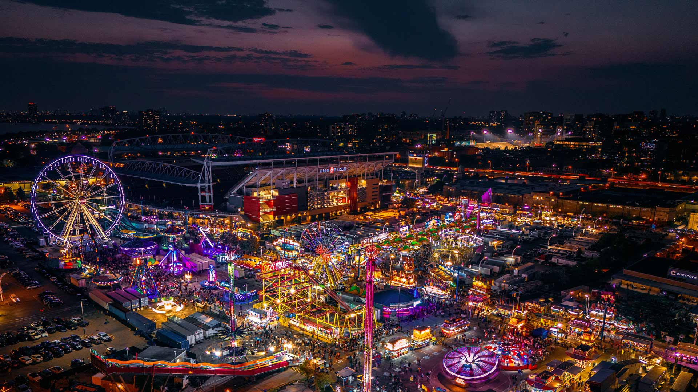

#### 20260820 Joshua Tree National Park, California, United States (© JJ Landscapes/Getty Images)

#### 20260820 An orca surfaces in Lynn Canal near the Chilkat Mountains, Alaska (© John Hyde/Alamy)

#### 20260819 Aerial view of a wildlife crossing near Zakrzów, Poland (© bbsferrari/Getty Images)

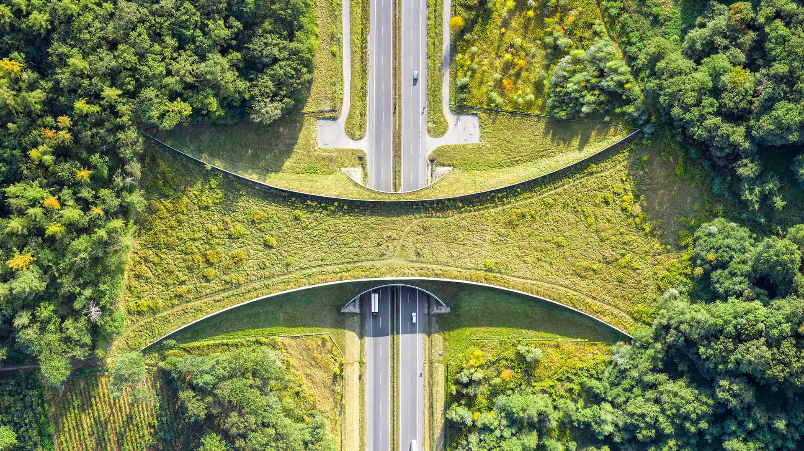

#### 20260819 怀特克利夫公园，西温哥华，加拿大 (© Aolin Chen/Getty Images)

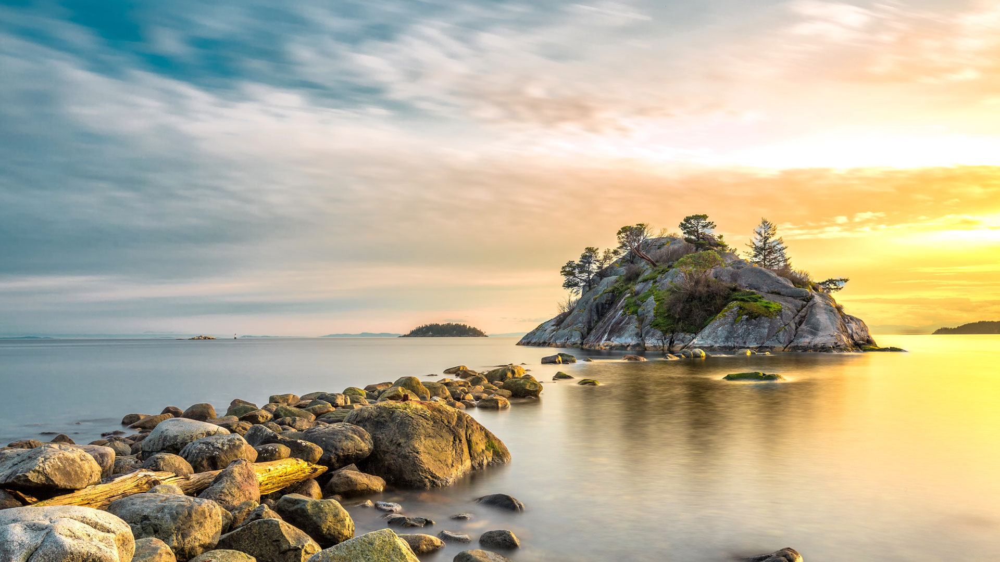

#### 20260819 NASA's Langley Research Center mounted the Navy's Brewster XF2A-1 Buffalo in the Full-Scale Tunnel, 1938, Hampton, Virginia (© NASA)

#### 20260817 Pedra Furada, Jericoacoara, Brazil (© Brendan van Son/Shutterstock)

#### 20260817 Three false clownfish in a sea anemone, Cabilao Island, Bohol, Philippines (© Franco Banfi/Nature Picture Library)

#### 20260816 Infinity Bridge in Stockton-on-Tees, England (© Bahadir Yeniceri/Shutterstock)

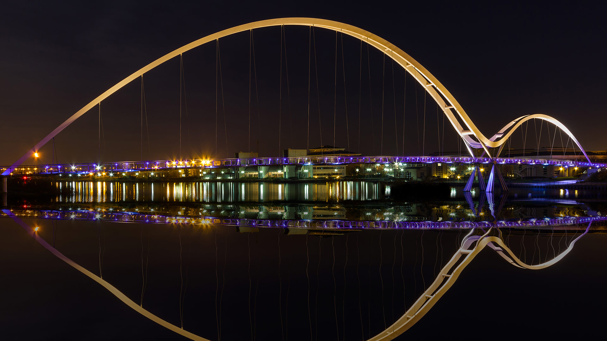

#### 20260816 Ruins of Ross Errilly Friary, County Galway, Ireland (© Maria Janus/Shutterstock)

#### 20260815 Sonnenaufgang an der Seebrücke Sellin, Rügen, Mecklenburg-Vorpommern (© bluejayphoto/Getty Images)

#### 20260815 Aerial view of Palmanova, a fortress city in Friuli, Italy (© Riccardo Saponi/Getty Images)

#### 20260814 Aerial view of a wildlife crossing near Zakrzów, Poland (© bbsferrari/Getty Images)

#### 20260814 下田港, 静岡県 下田市 (© Sean Pavone/Getty Images)

#### 20260814 Dolmen, La Roche-Aux-Fées, Bretagne (© Michal Boubin/Getty Images)

#### 20260813 Perseid meteors over Teide Observatory, Tenerife, Spain (© Westend61/Getty Images)

#### 20260812 A group of elephants, Amboseli National Park, Kenya (© Ibrahim Suha Derbent/Getty Images)

#### 20260811 Whytecliff Park, West Vancouver, Canada (© Aolin Chen/Getty Images)

#### 20260811 日本アルプス (© Sergey Alimov/Getty Images)

#### 20260810 Joshua Tree National Park, California (© JJ Landscapes/Getty Images)

#### 20260809 Hoodoos in Ah Shi Sle Pah Wilderness in San Juan County, New Mexico (© Westend61/Getty Images)

#### 20260809 Jean-Marie Tjibaou Cultural Centre, New Caledonia (© Fabien Astre/Alamy)

#### 20260808 Infinity Bridge in Stockton-on-Tees, England (© Bahadir Yeniceri/Shutterstock)

#### 20260808 Rhein in Flammen vor Schloss Stolzenfels bei Koblenz, Rheinland-Pfalz (© Jule_Berlin/Shutterstock)

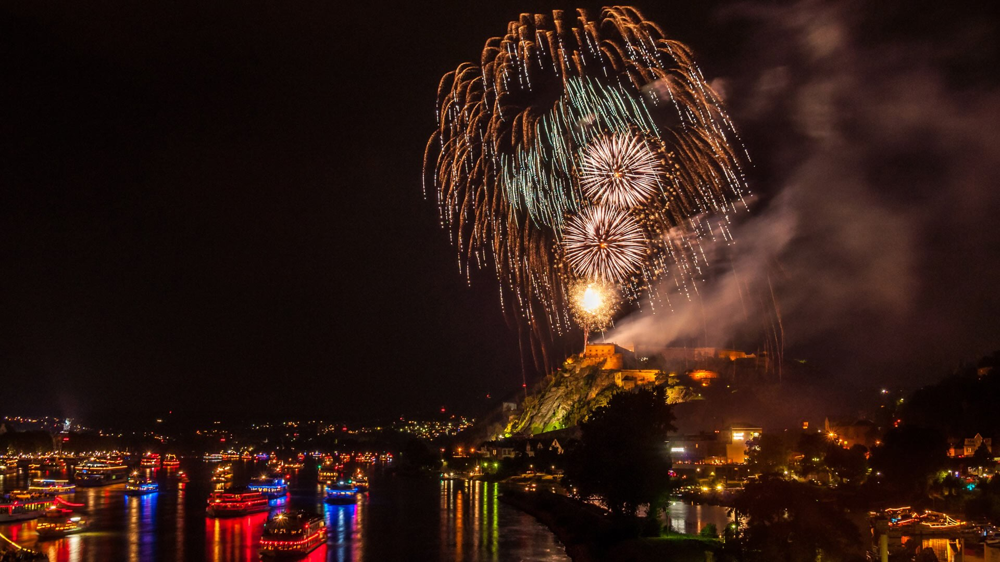

#### 20260808 Colorful homes line Nyhavn Canal, Copenhagen, Denmark (© emicristea/Getty Images)

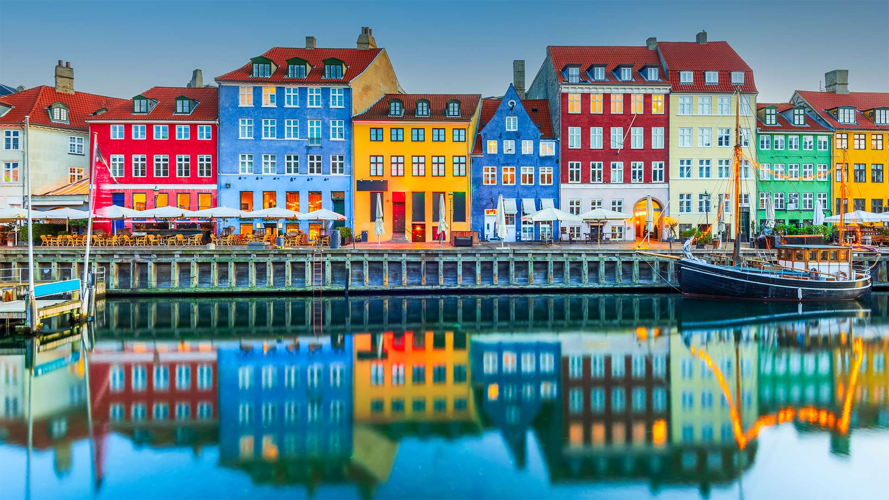

#### 20260808 Du linge qui sèche aux fenêtres d’une maison, Barjols, Var, Provence-Alpes-Côtes d'Azur (© mammuth/Getty Images)

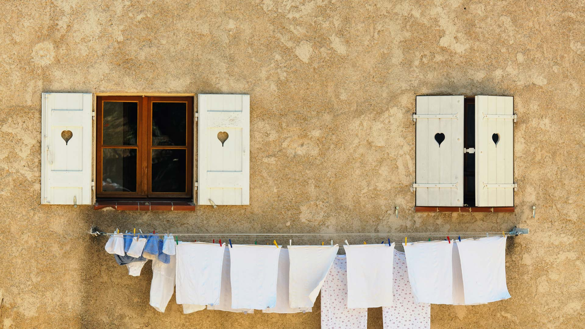

#### 20260807 Aerial view of a wildlife crossing near Zakrzów, Poland (© bbsferrari/Getty Images)

#### 20260807 Lime Kiln Lighthouse on San Juan Island, Washington State (© Edmund Lowe Photography/Shutterstock)

#### 20260806 Migrating wildebeest crossing Mara River in Masai Mara, Kenya (© Manoj Shah/Getty Images)

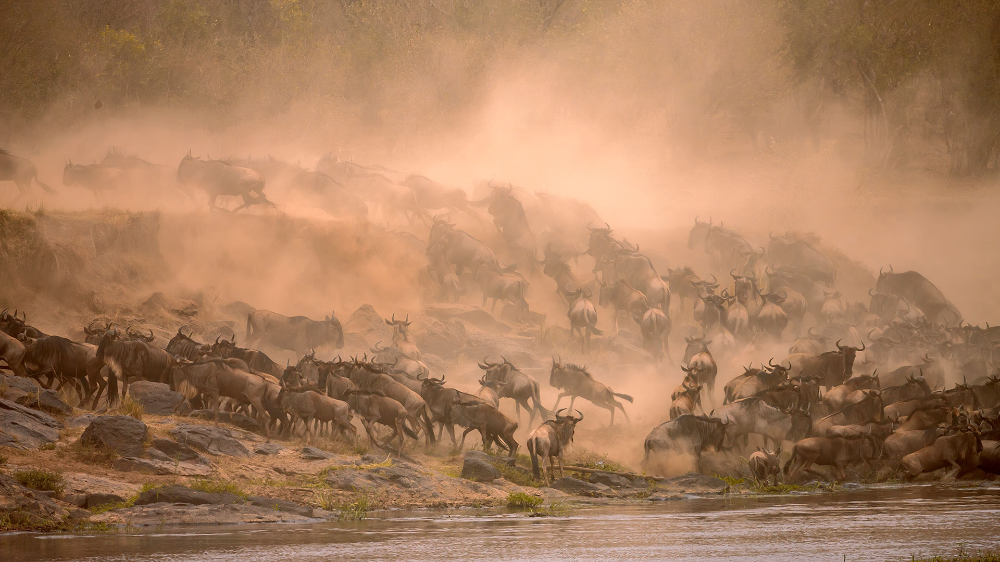

#### 20260806 広島平和記念公園のとうろう流し, 広島県 広島市 (© Buddhika Weerasinghe/Stringer/Getty Images)

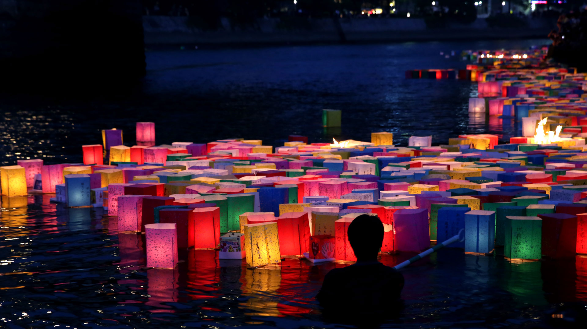

#### 20260806 Edmonton at night, Alberta (© Tetyana Babiy/iStock/Getty Images)

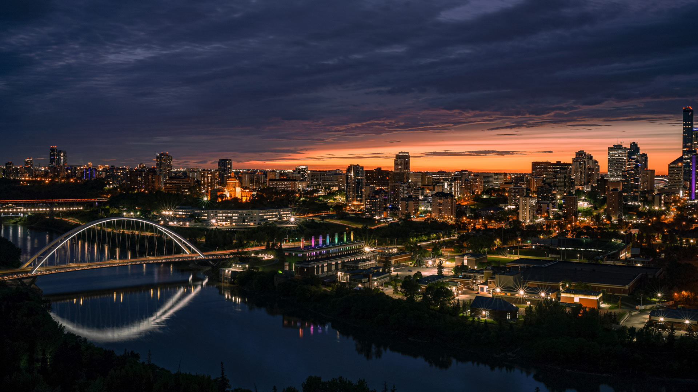

#### 20260805 Decorated gate of the Royal Palace of Fez, Morocco (© cgst26/Shutterstock)

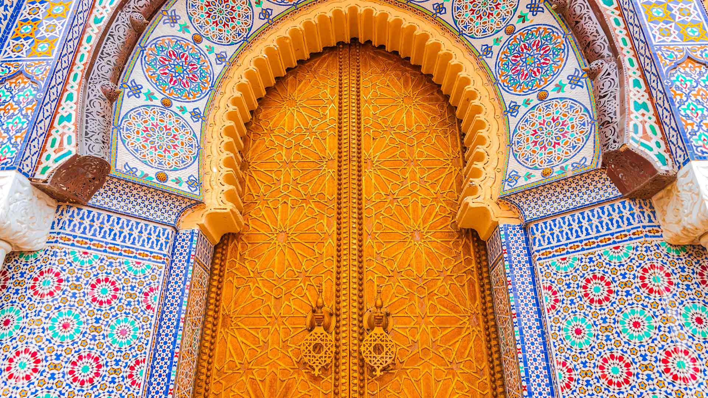

#### 20260804 Florida burrowing owlet, Cape Coral, Florida, USA (© mlorenzphotography/Getty Images)

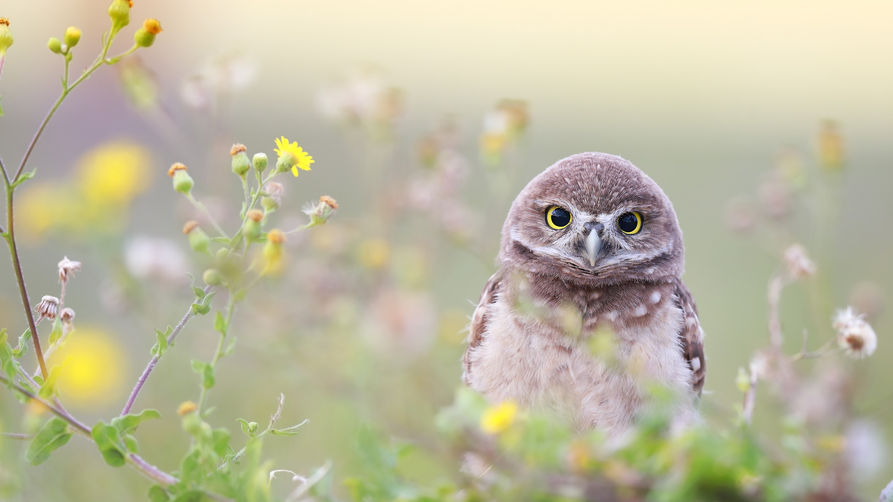

#### 20260803 Colorful boats in Marsaxlokk Harbor, Malta (© Klubovy/Getty Images)

#### 20260802 Helsinki's shoreline during blue hour, Uusimaa, Finland (© Miemo Penttinen/Getty Images)

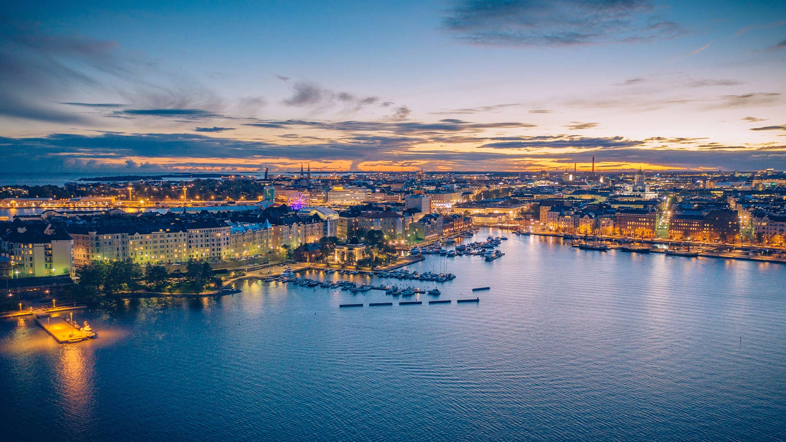

#### 20260801 Stacks près de Wilson Creek Beach, False Klamath Cove, Parc national et parcs d’État de Redwood, Californie, États-Unis (© benedek/Getty Images)

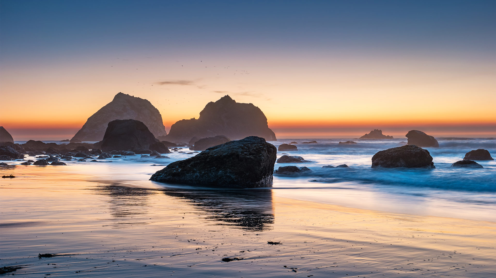

#### 20260801 変わり種の金魚ねぷた, 青森県 弘前市 (© David Parker/Alamy)

#### 20260801 A series of lava flows spill into the ocean, Big Island, Hawaii (© Ken McCurdy/Getty Images)

