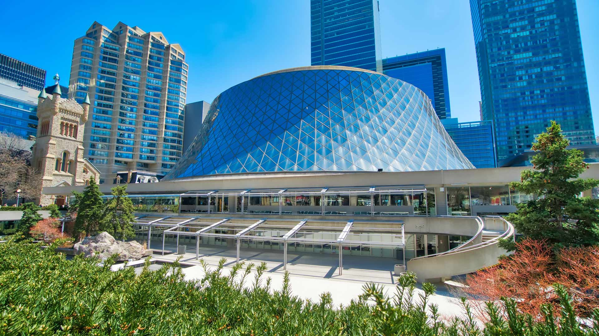
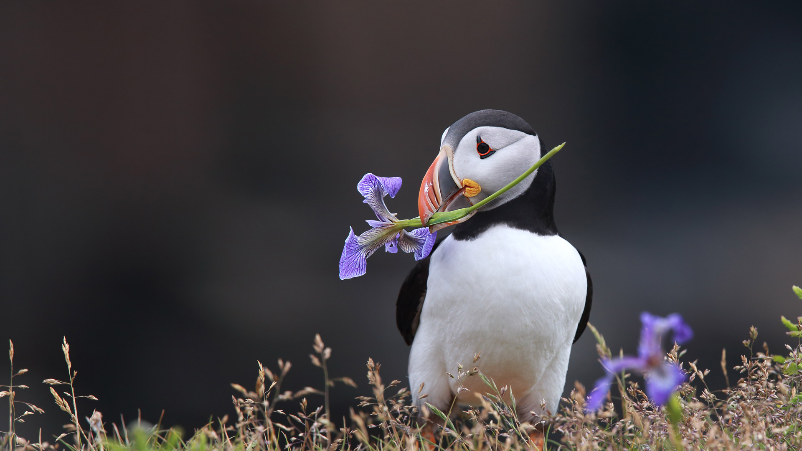
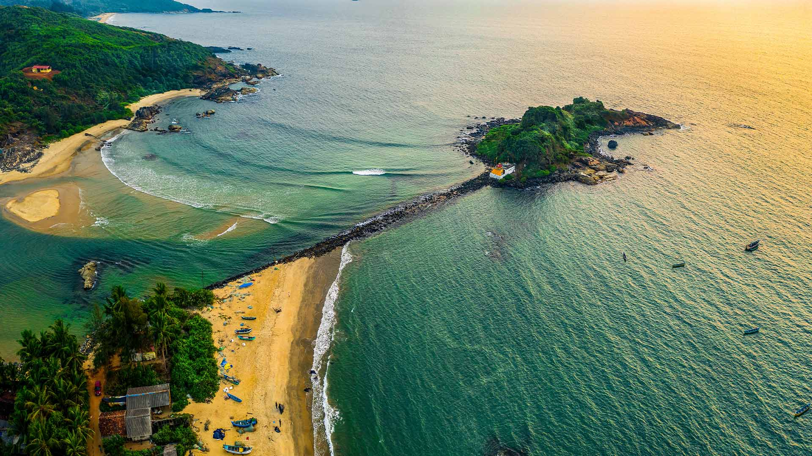
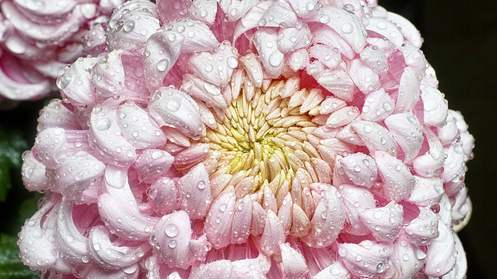
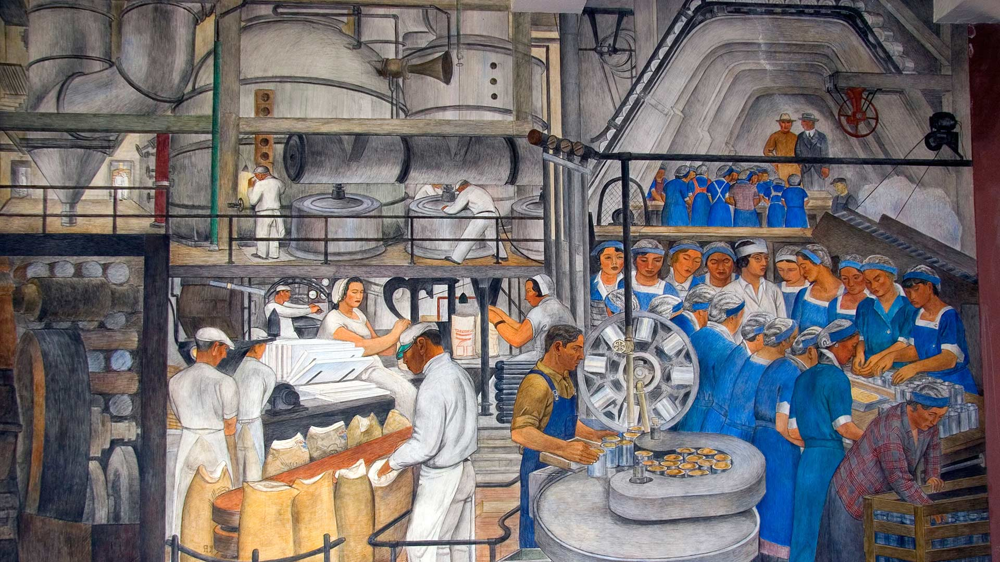
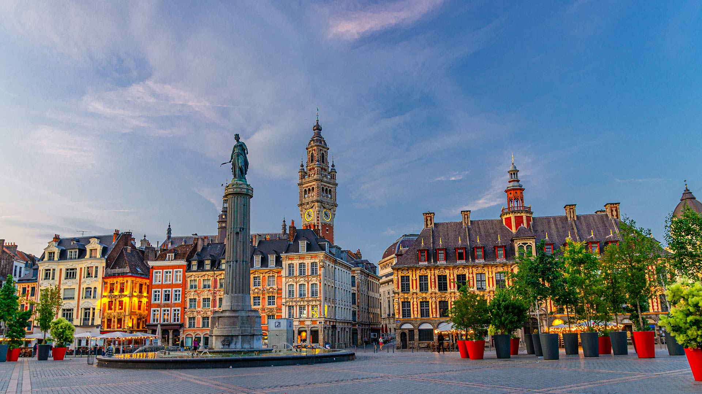
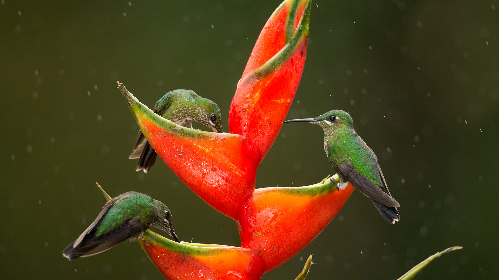

#### 20260910 The Roy Thomson Hall, Toronto, Ontario (© eskystudio/Shutterstock)

#### 20260910 Atlantic puffin holding a wild iris in his beak in Elliston, Newfoundland, Canada (© mlorenzphotography/Getty Images)

#### 20260910 Aerial view of Olvera, Andalusia, Spain (© Marco Bottigelli/Getty Images)

#### 20260909 Gabit Keni Beach near Ankola, Karnataka, India (© Amith Nag Photography/Getty Images)

#### 20260909 菊の花 (© yanjf/Getty Images)

#### 20260908 Beech tree in a cereal field, East Meon, South Downs National Park, Hampshire, England (© Guy Edwardes/Minden Pictures)

#### 20260907 'Industries of California' mural by Ralph Stackpole at Coit Tower, San Francisco, California (© David R. Frazier Photolibrary, Inc./Alamy)

#### 20260907 Cadini di Misurina, Dolomiten, Venetien, Italien (© Vithun Khamsong/Getty Images)

#### 20260907 バンベルク市街, ドイツ (© SCStock/Getty Images)

#### 20260906 Lake Fyans, Grampians National Park, Victoria, Australia (© tracielouise/Getty Images)

#### 20260905 La Grand’Place, Lille (© Aliaksandr Antanovich/Getty Images)

#### 20260905 Green-crowned brilliant hummingbirds feeding on lobster-claw flowers, Costa Rica (© Paul Hobson/Nature Picture Library)

#### 20260904 Westerheversand Lighthouse in Westerhever, Schleswig-Holstein, Germany (© bluejayphoto/Getty Images)

#### 20260904 Horizontobservatorium, Halde Hoheward, Herten, Nordrhein-Westfalen (© lilly3/Getty Images)

#### 20260903 Winding road of Julier Pass, Switzerland (© Westend61/Getty Images)

#### 20260903 Römerberg, historischer Altstadtplatz in Frankfurt am Main (© f11photo/Getty Images)

#### 20260903 Coyote Buttes, Vermilion Cliffs National Monument, Arizona (© James Hager/Getty Images)

#### 20260902 Traditional beach huts, Southwold, Suffolk Heritage Coast, England (© stevendocwra/Getty Images)

#### 20260901 Sellin Pier, Rügen, Germany (© bluejayphoto/Getty Images)

#### 20260901 Horsehair parachute fungus, Belarus (© Máté/Nature Picture Library)

