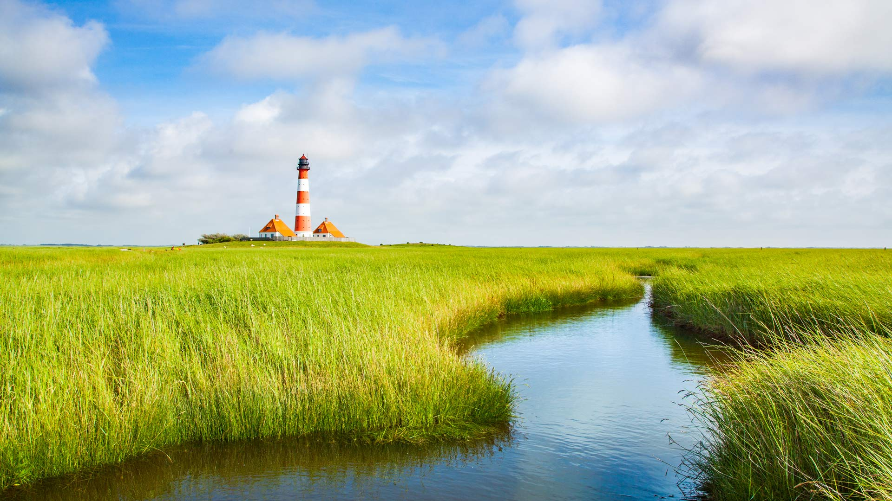
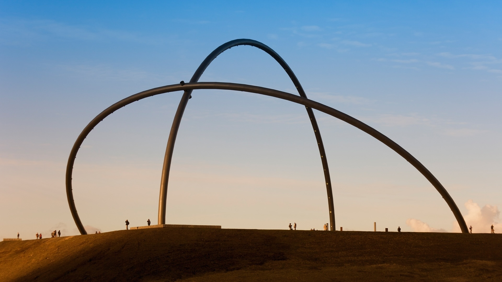
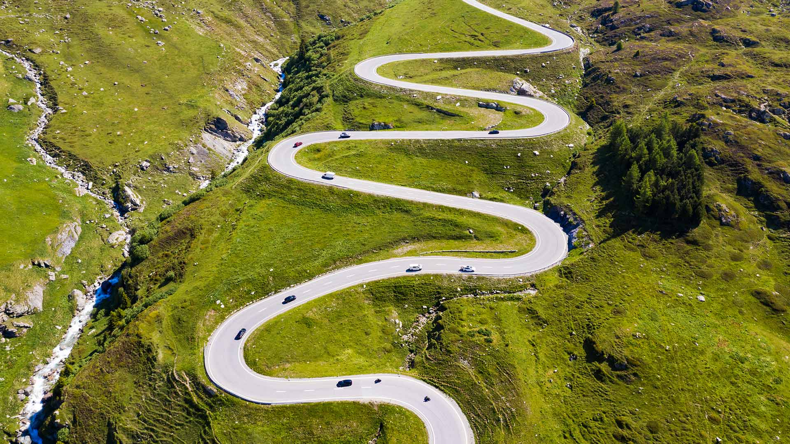
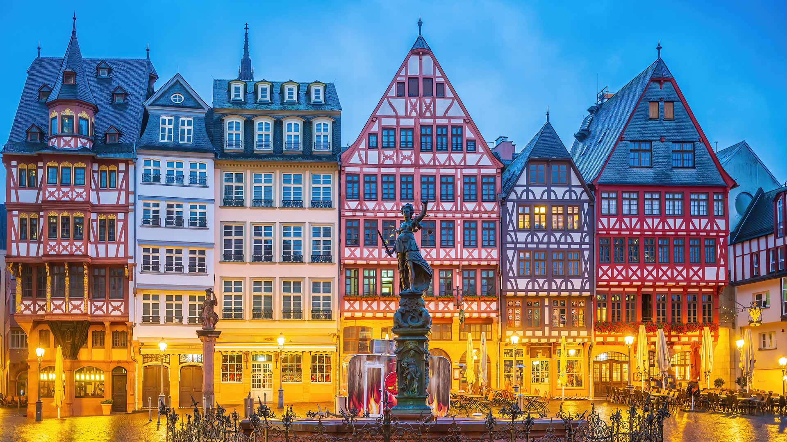
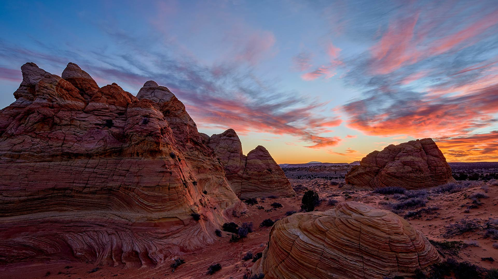
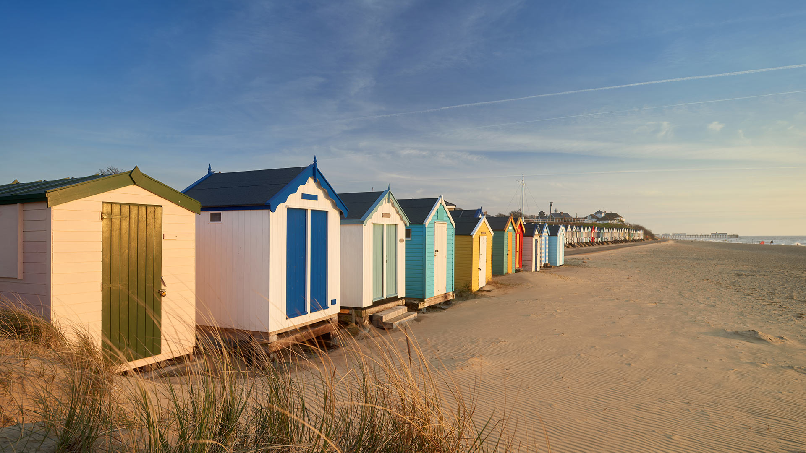
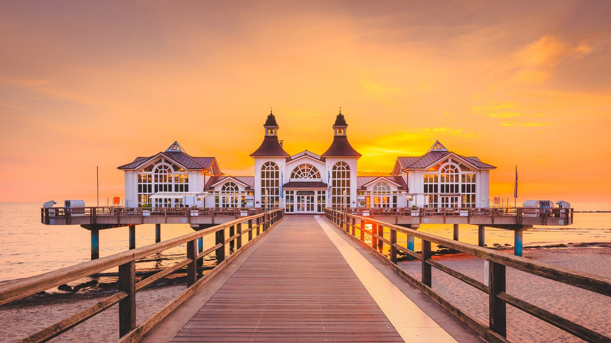

#### 20260904 Westerheversand Lighthouse in Westerhever, Schleswig-Holstein, Germany (© bluejayphoto/Getty Images)

#### 20260904 Horizontobservatorium, Halde Hoheward, Herten, Nordrhein-Westfalen (© lilly3/Getty Images)

#### 20260903 Winding road of Julier Pass, Switzerland (© Westend61/Getty Images)

#### 20260903 Römerberg, historischer Altstadtplatz in Frankfurt am Main (© f11photo/Getty Images)

#### 20260903 Coyote Buttes, Vermilion Cliffs National Monument, Arizona (© James Hager/Getty Images)

#### 20260902 Traditional beach huts, Southwold, Suffolk Heritage Coast, England (© stevendocwra/Getty Images)

#### 20260901 Sellin Pier, Rügen, Germany (© bluejayphoto/Getty Images)

#### 20260901 Horsehair parachute fungus, Belarus (© Máté/Nature Picture Library)

