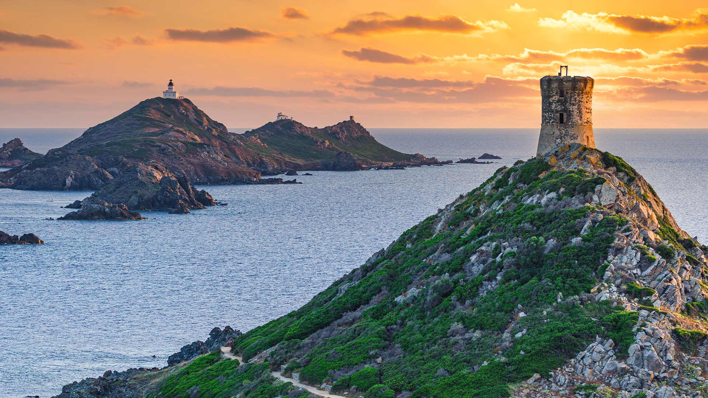
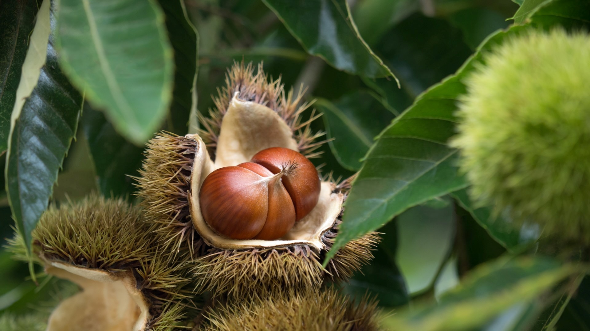
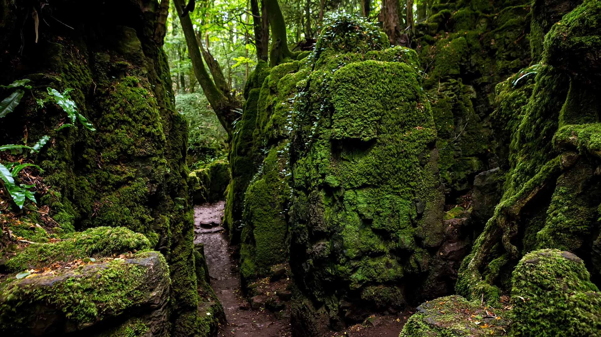
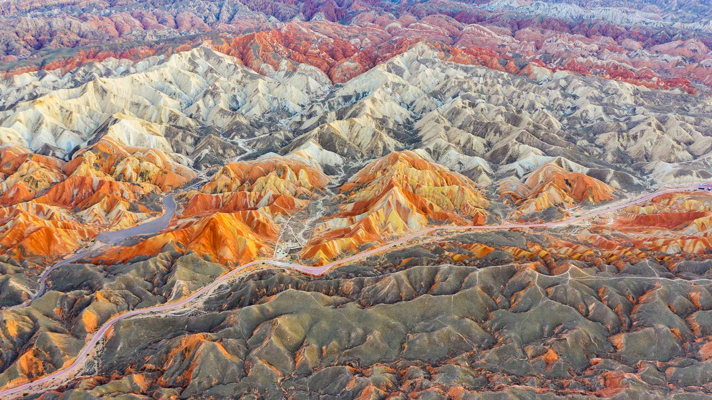
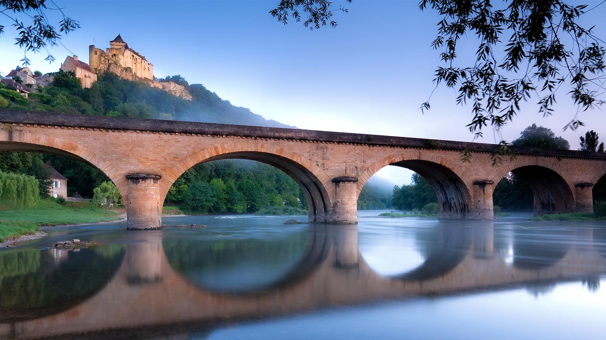
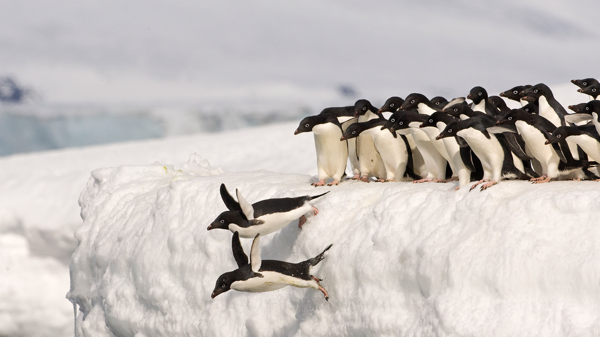

#### 20261009 サンギネール諸島, フランス (© Francesco Riccardo Iacomino/Getty Images)

#### 20261008 Octopus in defensive posture, Mayotte, Indian Ocean (© Gabriel Barathieu/Minden Pictures)

#### 20261008 栗の実 (© y-studio/Getty Images)

#### 20261007 Moss-covered rocks in Puzzlewood, Forest of Dean, Gloucestershire, England (© Fulcanelli_AOS/Getty Images)

#### 20261006 Danxia landform, Zhangye National Geopark, Gansu, China (© Weiquan Lin/Getty Images)

#### 20261005 Château de Castelnaud overlooking the river Dordogne, France (© garethkirklandphotogrphy/Getty Images)

#### 20261005 Adélie penguins, Antarctica (© Otto Plantema/Minden Pictures)

#### 20261004 Grues cendrées en vol à l'aube, lac du Der, France (© Christophe Lehenaff/Getty Images)

#### 20261004 Artemis I moon rocket at Launch Complex 39B, Kennedy Space Center, Florida, June 15, 2022 (© EVA MARIE UZCATEGUI/Getty Images)

#### 20261003 Toronto City Hall illuminated at night (© EB Adventure Photography/Shutterstock)

#### 20261003 Brandenburger Tor, Berlin (© almir1968/Getty Images)

#### 20261003 アンモナイトの化石 (© J Nemchinova/Getty Images)

#### 20261002 Brown bear in Silver Salmon Creek, Lake Clark National Park and Preserve, Alaska (© Danny Green/Nature Picture Library)

#### 20261002 Chattooga River in the Appalachian Mountains, North Carolina (© mtilghma/Getty Images)

#### 20261002 Végétation automnale multicolore sur la tourbière (© Utopia_88/Getty Images)

#### 20261001 La tour Eiffel au coucher de soleil, Paris (© Alexander Spatari/Getty Images)

#### 20261001 Sunset from Olmsted Point, Yosemite National Park, California, USA (© Robb Hirsch/Tandem Stills + Motion)

